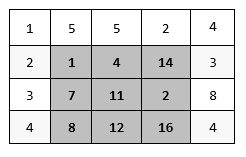

# Exercise: Multidimensional Arrays

Problems for exercise and homework for the
["CSharp Advanced" course @ Software
University](https://softuni.bg/courses/csharp-advanced).

You can check your solutions here:
<https://judge.softuni.bg/Contests/1455/Multidimensional-Arrays-Exercise>

## Diagonal Difference

Write a program that finds the **difference between the sums of the
square matrix diagonals** (absolute value).

### Input

  - On the **first line**, you are given the integer **N** – the size of
    the square matrix

  - The next **N lines** holds the values for **every row** – **N**
    numbers separated by a space

### Output

  - Print **the absolute** difference between **the sums** of the
    primary and the secondary diagonal

### Examples

<table>
<thead>
<tr class="header">
<th><strong>Input</strong></th>
<th><strong>Output</strong></th>
<th><strong>Comments</strong></th>
</tr>
</thead>
<tbody>
<tr class="odd">
<td>
3

11 2 4

4 5 6

10 8 -12
</td>
<td>15</td>
<td>
<strong>Primary diagonal: sum = 11 + 5 + (-12) = 4</strong>

<strong>Secondary diagonal: sum = 4 + 5 + 10 = 19</strong>

<strong>Difference: |4 - 19| = 15</strong>
</td>
</tr>
</tbody>
</table>

##  2X2 Squares in Matrix

Find the count of **2 x 2 squares of equal chars** in a matrix.

### Input

  - On the **first line**, you are given the integers **rows** and
    **cols –** the matrix’s dimensions

  - Matrix characters come at the next **rows** lines (space separated)

### Output

  - Print the number of all the squares matrixes you have found

### Examples

<table>
<thead>
<tr class="header">
<th><strong>Input</strong></th>
<th><strong>Output</strong></th>
<th><strong>Comments</strong></th>
</tr>
</thead>
<tbody>
<tr class="odd">
<td>
<strong>3 4</strong>

<strong>A B B D</strong>

<strong>E B B B</strong>

<strong>I J B B</strong>
</td>
<td><strong>2</strong></td>
<td>
<strong>Two 2 x 2 squares of equal cells:</strong>

<strong>A B B D</strong> <strong>A B B D</strong>

<strong>E B B B</strong> <strong>E B B B</strong>

<strong>I J B B</strong> <strong>I J B B</strong>
</td>
</tr>
<tr class="even">
<td>
<strong>2 2</strong>

<strong>a b</strong>

<strong>c d</strong>
</td>
<td><strong>0</strong></td>
<td><strong>No 2 x 2 squares of equal cells exist.</strong></td>
</tr>
</tbody>
</table>

## Maximal Sum

Write a program that reads a rectangular integer matrix of size **N x
M** and finds in it the square **3 x 3** that **has maximal sum of its
elements**.

### Input

  - On the first line, you will receive the rows **N** and columns
    **M**. On the next **N lines** you will receive **each row with its
    columns**

### Output

  - Print the **elements** of the 3 x 3 square as a matrix, along with
    their **sum**

### Examples

<table>
<thead>
<tr class="header">
<th><strong>Input</strong></th>
<th><strong>Matrix</strong></th>
<th><strong>Output</strong></th>
</tr>
</thead>
<tbody>
<tr class="odd">
<td>
<strong>4 5</strong>

<strong>1 5 5 2 4</strong>

<strong>2 1 4 14 3</strong>

<strong>3 7 11 2 8</strong>

<strong>4 8 12 16 4</strong>
</td>
<td></td>
<td>
<strong>Sum = 75</strong>

<strong>1 4 14</strong>

<strong>7 11 2</strong>

<strong>8 12 16</strong>
</td>
</tr>
</tbody>
</table>

## Matrix Shuffling

Write a program which reads a string matrix from the console and
performs certain operations with its elements. User input is provided in
a similar way like in the problems above – first you read the
**dimensions** and then the **data**.

Your program should then receive commands in format: "**swap row1 col1
row2c col2**" where row1, row2, col1, col2 are **coordinates** in the
matrix. In order for a command to be valid, it should start with the
"**swap**" keyword along with **four valid coordinates** (no more, no
less). You should **swap the values** at the given coordinates (cell
\[row1, col1\] with cell \[row2, col2\]) **and print the matrix at each
step** (thus you'll be able to check if the operation was performed
correctly).

If the **command is not valid** (doesn't contain the keyword "swap", has
fewer or more coordinates entered or the given coordinates do not
exist), print "**Invalid input\!**" and move on to the next command.
Your program should finish when the string "**END**" is entered.

### Examples

<table>
<thead>
<tr class="header">
<th><strong>Input</strong></th>
<th><strong>Output</strong></th>
</tr>
</thead>
<tbody>
<tr class="odd">
<td>
2 3

1 2 3

4 5 6

swap 0 0 1 1

swap 10 9 8 7

swap 0 1 1 0

END
</td>
<td>
5 2 3

4 1 6

Invalid input!

5 4 3

2 1 6
</td>
</tr>
<tr class="even">
<td>
1 2

Hello World

0 0 0 1

swap 0 0 0 1

swap 0 1 0 0

END
</td>
<td>
Invalid input!

World Hello

Hello World
</td>
</tr>
</tbody>
</table>

## Snake Moves

You are walking in the park and you encounter a snake\! You are
terrified, and you start running zig-zag, so the snake starts following
you.

You have a task to visualize the snake’s path in a square form. A
**snake** is represented by **a string**. The **isle** is a
**rectangular matrix of size NxM**. A snake starts going down from the
**top-left corner** and slithers its way down. The first cell is filled
with the first symbol of the snake, the second cell is filled with the
second symbol, etc. The snake is as long as it takes in order to **fill
the stairs completely** – if you reach the end of the string
representing the snake, start again at the beginning. After you fill the
matrix with the snake’s path, you should print it.

### Input

  - The input data should be read from the console. It consists of
    exactly two lines

  - On the first line, you’ll receive the **dimensions** of the stairs
    in format: **"N M"**, where **N** is the number of **rows**, and
    **M** is the number of **columns**. They’ll be separated by a single
    space

  - On the second line you’ll receive the string representing the
    **snake**

### Output

  - The output should be printed on the console. It should consist of
    **N lines**

  - Each line should contain a string representing the respective row of
    the matrix

### Constraints

  - The **dimensions** N and M of the matrix will be integers in the
    range \[1 … 12\]

  - The **snake** will be a string with length in the range \[1 … 20\]
    and **will not contain any whitespace characters**

### Examples

<table>
<thead>
<tr class="header">
<th><strong>Input</strong></th>
<th><strong>Output</strong></th>
</tr>
</thead>
<tbody>
<tr class="odd">
<td>
5 6

SoftUni
</td>
<td>
SoftUn

UtfoSi

niSoft

foSinU

tUniSo
</td>
</tr>
</tbody>
</table>

## Jagged Array Manipulator

Create a program that populates, analyzes and manipulates the elements
of a matrix with unequal length of its rows.

First you will receive an **integer N** equal to the **number of rows**
in your matrix.

On the **next N lines**, you will receive **sequences of integers**,
**separated** by a single **space**. Each sequence is a **row** in the
matrix.

After populating the matrix, start analyzing it. If a **row** and the
**one below** it have **equal length**, **multiply** each **element** in
**both** of them by **2**, **otherwise** - **divide** by **2**.

Then, you will receive commands. There are three possible commands:

  - "**Add {row} {column} {value}**" - **add** **{value}** to the
    element at the **given indexes**, if they are **valid**

  - "**Subtract {row} {column} {value}**" - **subtract** **{value}**
    from the element at the **given indexes**, if they are **valid**

  - "**End**" - print the **final state** of the **matrix** (all
    elements **separated by a single space**) and **stop** the program

**Input**

  - On the first line, you will receive the **number of rows** of the
    matrix - integer **N**

  - On the next **N** lines, you will receive **each row** - **sequence
    of integers**, separated by a single **space**

  - **{value}** will always be **integer** number

  - Then you will be receiving commands until reading "**End**"

**Output**

  - The output should be printed on the console and it should consist of
    **N lines**

  - Each line should contain a string representing the **respective
    row** of the **final matrix**, elements **separated** by a single
    **space**

**Constraints**

  - The **number of rows** N of the matrix will be integer in the range
    \[2 … 12\]

  - The **input** will always **follow** the **format above**

  - **Think about data types  
    **

### Examples

<table>
<thead>
<tr class="header">
<th><strong>Input</strong></th>
<th><strong>Output</strong></th>
</tr>
</thead>
<tbody>
<tr class="odd">
<td>
5

10 20 30

1 2 3

2

2

10 10

End
</td>
<td>20 40 60 
1 2 3 
2 
2 
5 5</td>
</tr>
<tr class="even">
<td>
5

10 20 30

1 2 3

2

2

10 10

Add 0 10 10

Add 0 0 10

Subtract -3 0 10

Subtract 3 0 10

End
</td>
<td>
30 40 60

1 2 3

2

-8

5 5
</td>
</tr>
</tbody>
</table>

## Knight Game

Chess is the oldest game, but it is still popular these days. For this
task we will use only one chess piece – the **Knight**.

The knight moves to the **nearest** square but **not on the
same [row](https://en.wikipedia.org/wiki/Glossary_of_chess#rank)**, [**column**](https://en.wikipedia.org/wiki/Glossary_of_chess#file),
or [**diagonal**](https://en.wikipedia.org/wiki/Glossary_of_chess#diagonal).
(This can be thought of as moving two squares horizontally, then one
square vertically, or moving one square horizontally then two squares
vertically— i.e. in an "**L**" pattern.) 

The knight game is played on a board with dimensions **N x N** and a lot
of chess knights **0 \<= K \<= N2**.

You will receive a board with **K** for knights and '**0'** for empty
cells. Your task is to remove a minimum of the knights, so there will be
no knights left that can attack another knight.

### Input

On the first line, you will receive the **N** size of the board

On the next **N** lines, you will receive strings with **Ks** and
**0s**.

### Output

Print a single integer with the minimum number of knights that needs to
be removed

### Constraints

  - Size of the board will be 0 \< N \< 30

  - Time limit: 0.3 sec. Memory limit: 16 MB.

### Examples

<table>
<thead>
<tr class="header">
<th><strong>Input</strong></th>
<th><strong>Output</strong></th>
</tr>
</thead>
<tbody>
<tr class="odd">
<td>
5

0K0K0

K000K

00K00

K000K

0K0K0
</td>
<td>1</td>
</tr>
<tr class="even">
<td>
2

KK

KK
</td>
<td>0</td>
</tr>
<tr class="odd">
<td>
8

0K0KKK00

0K00KKKK

00K0000K

KKKKKK0K

K0K0000K

KK00000K

00K0K000

000K00KK
</td>
<td>12</td>
</tr>
</tbody>
</table>

## \*Bombs

You will be given a square matrix of integers, each integer separated by
a **single space**, and each row on a new line. Then on the last line of
input you will receive indexes - coordinates to several cells separated
by a **single space**, in the following format: **row1,column1
row2,column2 row3,column3…**

On those cells there are bombs. You have to proceed **every** **bomb**,
one by one in the order they were given. When a bomb explodes deals
damage **equal** to its **own** **integer** **value**, to **all** the
cells **around** it (in every direction and in all diagonals). One bomb
can't explode more than once and after it does, its value becomes **0**.
When a cell’s value reaches **0 or below**, **it dies**. Dead cells
**can't explode**.

You must **print the count of all alive cells** and **their sum**.
Afterwards, print the matrix with all of its cells (including the dead
ones).

### Input

  - > On the first line, you are given the integer N – the size of the
    > square matrix.

  - > The next N lines holds the values for every row – N numbers
    > separated by a space.

  - > On the last line you will receive the coordinates of the cells
    > with the bombs in the format described above.

### Output

  - > On the first line you need to print the count of all alive cells
    > in the format:

> “**Alive cells: {aliveCells}**”

  - > On the second line you need to print the sum of all alive cell in
    > the format:

> “**Sum: {sumOfCells}**”

  - > In the end print the matrix. The cells must be **separated by a
    > single space**.

### Constraints

  - The size of the matrix will be between **\[0…1000\].**

  - The bomb coordinates will **always** be in the matrix.

  - The bomb’s values will always be **greater** than **0**.

  - The integers of the matrix will be in range **\[1…10000\].**

### Examples

<table>
<thead>
<tr class="header">
<th><strong>Input</strong></th>
<th><strong>Output</strong></th>
<th><strong>Comments</strong></th>
</tr>
</thead>
<tbody>
<tr class="odd">
<td>
4

8 3 2 5

6 4 7 9

9 9 3 6

6 8 1 2

1,2 2,1 2,0
</td>
<td>
Alive cells: 3

Sum: 12

8 -4 -5 -2

-3 -3 0 2

0 0 -4 -1

-3 -1 -1 2
</td>
<td>First the bomb with value <strong>7</strong> will explode and reduce the values of the cells around it. Next the bomb with coordinates <strong>2,1</strong> and value <strong>2</strong> (initially 9-7) will explode and reduce its neighbour cells. In the end the bomb with coordinates <strong>2,0</strong> and value <strong>7</strong> (initially 9-2) will explode. After that you have to print the count of the alive cells, which is 3, and their sum is 12. Print the matrix after the explosions.</td>
</tr>
<tr class="even">
<td>
3

7 8 4

3 1 5

6 4 9

0,2 1,0 2,2
</td>
<td>
Alive cells: 3

Sum: 8

4 1 0

0 -3 -8

3 -8 0
</td>
<td></td>
</tr>
</tbody>
</table>

## \*Miner

We get as input **the size** of the **field** in which our miner moves.
The field is **always a square**. After that we will receive the
commands which represent the directions in which the miner should move.
The miner **starts** from position – ‘**s’**. The commands will be:
**left**, **right**, **up** and **down**. If the miner has reached a
side edge of the field and the next command indicates that he has to get
out of the field, he must **remain on his current possition and ignore
the current command**. The possible characters that may appear on the
screen are:

  - **\*** – a regular position on the field.

  - **e** – the end of the route.

  - **c -** coal

  - **s** - the place where the **miner starts**

Each time when the miner finds a coal, he collects it and **replaces it
with '\*'**. Keep track of the **count of the collected coals**. If the
miner collects all of the coals in the field, the program stops and you
have to print the following message: **"You collected all coals\!
({rowIndex}, {colIndex})"**.

If the miner **steps at 'e' the game is over (the program stops)** and
you have to print the following message: **"Game over\! ({rowIndex},
{colIndex})"**.

If there are no more commands and none of the above cases had happened,
you have to print the following message: **"{remainingCoals} coals left.
({rowIndex}, {colIndex})"**.

### Input

  - **Field size** – an integer number.

  - **Commands to move** the miner – an array of strings separated by
    **" "**.

  - **The field: some of the following characters (\*, e, c, s),**
    separated by whitespace (" ");

### Output

  - There are three types of output:
    
      - If all the coals have been collected, print the following
        output: **"You collected all coals\! ({rowIndex}, {colIndex})"**
    
      - If you have reached the end, you have to stop moving and print
        the following line: **"Game over\! ({rowIndex}, {colIndex})"**
    
      - If there are no more commands and none of the above cases had
        happened, you have to print the following message:
        **"{totalCoals} coals left. ({rowIndex}, {colIndex})"**

### Constraints

  - The **field size** will be a 32-bit integer in the range \[0 …
    2 147 483 647\].

  - The field will always have only one’s’.

  - Allowed working time for your program: 0.1 seconds.

  - Allowed memory: 16 MB.

### Examples

<table>
<thead>
<tr class="header">
<th><strong>Input</strong></th>
<th><strong>Output</strong></th>
</tr>
</thead>
<tbody>
<tr class="odd">
<td>
5

up right right up right

* * * c *

* * * e *

* * c * *

s * * c *

* * c * *
</td>
<td>Game over! (1, 3)</td>
</tr>
<tr class="even">
<td>
4

up right right right down

* * * e

* * c *

* s * c

* * * *
</td>
<td>You collected all coals! (2, 3)</td>
</tr>
<tr class="odd">
<td>
6

left left down right up left left down down down

* * * * * *

e * * * c *

* * c s * *

* * * * * *

c * * * c *

* * c * * *
</td>
<td><ol start="3" type="1">
<li>
coals left. (5, 0)
</li>
</ol></td>
</tr>
</tbody>
</table>

## 10\. \*Radioactive Mutant Vampire Bunnies

Browsing through GitHub, you come across an old JS Basics teamwork game.
It is about very nasty bunnies that multiply extremely fast. There’s
also a player that has to escape from their lair. You really like the
game, so you decide to port it to C\# because that’s your language of
choice. The last thing that is left is the algorithm that decides if the
player will escape the lair or not.

First, you will receive a line holding integers **N** and **M**, which
represent the rows and columns in the lair. Then you receive **N**
strings that can **only** consist of **“.”**, **“B”**, **“P”**. The
**bunnies** are marked with “**B”,** the **player** is marked with
“**P**”, and **everything** else is free space, marked with a dot
**“.”**. They represent the initial state of the lair. There will be
**only** one player. Then you will receive a string with **commands**
such as **LLRRUUDD** – where each letter represents the next **move** of
the player (Left, Right, Up, Down).

**After** each step of the player, each of the bunnies spread to the up,
down, left and right (neighboring cells marked as “.” **changes** their
value to B). If the player **moves** to a bunny cell or a bunny
**reaches** the player, the player has died. If the player goes **out**
of the lair **without** encountering a bunny, the player has won.

When the player **dies** or **wins**, the game ends. All the activities
for **this** turn continue (e.g. all the bunnies spread normally), but
there are no more turns. There will be **no** stalemates where the moves
of the player end before he dies or escapes.

Finally, print the final state of the lair with every row on a separate
line. On the last line, print either **“dead: {row} {col}”** or **“won:
{row} {col}”**. Row and col are the coordinates of the cell where the
player has died or the last cell he has been in before escaping the
lair.

### Input

  - On the first line of input, the numbers **N** and **M** are received
    – the number of **rows** and **columns** in the lair

  - On the next N lines, each row is received in the form of a string.
    The string will contain only “.”, “B”, “P”. All strings will be the
    same length. There will be only one “P” for all the input

  - On the last line, the directions are received in the form of a
    string, containing “R”, “L”, “U”, “D”

### Output

  - On the first N lines, print the final state of the bunny lair

  - On the last line, print the outcome – “won:” or “dead:” + {row}
    {col}

### Constraints

  - The dimensions of the lair are in range \[3…20\]

  - The directions string length is in range \[1…20\]

### Examples

<table>
<thead>
<tr class="header">
<th><strong>Input</strong></th>
<th><strong>Output</strong></th>
</tr>
</thead>
<tbody>
<tr class="odd">
<td>
5 8

.......B

...B....

....B..B

........

..P.....

ULLL
</td>
<td>
BBBBBBBB

BBBBBBBB

BBBBBBBB

.BBBBBBB

..BBBBBB

won: 3 0
</td>
</tr>
<tr class="even">
<td>
4 5

.....

.....

.B...

...P.

LLLLLLLL
</td>
<td>
.B...

BBB..

BBBB.

BBB..

dead: 3 1
</td>
</tr>
</tbody>
</table>
