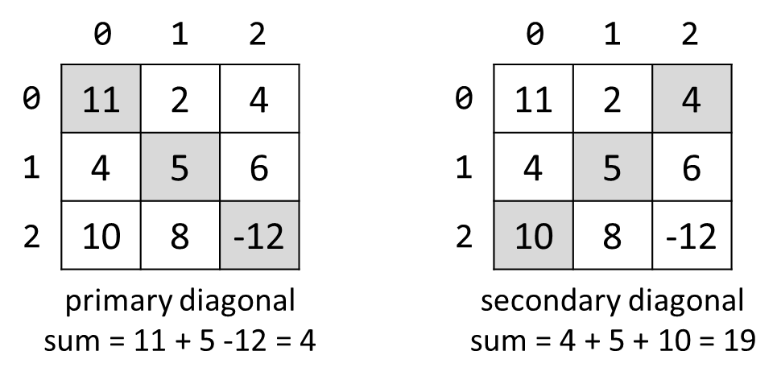

# Lab: **Multidimensional Arrays**

Problems for exercises and homework for the
["CSharp Advanced" course @ Software
University](https://softuni.bg/courses/csharp-advanced).

You can check your solutions here:
<https://judge.softuni.bg/Contests/1452/Multidimensional-Arrays-Lab>

## Sum Matrix Elements

Write program that **reads a matrix** from the console and print:

  - Count of **rows**

  - Count of **columns**

  - Sum of all **matrix elements**

On first line you will get matrix sizes in format **\[rows, columns\]**

### Examples

<table>
<thead>
<tr class="header">
<th><strong>Input</strong></th>
<th><strong>Output</strong></th>
</tr>
</thead>
<tbody>
<tr class="odd">
<td>
<em>3, 6</em>

<em>7, 1, 3, 3, 2, 1 
1, 3, 9, 8, 5, 6 
4, 6, 7, 9, 1, 0</em>
</td>
<td>
<strong>3</strong>

<strong>6</strong>

<strong>76</strong>
</td>
</tr>
</tbody>
</table>

### Hints

  - On next **\[rows\]** lines you will get elements for each column
    separated with coma and whitespace

  - Try to use only **foreach** for printing

## Sum Matrix Columns

Write program that **read a matrix** from console and print the sum for
each column. On first line you will get matrix **rows**. On the next
**rows** lines, you will get elements for each column separated with a
space.

### Examples

<table>
<thead>
<tr class="header">
<th><strong>Input</strong></th>
<th><strong>Output</strong></th>
</tr>
</thead>
<tbody>
<tr class="odd">
<td>
<em>3, 6</em>

<em>7 1 3 3 2 1</em>

<em>1 3 9 8 5 6</em>

<em>4 6 7 9 1 0</em>
</td>
<td>
<strong>12</strong>

<strong>10</strong>

<strong>19</strong>

<strong>20</strong>

<strong>8</strong>

<strong>7</strong>
</td>
</tr>
<tr class="even">
<td>
<em>3, 3</em>

<em>1 2 3</em>

<em>4 5 6</em>

<em>7 8 9</em>
</td>
<td>
<strong>12</strong>

<strong>15</strong>

<strong>18</strong>
</td>
</tr>
</tbody>
</table>

### Hints

  - Read matrix sizes.

  - On the next row lines read the columns.

  - Traverse the matrix and sum all elements in each column.

  - Print the sum and continue with the other columns.

## Primary Diagonal

Write a program that finds the **sum of matrix primary diagonal**.

### Input

  - On the **first line**, you are given the integer **N** – the size of
    the square matrix

  - The next **N lines** holds the values for **every row** – **N**
    numbers separated by a space

### Examples

<table>
<thead>
<tr class="header">
<th><strong>Input</strong></th>
<th><strong>Output</strong></th>
</tr>
</thead>
<tbody>
<tr class="odd">
<td>
3

11 2 4

4 5 6

10 8 -12
</td>
<td>4</td>
</tr>
<tr class="even">
<td>
3

1 2 3

4 5 6

7 8 9
</td>
<td>15</td>
</tr>
</tbody>
</table>

## Symbol in Matrix

Write a program that reads **N**, number representing **rows** and
**cols** of a **matrix**. On the next **N** lines, you will receive rows
of the matrix. Each row consists of ASCII characters. After that, you
will receive a symbol. Find the **first occurrence** of that symbol in
the matrix and print its position in the format: "**({row}, {col})**".
If there is no such symbol print an error message  
"**{symbol} does not occur in the matrix** "

### Examples

<table>
<thead>
<tr class="header">
<th><strong>Input</strong></th>
<th><strong>Output</strong></th>
</tr>
</thead>
<tbody>
<tr class="odd">
<td>
3

ABC

DEF

X!@

!
</td>
<td>(2, 1)</td>
</tr>
<tr class="even">
<td>
4

asdd

xczc

qwee

qefw

4
</td>
<td>4 does not occur in the matrix</td>
</tr>
</tbody>
</table>

## Square with Maximum Sum

Write a program that **read a matrix** from console. Then find biggest
sum of **2x2 submatrix** and print it to console.

On first line you will get matrix sizes in format **rows, columns.**

One next **rows** lines you will get elements for each **column**
separated with coma.

Print **biggest top-left** square, which you find and sum of its
elements.

### Examples

<table>
<thead>
<tr class="header">
<th><strong>Input</strong></th>
<th><strong>Output</strong></th>
</tr>
</thead>
<tbody>
<tr class="odd">
<td>
<em>3, 6</em>

<em>7, 1, 3, 3, 2, 1 
1, 3, 9, 8, 5, 6 
4, 6, 7, 9, 1, 0</em>
</td>
<td>
<em>9 8</em>

<em>7 9</em>

<em>33</em>
</td>
</tr>
<tr class="even">
<td>
<em>2, 4</em>

<em>10, 11, 12, 13</em>

<em>14, 15, 16, 17</em>
</td>
<td>
<em>12 13</em>

<em>16 17</em>

<em>58</em>
</td>
</tr>
</tbody>
</table>

### Hints

  - Think about **IndexOutOfRangeException()**

  - If you find more than one max square, print the top-left one

## Jagged-Array Modification

Write a program that **reads a matrix** from the console. On the first
line you will get matrix **rows**. On next **rows** lines you will get
elements for each **column** separated with **space**. You will be
receiving commands in the following format:

  - **Add {row} {col} {value}** – **Increase** the number at the given
    **coordinates** with the **value.**

  - **Subtract {row} {col} {value}** – **Decrease** the number at the
    given **coordinates** by the **value**.

Coordinates might be invalid. In this case you should print "**Invalid
coordinates**". When you receive "**END**" you should print the matrix
and stop the program.

### Examples

<table>
<thead>
<tr class="header">
<th><strong>Input</strong></th>
<th><strong>Output</strong></th>
</tr>
</thead>
<tbody>
<tr class="odd">
<td>
<em>3</em>

<em>1 2 3</em>

<em>4 5 6</em>

<em>7 8 9</em>

<em>Add 0 0 5</em>

<em>Subtract 1 1 2</em>

<em>END</em>
</td>
<td>
<em>6 2 3</em>

<em>4 3 6</em>

<em>7 8 9</em>
</td>
</tr>
<tr class="even">
<td>
<em>4</em>

<em>1 2 3 4</em>

<em>5 6 7 8</em>

<em>8 7 6 5</em>

<em>4 3 2 1</em>

<em>Add 4 4 100</em>

<em>Add 3 3 100</em>

<em>Subtract -1 -1 42</em>

<em>Subtract 0 0 42</em>

<em>END</em>
</td>
<td>
<em>Invalid coordinates</em>

<em>Invalid coordinates</em>

<em>-41 2 3 4</em>

<em>5 6 7 8</em>

<em>8 7 6 5</em>

<em>4 3 2 101</em>
</td>
</tr>
</tbody>
</table>

## Pascal Triangle

The triangle may be constructed in the following manner: In row 0 (the
topmost row), there is a unique nonzero entry 1. Each entry of each
subsequent row is constructed by adding the number above and to the left
with the number above and to the right, treating blank entries as 0. For
example, the initial number in the first (or any other) row is 1 (the
sum of 0 and 1), whereas the numbers 1 and 3 in the third row are added
to produce the number 4 in the fourth row.

If you want more info about it:
<https://en.wikipedia.org/wiki/Pascal's_triangle>

Print each row elements separated with whitespace.

### Examples

<table>
<thead>
<tr class="header">
<th><strong>Input</strong></th>
<th><strong>Output</strong></th>
</tr>
</thead>
<tbody>
<tr class="odd">
<td><em>4</em></td>
<td>
<em>1</em>

<em>1 1</em>

<em>1 2 1</em>

<em>1 3 3 1</em>
</td>
</tr>
<tr class="even">
<td><em>13</em></td>
<td>
<em>1</em>

<em>1 1</em>

<em>1 2 1</em>

<em>1 3 3 1</em>

<em>1 4 6 4 1</em>

<em>1 5 10 10 5 1</em>

<em>1 6 15 20 15 6 1</em>

<em>1 7 21 35 35 21 7 1</em>

<em>1 8 28 56 70 56 28 8 1</em>

<em>1 9 36 84 126 126 84 36 9 1</em>

<em>1 10 45 120 210 252 210 120 45 10 1</em>

<em>1 11 55 165 330 462 462 330 165 55 11 1</em>

<em>1 12 66 220 495 792 924 792 495 220 66 12 1</em>
</td>
</tr>
</tbody>
</table>

### Hints

  - The input number **n** will be **1 \<= n \<= 60**

  - Think about proper **type** for elements in array

  - Don’t be scary to use **more and more arrays**
