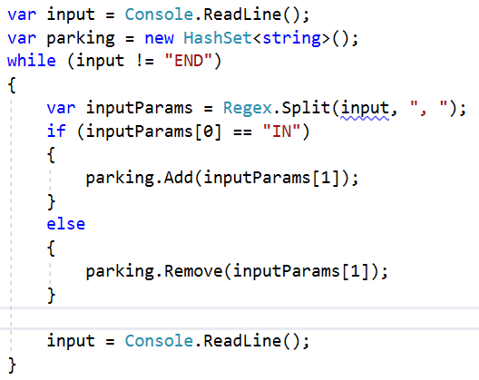

# Lab: Sets and Dictionaries Advanced

Problems for exercises and homework for the ["C\# Advanced" course @
SoftUni](https://softuni.bg/courses/csharp-advanced).

You can check your solutions here:
<https://judge.softuni.bg/Contests/1465/Sets-and-Dictionaries-Advanced-Lab>

## Dictionaries

### Count Same Values in Array

Write a program that counts in a given array of double values the number
of occurrences of each value.

#### Examples

<table>
<thead>
<tr class="header">
<th><strong>Input</strong></th>
<th><strong>Output</strong></th>
</tr>
</thead>
<tbody>
<tr class="odd">
<td>-2.5 4 3 -2.5 -5.5 4 3 3 -2.5 3</td>
<td>
<strong>-2.5 - 3 times</strong>

<strong>4 - 2 times</strong>

<strong>3 - 4 times</strong>

<strong>-5.5 - 1 times</strong>
</td>
</tr>
<tr class="even">
<td>2 4 4 5 5 2 3 3 4 4 3 3 4 3 5 3 2 5 4 3</td>
<td>
2 - 3 times

4 - 6 times

5 - 4 times

3 - 7 times
</td>
</tr>
</tbody>
</table>

### Average Student Grades

Write a program, which reads a **name** of a student and his/her
**grades** and **adds** them to the **student record**, then **prints**
**the** student's **names** with their **grades** and their **average
grade**.

#### Examples

<table>
<thead>
<tr class="header">
<th><strong>Input</strong></th>
<th><strong>Output</strong></th>
</tr>
</thead>
<tbody>
<tr class="odd">
<td>
7

Ivancho 5.20

Mariika 5.50

Ivancho 3.20

Mariika 2.50

Stamat 2.00

Mariika 3.46

Stamat 3.00
</td>
<td>
Ivancho -&gt; 5.20 3.20 (avg: 4.20)

Mariika -&gt; 5.50 2.50 3.46 (avg: 3.82)

Stamat -&gt; 2.00 3.00 (avg: 2.50)
</td>
</tr>
<tr class="even">
<td>
4

Vladimir 4.50

Petko 3.00

Vladimir 5.00

Petko 3.66
</td>
<td>
Vladimir -&gt; 4.50 5.00 (avg: 4.75)

Petko -&gt; 3.00 3.66 (avg: 3.33)
</td>
</tr>
<tr class="odd">
<td>
5

Gosho 6.00

Gosho 5.50

Gosho 6.00

Ivan 4.40

Petko 3.30
</td>
<td>
Gosho -&gt; 6.00 5.50 6.00 (avg: 5.83)

Ivan -&gt; 4.40 (avg: 4.40)

Petko -&gt; 3.30 (avg: 3.30)
</td>
</tr>
</tbody>
</table>

#### Hints

  - Use a **dictionary** (**string** **List\<decimal\>**)

  - Check if the name **exists** before adding the grade. If it doesn’t,
    add it to the dictionary.

  - Pass through all **key-value pairs** in the dictionary and print the
    results. You can use the **.Average()** method to quickly calculate
    the average value from a list.

### Product Shop

Write a program that prints information about **food shops** in Sofia
and the **products** they **store**. Until the "**Revision**" command is
received, you will be receiving input in the format: **"{shop},
{product}, {price}"**. Keep in mind that if you receive a **shop** you
already **have** **received**, you must **collect** its **product**
**information**.

Your output must be **ordered** by shop **name** and must be in the
format:

{shop}-\>

Product: {product}, Price: {price}

#### Examples

<table>
<thead>
<tr class="header">
<th><strong>Input</strong></th>
<th><strong>Output</strong></th>
</tr>
</thead>
<tbody>
<tr class="odd">
<td>
lidl, juice, 2.30

fantastico, apple, 1.20

kaufland, banana, 1.10

fantastico, grape, 2.20

Revision
</td>
<td>
fantastico-&gt;

Product: apple, Price: 1.2

Product: grape, Price: 2.2

kaufland-&gt;

Product: banana, Price: 1.1

lidl-&gt;

Product: juice, Price: 2.3
</td>
</tr>
<tr class="even">
<td>
tmarket, peanuts, 2.20

GoGrill, meatballs, 3.30

GoGrill, HotDog, 1.40

tmarket, sweets, 2.20

Revision
</td>
<td>
GoGrill-&gt;

Product: meatballs, Price: 3.3

Product: HotDog, Price: 1.4

tmarket-&gt;

Product: peanuts, Price: 2.2

Product: sweets, Price: 2.2
</td>
</tr>
</tbody>
</table>

### Cities by Continent and Country

Write a program that reads **continents**, **countries** and their
**cities**, puts them in a **nested dictionary** and **prints** them.

#### Examples

<table>
<thead>
<tr class="header">
<th><strong>Input</strong></th>
<th><strong>Output</strong></th>
</tr>
</thead>
<tbody>
<tr class="odd">
<td>
9

Europe Bulgaria Sofia

Asia China Beijing

Asia Japan Tokyo

Europe Poland Warsaw

Europe Germany Berlin

Europe Poland Poznan

Europe Bulgaria Plovdiv

Africa Nigeria Abuja

Asia China Shanghai
</td>
<td>
Europe:

Bulgaria -&gt; Sofia, Plovdiv

Poland -&gt; Warsaw, Poznan

Germany -&gt; Berlin

Asia:

China -&gt; Beijing, Shanghai

Japan -&gt; Tokyo

Africa:

Nigeria -&gt; Abuja
</td>
</tr>
<tr class="even">
<td>
3

Europe Germany Berlin

Europe Bulgaria Varna

Africa Egypt Cairo
</td>
<td>
Europe:

Germany -&gt; Berlin

Bulgaria -&gt; Varna

Africa:

Egypt -&gt; Cairo
</td>
</tr>
<tr class="odd">
<td>
8

Africa Somalia Mogadishu

Asia India Mumbai

Asia India Delhi

Europe France Paris

Asia India Nagpur

Europe Germany Hamburg

Europe Poland Gdansk

Europe Germany Danzig
</td>
<td>
Africa:

Somalia -&gt; Mogadishu

Asia:

India -&gt; Mumbai, Delhi, Nagpur

Europe:

France -&gt; Paris

Germany -&gt; Hamburg, Danzig

Poland -&gt; Gdansk
</td>
</tr>
</tbody>
</table>

#### Hints

  - Use a **nested** **dictionary** (**string** (**Dictionary
    List\<string\>)**)

  - Check if the continent exists before adding the country. If it
    doesn’t, add it to the dictionary.

  - Check if the country exists, before adding the city. If it doesn’t,
    add it to the dictionary.

  - Pass through all **key-value pairs** in the dictionary and the
    values’ key-value pairs and print the results.

## Sets

### Record Unique Names

Write a program, which will take a list of **names** and print **only**
the **unique** names in the list.

#### Examples

<table>
<thead>
<tr class="header">
<th><strong>Input</strong></th>
<th><strong>Output</strong></th>
<th></th>
<th><strong>Input</strong></th>
<th><strong>Output</strong></th>
<th></th>
<th><strong>Input</strong></th>
<th><strong>Output</strong></th>
</tr>
</thead>
<tbody>
<tr class="odd">
<td>
8

Ivan

Pesho

Ivan

Stamat

Pesho

Alice

Peter

Pesho
</td>
<td>
Ivan

Pesho

Stamat

Alice

Peter
</td>
<td></td>
<td>
7

Lyle

Bruce

Alice

Easton

Shawn

Alice

Shawn

Peter
</td>
<td>
Lyle

Bruce

Alice

Easton

Shawn
</td>
<td></td>
<td>
6

Roki

Roki

Roki 
Roki

Roki

Roki
</td>
<td>Roki</td>
</tr>
</tbody>
</table>

#### Hints

You can store the names in a **HashSet\<string\>** to extract only the
unique ones.

### Parking Lot

Write a program that:

  - Records a **car number** for every car that enters the **parking
    lot**

  - Removes a **car number** when the car leaves the **parking lot**

The input will be a string in the format: **\[direction, carNumber\]**.
You will be receiving commands, until the **"END"** command is given.

Print the car numbers of the cars, which are still in the parking lot:

#### Examples

<table>
<thead>
<tr class="header">
<th><strong>Input</strong></th>
<th><strong>Output</strong></th>
</tr>
</thead>
<tbody>
<tr class="odd">
<td>
<strong>IN, CA2844AA</strong>

<strong>IN, CA1234TA</strong>

<strong>OUT, CA2844AA</strong>

<strong>IN, CA9999TT</strong>

<strong>IN, CA2866HI</strong>

<strong>OUT, CA1234TA</strong>

<strong>IN, CA2844AA</strong>

<strong>OUT, CA2866HI</strong>

<strong>IN, CA9876HH</strong>

<strong>IN, CA2822UU</strong>

END
</td>
<td>
<strong>CA9999TT</strong>

<strong>CA2844AA</strong>

<strong>CA9876HH</strong>

<strong>CA2822UU</strong>
</td>
</tr>
<tr class="even">
<td>
<strong>IN, CA2844AA</strong>

<strong>IN, CA1234TA</strong>

<strong>OUT, CA2844AA</strong>

<strong>OUT, CA1234TA</strong>

<strong>END</strong>
</td>
<td><strong>Parking Lot is Empty</strong></td>
</tr>
</tbody>
</table>

#### Hints

  - Car numbers are **unique**

  - Before printing, **first** **check** if the set has any elements

#### Solution

You can help yourself with the code below:

### SoftUni Party

#### There is a party in SoftUni. Many guests are invited and there are two types of them: VIP and Regular. When a guest comes, check if he/she exists in any of the two reservation lists.

All reservation numbers will be with the length of 8 chars.

All VIP numbers start with a digit.

First, you will be receiving the reservation numbers of the guests. You
can also receive 2 possible commands:

  - **"PARTY"** – After this command you will begin receiving the
    reservation numbers of the people, who actually came to the party.

  - **"END"** –The party is over and you have to stop the program and
    print the appropriate output.

In the end, print the count of the quests who didn't come to the party
and afterwards, print their reservation numbers. the VIP guests must be
first.

#### Examples

<table>
<thead>
<tr class="header">
<th><strong>Input</strong></th>
<th><strong>Output</strong></th>
<th><strong>Input</strong></th>
<th><strong>Output</strong></th>
</tr>
</thead>
<tbody>
<tr class="odd">
<td>
<strong>7IK9Yo0h</strong>

<strong>9NoBUajQ</strong>

<strong>Ce8vwPmE</strong>

<strong>SVQXQCbc</strong>

<strong>tSzE5t0p</strong>

<strong>PARTY</strong>

<strong>9NoBUajQ</strong>

<strong>Ce8vwPmE</strong>

<strong>SVQXQCbc</strong>

<strong>END</strong>
</td>
<td>
<strong>2</strong>

<strong>7IK9Yo0h</strong>

<strong>tSzE5t0p</strong>
</td>
<td>
<strong>m8rfQBvl</strong>

<strong>fc1oZCE0</strong>

<strong>UgffRkOn</strong>

<strong>7ugX7bm0</strong>

<strong>9CQBGUeJ</strong>

<strong>2FQZT3uC</strong>

<strong>dziNz78I</strong>

<strong>mdSGyQCJ</strong>

<strong>LjcVpmDL</strong>

<strong>fPXNHpm1</strong>

<strong>HTTbwRmM</strong>

<strong>B5yTkMQi</strong>

<strong>8N0FThqG</strong>

<strong>xys2FYzn</strong>

<strong>MDzcM9ZK</strong>

<strong>PARTY</strong>

<strong>2FQZT3uC</strong>

<strong>dziNz78I</strong>

<strong>mdSGyQCJ</strong>

<strong>LjcVpmDL</strong>

<strong>fPXNHpm1</strong>

<strong>HTTbwRmM</strong>

<strong>B5yTkMQi</strong>

<strong>8N0FThqG</strong>

<strong>m8rfQBvl</strong>

<strong>fc1oZCE0</strong>

<strong>UgffRkOn</strong>

<strong>7ugX7bm0</strong>

<strong>9CQBGUeJ</strong>

<strong>END</strong>
</td>
<td>
<strong>2</strong>

<strong>xys2FYzn</strong>

<strong>MDzcM9ZK</strong>
</td>
</tr>
</tbody>
</table>
