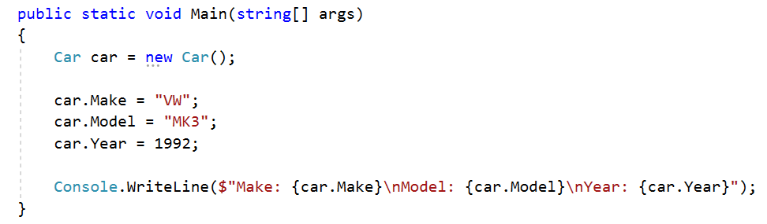
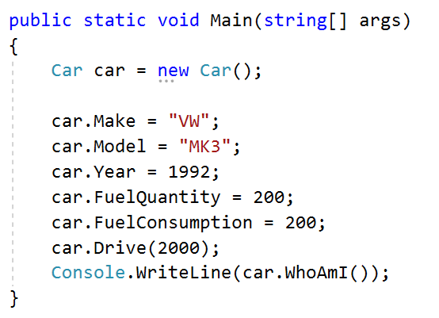
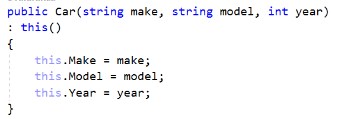
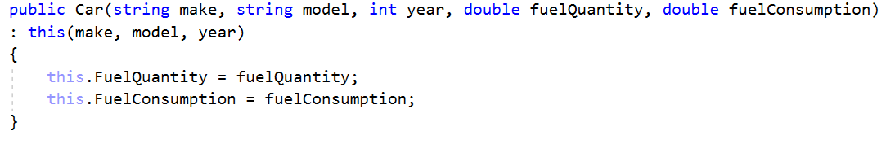
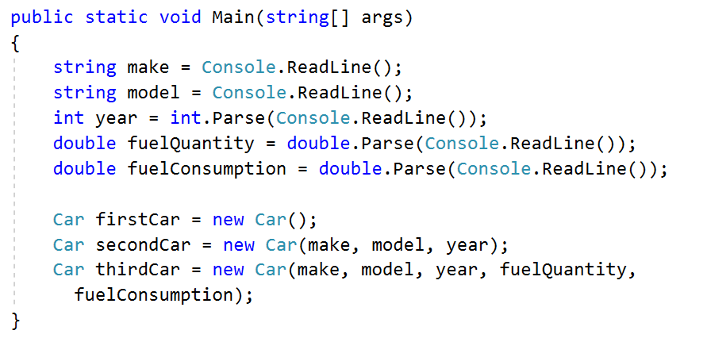
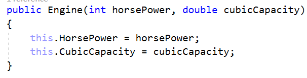
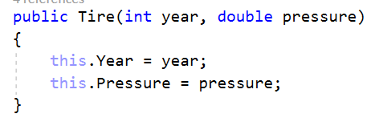
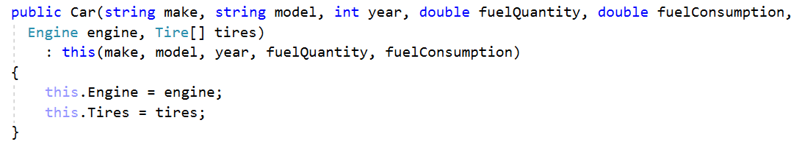
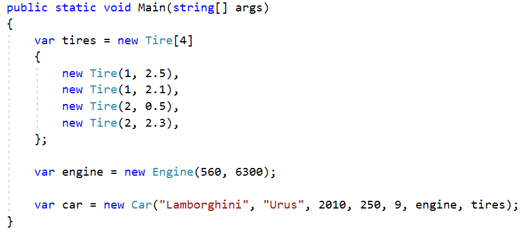

# Lab: Defining Classes

Problems for the ["C\# Advanced" course @
Software
University](https://softuni.bg/courses/csharp-advanced).  
You can check your solutions here:
<https://judge.softuni.bg/Contests/1478/Defining-Classes-Lab>

## Car

**NOTE**: You need a **StartUp** class with the namespace
**CarManufacturer**.

Create a **class** named **Car**. The class should have **private**
**fields** for:

  - **make: string**

  - **model:** **string**

  - **year: int**

The class should also have **public** **properties** for:

  - **Make: string**

  - **Model:** **string**

  - **Year: int**

You should be able to use the class like this:

## Car Extension

**NOTE**: You need a **StartUp** class with the namespace
**CarManufacturer**.

Create a class **Car** (you can use the class from the previous task)

The class should have private fields for:

  - **make: string**

  - **model:** **string**

  - **year: int**

  - **fuelQuantity: double**

  - **fuelConsumption: double**

The class should also have properties for:

  - **Make: string**

  - **Model:** **string**

  - **Year: int**

  - **FuelQuantity: double**

  - **FuelConsumption: double**

The class should also have methods for:

  - **Drive(double distance): void** – this method checks if the car
    fuel quantity minus the distance multiplied by the car fuel
    consumption is bigger than zero. If it is remove from the fuel
    quantity the result of the multiplication between the distance and
    the fuel consumption. Otherwise write on the console the following
    message:

**"Not enough fuel to perform this trip\!"**

  - **WhoAmI(): string –** returns the following message:

**"Make: {this.Make}\\nModel: {this.Model}\\nYear: {this.Year}\\nFuel:
{this.FuelQuantity:F2}L"**

You should be able to use the class like this:

## Car Constructors

Using the class from the previous problem create one parameterless
constructor with default values:

  - > Make – VW

  - > Model – Golf

  - > Year – 2025

  - > FuelQuantity – 200

  - > FuelConsumption – 10

Create a second constructor accepting **make, model** and **year** upon
initialization and calls the base constructor with its default values
for **fuelQuantity** and **fuelConsumption**.

Create a third constructor accepting **make, model, year, fuelQuantity**
and **fuelConsumption** upon initialization and reuses the second
constructor to set the make, model and year values.

Go to **StartUp.cs** file and make 3 different instances of the **Class
Car**, using the **different** overloads of the constructor.

## Car Engine and Tires

Using the Car class, you already created, define another class
**Engine**.

The class should have private fields for:

  - **horsePower: int**

  - **cubicCapacity:** **double**

The class should also have properties for:

  - **HorsePower: int**

  - **CubicCapacity:** **double**

The class should also have a constructor, which accepts **horsepower**
and **cubicCapacity** upon initialization:

Now create a class **Tire**.

The class should have private fields for:

  - **year: int**

  - **pressure:** **double**

The class should also have properties for:

  - **Year: int**

  - **Pressure: double**

The class should also have a constructor, which accepts **year** and
**pressure** upon initialization:

Finally, go to the **Car** class and create **private fields** and
**public properties** for **Engine** and **Tire\[\]**.Create another
constructor, which accepts **make, model, year, fuelQuantity,
fuelConsumption, Engine** and **Tire\[\]** upon initialization:

You should be able to use the classes like this:

## Special Cars

This is the final and most interesting problem in this lab. Until you
receive the command **"No more tires"**, you will be given tire info in
the format:

**{year} {pressure}**

**{year} {pressure}**

**…**

**"No more tires"**

You have to collect all the tires provided. Next, until you receive the
command **"Engines done"** you will be given engine info and you also
have to collect all that info.

**{horsePower} {cubicCapacity}**

**{horsePower} {cubicCapacity}**

**…**

The final step - until you receive **"Show special"**, you will be given
information about cars in the format:

**{make} {model} {year} {fuelQuantity} {fuelConsumption} {engineIndex}
{tiresIndex}**

**…**

Every time you have to create a **new Car** with the information
provided. The car engine is the provided **engineIndex** and the tires
are **tiresIndex**. Finally, collect all the created cars. When you
receive the command **"Show special"**, drive 20 kilometers all the
cars, which were manufactured during 2017 or after, have horse power
above 330 and the sum of their tire pressure is between 9 and 10.
Finally, print information about each special car in the following
format:

"Make: {specialCar.Make}"

"Model: {specialCar.Model}"

"Year: {specialCar.Year}"

"HorsePowers: {specialCar.Engine.HorsePower}"

"FuelQuantity: {specialCar.FuelQuantity}"

<table>
<thead>
<tr class="header">
<th><strong>Input</strong></th>
<th><strong>Output</strong></th>
</tr>
</thead>
<tbody>
<tr class="odd">
<td>
2 2.6 3 1.6 2 3.6 3 1.6

1 3.3 2 1.6 5 2.4 1 3.2

No more tires

331 2.2

145 2.0

Engines done

Audi A5 2017 200 12 0 0

BMW X5 2007 175 18 1 1

Show special
</td>
<td>
Make: Audi

Model: A5

Year: 2017

HorsePowers: 331

FuelQuantity: 197.6
</td>
</tr>
</tbody>
</table>
