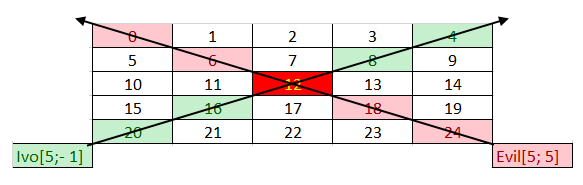
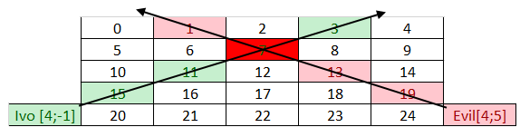

# Exercise: Working with Abstraction

This document defines the **exercise assignments** for the
["C\# OOP" course @ Software
University](https://softuni.bg/opencourses/csharp-oop).

You can check your solutions here:
[https://judge.softuni.bg/Contests/Working-with-Abstraction-Exercise](https://judge.softuni.bg/Contests/1496/Working-with-Abstraction-Exercise)

Your job is to download [source
code](https://softuni.bg/downloads/svn/csharp-fundamentals/2018-Jan/CSharp-OOP-Basics/02.%20CSharp-OOP-Basics-Working-with-Abstraction/02.%20CSharp-OOP-Basics-Working-with-Abstraction-Exercises-Resources.zip)
and **refactor** it.

## Raw Data

Write a program that tracks **cars** and their **cargo**. Define a class
**Car** that holds an information about **model, engine, cargo** and a
**collection of exactly 4 tires**. The **engine**, **cargo** and
**tire** should be **separate classes**. Create a **constructor** that
receives all of the information about the **Car** and creates and
**initializes** its inner **components** (**engine**, **cargo** and
**tires**).

On the first line of input, you will receive a number **N** - the number
of cars you have. On each of the next **N** lines, you will receive an
information about each car in the format:

"**{model} {engineSpeed} {enginePower} {cargoWeight} {cargoType}
{tire1Pressure} {tire1Age} {tire2Pressure} {tire2Age} {tire3Pressure}
{tire3Age} {tire4Pressure} {tire4Age}"**

The **speed**, **power**, **weight** and **tire age** are **integers**
and **tire** **pressure** is a **double.**

After the **N** lines, you will receive a single line with one of the
following commands:

  - "**fragile**" - print all cars whose **cargo** is **"fragile"** with
    **a tire**, whose **pressure is** **\< 1**

  - "**flamable**" - print all of the cars, whose **cargo** is
    **"flamable"** and have **engine power \> 250**

The cars should be printed in order of appearing in the input.

### Examples

<table>
<thead>
<tr class="header">
<th><strong>Input</strong></th>
<th><strong>Output</strong></th>
</tr>
</thead>
<tbody>
<tr class="odd">
<td>
2

ChevroletAstro 200 180 1000 fragile 1.3 1 1.5 2 1.4 2 1.7 4

Citroen2CV 190 165 1200 fragile 0.9 3 0.85 2 0.95 2 1.1 1

fragile
</td>
<td>Citroen2CV</td>
</tr>
<tr class="even">
<td>
4

ChevroletExpress 215 255 1200 flamable 2.5 1 2.4 2 2.7 1 2.8 1

ChevroletAstro 210 230 1000 flamable 2 1 1.9 2 1.7 3 2.1 1

DaciaDokker 230 275 1400 flamable 2.2 1 2.3 1 2.4 1 2 1

Citroen2CV 190 165 1200 fragile 0.8 3 0.85 2 0.7 5 0.95 2

flamable
</td>
<td>
ChevroletExpress

DaciaDokker
</td>
</tr>
</tbody>
</table>

## Cars Salesman

**You are given the problem and the solution of this task. Refactor it
by reusing the base constructors in the classes.**

Define two classes **Car** and **Engine.**

**Car** has the following properties:

  - **Model**

  - **Engine**

  - **Weight**

  - **Color**

**Engine** has the following properties:

  - **Model**

  - **Power**

  - **Displacement**

  - **Efficiency**

A Car's **weight** and **color** and its Engine's **displacement** and
**efficiency** are **optional**.

On the first line, you will read a number **N,** which will specify how
many lines of engines you will receive. On each of the next **N** lines,
you will receive information about an **Engine** in the following
format:

**"{model} {power} {displacement} {efficiency}"**

After the lines with engines, you will receive a number **M**. On each
of the next **M** lines, an information about a **Car** will follow in
the format:

**"{model} {engine} {weight} {color}"**

The engine will be the **model of an existing** **Engine**. When
creating the object for a **Car**, you should keep a **reference to the
real engine** in it, instead of just the engine's model.

**Note:** that the optional properties **might be missing** from the
formats.

Your task is to **print** all the **cars** in the order they were
received and their information in the format defined bellow. If any of
the optional fields are missing, print "**n/a**" in its place:

{CarModel}:  
{EngineModel}:  
Power: {EnginePower}  
Displacement: {EngineDisplacement}  
Efficiency: {EngineEfficiency}  
Weight: {CarWeight}  
Color: {CarColor}

### Bonus\*

Override the classes'  **ToString()** methods to have a reusable way of
displaying the objects.

### Examples

<table>
<thead>
<tr class="header">
<th><strong>Input</strong></th>
<th><strong>Output</strong></th>
</tr>
</thead>
<tbody>
<tr class="odd">
<td>
2

V8-101 220 50

V4-33 140 28 B

3

FordFocus V4-33 1300 Silver

FordMustang V8-101

VolkswagenGolf V4-33 Orange
</td>
<td>
FordFocus:

V4-33:

Power: 140

Displacement: 28

Efficiency: B

Weight: 1300

Color: Silver

FordMustang:

V8-101: 
Power: 220 
Displacement: 50

Efficiency: n/a

Weight: n/a

Color: n/a

VolkswagenGolf:

V4-33:

Power: 140

Displacement: 28

Efficiency: B

Weight: n/a

Color: Orange
</td>
</tr>
<tr class="even">
<td>
4

DSL-10 280 B

V7-55 200 35

DSL-13 305 55 A+

V7-54 190 30 D

4

FordMondeo DSL-13 Purple

VolkswagenPolo V7-54 1200 Yellow

VolkswagenPassat DSL-10 1375 Blue

FordFusion DSL-13
</td>
<td>
FordMondeo:

DSL-13:

Power: 305

Displacement: 55

Efficiency: A+

Weight: n/a

Color: Purple

VolkswagenPolo:

V7-54:

Power: 190

Displacement: 30

Efficiency: D

Weight: 1200

Color: Yellow

VolkswagenPassat:

DSL-10:

Power: 280

Displacement: n/a

Efficiency: B

Weight: 1375

Color: Blue

FordFusion:

DSL-13:

Power: 305

Displacement: 55

Efficiency: A+

Weight: n/a

Color: n/a
</td>
</tr>
</tbody>
</table>

## Jedi Galaxy

**Rework the following solutions in order to avoid repeating code,
increase readability and improve performance.**

Ivo's galaxy is represented as a two-dimensional array. You will receive
**two** integers, separated by a space, which represent the two
dimensional array - the first being the rows and the second being the
columns. Every cell in the matrix is a star that has a value. Ivo starts
at the given **row** and **col**. He can move only on the diagonal
**from the lowest left to the upper right**, and **adds** to his score
**all** the **stars** (values) from the cells he **passes through**.
Unfortunately, there is always an Evil power that tries to prevent his
success.

Evil power starts at the given **row** and **col** and instantly
**destroys** **all stars** on the **opposite** diagonal - **from lowest
right to the upper left.** Ivo **adds** the values only of the stars
that are **not** **destroyed** by the evil power.

Then, you must fill the two dimensional array with increasing integers
starting from 0, and continuing on every row, like this:

first row: 0, 1, 2… m

second row: n+1, n+2, n+3… n + n.

**Example:**

Ivo starts with coordinates **row = 5**, **col =
-1**. He must collect all stars with value **\[20, 16, 12, 8, 4\]**.
Evil starts with coordinates **row = 5**, **col = 5**. The Evil
**destroys** all stars in range **\[24, 18, 12, 6, 0\]**. The star with
value **12** is the **cross** **point** for Ivo and The Evil, so Ivo
**skips** the stars and **collects** only these who are not in the evil
range.

You will also receive multiple pairs of commands in the form of 2
integers separated by a single space. The first two integers will
represent Ivo's start coordinates. The second one will represent the
Evil Power's start coordinates.

The input ends when you receive the command "**Let the Force be with
you**". When that happens, you must print the value of all stars that
Ivo has collected successfully.

### Input

  - On the first line, you will receive the number N, M -\> the
    dimensions of the matrix. You must then fill the matrix according to
    these dimensions.

  - On the next several lines you will begin receiving 2 integers
    separated by a single **space**, which represent Ivo's row and col.
    On the next line you will receive the Evil Power's coordinates.

  - There will always be **at least 2 lines** of input to represent at
    least 1 path of Ivo and the Evil force.

  - When you receive the command, "**Let the Force be with you**" the
    input ends.

### Output

  - The output is simple. Print the sum of the values from all stars
    that Ivo has collected.

### Constraints

  - The dimensions of the matrix will be integers in the range \[5,
    2000\].

  - The given rows will be valid integers in the range \[0, 2000\].

  - The given columns will be valid integers in the range
    \[-231 + 1, 231 - 1\].

<table>
<thead>
<tr class="header">
<th><strong>Input</strong></th>
<th><strong>Output</strong></th>
</tr>
</thead>
<tbody>
<tr class="odd">
<td>
5 5

5 -1

5 5

Let the Force be with you
</td>
<td>48</td>
</tr>
<tr class="even">
<td>
5 5

4 -1

4 5

Let the Force be with you
</td>
<td>29</td>
</tr>
</tbody>
</table>

## Hospital

Your task will be to prepare an electronic register for a hospital. In
the hospital we have different departments:

  - **Cardiology**

  - [**Oncology**](https://en.wikipedia.org/wiki/Oncology)

  - **[Emergency
    department](https://en.wikipedia.org/wiki/Emergency_department)**

  - **etc.**

Each department has **20** rooms for patients and **each room has 3
beds**. When a new patient goes in the hospital, he/she is placed on the
first free bed in the department. If there are no free beds, the patient
should go in another hospital. Of course, in every hospital there are
doctors. Each doctor can have patients in a different department. You
will receive an information about the patients in the format
**{Department} {Doctor} {Patient}**

After the **"Output"** command, you will receive some other commands
about what kind of output you need to print. The commands are:

  - **{Department}** - You need to **print all patients** in this
    department in the **order of receiving**.

  - **{Department} {Room}** - You need to **print all patients** in this
    room in **alphabetical order**.

  - **{Doctor}** - You need to **print all patients** for this doctor in
    **alphabetical order.**

The program ends when you receive command **"End"**.

### Input

On the first lines you will receive info for the hospital, department,
doctors and patients in the following format:

**{Department} {Doctor} {Patient}**

When you read the **"Output"** line you will get one or more commands
telling you what you need to print

Keep reading commands for printing untill you reach the command
**"End"**.

### Output

  - **{Department}** - print all patients in this department in order of
    receiving on a new line

  - **{Department} {Room}** - print all patients in this room in
    alphabetical order each on new line

  - **{Doctor}** - print all patients that are healed from doctor in
    alphabetical order on new line

### Constraints

  - **{Department}** - single word with length **1 \< n \< 100**

  - **{Doctor}** - name and surname, both with length **1 \< n \< 20**

  - **{Patient}** - unique name with length **1 \< n \< 20**

  - **{Room}** - integer **1 \<= n \<= 20**

  - Time limit: 0.3 sec. Memory limit: 16 MB.

### Examples

<table>
<thead>
<tr class="header">
<th><strong>Input</strong></th>
<th><strong>Output</strong></th>
</tr>
</thead>
<tbody>
<tr class="odd">
<td>
Cardiology Petar Petrov Ventsi

Oncology Ivaylo Kenov Valio

Emergency Mariq Mircheva Simo

Cardiology Genka Shikerova Simon

Emergency Ivaylo Kenov NuPogodi

Cardiology Gosho Goshov Esmeralda

Oncology Gosho Goshov Cleopatra

Output

Cardiology

End
</td>
<td>
Ventsi

Simon

Esmeralda
</td>
</tr>
</tbody>
</table>

<table>
<thead>
<tr class="header">
<th><strong>Input</strong></th>
<th><strong>Output</strong></th>
</tr>
</thead>
<tbody>
<tr class="odd">
<td>
Cardiology Petar Petrov Ventsi

Oncology Ivaylo Kenov Valio

Emergency Mariq Mircheva Simo

Cardiology Genka Shikerova Simon

Emergency Ivaylo Kenov NuPogodi

Cardiology Gosho Goshov Esmeralda

Oncology Gosho Goshov Cleopatra

Output

Cardiology 1

End
</td>
<td>
Esmeralda

Simon

Ventsi
</td>
</tr>
</tbody>
</table>

<table>
<thead>
<tr class="header">
<th><strong>Input</strong></th>
<th><strong>Output</strong></th>
</tr>
</thead>
<tbody>
<tr class="odd">
<td>
Cardiology Petar Petrov Ventsi

Oncology Ivaylo Kenov Valio

Emergency Mariq Mircheva Simo

Cardiology Genka Shikerova Simon

Emergency Ivaylo Kenov NuPogodi

Cardiology Gosho Goshov Esmeralda

Oncology Gosho Goshov Cleopatra

Output

Ivaylo Kenov

End
</td>
<td>
NuPogodi

Valio
</td>
</tr>
</tbody>
</table>

## Greedy Times

Finally, you have unlocked the safe and reached the treasure\! Inside
there are all kinds of gems, cash in different currencies and gold
bullions. Next to you there is a bag which unfortunately has a limited
space. You don't have much time so you need to take as much wealth as
possible\! But in order to get a bigger amount of the most valuable
items, you need to keep the following rules:

  - The **gold amount** in your bag should **always** **be** **more**
    than **or equal** to the **gem** **amount** at **any** time

  - The **gem amount** should **always** **be** **more** than **or**
    **equal** to the **cash** **amount** at **any** time

If you read an **item** which **breaks** one of **these rules** you
**should not put** it in the **bag**. You should **always** be careful
**not** to **exceed** the overall **bag**'**s capacity,** because it
will tear down and you will lose everything\! You will receive the
**content** **of** the **safe** on a **single line** in the **format**
of **item - quantity** pairs, separated by **whitespace**. You need to
gather **only** **three** **types** of items:

  - Cash - All **three letter** items

  - Gem - All **items** which **end** on "**Gem**" (at least 4 symbols)

  - Gold - this type has **only one item** with the name - "**Gold**"

Each **item** which **does not** fall **in** one of the **above
categories** is **useless** and you should **skip it**. Reading item's
**names** should be **CASE-INSENSITIVE**. You should **aggregate**
**item's quantities** which have the **same** **name**.

If you've kept the rules you should escape successfully with a bag full
of wealth. Now it's time to review what you have managed to get out of
the safe. **Print all** the **types** ordered by **total amount** in
**descending order**. Inside a type, **order** the **items** first
**alphabetically** in **descending** order and **then by** their
**amount** in **ascending** order. Use the following format for each
type:

**"\<{type}\> ${total amount}"**

**"\#\#{item} - {amount}"** - each item from this type on new line

### Input

  - On the **first line**, you will receive a **number** which
    represents the **capacity** of the **bag**

  - On the **second line**, you will receive a **sequence** of **item -
    quantity** pairs

### Output

  - Print **only** the **types** from which you **have items in the
    bag**, ordered by **Total Amount** in descending order. Inside a
    type, order the **items** **first** **alphabetically** in
    **descending** order and **then** by **amount** in **ascending**
    **order**. Use the following format for each type:

**"\<{type}\> ${total amount}"**

**"\#\#{item} - {amount}"** - each item on new line

### Constraints

  - The Bag's **max capacity** will **always** be a **positive number**

  - All **quantities** will be **positive** **integer** in the range \[0
    … 2100000000\]

  - Each item of type **gem** will have a **name** - **at** **least 4**
    symbols

  - Time limit: 0.1 sec. Memory limit: 16 MB

### Examples

<table>
<thead>
<tr class="header">
<th><strong>Input</strong></th>
<th><strong>Output</strong></th>
</tr>
</thead>
<tbody>
<tr class="odd">
<td>
150

Gold 28 Rubygem 16 USD 9 GBP 8
</td>
<td>
&lt;Gold&gt; $28

##Gold - 28

&lt;Gem&gt; $16

##Rubygem - 16

&lt;Cash&gt; $9

##USD - 9
</td>
</tr>
<tr class="even">
<td>
24000010

USD 1030 Gold 300000 EmeraldGem 900000 Topazgem 290000 CHF 280000 Gold 10000000 JPN 10000 Rubygem 10000000 KLM 3120010
</td>
<td>
&lt;Gold&gt; $10300000

##Gold - 10300000

&lt;Gem&gt; $10290000

##Topazgem - 290000

##Rubygem - 10000000

&lt;Cash&gt; $3410010

##KLM - 3120010

##JPN - 10000

##CHF - 280000
</td>
</tr>
<tr class="odd">
<td>
80345

RubyGem 70000 JAV 10960 Bau 60000 Gold 80000
</td>
<td>
&lt;Gold&gt; $80000

##Gold - 80000
</td>
</tr>
</tbody>
</table>

## Sneaking

After our hero Sam got the recipe from the first problem, there is
another thing he needs to check off from his to-do list. In order to
make the recipe even more valuable, he needs to **"**eliminate**"**
anyone who possesses the knowledge of it. That person is Sam's sworn
enemy - **Nikoladze**. Sam needs to get through a rectangular room of
**patrolling** **enemies** until he finally **reaches Nikoladze**.

A standard room looks like this:

<table>
<thead>
<tr class="header">
<th><strong>Room</strong></th>
<th><strong>Legend</strong></th>
</tr>
</thead>
<tbody>
<tr class="odd">
<td>......N... 
b......... 
..d....... 
......d... 
.....S....</td>
<td>
<strong>S Sam,</strong> the player character

<strong>b/d left/right-facing patrolling enemy</strong>

<strong>N Nikoladze</strong>

<strong>. Empty space</strong>
</td>
</tr>
</tbody>
</table>

Each turn proceeds as follows:

  - **Enemies** move either **left** or **right**, depending on which
    **direction** they are **facing** (**b** goes **right**, **d** goes
    **left**)
    
      - If an enemy is standing on the **edge** of the room, he flips
        his **direction** (from **d** to **b** or from **b** to **d**)

  - After that, Sam moves in the **direction** he is instructed to
    (either **U**/**D**/**L**/**R** or **W**, which means **wait**).

  - If **Sam** moves **onto an enemy** (**same row** and **column**),
    Sam **kills** the enemy and **leaves no trace of him**.

  - Otherwise, if an enemy is on the **same row** as Sam, and also
    **facing** **Sam** (eg. **.b.S.**), the **enemy** **kills Sam**.

  - If Sam reaches the **same row** as **Nikoladze**, **Sam** kills
    **Nikoladze** (replacing him with an **X**)

### Input

  - On the **first line** of input, you will receive n - the **number of
    rows** the **room** will consist of

  - On the next **n lines**, you will receive the **room**, which Sam
    will have to navigate.

  - On the **final line** of input, you will receive a sequence of
    **directions** - one of (U, D, L, R, W)

### Output

  - If Sam is **killed**, print **"Sam died at {row}, {col}".**

  - If Nikoladze is **killed**, print **"Nikoladze killed\!".**

  - Then, in both cases, **print** the **final state of the room** on
    the **console**, with either **Sam** or **Nikoladze**'**s**
    **symbols** replaced by an **X**.

### Constraints

  - The room will always be **rectangular**.

  - There will **always** be enough moves for **Sam** to reach
    **Nikoladze.**

  - There will be **no case** where **Sam** is instructed to move **out
    of the bounds of the room**.

  - There will be **no case** with **two enemies on the same row**.

  - There will be **no case** with an **enemy and Nikoladze** standing
    on the **same row**.

  - There will be **no case** where Sam reaches the same **row and
    column** as **Nikoladze**.

### Examples

<table>
<thead>
<tr class="header">
<th><strong>Input</strong></th>
<th><strong>Output</strong></th>
<th><strong>Comments</strong></th>
</tr>
</thead>
<tbody>
<tr class="odd">
<td>
5

......N...

b.........

..d.......

......d...

.....S....

UUUUR
</td>
<td>
Sam died at 2, 5

......N...

...b......

b....X....

..........

..........
</td>
<td>
Turn 1: <strong>Enemies</strong> move, then Sam <strong>steps on</strong> the enemy on the <strong>4th</strong> row.

Turn 2: Enemies move, then Sam moves.

Turn 3: Enemy 2 <strong>turns around</strong>, Sam goes on the same row as him.

Turn 4: Enemy sees Sam and <strong>kills him</strong>.
</td>
</tr>
<tr class="even">
<td>
3

N......

.b.....

..dS...

WUUU
</td>
<td>
Nikoladze killed!

X..S...

.......

b......
</td>
<td>
Turn 1: Enemies move, Sam waits.

Turn 2: Enemies move, Sam goes <strong>up, steps on an enemy</strong>.

Turn 3: Enemies move, Sam goes <strong>up, kills Nikoladze</strong>.
</td>
</tr>
<tr class="odd">
<td>
6

.............

....S........

.b...........

...........d.

.............

....N........

WWWDWWWDDRD
</td>
<td>
Nikoladze killed!

.............

.............

............b

d............

.............

....XS.......
</td>
<td>
Turn 1/2/3: Enemies <strong>move</strong>, Sam <strong>waits</strong>.

Turn 4: Enemies <strong>move</strong>, Sam goes <strong>down</strong>.

Turn 5/6/7: Enemies <strong>move</strong>, Sam <strong>waits</strong>.

Turn 8/9: Enemies <strong>move</strong>, Sam goes <strong>down</strong>.

Turn 10: Enemies <strong>move</strong>, Sam goes <strong>right</strong>.

Turn 11: Enemies <strong>move</strong>, Sam goes <strong>down</strong> and <strong>kills</strong> Nikoladze.
</td>
</tr>
</tbody>
</table>
