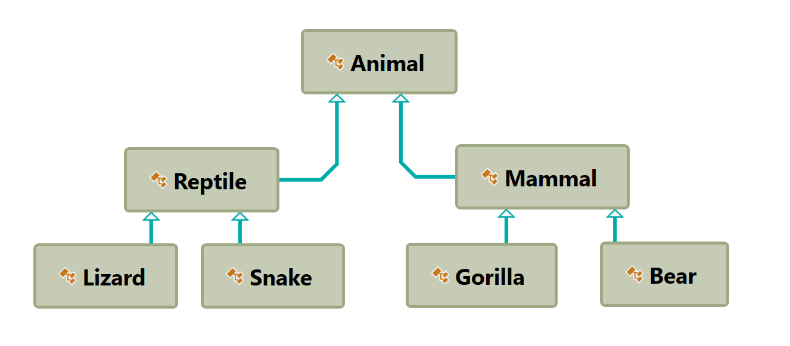
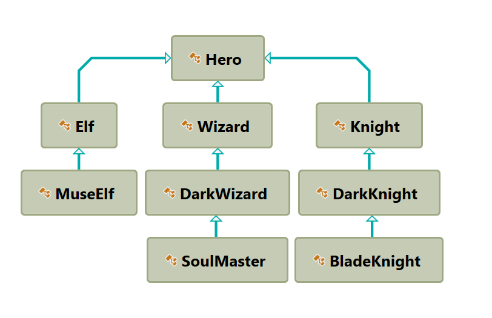
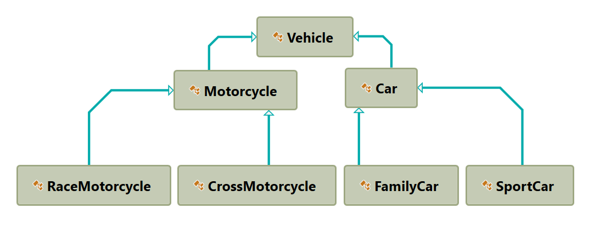

# Exercises: Inheritance

Problems for exercises and homework for the ["C\# OOP" course @
SoftUni"](https://softuni.bg/trainings/2244/csharp-oop-february-2019).

You can check your solutions here:
<https://judge.softuni.bg/Contests/1500/Inheritance-Exercise>

**Use** the **provided** **skeleton** for each of the exercises.

## Person

You are asked to model an application for storing data about people. You
should be able to have a person and a child. The child derives from the
person. Your task is to model the application. The only constraints are:

  - People should **not** be able to have a **negative age**

  - Children should **not** be able to have an age **more than 15**.

<!-- end list -->

  - **Person** – represents the base class by which all of the others
    are implemented

<!-- end list -->

  - **Child** - represents a class, which derives from **Person.**

### Note

Your class’s names **MUST** be the same as the names shown above\!\!\!

<table>
<thead>
<tr class="header">
<th><strong>Sample Main()</strong></th>
</tr>
</thead>
<tbody>
<tr class="odd">
<td>
static void Main()

{

string name = Console.ReadLine();

int age = int.Parse(Console.ReadLine());

Child child = new Child(name, age);

Console.WriteLine(child);

}
</td>
</tr>
</tbody>
</table>

Create a new empty class and name it **Person**. Set its access modifier
to **public** so it can be instantiated from any project. Every person
has a **name**, and an **age**.

<table>
<thead>
<tr class="header">
<th><strong>Sample Code</strong></th>
</tr>
</thead>
<tbody>
<tr class="odd">
<td>
public class Person

{

// 1. Add Fields

// 2. Add Constructor

// 3. Add Properties

// 4. Add Methods

}
</td>
</tr>
</tbody>
</table>

  - Define a **field** for each property the class should have (e.g.
    **Name**, **Age**)

  - Define the **Name** and **Age** properties of a Person.

### Step 1 - Define a Constructor

Define a constructor that accepts **name and age**.

<table>
<thead>
<tr class="header">
<th><strong>Sample Code</strong></th>
</tr>
</thead>
<tbody>
<tr class="odd">
<td>
public Person(string name, int age)

{

this.Name = name;

this.Age = age;

}
</td>
</tr>
</tbody>
</table>

### Step 2 - Override ToString()

As you probably already know, all classes in C\# inherit the **Object**
class and therefore have all its **public** members (**ToString()**,
**Equals()** and **GetHashCode()** methods). **ToString()** serves to
return information about an instance as string. Let's **override**
(change) its behavior for our **Person** class.

<table>
<thead>
<tr class="header">
<th><strong>Sample Code</strong></th>
</tr>
</thead>
<tbody>
<tr class="odd">
<td>
public override string ToString()

{

StringBuilder stringBuilder = new StringBuilder();

stringBuilder.Append(String.Format("Name: {0}, Age: {1}",

this.Name,

this.Age));

return stringBuilder.ToString();

}
</td>
</tr>
</tbody>
</table>

And voila\! If everything is correct, we can now create **Person
objects** and display information about them.

### Step 3 – Create a Child

Create a **Child** class that inherits **Person** and has the same
constructor definition. However, do not copy the code from the Person
class - **reuse the Person class' constructor**.

<table>
<thead>
<tr class="header">
<th><strong>Sample Code</strong></th>
</tr>
</thead>
<tbody>
<tr class="odd">
<td>
public Child(string name, int age)

: base(name, age)

{

}
</td>
</tr>
</tbody>
</table>

There is **no need** to rewrite the **Name** and **Age** properties
since **Child** inherits **Person** and by default has them.

### Examples

<table>
<thead>
<tr class="header">
<th><strong>Input</strong></th>
<th><strong>Output</strong></th>
</tr>
</thead>
<tbody>
<tr class="odd">
<td>
Pesho

12
</td>
<td>Name: Pesho, Age: 13</td>
</tr>
</tbody>
</table>

## Zoo

**NOTE**: You need a public class **StartUp**.

Create a project **Zoo**. It needs to contain the following classes:

Follow the diagram and create all of the classes. **Each** of them,
except the **Animal** class, should **inherit** from **another**
**class**. Every class should have:

  - A constructor, which accepts one parameter: **name**.

  - Property **Name - string**.

Zip your solution without the bin and obj folders and upload it in
Judge.

## Players and Monsters

NOTE: You need a public class **StartUp**.

Your task is to create the following game hierarchy:

Create a class Hero. It should contain the following members:

  - A constructor, which accepts:
    
      - **username – string**
    
      - **level – int**

  - The following properties:
    
      - **Username - string**
    
      - **Level – int**

  - **ToString()** method

Hint: Override **ToString()** of the base class in the following way:

<table>
<tbody>
<tr class="odd">
<td>
public override string ToString()

{

return $"Type: {this.GetType().Name} Username: {this.Username} Level: {this.Level}";

}
</td>
</tr>
</tbody>
</table>

## Need for Speed

NOTE: You need a public class **StartUp**. Create the following
**hierarchy** with the following **classes**: 

Create a base class **Vehicle**. It should contain the following
members:

  - A constructor that accepts the following parameters: **int
    horsePower**, **double fuel**

<!-- end list -->

  - **DefaultFuelConsumption – double**

  - **FuelConsumption – virtual double**

  - **Fuel – double**

  - **HorsePower – int**

  - **virtual void Drive(double kilometers)**
    
      - The **Drive** method should have a functionality to reduce the
        **Fuel** based on the travelled kilometers.

The default fuel consumption for **Vehicle** is **1.25**. Some of the
classes have different default fuel consumption values:

  - **SportCar – DefaultFuelConsumption = 10**

  - **RaceMotorcycle – DefaultFuelConsumption = 8**

  - **Car – DefaultFuelConsumption = 3**

Zip your solution without the bin and obj folders and upload it in
Judge.

## Restaurant

NOTE: You need a public class **StartUp**. Create a **Restaurant**
project with the following classes and hierarchy:

There are **Food** and **Beverages** in the restaurant and they are all
products.

The **Product** class must have the following members:

  - A constructor with the following parameters: **string name, decimal
    price**

  - **Name – string**

  - **Price – decimal**

**Beverage** and **Food** classes are products.

The **Beverage** class must have the following members:

  - A constructor with the following parameters**: string name, decimal
    price, double milliliters**
    
      - Reuse the constructor of the inherited class

  - **Name – string**

  - **Price – double**

  - **Milliliters – double**

**HotBeverage** and **ColdBeverage** are beverages and they accept the
following parameters upon initialization: **string name, decimal price,
double milliliters.** Reuse the constructor of the inherited class.

**Coffee** and **Tea** are hot beverages. The **Coffee** class must have
the following additional members:

  - **double CoffeeMilliliters = 50**

<!-- end list -->

  - **decimal CoffeePrice = 3.50**

  - **Caffeine – double**

The **Food** class must have the following members:

  - A constructor with the following parameters**: string name, decimal
    price, double grams**

  - **Name – string**

  - **Price – decimal**

  - **Grams – double**

**MainDish**, **Dessert** and **Starter** are food. They all accept the
following parameters upon initialization: **string name, decimal price,
double grams**. Reuse the base class constructor.

**Dessert** must accept **one more** parameter in its **constructor**:
**double calories**, and has a property:

  - **Calories**

Make **Fish**, **Soup** and **Cake** inherit the proper classes.

The **Cake** class must have the following default values:

  - **Grams = 250**

<!-- end list -->

  - **Calories = 1000**

  - **CakePrice = 5**

A **Fish** must have the following default values:

  - **Grams = 22**

Zip your solution without the bin and obj folders and upload it in
Judge.

## Animals

NOTE: You need a public class **StartUp**.

Create a hierarchy of **Animals**. Your program should have three
different animals – **Dog**, **Frog** and **Cat**. Deeper in the
hierarchy you should have two additional classes – **Kitten** and
**Tomcat**. **Kittens are female and Tomcats are male.** All types of
animals should be able to produce some kind of sound -
**ProduceSound()**. For example, the dog should be able to bark. Your
task is to model the hierarchy and test its functionality. Create an
animal of each kind and make them all produce sound.

You will be given some lines of input. Each two lines will represent an
animal. On the first line will be the type of animal and on the second –
the name, the age and the gender. When the command "**Beast\!**" is
given, stop the input and print all the animals in the format shown
below.

### Output

  - Print the information for each animal on three lines. On the first
    line, print: **"{AnimalType}"**

  - On the second line print: **"{Name} {Age} {Gender}"**

  - On the third line print the sounds it produces:
    **"{ProduceSound()}"**

### Constraints

  - Each **Animal** should have a **name**, an **age** and a **gender**

  - **All** input values should **not be blank** (e.g. name, age and so
    on…)

  - If you receive an input for the **gender** of a **Tomcat** or a
    **Kitten**, ignore it but **create** the animal

  - If the input is invalid for one of the properties, throw an
    exception with message: **"Invalid input\!"**

  - Each animal should have the functionality to **ProduceSound()**

  - Here is the type of sound each animal should produce:
    
      - **Dog: "Woof\!"**
    
      - **Cat: "Meow meow"**
    
      - **Frog: "Ribbit"**
    
      - **Kittens: "Meow"**
    
      - **Tomcat: "MEOW"**

### Examples

<table>
<thead>
<tr class="header">
<th><strong>Input</strong></th>
<th><strong>Output</strong></th>
</tr>
</thead>
<tbody>
<tr class="odd">
<td>
Cat

Tom 12 Male

Dog

Sharo 132 Male

Beast!
</td>
<td>
Cat

Tom 12 Male

Meow meow

Dog

Sharo 132 Male

Woof!
</td>
</tr>
<tr class="even">
<td>
Frog

Kermit 12 Male

Beast!
</td>
<td>
Frog

Kermit 12 Male

Ribbit
</td>
</tr>
<tr class="odd">
<td>
Frog

Sashko -2 Male

Frog

Sashko 2 Male

Beast!
</td>
<td>
Invalid input!

Frog

Sashko 2 Male

Ribbit
</td>
</tr>
</tbody>
</table>
