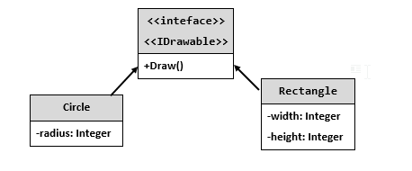
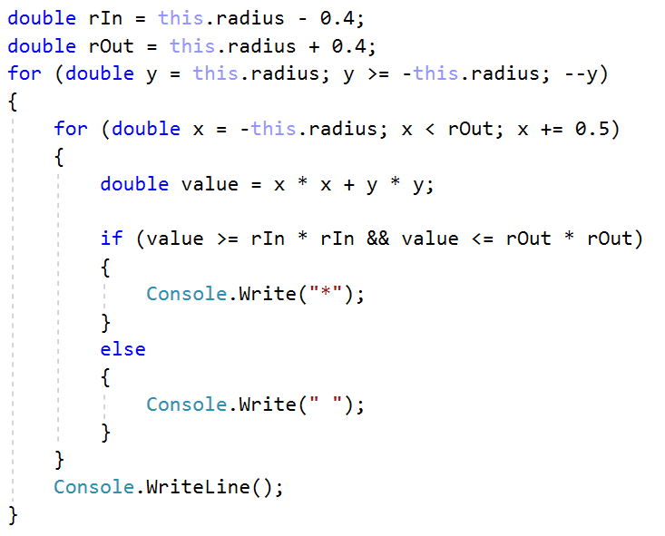
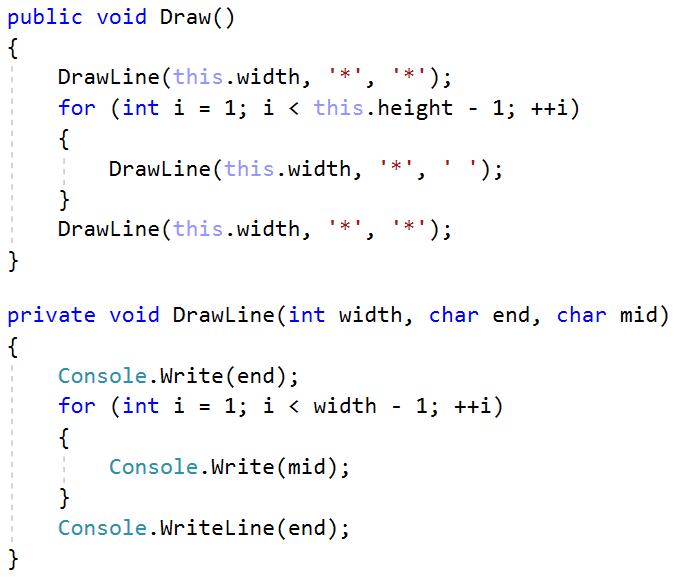
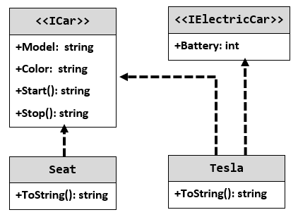

# Lab: **Interfaces and Abstraction**

Problems for exercises and homework for the ["C\# OOP" course @
SoftUni"](https://softuni.bg/trainings/2244/csharp-oop-february-2019).

You can check your solutions here:
<https://judge.softuni.bg/Contests/1501/Interfaces-and-Abstraction-Lab>

## Shapes

**NOTE**: You need a public **StartUp** class with the namespace
**Shapes**.

Build hierarchy of interfaces and classes:

You should be able to use the class like this:

<table>
<thead>
<tr class="header">
<th>StartUp.cs</th>
</tr>
</thead>
<tbody>
<tr class="odd">
<td>
var radius = int.Parse(Console.ReadLine());

IDrawable circle = new Circle(radius);

var width = int.Parse(Console.ReadLine());

var height = int.Parse(Console.ReadLine());

IDrawable rect = new Rectangle(width, height);

circle.Draw();

rect.Draw();
</td>
</tr>
</tbody>
</table>

### Examples

<table>
<thead>
<tr class="header">
<th><strong>Input</strong></th>
<th><strong>Output</strong></th>
</tr>
</thead>
<tbody>
<tr class="odd">
<td>
<strong>3</strong>

<strong>4</strong>

<strong>5</strong>
</td>
<td>
<strong>*******</strong>

<strong>** **</strong>

<strong>** **</strong>

<strong>* *</strong>

<strong>** **</strong>

<strong>** **</strong>

<strong>*******</strong>

<strong>****</strong>

<strong>* *</strong>

<strong>* *</strong>

<strong>* *</strong>

<strong>****</strong>
</td>
</tr>
</tbody>
</table>

### Solution

The algorithm for drawing a circle is:

The algorithm for drawing a rectangle is:

## Cars

**NOTE**: You need a public **StartUp** class with the namespace
**Cars**.

Build a hierarchy of interfaces and classes:

Your hierarchy must be used with this code:

<table>
<thead>
<tr class="header">
<th>StartUp.cs</th>
</tr>
</thead>
<tbody>
<tr class="odd">
<td>
ICar seat = new Seat("Leon", "Grey");

ICar tesla = new Tesla("Model 3", "Red", 2);

Console.WriteLine(seat.ToString());

Console.WriteLine(tesla.ToString());
</td>
</tr>
</tbody>
</table>

### Examples

<table>
<thead>
<tr class="header">
<th><strong>Output</strong></th>
</tr>
</thead>
<tbody>
<tr class="odd">
<td>
<strong>Grey Seat Leon</strong>

<strong>Engine start</strong>

<strong>Breaaak!</strong>

<strong>Red Tesla Model 3 with 2 Batteries 
Engine start</strong>

<strong>Breaaak!</strong>
</td>
</tr>
</tbody>
</table>
