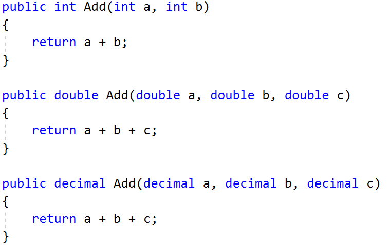
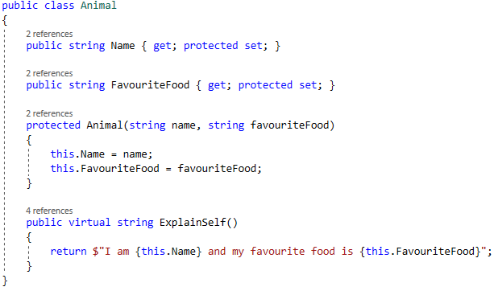
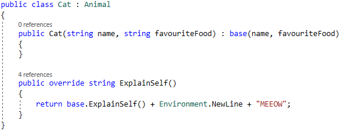

# Lab: Polymorphism

Problems for exercises and homework for the ["C\# OOP" course @
SoftUni"](https://softuni.bg/trainings/2244/csharp-oop-february-2019).

You can check your solutions here:
<https://judge.softuni.bg/Contests/1503/Polymorphism-Lab>

## MathOperation

**NOTE**: You need a public **StartUp** class with the namespace
**Operations**.

Create a class **MathOperations**, which should have 3 times method
**Add().** Method **Add()** has to be invoked with:

  - Add(int, int): **int**

  - Add(double, double, double): **double**

  - Add(decimal, decimal, decimal): **decimal**

You should be able to use the class like this:

<table>
<thead>
<tr class="header">
<th>StartUp.cs</th>
</tr>
</thead>
<tbody>
<tr class="odd">
<td>
public static void Main()

{

MathOperations mo = new MathOperations();

Console.WriteLine(mo.Add(2, 3));

Console.WriteLine(mo.Add(2.2, 3.3, 5.5));

Console.WriteLine(mo.Add(2.2m, 3.3m, 4.4m));

}
</td>
</tr>
</tbody>
</table>

### Examples

<table>
<thead>
<tr class="header">
<th><strong>Output</strong></th>
</tr>
</thead>
<tbody>
<tr class="odd">
<td>
<strong>5</strong>

<strong>11</strong>

<strong>9.9</strong>
</td>
</tr>
</tbody>
</table>

### Solution

Created MathOperation class should look like this:

## Animals

**NOTE**: You need a public **StartUp** class with the namespace
**Animals**.

Create a class Animal, which holds two fields:

  - name: string

  - favouriteFood: string

Animal has one virtual method **ExplainSelf(): string.  
**You should add two new classes - **Cat** and **Dog. Override** the
**ExplainSelf()** method by adding concrete animal sound on a new line.
(Look at examples below)

You should be able to use the class like this:

<table>
<thead>
<tr class="header">
<th>StartUp.cs</th>
</tr>
</thead>
<tbody>
<tr class="odd">
<td>
Animal cat = new Cat("Pesho", "Whiskas");

Animal dog = new Dog("Gosho", "Meat");

Console.WriteLine(cat.ExplainSelf());

Console.WriteLine(dog.ExplainSelf());
</td>
</tr>
</tbody>
</table>

### Examples

<table>
<thead>
<tr class="header">
<th><strong>Output</strong></th>
</tr>
</thead>
<tbody>
<tr class="odd">
<td>
<strong>I am Pesho and my fovourite food is Whiskas</strong>

<strong>MEEOW</strong>

<strong>I am Gosho and my fovourite food is Meat</strong>

<strong>DJAAF</strong>
</td>
</tr>
</tbody>
</table>

### Solution

## Shapes

**NOTE**: You need a public **StartUp** class with the namespace
**Shapes**.

Create a class hierarchy, starting with **abstract** class Shape:

  - **Abstract methods:**
    
      - **CalculatePerimeter(): doulbe**
    
      - **CalculateArea(): double**

  - **Virtual methods:**
    
      - **Draw(): string**

Extend the Shape class with two children:

  - **Rectangle**

  - **Circle**

Each of them need to have:

  - **Fields:**
    
      - **height and width for Rectangle**
    
      - **radius for Circle**

  - **Encapsulation for these fields**

  - **A public constructor**

  - **Concrete methods for calculations (perimeter and area)**

  - **Override methods for drawing**
