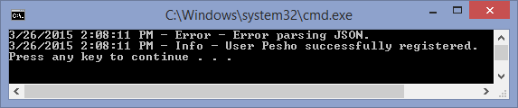
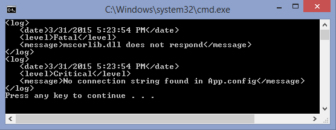
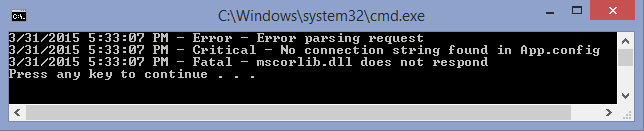

# Exercises: SOLID

Problems for exercise and homework for the ["C\# OOP" course @
SoftUni"](https://softuni.bg/trainings/2244/csharp-oop-february-2019).

## Logger

Write a logging library for logging messages. The interface for the
end-user should be as follows:

<table>
<thead>
<tr class="header">
<th><strong>Sample Source Code</strong></th>
<th><strong>Sample Output</strong></th>
</tr>
</thead>
<tbody>
<tr class="odd">
<td>
ILayout simpleLayout = new SimpleLayout();

IAppender consoleAppender =

new ConsoleAppender(simpleLayout);

ILogger logger = new Logger(consoleAppender);

logger.Error(<strong>"3/26/2015 2:08:11 PM"</strong>, "Error parsing JSON.");

logger.Info(<strong>"3/26/2015 2:08:11 PM"</strong>, "User Pesho successfully registered.");
</td>
<td></td>
</tr>
</tbody>
</table>

Logger logs data and time (string) and a message (string).

### Library Architecture

The library should have the following components:

  - **Layouts** - define the format in which messages should be appended
    (e.g. **SimpleLayout** displays logs in the format "**\<date-time\>
    - \<report level\> - \<message\>**")

  - **Appenders -** responsible for appending the messages somewhere
    (e.g. **Console**, **File**, etc.)

  - **Loggers** - hold methods for various kinds of logging (warnings,
    errors, info, etc.)

Whenever a logger is told to log something, it calls all of its
appenders and tells them to append the message. In turn, the appenders
append the message (e.g. to the console or a file) according to the
layout they have.

### Requirements

Your library should correctly follow all of the **SOLID** principles:

  - **Single Responsibility Principle** - no class or method should do
    more than one thing at once

  - **Open-Closed Principle** - the library should be open for extension
    (i.e. its user should be able to create his own
    layouts/appenders/loggers)

  - **Liskov Substitution Principle -** children classes should not
    break the behavior of their parent

  - **Interface Segregation Principle** - the library should provide
    simple interfaces for the client to implement

  - **Dependency Inversion** - no class/method should directly depend on
    concretions (only on abstractions)

Avoid code repetition. Name everything accordingly.

### Implementations

The library should provide the following ready classes for the client:

  - **SimpleLayout** - defines the format "**\<date-time\> - \<report
    level\> - \<message\>**"

  - **ConsoleAppender** - appends a log to the console, using the
    provided layout

  - **FileAppender** - appends a log to a file, using the provided
    layout

  - **LogFile** - a custom file class, which logs messages in a string
    builder, using a method **Write()**. It should have a **getter** for
    its **size,** which is the **sum** of the **ascii codes** of all
    alphabet characters it contains (e.g. a-z and A-Z)

<!-- end list -->

  - **Logger** - a logger class, which is used to **log** **messages**.
    Calls each of its **appenders** when something needs to be logged

<table>
<thead>
<tr class="header">
<th><strong>Sample Source Code</strong></th>
</tr>
</thead>
<tbody>
<tr class="odd">
<td>
var simpleLayout = new SimpleLayout();

var consoleAppender = new ConsoleAppender(simpleLayout);

var file = new LogFile();

var fileAppender = new FileAppender(simpleLayout, file);

var logger = new Logger(consoleAppender, fileAppender);

logger.Error(<strong>"3/26/2015 2:08:11 PM"</strong>, "Error parsing JSON.");

logger.Info(<strong>"3/26/2015 2:08:11 PM"</strong>, "User Pesho successfully registered.");
</td>
</tr>
</tbody>
</table>

The above code should log the messages both on the **console** and in
**log.txt** in the format **SimpleLayout** provides.

### Extensibility

The end-user should be able to add his own
**layouts**/**appenders**/**loggers** and use them. For example, he
should be able to create his own **XmlLayout** and make the appenders
use it, **without directly editing** the library source code.

<table>
<thead>
<tr class="header">
<th><strong>Sample Source Code</strong></th>
</tr>
</thead>
<tbody>
<tr class="odd">
<td>
var xmlLayout = new XmlLayout();

var consoleAppender = new ConsoleAppender(xmlLayout);

var logger = new Logger(consoleAppender);

logger.Fatal(<strong>"3/31/2015 5:23:54 PM"</strong>, "mscorlib.dll does not respond");

logger.Critical(<strong>"3/31/2015 5:23:54 PM"</strong>, "No connection string found in App.config");
</td>
</tr>
<tr class="even">
<td><strong>Console Output</strong></td>
</tr>
<tr class="odd">
<td></td>
</tr>
</tbody>
</table>

### Report Threshold

Implement a **report level threshold** in all appenders. The appender
should append only messages with report level **above or equal to** its
report level threshold (by **default** all messages are **appended**).
The report level is in the order **Info** \> **Warning** \> **Error** \>
**Critical** \> **Fatal**.

<table>
<thead>
<tr class="header">
<th><strong>Sample Source Code</strong></th>
</tr>
</thead>
<tbody>
<tr class="odd">
<td>
var simpleLayout = new SimpleLayout();

var consoleAppender = new ConsoleAppender(simpleLayout);

consoleAppender.ReportLevel = ReportLevel.Error;

var logger = new Logger(consoleAppender);

logger.Info(<strong>"3/31/2015 5:33:07 PM"</strong>, "Everything seems fine");

logger.Warning(<strong>"3/31/2015 5:33:07 PM"</strong>, "Warning: ping is too high - disconnect imminent");

logger.Error(<strong>"3/31/2015 5:33:07 PM"</strong>, "Error parsing request");

logger.Critical(<strong>"3/31/2015 5:33:07 PM"</strong>, "No connection string found in App.config");

logger.Fatal(<strong>"3/31/2015 5:33:07 PM"</strong>, "mscorlib.dll does not respond");
</td>
</tr>
<tr class="even">
<td><strong>Console Output</strong></td>
</tr>
<tr class="odd">
<td></td>
</tr>
</tbody>
</table>

Only messages from error and above are appended.

### LogFile

A file should write all messages internally and it should keep
information about its size.

Size of a file is calculated by summing ASCII codes of all alphabet
characters (a-Z). For example, a file appender with simple layout and a
single message **"3/31/2015 5:33:07 PM - ERROR - Error parsing
request"** has size 2606 (including all characters in PM, ERROR, Error,
parsing, request). In case of Xml layout, the file would have size 6632,
because of the extra characters within the tags.

**Command Interpreter**

Implement a Command Interpreter, which reads all appenders that a Logger
will have and input messages from the console. Every message should be
evaluated by all the appenders and logged, if they meet the report
level. Console appenders should write directly on the **console**. File
appenders write (save) the messages, but do not print them.

### Input

On the first line, you will get **N** - the number of appenders. On the
next N lines, you will get information about the appenders in one of the
formats below:

  - **"\<appender type\> \<layout type\> \<REPORT LEVEL\>"**

  - **"\<appender type\> \<layout type\>"**

If no report level is provided, the appender should be set to record all
messages.

Next, until you get the "**END**" command you will receive messages
containing report level, time and message separated by pipe "**|**":

  - **"\<REPORT LEVEL\>|\<time\>|\<message\>"**

### Output

Console appenders should print directly at the console in the layout
they are provided:

  - Simple layout example - **"3/31/2015 5:33:07 PM - ERROR - Error
    parsing request"**

  - Xml layout example (date, level and message tags are indented by 1
    tabulation):

**\<log\>**

**\<date\>3/31/2015 5:33:07 PM\</date\>**

**\<level\>ERROR\</level\>**

**\<message\>Error parsing request\</message\>**

**\</log\>**

After the "**END**" command, you should print Logger info, which
includes statistics about every appender (its type, layout, report
level, messages appended and file size for file appenders):

**"Logger info**

**Appender type: \<appender type\>, Layout type: \<layout type\>, Report
level: \<REPORT LEVEL\>, Messages appended: \<count\>, File size
\<size\>"**

### Example

<table>
<thead>
<tr class="header">
<th><strong>Input</strong></th>
</tr>
</thead>
<tbody>
<tr class="odd">
<td>
<strong>2</strong>

<strong>ConsoleAppender SimpleLayout CRITICAL</strong>

<strong>FileAppender XmlLayout</strong>

<strong>INFO|3/26/2015 2:08:11 PM|Everything seems fine</strong>

<strong>WARNING|3/26/2015 2:22:13 PM|Warning: ping is too high - disconnect imminent</strong>

<strong>ERROR|3/26/2015 2:32:44 PM|Error parsing request</strong>

<strong>CRITICAL|3/26/2015 2:38:01 PM|No connection string found in App.config</strong>

<strong>FATAL|3/26/2015 2:39:19 PM|mscorlib.dll does not respond</strong>

<strong>END</strong>
</td>
</tr>
<tr class="even">
<td><strong>Output</strong></td>
</tr>
<tr class="odd">
<td>
<strong>3/26/2015 2:38:01 PM - CRITICAL - No connection string found in App.config</strong>

<strong>3/26/2015 2:39:19 PM - FATAL - mscorlib.dll does not respond</strong>

<strong>Logger info</strong>

<strong>Appender type: ConsoleAppender, Layout type: SimpleLayout, Report level: CRITICAL, Messages appended: 2</strong>

<strong>Appender type: FileAppender, Layout type: XmlLayout, Report level: INFO, Messages appended: 5</strong><strong>, File size: 37526</strong>
</td>
</tr>
</tbody>
</table>
