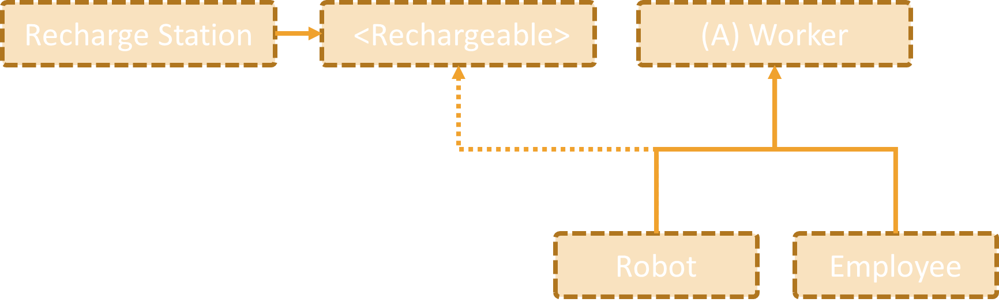

# Lab: SOLID

Problems for exercises and homework for the ["C\# OOP" course @
SoftUni"](https://softuni.bg/trainings/2244/csharp-oop-february-2019).

## Stream Progress Info

Refactor the code for this task, so that **Stream Progress Info** can
work with different kinds of **Streams**. First make sure it works with
**Music** too. Refactor the code, so in the future if a **new kind of
stream** is introduced, you will need to **just import one new class**
with **BytesSent** and **Length** getters in it.

## Graphic Editor

Refactor the code for this task, so that **Graphic Editor can draw all
kinds of shapes** without checking **what kind is the concrete shape.**
In the future, new shapes will be added to the system, so prepare the
system for those moments. When you **add a new shape**, you should just
**add a new class and nothing more**.

## Detail Printer

Refactor the code for this task, so that **Detail Printer** doesn’t need
to ask **what kind of an employee is passed to it**. Detail Printer
needs to just print details for all kinds of employees. When a new kind
of employee is added, you will only need to **add a new class and
nothing more.**

## Recharge

You are given a library with the following classes:

  - Worker implements ISleeper

  - Employee inherits Worker

  - Robot inherits Worker

  - RechargeStation

If you inspect the code, you can see that some of the classes have
methods that they can't use (throw **UnsupportedOpperationException**),
which is a clear indication that the code should be refactored.

Refactor the structure, so that it conforms to the **Interface
Segregation** principle.

### Hints

Make the **Robot** extend **Worker** and at the same time implement
**Rechargeable.**

