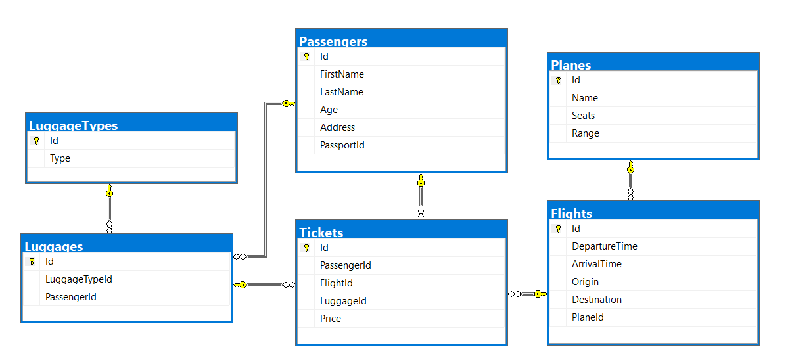

# Database Basics MS SQL Exam – 16 Apr 2019

Exam problems for the [“Database Basics” course
@
SoftUni](https://softuni.bg/courses/databases-basics-ms-sql-server).

Submit your solutions in the SoftUni Judge system at
[https://judge.softuni.bg/](https://judge.softuni.bg/)

# Airport

# Section 1. DDL (30 pts)

You are given an E/R Diagram of the Airport:

Crеate a database called **Airport**. You need to create **6 tables**:

  - **Planes** – contains information about the **planes**.

  - **Flights** – contains information about the **flights**.

  - **Passеngers** – contains information about the **passengers**

  - **LuggageTypes** – contains information about the **type of
    luggage's**.

  - **Flights** – contains information about the **flights**.
    
      - Each **flight** has a **plane**.

  - **Luggages** – contains information about the **luggage's**.
    
      - Each **luggage** has a **luggage type**.

  - **Tickets** – contains information about the **tickets**.
    
      - Each **ticket** has a **passenger**.
    
      - Each **ticket** has a **flight**.
    
      - Each **ticket** has a **luggage**.

**Planes**

|                 |                                             |                                              |
| --------------- | ------------------------------------------- | -------------------------------------------- |
| **Column Name** | **Data Type**                               | **Constraints**                              |
| Id              | **Integer** from **0** to **2,147,483,647** | Unique table **identificator**, **Identity** |
| Name            | **String** up to 30 symbols                 | **NULL** is **not** allowed                  |
| Seats           | **Integer** from **0** to **2,147,483,647** | **NULL** is **not** allowed                  |
| Range           | **Integer** from **0** to **2,147,483,647** | **NULL** is **not** allowed                  |

**Flights**

|                 |                                             |                                                             |
| --------------- | ------------------------------------------- | ----------------------------------------------------------- |
| **Column Name** | **Data Type**                               | **Constraints**                                             |
| Id              | **Integer** from **0** to **2,147,483,647** | Unique table **identificator**, **Identity**                |
| DepartureTime   | **Datetime**                                | None                                                        |
| ArrivalTime     | **Datetime**                                | None                                                        |
| Origin          | **String** up to 50 symbols                 | **NULL** is **not** allowed                                 |
| Destination     | **String** up to 50 symbols                 | **NULL** is **not** allowed                                 |
| PlaneId         | **Integer** from **0** to **2,147,483,647** | **NULL** is **not** allowed, Relationship with table Planes |

**Passengers**

|                 |                                             |                                              |
| --------------- | ------------------------------------------- | -------------------------------------------- |
| **Column Name** | **Data Type**                               | **Constraints**                              |
| Id              | **Integer** from **0** to **2,147,483,647** | Unique table **identificator**, **Identity** |
| FirstName       | **String** up to 30 symbols                 | **NULL** is **not** allowed                  |
| LastName        | **String** up to 30 symbols                 | **NULL** is **not** allowed                  |
| Age             | **Integer** from **0** to **2,147,483,647** | **NULL** is **not** allowed                  |
| Address         | **String** up to 30 symbols                 | **NULL** is **not** allowed                  |
| PassportId      | **String** with **exactly 11** symbols      | **NULL** is **not** allowed                  |

**LuggageTypes**

|                 |                                             |                                              |
| --------------- | ------------------------------------------- | -------------------------------------------- |
| **Column Name** | **Data Type**                               | **Constraints**                              |
| Id              | **Integer** from **0** to **2,147,483,647** | Unique table **identificator**, **Identity** |
| Type            | **String** up to 30 symbols                 | **NULL** is **not** allowed                  |

**Luggages**

|                 |                                             |                                                                       |
| --------------- | ------------------------------------------- | --------------------------------------------------------------------- |
| **Column Name** | **Data Type**                               | **Constraints**                                                       |
| Id              | **Integer** from **0** to **2,147,483,647** | Unique table **identificator**, **Identity**                          |
| LuggageTypeId   | **Integer** from **0** to **2,147,483,647** | **NULL** is **not** allowed, Relationship with table **LuggageTypes** |
| PassengerId     | **Integer** from **0** to **2,147,483,647** | **NULL** is **not** allowed, Relationship with table **Passengers**   |

**Tickets**

|                 |                                                 |                                                                     |
| --------------- | ----------------------------------------------- | ------------------------------------------------------------------- |
| **Column Name** | **Data Type**                                   | **Constraints**                                                     |
| Id              | **Integer** from **0** to **2,147,483,647**     | Unique table **identificator**, **Identity**                        |
| PassеngerId     | **Integer** from **0** to **2,147,483,647**     | **NULL** is **not** allowed, Relationship with table **Passengers** |
| FlightId        | **Integer** from **0** to **2,147,483,647**     | **NULL** is **not** allowed, Relationship with table **Flights**    |
| LuggageId       | **Integer** from **0** to **2,147,483,647**     | **NULL** is **not** allowed, Relationship with table **Luggages**   |
| Price           | **Decimal** number with **two-digit** precision | **NULL** is **not** allowed                                         |

## Database Design

Submit all of yours **create** **statements** to Judge (only creation of
tables).

# Section 2. DML (10 pts)

**Before you start, you must import
“DataSet-Airport.sql”. If you have created the structure correctly,
the data should be successfully inserted without any errors.**

In this section, you have to do some data manipulations:

## Insert

**Insert** some sample data into the database. Write a query to add the
following records into the corresponding tables. **All Ids should be
auto-generated**.

**Planes**

|            |       |       |
| ---------- | ----- | ----- |
| Name       | Seats | Range |
| Airbus 336 | 112   | 5132  |
| Airbus 330 | 432   | 5325  |
| Boeing 369 | 231   | 2355  |
| Stelt 297  | 254   | 2143  |
| Boeing 338 | 165   | 5111  |
| Airbus 558 | 387   | 1342  |
| Boeing 128 | 345   | 5541  |

**Luggage Types**

|                 |
| --------------- |
| Type            |
| Crossbody Bag   |
| School Backpack |
| Shoulder Bag    |

## Update

Make all flights to "**Carlsbad**" 13% more expensive.

## Delete

Delete all flights to "**Ayn Halagim**".

# Section 3. Querying (40 pts)

**You need to start with a fresh dataset, so
recreate your DB and import the sample data again
(DataSet-Bitbucket.sql).**

## The "Tr" Planes

Select all of the **planes,** which name contains "**tr**". Order them
by **id** (ascending), **name** (ascending), **seats** (ascending) and
**range** (ascending).

### Examples

|        |            |           |           |
| ------ | ---------- | --------- | --------- |
| **Id** | **Name**   | **Seats** | **Range** |
| 31     | Trunyx cpp | 195       | 2653      |
| 86     | Yakitri    | 321       | 1360      |
| 87     | Trilith    | 223       | 4375      |
| …      | …          | …         | …         |

## Flight Profits

Select the total profit for each flight from database. Order them by
**total price** (descending), **flight id** (ascending).

### Examples

|              |           |
| ------------ | --------- |
| **FlightId** | **Price** |
| 58           | 828.43    |
| 43           | 819.84    |
| …            | …         |

## Passenger Trips

Select the **full name** of the passengers with their trips (**origin**
- **destination**). Order them by **full name** (ascending), **origin**
(ascending) and **destination** (ascending).

### Examples

|               |            |                 |
| ------------- | ---------- | --------------- |
| **Full Name** | **Origin** | **Destination** |
| Adina Uvedale | Lawa-an    | Hulei           |
| Adolphe Juste | Boto       | Pantubig        |
| Adolphe Juste | Codrington | Kasiyan         |
| …             | …          | ..              |

## Non Adventures People

Select all people who don't have tickets. Select their **first name**,
**last name** and **age** .Order them by **age** (descending), **first
name** (ascending) and **last name** (ascending).

### Examples

|                |               |         |
| -------------- | ------------- | ------- |
| **First Name** | **Last Name** | **Age** |
| Felipa         | Wabe          | 89      |
| Darius         | Ellissen      | 87      |
| Eleen          | Ummfrey       | 86      |
| …              | …             | ..      |

## Full Info

Select all passengers who have **trips**. Select their **full name**
(first name – last name), **plane name**, trip (in format {**origin**} -
{**destination**}) and luggage type. Order the results by **full name**
(ascending), **name** (ascending), **origin** (ascending),
**destination** (ascending) and **luggage type** (ascending).

### Examples

|               |                |                      |                       |
| ------------- | -------------- | -------------------- | --------------------- |
| **Full Name** | **Plane Name** | **Trip**             | **Luggage Type**      |
| Adina Uvedale | Feedspan       | Lawa-an - Hulei      | Wheeled Business Case |
| Adolphe Juste | Babbleopia     | Usagara - Ikhtiman   | Upright Luggage       |
| Adolphe Juste | Feednation     | Le Mans - Grazhdanka | Duffel Bag            |
| …             | …              | …                    | …                     |

## PSP

Select **all planes** with their **name**, **seats count** and
**passengers count**. Order the results by **passengers count**
(descending), **plane name** (ascending) and **seats** (ascending)

### Examples

|            |           |                      |
| ---------- | --------- | -------------------- |
| **Name**   | **Seats** | **Passengers Count** |
| Jabberbean | 56        | 6                    |
| Youbridge  | 159       | 5                    |
| Yoveo      | 247       | 5                    |
| …          | …         | …                    |

# Section 4. Programmability (20 pts)

## Vacation

Create a **user defined function**, named
**udf\_CalculateTickets(@origin, @destination, @peopleCount)** that
receives an origin (town name), destination (town name) and people
count.

The function must return the total price in format "**Total price
{price}**"

  - If people count is less or equal to zero return – "**Invalid people
    count\!**"

  - If flight is invalid return – "**Invalid flight\!**"

### Example:

|                                                                                     |
| ----------------------------------------------------------------------------------- |
| **Query**                                                                           |
| **SELECT** **dbo.udf\_CalculateTickets**(**'Kolyshley'**,**'Rancabolang'**, **33**) |
| **Output**                                                                          |
| **Total price 2419.89**                                                             |

|                                                                                     |
| ----------------------------------------------------------------------------------- |
| **Query**                                                                           |
| **SELECT** **dbo.udf\_CalculateTickets**(**'Kolyshley'**,**'Rancabolang'**, **-1**) |
| **Output**                                                                          |
| **Invalid people count\!**                                                          |

|                                                                                   |
| --------------------------------------------------------------------------------- |
| **Query**                                                                         |
| **SELECT** **dbo.udf\_CalculateTickets**(**'Invalid'**,**'Rancabolang'**, **33**) |
| **Output**                                                                        |
| **Invalid flight\!**                                                              |

## Wrong Data

Create a **user defined stored procedure**, named
**usp\_CancelFlights**  
The procedure must cancel all flights on which the arrival time is
before the departure time. Cancel means you need to leave the departure
and arrival time empty.

### Example:

|                                 |
| ------------------------------- |
| **Query**                       |
| **EXEC** **usp\_CancelFlights** |
| **Output**                      |
| (49 rows affected)              |

##
