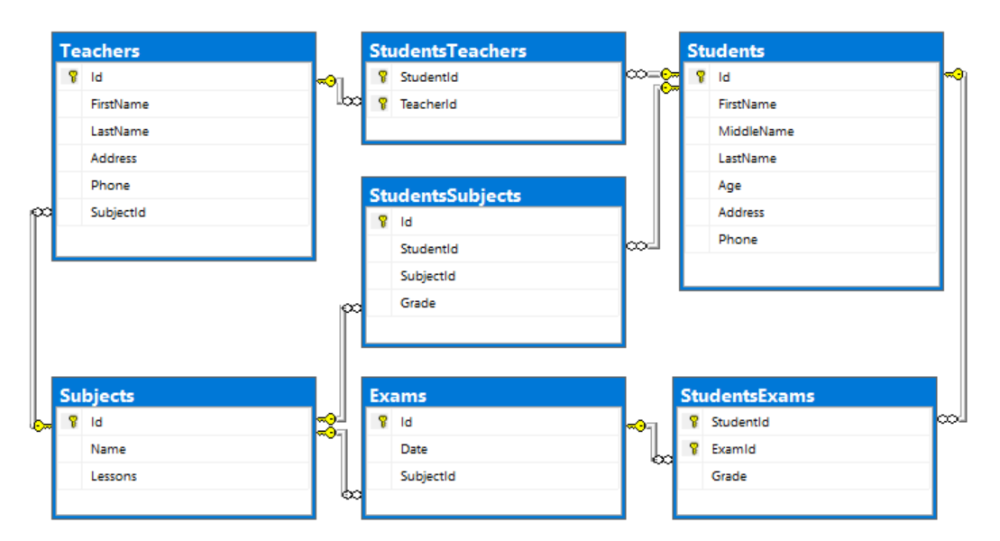

# Database Basics MSSQL Exam – 17 Feb 2019

Exam problems for the [“Database Basics” course
@
SoftUni](https://softuni.bg/courses/databases-basics-ms-sql-server).

Submit your solutions in the SoftUni Judge system at
[https://judge.softuni.bg/](https://judge.softuni.bg/)

# School

Don’t be so stressed\! Today you must build a very simple school system
and execute some queries over it to check if it works correctly. From
the very beginning **SoftUni** saw a huge potential in you and has
assigned you a very exciting project. In **4 hours**, you must develop a
complicated system for a small school.

# Your database must contain information about the students with their teachers and exams. Also, it must contain information about the subjects in the school

# Section 1. DDL (30 pts)

You are given an E/R Diagram of the School:

Crеate a database called **School**. You need to create **7 tables**:

  - **Students** – contains information about the students.

  - **Subjects** – contains information about the subjects.

  - **StudentsSubjects** – contains information about every student’s
    subjects.

  - **Exams** – contains information about the exams.

  - **StudentsExams** – contains information about every student’s
    exams.

  - **Teachers** – contains information about the teachers.

  - **StudentsTeachers** – contains information about every student’s
    teachers.

### Students

|            |                                                 |                                                  |
| ---------- | ----------------------------------------------- | ------------------------------------------------ |
| **Column** | **Data Type**                                   | **Constraints**                                  |
| Id         | **Integer** from **0** to **2,147,483,647**     | Unique table **identificator**, **Identity**     |
| FirstName  | **String** up to **30** symbols, Unicode        | **NULL** is **not** allowed                      |
| MiddleName | **String** up to **25** symbols, Unicode        | None                                             |
| LastName   | **String** up to **30** symbols, Unicode        | **NULL** is **not** allowed                      |
| Age        | **Integer** from **5** to **100**               | **Negative or zero numbers** are **not allowed** |
| Address    | **String** up to **50** symbols, Unicode        | None                                             |
| Phone      | **String** with **exactly** 10 symbols, Unicode | None                                             |

### Subjects

|            |                                             |                                              |
| ---------- | ------------------------------------------- | -------------------------------------------- |
| **Column** | **Data Type**                               | **Constraints**                              |
| Id         | **Integer** from **0** to **2,147,483,647** | Unique table **identificator**, **Identity** |
| Name       | **String** up to **20** symbols, Unicode    | **NULL** is **not** allowed                  |
| Lessons    | **Integer** must be more than 0             | **NULL** is **not** allowed                  |

### StudentsSubjects

|            |                                                 |                                                                   |
| ---------- | ----------------------------------------------- | ----------------------------------------------------------------- |
| **Column** | **Data Type**                                   | **Constraints**                                                   |
| Id         | **Integer** from **0** to **2,147,483,647**     | Unique table **identificator**, **Identity**                      |
| StudentId  | **Integer** from **0** to **2,147,483,647**     | **NULL** is **not** allowed, Relationship with table **Students** |
| SubjectId  | **Integer** from **0** to **2,147,483,647**     | **NULL** is **not** allowed, Relationship with table **Subjects** |
| Grade      | **Decimal** number with **two-digit** precision | **Grade** must be between 2 and 6, **NULL** is **not** allowed    |

### Exams

|            |                                             |                                                                   |
| ---------- | ------------------------------------------- | ----------------------------------------------------------------- |
| **Column** | **Data Type**                               | **Constraints**                                                   |
| Id         | **Integer** from **0** to **2,147,483,647** | Unique table **identificator**, **Identity**                      |
| Date       | **DateTime**                                | None                                                              |
| SubjectId  | **Integer** from **0** to **2,147,483,647** | **NULL** is **not** allowed, Relationship with table **Subjects** |

### StudentsExams

|            |                                                 |                                                                   |
| ---------- | ----------------------------------------------- | ----------------------------------------------------------------- |
| **Column** | **Data Type**                                   | **Constraints**                                                   |
| StudentId  | **Integer** from **0** to **2,147,483,647**     | **NULL** is **not** allowed, Relationship with table **Students** |
| ExamId     | **Integer** from **0** to **2,147,483,647**     | **NULL** is **not** allowed, Relationship with table **Exams**    |
| Grade      | **Decimal** number with **two-digit** precision | **Grade** must be between 2 and 6, **NULL** is **not** allowed    |

### Teachers

|            |                                             |                                                                   |
| ---------- | ------------------------------------------- | ----------------------------------------------------------------- |
| **Column** | **Data Type**                               | **Constraints**                                                   |
| Id         | **Integer** from **0** to **2,147,483,647** | Unique table **identificator**, **Identity**                      |
| FirstName  | **String** up to **20** symbols, Unicode    | **NULL** is **not** allowed                                       |
| LastName   | **String** up to **20** symbols, Unicode    | **NULL** is **not** allowed                                       |
| Address    | **String** up to **20** symbols, Unicode    | **NULL** is **not** allowed                                       |
| Phone      | **String** with **exactly** **10** symbols  | None                                                              |
| SubjectId  | **Integer** from **0** to **2,147,483,647** | **NULL** is **not** allowed, Relationship with table **Subjects** |

### StudentsTeachers

|            |                                             |                                                                   |
| ---------- | ------------------------------------------- | ----------------------------------------------------------------- |
| **Column** | **Data Type**                               | **Constraints**                                                   |
| StudentId  | **Integer** from **0** to **2,147,483,647** | **NULL** is **not** allowed, Relationship with table **Students** |
| TeacherId  | **Integer** from **0** to **2,147,483,647** | **NULL** is **not** allowed, Relationship with table **Teachers** |

## Database Design

Submit all of yours **create** **statements** to the **Judge** system.

# 

# Section 2. DML (10 pts)

**Before you start, you must import
“DataSet-School.sql”. If you have created the structure correctly, the
data should be successfully inserted without any errors.**

In this section, you have to do some data manipulations:

## Insert

**Insert** some sample data into the database. Write a query to add the
following records into the corresponding tables. **All Ids should be
auto-generated**.

**Teachers**

|               |              |                      |            |               |
| ------------- | ------------ | -------------------- | ---------- | ------------- |
| **FirstName** | **LastName** | **Address**          | **Phone**  | **SubjectId** |
| Ruthanne      | Bamb         | 84948 Mesta Junction | 3105500146 | 6             |
| Gerrard       | Lowin        | 370 Talisman Plaza   | 3324874824 | 2             |
| Merrile       | Lambdin      | 81 Dahle Plaza       | 4373065154 | 5             |
| Bert          | Ivie         | 2 Gateway Circle     | 4409584510 | 4             |

**Subjects**

|          |             |
| -------- | ----------- |
| **Name** | **Lessons** |
| Geometry | 12          |
| Health   | 10          |
| Drama    | 7           |
| Sports   | 9           |

## Update

Make all grades 6.00, where the subject id is 1 or 2, if the **grade**
is above or equal to 5.50

## Delete

Delete all teachers, whose phone number contains ‘72’.

# Section 3. Querying (40 pts)

**You need to start with a fresh dataset, so
recreate your DB and import the sample data again
(DataSet-School.sql).**

## Teen Students

Select all **students** who are teenagers (their age is above or equal
to 12). Order them by **first name (alphabetically)**, then by **last
name (alphabetically)**. Select their first name, last name and their
age.

### Example

|               |              |         |
| ------------- | ------------ | ------- |
| **FirstName** | **LastName** | **Age** |
| Agace         | Sneddon      | 12      |
| Andres        | Colliard     | 12      |
| Brose         | Yeats        | 13      |
| Casper        | Tite         | 12      |
| …             | …            | …       |

## Students Teachers

Select all students and the count of teachers each one has.

### Example

|               |              |                   |
| ------------- | ------------ | ----------------- |
| **FirstName** | **LastName** | **TeachersCount** |
| Sandy         | Abbison      | 10                |
| Baxter        | Abrahart     | 13                |
| Demott        | Addison      | 13                |
| Deane         | Adess        | 10                |
| …             | …            | ...               |

## Students to Go

Find all students, who have not attended an exam. Select their full name
(first name + last name).

Order the results by full name (**ascending**)**.**

### Example

|                    |
| ------------------ |
| **Full Name**      |
| Bernardine Purrier |
| …                  |

## Top Students

Find top 10 students, who have highest average grades from the exams.

Format the grade, two symbols after the decimal point.

Order them by grade (**descending**), then by first name
(**ascending**), then by last name (**ascending**)

### Example

|                |               |           |
| -------------- | ------------- | --------- |
| **First Name** | **Last Name** | **Grade** |
| Lurlene        | Orgee         | 6.00      |
| Ivy            | Bilovsky      | 5.70      |
| Chariot        | Giacobbo      | 5.50      |
| …              | …             |           |

## Not So In The Studying

Find all students **who don’t have any subjects**. Select **their full
name**. The full name is combination of first name, middle name and last
name. Order the result by **full name**

**NOTE**: If the middle name is null you have to concatenate the first
name and last name separated with single space.

### Example

|                            |
| -------------------------- |
| **Full Name**              |
| Allen Storre Piniur        |
| Andria Geleman Andrioletti |
| Ashley Morecombe Summerell |
| Bobby Leggitt Domnin       |
| …                          |

## Average Grade per Subject

Find the **average** **grade** for each subject. Select the subject name
and the average grade.

Sort them by **subject id (ascending)**.

### Example

|          |                  |
| -------- | ---------------- |
| **Name** | **AverageGrade** |
| Biology  | 4.059055         |
| History  | 3.880370         |
| English  | 4.060546         |
| Math     | 3.957876         |
| Music    | 3.923984         |
| Art      | 4.070898         |
| …        | …                |

# Section 4. Programmability (20 pts)

## Exam Grades

Create a **user defined function**, named
**udf\_ExamGradesToUpdate(@studentId, @grade)**, that receives a
**student id and grade**.

The function should return the count of grades, for the student with the
given id, which are above the received grade and under the received
grade with **0.50** added (**example:** you are given grade **3.50** and
you have to find all grades for the provided student which are between
**3.50** and **4.00** inclusive):

If the condition is true, you must return following message in the
format:

  - “**You have to update {count} grades for the student {student first
    name}**”

If the provided student id is not in the database the function should
return “**The student with provided id does not exist in the school\!**”

If the provided grade is above **6.00** the function should return
“**Grade cannot be above 6.00\!”**

**Note: Do not update any records in the database\!**

### Example:

|                                                  |
| ------------------------------------------------ |
| **Query**                                        |
| **SELECT dbo.udf\_ExamGradesToUpdate(12, 6.20)** |
| **Output**                                       |
| **Grade cannot be above 6.00\!**                 |

|                                                       |
| ----------------------------------------------------- |
| **Query**                                             |
| **SELECT dbo.udf\_ExamGradesToUpdate(12, 5.50)**      |
| **Output**                                            |
| **You have to update 2 grades for the student Agace** |

|                                                                 |
| --------------------------------------------------------------- |
| **Query**                                                       |
| **SELECT dbo.udf\_ExamGradesToUpdate(121, 5.50)**               |
| **Output**                                                      |
| **The student with provided id does not exist in the school\!** |

## Exclude from school

Create a **user defined stored procedure**, named
**usp\_ExcludeFromSchool(@StudentId)**, that receives a **student id**
and attempts to **delete the current student**. A student will only be
deleted if all of these conditions **pass**:

  - If the **student** doesn’t exist, then it **cannot be deleted.**
    **Raise an error** with the message “**This school has no student
    with the provided id\!**”

If all the above conditions pass, **delete the student and ALL OF HIS
REFERENCES**\!

### Example usage:

<table>
<tbody>
<tr class="odd">
<td><strong>Query</strong></td>
<td><strong>Output</strong></td>
</tr>
<tr class="even">
<td>
<strong>EXEC usp_ExcludeFromSchool 1</strong>

<strong>SELECT COUNT(*) FROM Students</strong>
</td>
<td><strong>119</strong></td>
</tr>
<tr class="odd">
<td><strong>EXEC usp_ExcludeFromSchool 301</strong></td>
<td><strong>This school has no student with the provided id!</strong></td>
</tr>
</tbody>
</table>

##
