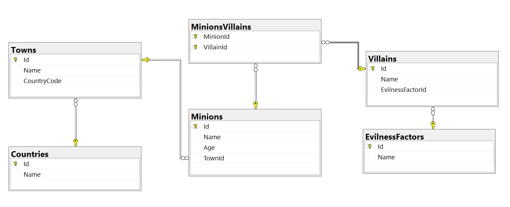

# Exercises: Introduction to DB Apps

This document defines the **exercise assignments** for the ["Databases
Advanced – EF Core" course @ Software
University](https://softuni.bg/trainings/1741/databases-advanced-entity-framework-october-2017).

## Initial Setup 

Write a program that connects to your **localhost** server. Create **new
database** called **MinionsDB** where we will keep information about our
minions and villains.

For each **minion** we should keep information about its **name**,
**age** and **town**. Each **town** has information about **the**
**country** where it’s located. **Villains** have **name** and
**evilness** **factor** (**super good**, **good**, **bad**, **evil**,
**super** **evil**). Each **minion** can **serve** **several**
**villains** and **each** **villain** can **have** **several**
**minions** **serving** **him**. Fill all tables with at least 5 records
each.

In the end you shoud have the following tables:

  - Countries

  - Towns

  - Minions

  - EvilnessFactors

  - Villains

  - MinionsVillains

## Villain Names

Write a program that prints on the console **all villains’ names** and
their **number of minions** of those who have more than 3 minions
**ordered descending** by number of minions.

### Example

| **Output** |
| ---------- |
| Jilly – 4  |

## Minion Names

Write a program that prints on the console **all minion names** and age
for a given **villain id**, ordered by **name** **alphabetically.**

If there is no villain with the given ID, print "No villain with ID
\<**VillainId**\> exists in the database.".  
If the selected villain has no minions, print "(no minions)" on the
second row.

### Example

<table>
<thead>
<tr class="header">
<th><strong>Input</strong></th>
<th><strong>Output</strong></th>
<th></th>
<th><strong>Input</strong></th>
<th><strong>Output</strong></th>
<th></th>
<th><strong>Input</strong></th>
<th><strong>Output</strong></th>
</tr>
</thead>
<tbody>
<tr class="odd">
<td>1</td>
<td>
Villain: Gru

1. Becky 125

2. Bob 42

3. Kevin 1
</td>
<td></td>
<td>3</td>
<td>
Villain: Jilly

1. Becky 125

2. Bob 42

3. Cathleen 11

4. Simon 45
</td>
<td></td>
<td>8</td>
<td>
Villain: Toni

(no minions)
</td>
</tr>
</tbody>
</table>

| **Input** | **Output**                                    |
| --------- | --------------------------------------------- |
| 10        | No villain with ID 10 exists in the database. |

## Add Minion

Write a program that **reads** **information** about a minion and its
villain and **adds it to the database**. In case the town of the minion
is not in the database, **insert** it as well. In case the villain is
not present in the database, add him too with a default **evilness**
**factor** of "evil". Finally set the new minion to be a servant of the
villain. Print appropriate messages after each operation.

### Input

The input comes in two lines:

  - On the first line, you will receive the **minion** **information**
    in the format "Minion: \<**Name**\> \<**Age**\> \<**TownName**\>"

<!-- end list -->

  - On the second – the **villain** **information** in the format
    "Villain: \<**Name**\>"

### Output

After completing an operation, you must print one of the following
messages:

  - After adding a new **town** to the database: "Town \<**TownName**\>
    was added to the database."

  - After adding a new **villain** to the database: "Villain
    \<**VillainName**\> was added to the database."

  - Finally, after successfully adding the **minion** to the database
    and making it a **servant** of a villain: "Successfully added
    \<**MinionName**\> to be minion of \<**VillainName**\>."

**\*Bonus task:** Make sure all operations are executed successfully. In
case of an error do not change the database.

### Example

<table>
<thead>
<tr class="header">
<th><strong>Input</strong></th>
<th><strong>Output</strong></th>
</tr>
</thead>
<tbody>
<tr class="odd">
<td>
Minion: Bob 14 Berlin

Villain: Gru
</td>
<td>Successfully added Robert to be minion of Gru.</td>
</tr>
<tr class="even">
<td>
Minion: Cathleen 20 Liverpool

Villain: Gru
</td>
<td>
Town Liverpool was added to the database.

Successfully added Cathleen to be minion of Gru.
</td>
</tr>
<tr class="odd">
<td>
Minion: Mars 23 Sofia

Villain: Poppy
</td>
<td>
Villain Poppy was added to the database.

Successfully added Mars to be minion of Poppy.
</td>
</tr>
<tr class="even">
<td>
Minion: Carry 20 Eindhoven

Villain: Jimmy
</td>
<td>
Town Eindhoven was added to the database.

Villain Jimmy was added to the database.

Successfully added Carry to be minion of Jimmy.
</td>
</tr>
</tbody>
</table>

## Change Town Names Casing

Write a program that **changes all town names to uppercase** for a given
country.

You will receive one line of input with the **name** of the country.

**Print the** **number of towns that were changed** in the format
"\<**ChangedTownsCount**\> town names were affected.". On a second line,
**print** the **names that were changed**, separated with a comma and a
space.

If **no** **towns** were affected (the country does not exist in the
database or has no cities connected to it), **print** "**No town names
were affected.**".

### Example

<table>
<thead>
<tr class="header">
<th><strong>Input</strong></th>
<th><strong>Output</strong></th>
</tr>
</thead>
<tbody>
<tr class="odd">
<td>Bulgaria</td>
<td>
3 town names were affected.

[SOFIA, VARNA, BURGAS]
</td>
</tr>
<tr class="even">
<td>Germany</td>
<td>No town names were affected.</td>
</tr>
</tbody>
</table>

## \*Remove Villain 

Write a program that receives the **ID** of a villain, **deletes him
from the database** and **releases his minions** from serving to him.
Print on **two** **lines** the name of the deleted villain in format
"\<**Name**\> **was** **deleted**." and the number of minions released
in format "\<**MinionCount**\> **minions** **were** **released**.". Make
sure all operations go as planned, otherwise do not make any changes in
the database.

If there is no villain in the database with the given ID, print "**No
such villain was found**.".

### Example

<table>
<thead>
<tr class="header">
<th><strong>Input</strong></th>
<th><strong>Output</strong></th>
</tr>
</thead>
<tbody>
<tr class="odd">
<td>1</td>
<td>
Gru was deleted.

6 minions were released.
</td>
</tr>
<tr class="even">
<td>3</td>
<td>
Victor was deleted.

0 minions were released.
</td>
</tr>
<tr class="odd">
<td>101</td>
<td>No such villain was found.</td>
</tr>
</tbody>
</table>

## Print All Minion Names

Write a program that **prints all minion names** from the minions table
**in the following order:** first record, last record, first + 1, last -
1, first + 2, last - 2 … first + n, last - n.

|   |    |   |   |   |   |   |   |   |   |
| - | -- | - | - | - | - | - | - | - | - |
| 1 | 10 | 2 | 9 | 3 | 8 | 4 | 7 | 5 | 6 |

### Example

<table>
<thead>
<tr class="header">
<th><strong>Original Order</strong></th>
<th><strong>Output</strong></th>
</tr>
</thead>
<tbody>
<tr class="odd">
<td>
Bob

Kevin

Steward

Jimmy

Vicky

Becky

Jully
</td>
<td>
Bob

Jully

Kevin

Becky

Steward

Vicky

Jimmy
</td>
</tr>
</tbody>
</table>

## Increase Minion Age

Read from the console minion IDs separated by space. **Increment the
age** of those minions **by 1** and make their **names title case**.
Finally, **print the name and the age of all minions** in the database,
each on a new row in format **"\<Name\> \<Age\>**".

### Example

| **Minions** |               |         |
| ----------- | ------------- | ------- |
| **Id**      | **Name**      | **Age** |
| 1           | bob           | 14      |
| 2           | stuart        | 22      |
| 3           | kevin         | 13      |
| 4           | jimmy         | 49      |
| 5           | vicky jackson | 26      |

<table>
<thead>
<tr class="header">
<th><strong>Input</strong></th>
<th><strong>Output</strong></th>
<th></th>
<th><strong>Input</strong></th>
<th><strong>Output</strong></th>
</tr>
</thead>
<tbody>
<tr class="odd">
<td>2 1 4</td>
<td>
Bob 15

Stuart 23

kevin 13

Jimmy 50

vicky jackson 26
</td>
<td></td>
<td>5</td>
<td>
bob 14

stuart 22

kevin 13

jimmy 49

Vicky Jackson 27
</td>
</tr>
</tbody>
</table>

## Increase Age Stored Procedure 

Create stored procedure **usp\_GetOlder** (**directly in the database**
using **Management Studio** or any other similar tool) that receives
**MinionId** and **increases that minion’s age by 1**. Write a program
that **uses that stored procedure to increase the age** of a minion
whose id will be given as input from the console. After that **print the
name and the age** of that minion.

### Example

| **Minions** |               |         |
| ----------- | ------------- | ------- |
| **Id**      | **Name**      | **Age** |
| 1           | bob           | 14      |
| 2           | steward       | 22      |
| 3           | kevin         | 13      |
| 4           | jimmy         | 49      |
| 5           | vicky jackson | 26      |

| **Input** | **Output**                   |
| --------- | ---------------------------- |
| 1         | bob – 15 years old           |
| 3         | kevin – 14 years old         |
| 5         | vicky jackson – 27 years old |
