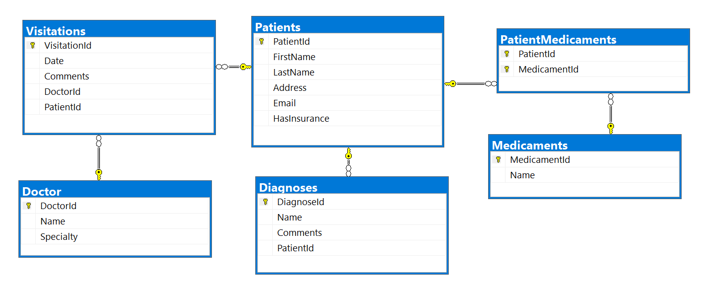
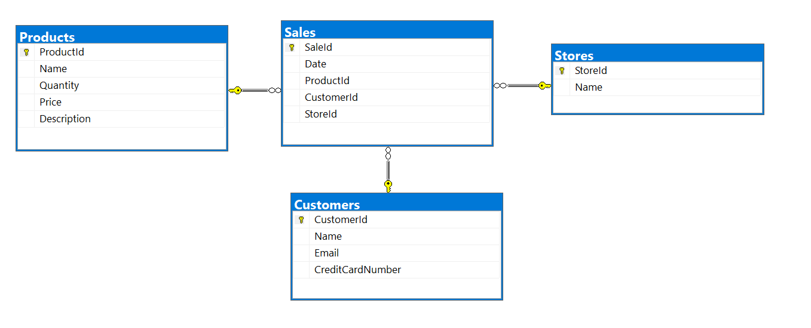

# Exercises: Code First

This document defines the **exercise assignments** for the ["Databases
Advanced – EF Core" course @ Software
University](https://softuni.bg/trainings/1741/databases-advanced-entity-framework-october-2017).

## Hospital Database

You went to your GP for your annual exam and you told him that you’ve
started work as a Junior Database App Developer. It turned out he was
looking for someone to make an app, which he could use to manage and
store data about his patients.

Your task is to design a database using the **Code** **First** approach.
The GP needs to keep information about his **patients**. Each patient
has **first name**, **last name**, **address**, **email**, information
whether he has **medical** **insurance** or not and should keep history
about all his **visitations**, **diagnoses** and **prescribed**
**medicaments**. Each visitation has **date** and **comments**. Each
**diagnose** has **name** and **comments** for it. Each **medicament**
has **name**. **Validate** all data before inserting it in the database.

Your Database should look something like this:  
Remember\! With Entity Framework Core you can have **different**
**column** **names** from your **classes’** **property** **names**\!

### Constraints

Your **namespaces** should be:

  - **P01\_HospitalDatabase** – for your Startup class, if you have one

  - **P01\_HospitalDatabase.Data** – for your DbContext

  - **P01\_HospitalDatabase.Data.Models** – for your models

> **Note**: **Do not** use separated projects, because Judge will return
> Compile Time Error.

Your **classes** should be:

  - **HospitalContext** – your DbContext

  - **Patient**:
    
      - PatientId
    
      - FirstName (up to 50 characters, unicode)
    
      - LastName (up to 50 characters, unicode)
    
      - Address (up to 250 characters, unicode)
    
      - Email (up to 80 characters, not unicode)
    
      - HasInsurance

  - **Visitation**:
    
      - VisitationId
    
      - Date
    
      - Comments (up to 250 characters, unicode)
    
      - Patient

  - **Diagnose**:
    
      - DiagnoseId
    
      - Name (up to 50 characters, unicode)
    
      - Comments (up to 250 characters, unicode)
    
      - Patient

  - **Medicament**:
    
      - MedicamentId
    
      - Name (up to 50 characters, unicode)

  - **PatientMedicament** – mapping class between Patients and
    Medicaments

The **collections** of mapping classes
(**ICollection\<PatientMedicament\>**) must be named **Prescriptions**\!

**Note**: Don’t forget to remove the **Tools** package before uploading
your project to Judge, if you have used it\!  
Don’t use version of Entity Framework Core above 2.2.0\!

### Bonus Task

Make a console-based user interface, so the doctor can easily use the
database.

namespace P01\_HospitalDatabase

{

using P01\_HospitalDatabase.Data;

using System;

public class StartUp

{

public static void Main()

{

var db = new HospitalContext();

db.Database.EnsureCreated();

}

}

}

namespace P01\_HospitalDatabase.Data

{

using Microsoft.EntityFrameworkCore;

using P01\_HospitalDatabase.Data.Models;

public class HospitalContext : DbContext

{

public DbSet\<Patient\> Patients { get; set; }

public DbSet\<Diagnose\> Diagnoses { get; set; }

public DbSet\<Medicament\> Medicaments { get; set; }

public DbSet\<Visitation\> Visitations { get; set; }

public DbSet\<PatientMedicament\> PatientsMedicaments { get; set; }

protected override void OnConfiguring(DbContextOptionsBuilder
optionsBuilder)

{

if (\!optionsBuilder.IsConfigured)

{

optionsBuilder.UseSqlServer(Configuration.ConfigurationString);

}

}

protected override void OnModelCreating(ModelBuilder modelBuilder)

{

ConfigurePatientEntity(modelBuilder);

ConfigureVisitationEntity(modelBuilder);

ConfigureDiagnoseEntity(modelBuilder);

ConfigureMedicamentEntity(modelBuilder);

ConfigurePatientMedicamentEntity(modelBuilder);

}

private void ConfigurePatientEntity(ModelBuilder modelBuilder)

{

modelBuilder.Entity\<Patient\>(entity =\>

{

entity.HasKey(p =\> p.PatientId);

entity.HasMany(p =\> p.Visitations).WithOne(v =\> v.Patient);

entity.HasMany(p =\> p.Diagnoses).WithOne(d =\> d.Patient);

entity.Property(p =\> p.FirstName)

.HasMaxLength(50)

.IsRequired()

.IsUnicode();

entity.Property(p =\> p.LastName)

.HasMaxLength(50)

.IsRequired()

.IsUnicode();

entity.Property(p =\> p.Address)

.HasMaxLength(250)

.IsRequired()

.IsUnicode();

entity.Property(p =\> p.Email)

.HasMaxLength(80)

.IsRequired();

entity.Property(p =\> p.HasInsurance)

.IsRequired();

});

}

private void ConfigureVisitationEntity(ModelBuilder modelBuilder)

{

modelBuilder.Entity\<Visitation\>(entity =\>

{

entity.HasKey(v =\> v.VisitationId);

entity.Property(v =\> v.Comments)

.HasMaxLength(250)

.IsUnicode();

});

}

private void ConfigureDiagnoseEntity(ModelBuilder modelBuilder)

{

modelBuilder.Entity\<Diagnose\>(entity =\>

{

entity.HasKey(d =\> d.DiagnoseId);

entity.Property(d =\> d.Name)

.HasMaxLength(50)

.IsRequired()

.IsUnicode();

entity.Property(d =\> d.Comments)

.HasMaxLength(250)

.IsUnicode();

});

}

private void ConfigureMedicamentEntity(ModelBuilder modelBuilder)

{

modelBuilder.Entity\<Medicament\>(entity =\>

{

entity.HasKey(m =\> m.MedicamentId);

entity.Property(m =\> m.Name)

.HasMaxLength(50)

.IsRequired()

.IsUnicode();

});

}

private void ConfigurePatientMedicamentEntity(ModelBuilder modelBuilder)

{

modelBuilder.Entity\<PatientMedicament\>(entity =\>

{

entity.HasKey(pm =\> new

{

pm.PatientId,

pm.MedicamentId

});

entity.HasOne(pm =\> pm.Patient)

.WithMany(p =\> p.Prescriptions)

.HasForeignKey(pm =\> pm.PatientId);

entity.HasOne(pm =\> pm.Medicament)

.WithMany(m =\> m.Prescriptions)

.HasForeignKey(pm =\> pm.MedicamentId);

});

}

}

}

namespace P01\_HospitalDatabase.Data

{

public class Configuration

{

public const string ConfigurationString =
@"Server=DESKTOP-LPLN6BV\\\\SQLEXPRESS;" +

"Database=HospitalDatabase;" +

"Integrated Security=true";

}

}

namespace P01\_HospitalDatabase.Data.Models

{

using System;

public class Visitation

{

public int VisitationId { get; set; }

public DateTime Date { get; set; }

public string Comments { get; set; }

public int PatientId { get; set; }

public Patient Patient { get; set; }

}

}

namespace P01\_HospitalDatabase.Data.Models

{

using System.Collections.Generic;

public class PatientMedicament

{

public PatientMedicament()

{

this.Prescriptions = new HashSet\<PatientMedicament\>();

}

public int PatientId { get; set; }

public Patient Patient { get; set; }

public int MedicamentId { get; set; }

public Medicament Medicament { get; set; }

public ICollection\<PatientMedicament\> Prescriptions { get; set; }

}

}

namespace P01\_HospitalDatabase.Data.Models

{

public class Diagnose

{

public int DiagnoseId { get; set; }

public string Name { get; set; }

public string Comments { get; set; }

public int PatientId { get; set; }

public Patient Patient { get; set; }

}

}

namespace P01\_HospitalDatabase.Data.Models

{

using System.Collections.Generic;

public class Medicament

{

public Medicament()

{

this.Prescriptions = new HashSet\<PatientMedicament\>();

}

public int MedicamentId { get; set; }

public string Name { get; set; }

public ICollection\<PatientMedicament\> Prescriptions { get; set; }

}

}

namespace P01\_HospitalDatabase.Data.Models

{

using System.Collections.Generic;

public class Patient

{

public Patient()

{

this.Visitations = new HashSet\<Visitation\>();

this.Diagnoses = new HashSet\<Diagnose\>();

this.Prescriptions = new HashSet\<PatientMedicament\>();

}

public int PatientId { get; set; }

public string FirstName { get; set; }

public string LastName { get; set; }

public string Address { get; set; }

public string Email { get; set; }

public bool HasInsurance { get; set; }

public ICollection\<Visitation\> Visitations { get; set; }

public ICollection\<Diagnose\> Diagnoses { get; set; }

public ICollection\<PatientMedicament\> Prescriptions { get; set; }

}

}

## Hospital Database Modification

Your GP bragged around in the hospital about the cool software you made
for him. Now the hospital administration wants to modify your program so
they can use it too. They want to store information about the
**doctors** (**name** and **specialty**). Each doctor can perform
**many** **visitations**. Make the necessary changes in the **database**
to satisfy the new needs of the hospital administration.

### Constraints

Keep the **namespaces** from the previous task and only add the class
**Doctor** and change the class **Visitation** accordingly. The doctor’s
**name** and **specialty** should be up to 100 **characters** long,
**unicode**.

### \*\*Bonus Task

Make an authentication system for doctors. Each **doctor** should be
able to log in with his **email** and **password**. Choose what
information each doctor should have access to and hide the rest.

namespace P01\_HospitalDatabase

{

using P01\_HospitalDatabase.Data;

using System;

public class StartUp

{

public static void Main()

{

var db = new HospitalContext();

db.Database.EnsureCreated();

}

}

}

using System.Collections.Generic;

namespace P01\_HospitalDatabase.Data.Models

{

public class Doctor

{

public Doctor()

{

this.Visitations = new HashSet\<Visitation\>();

}

public int DoctorId { get; set; }

public string Name { get; set; }

public string Specialty { get; set; }

public ICollection\<Visitation\> Visitations { get; set; }

}

}

modelBuilder

.Entity\<Doctor\>(entity =\>

{

entity.HasKey(d =\> d.DoctorId);

entity

.Property(n =\> n.Name)

.HasMaxLength(100)

.IsRequired()

.IsUnicode();

entity

.Property(s =\> s.Specialty)

.HasMaxLength(100)

.IsRequired()

.IsUnicode();

entity

.HasMany(v =\> v.Visitations)

.WithOne(d =\> d.Doctor)

.HasForeignKey(d =\> d.DoctorId);

});

## Sales Database

Create a database for storing data about sales using the Code First
approach. The database should look like this:  
  
Constraints

Your **namespaces** should be:

  - **P03\_SalesDatabase**

  - **P03\_SalesDatabase.Data**

  - **P03\_SalesDatabase.Data.Models**

Your **classes** should be:

  - **SalesContext** – your DbContext

  - **Product**:
    
      - ProductId
    
      - Name (up to 50 characters, unicode)
    
      - Quantity (real number)
    
      - Price
    
      - Sales

  - **Customer**:
    
      - CustomerId
    
      - Name (up to 100 characters, unicode)
    
      - Email (up to 80 characters, not unicode)
    
      - CreditCardNumber (string)
    
      - Sales

  - **Store**:
    
      - StoreId
    
      - Name (up to 80 characters, unicode)
    
      - Sales

  - **Sale**:
    
      - SaleId
    
      - Date
    
      - Product
    
      - Customer
    
      - Store

### Bonus Task

Write a **seed method** that fills the database with sample data
(randomly generated).

## Products Migration

To apply migrations, you will need two packages:

  - EntityFrameworkCore.Tools 2.2.0

  - EntityFrameworkCore.SqlServer.Design 1.1.6

For table **Products** add string column **Description**, up to 250
symbols. Use migrations. The migration should be named:
**"ProductsAddColumnDescription"**. Add a default value for the
description property: **"No description"**.

**Note**: Don’t forget to remove the **Tools** and **Design** packages
before uploading your project to Judge\!

## Sales Migration

For table **Sales** make **Date** column with default value
**GETDATE()** function, called from the database, not the application.
Use explicit migration. Do **not** use **DateTime.Now**\! Name the
migration “**SalesAddDateDefault**”.

After that, open your table data and see if the default value is applied
or not.

Keep your **namespaces** from **Task** **3** and do both **Task** **4**
and **Task** **5** before testing your project in **Judge**. Make sure
to upload your **migrations** too\!

**Note**: Don’t forget to remove the **Tools** and **Design** packages
before uploading your project to Judge\!

using System;

namespace P03\_SalesDatabase

{

public class StartUp

{

public static void Main()

{

}

}

}

using System.Collections.Generic;

namespace P03\_SalesDatabase.Data.Models

{

public class Store

{

public Store()

{

this.Sales = new HashSet\<Sale\>();

}

public int StoreId { get; set; }

public string Name { get; set; }

public ICollection\<Sale\> Sales { get; set; }

}

}

using System;

namespace P03\_SalesDatabase.Data.Models

{

public class Sale

{

public int SaleId { get; set; }

public DateTime Date { get; set; }

public int ProductId { get; set; }

public Product Product { get; set; }

public int CustomerId { get; set; }

public Customer Customer { get; set; }

public int StoreId { get; set; }

public Store Store { get; set; }

}

}

namespace P03\_SalesDatabase.Data.Models

{

using System.Collections.Generic;

public class Product

{

public Product()

{

this.Sales = new HashSet\<Sale\>();

}

public int ProductId { get; set; }

public string Name { get; set; }

public double Quantity { get; set; }

public decimal Price { get; set; }

public string Description { get; set; }

public ICollection\<Sale\> Sales { get; set; }

}

}

namespace P03\_SalesDatabase.Data.Models

{

using System.Collections.Generic;

public class Customer

{

public Customer()

{

this.Sales = new HashSet\<Sale\>();

}

public int CustomerId { get; set; }

public string Name { get; set; }

public string Email { get; set; }

public string CreditCardNumber { get; set; }

public ICollection\<Sale\> Sales { get; set; }

}

}

namespace P03\_SalesDatabase.Data

{

public class Configuration

{

public const string ConfigurationString =
"Server=DESKTOP-LPLN6BV\\\\SQLEXPRESS;" +

"Database=SalesDatabase;" +

"Integrated Security=true";

}

}

using Microsoft.EntityFrameworkCore;

using P03\_SalesDatabase.Data.Models;

namespace P03\_SalesDatabase.Data

{

public class SalesContext : DbContext

{

public DbSet\<Customer\> Customers { get; set; }

public DbSet\<Product\> Products { get; set; }

public DbSet\<Sale\> Sales { get; set; }

public DbSet\<Store\> Stores { get; set; }

protected override void OnConfiguring(DbContextOptionsBuilder
optionsBuilder)

{

if (\!optionsBuilder.IsConfigured)

{

optionsBuilder.UseSqlServer

(Configuration.ConfigurationString);

}

}

protected override void OnModelCreating(ModelBuilder modelBuilder)

{

modelBuilder.Entity\<Product\>(entity =\>

{

entity

.HasKey(p =\> p.ProductId);

entity

.Property(p =\> p.Name)

.HasMaxLength(50)

.IsRequired(true)

.IsUnicode(true);

entity

.Property(p =\> p.Description)

.HasMaxLength(250)

.HasDefaultValue("No description");

entity

.HasMany(s =\> s.Sales)

.WithOne(p =\> p.Product)

.HasForeignKey(p =\> p.ProductId);

});

modelBuilder.Entity\<Customer\>(entity =\>

{

entity

.HasKey(c =\> c.CustomerId);

entity

.Property(c =\> c.Name)

.HasMaxLength(100)

.IsUnicode(true)

.IsRequired(true);

entity

.Property(c =\> c.Email)

.HasMaxLength(80);

entity

.Property(c =\> c.CreditCardNumber)

.IsRequired(true)

.IsUnicode(true);

entity

.HasMany(s =\> s.Sales)

.WithOne(c =\> c.Customer)

.HasForeignKey(c =\> c.CustomerId);

});

modelBuilder.Entity\<Store\>(entity =\>

{

entity

.HasKey(s =\> s.StoreId);

entity

.Property(s =\> s.Name)

.HasMaxLength(80)

.IsRequired(true)

.IsUnicode(true);

entity

.HasMany(sa =\> sa.Sales)

.WithOne(s =\> s.Store)

.HasForeignKey(s =\> s.StoreId);

});

modelBuilder.Entity\<Sale\>(entity =\>

{

entity.HasKey(sa =\> sa.SaleId);

entity.Property(sa =\> sa.Date)

.HasDefaultValueSql("GetDate()");

});

}

}

}
