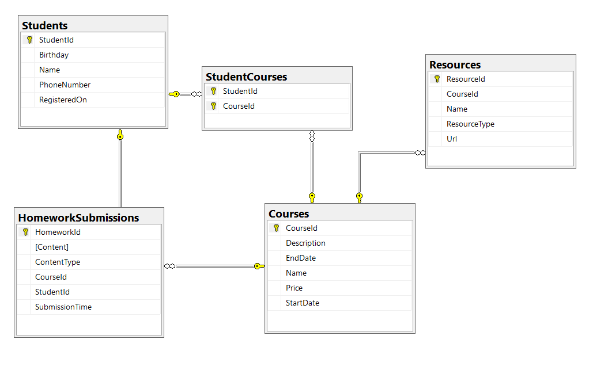

# Exercises: Entity Relations

This document defines the **exercise assignments** for the ["Databases
Advanced – EF Core" course @ Software
University](https://softuni.bg/trainings/1741/databases-advanced-entity-framework-october-2017).

## Student System

Your task is to create a database for the **Student System**, using the
**EF Core Code First** approach. It should look like this:

### Constraints

Your **namespaces** should be:

  - **P01\_StudentSystem** – for your Startup class, if you have one

  - **P01\_StudentSystem.Data** – for your DbContext

  - **P01\_StudentSystem.Data.Models** – for your models

Your **models** should be:

  - **StudentSystemContext** – your DbContext

  - **Student**:
    
      - StudentId
    
      - Name (up to 100 characters, unicode)
    
      - PhoneNumber (exactly 10 characters, not unicode, not required)
    
      - RegisteredOn
    
      - Birthday (not required)

  - **Course**:
    
      - CourseId
    
      - Name (up to 80 characters, unicode)
    
      - Description (unicode, not required)
    
      - StartDate
    
      - EndDate
    
      - Price

  - **Resource**:
    
      - ResourceId
    
      - Name (up to 50 characters, unicode)
    
      - Url (not unicode)
    
      - ResourceType (enum – can be Video, Presentation, Document or
        Other)
    
      - CourseId

  - **Homework**:
    
      - HomeworkId
    
      - Content (string, linking to a file, not unicode)
    
      - ContentType (enum – can be Application, Pdf or Zip)
    
      - SubmissionTime
    
      - StudentId
    
      - CourseId

  - **StudentCourse** – mapping class between **Students** and
    **Courses**

Table relations:

  - **One student** can have **many CourseEnrollments**

  - **One student** can have **many HomeworkSubmissions**

  - **One course** can have **many StudentsEnrolled**

  - **One course** can have **many Resources**

  - **One course** can have **many HomeworkSubmissions**

You will need a constructor, accepting **DbContextOptions** to test your
solution in **Judge**\!

## Seed Some Data in the Database

Write a **seed method** that fills the database with sample data.  
Fill a few **students**, **courses**, **resources** and **homework
submissions**.

#### Bonus

Create a console application that reads information about **courses**
and **students**.

namespace P01\_StudentSystem

{

using System;

public class StartUp

{

public static void Main()

{

}

}

}

namespace P01\_StudentSystem.Data.Models

{

public class StudentCourse

{

public int StudentId { get; set; }

public Student Student { get; set; }

public int CourseId { get; set; }

public Course Course { get; set; }

}

}

using System;

using System.Collections.Generic;

namespace P01\_StudentSystem.Data.Models

{

public class Student

{

public int StudentId { get; set; }

public string Name { get; set; }

public string PhoneNumber { get; set; }

public DateTime RegisteredOn { get; set; }

public DateTime? Birthday { get; set; }

public ICollection\<StudentCourse\> CourseEnrollments { get; set; }

public ICollection\<Homework\> HomeworkSubmissions { get; set; }

}

}

namespace P01\_StudentSystem.Data.Models

{

using Enums;

public class Resource

{

public int ResourceId { get; set; }

public string Name { get; set; }

public string Url { get; set; }

public ResourceType ResourceType { get; set; }

public int CourseId { get; set; }

public Course Course { get; set; }

}

}

namespace P01\_StudentSystem.Data.Models

{

using P01\_StudentSystem.Data.Models.Enums;

using System;

public class Homework

{

public int HomeworkId { get; set; }

public string Content { get; set; }

public ContentType ContentType { get; set; }

public DateTime SubmissionTime { get; set; }

public int StudentId { get; set; }

public Student Student { get; set; }

public int CourseId { get; set; }

public Course Course { get; set; }

}

}

namespace P01\_StudentSystem.Data.Models

{

using System;

using System.Collections.Generic;

public class Course

{

public int CourseId { get; set; }

public string Name { get; set; }

public string Description { get; set; }

public DateTime StartDate { get; set; }

public DateTime EndDate { get; set; }

public decimal Price { get; set; }

public ICollection\<StudentCourse\> StudentsEnrolled { get; set; }

public ICollection\<Resource\> Resources { get; set; }

public ICollection\<Homework\> HomeworkSubmissions { get; set; }

}

}

namespace P01\_StudentSystem.Data.Models.Enums

{

public enum ContentType

{

Application,

Pdf,

Zip

}

}

namespace P01\_StudentSystem.Data.Models.Enums

{

public enum ResourceType

{

Video,

Presentation,

Document,

Other

}

}

namespace P01\_StudentSystem.Data

{

using Microsoft.EntityFrameworkCore;

using Models;

public class StudentSystemContext : DbContext

{

public StudentSystemContext(DbContextOptions options)

: base(options)

{

}

public DbSet\<Course\> Courses { get; set; }

public DbSet\<Homework\> HomeworkSubmissions { get; set; }

public DbSet\<Resource\> Resources { get; set; }

public DbSet\<Student\> Students { get; set; }

public DbSet\<StudentCourse\> StudentCourses { get; set; }

protected override void OnConfiguring(DbContextOptionsBuilder
optionsBuilder)

{

if (\!optionsBuilder.IsConfigured)

{

optionsBuilder.UseSqlServer

(Configuration.ConfigurationString);

}

}

protected override void OnModelCreating(ModelBuilder modelBuider)

{

modelBuider.Entity\<Resource\>(entity =\>

{

entity

.HasKey(r =\> r.ResourceId);

entity

.Property(r =\> r.Name)

.HasMaxLength(50)

.IsRequired()

.IsUnicode();

entity

.Property(r =\> r.Url)

.IsUnicode(false);

});

modelBuider.Entity\<Course\>(entity =\>

{

entity

.HasKey(c =\> c.CourseId);

entity

.Property(c =\> c.Name)

.HasMaxLength(80)

.IsRequired()

.IsUnicode();

entity

.Property(c =\> c.Description)

.IsRequired(false)

.IsUnicode();

entity

.HasMany(st =\> st.StudentsEnrolled)

.WithOne(c =\> c.Course)

.HasForeignKey(c =\> c.CourseId);

entity

.HasMany(r =\> r.Resources)

.WithOne(c =\> c.Course)

.HasForeignKey(c =\> c.CourseId);

entity

.HasMany(h =\> h.HomeworkSubmissions)

.WithOne(c =\> c.Course)

.HasForeignKey(c =\> c.CourseId);

});

modelBuider.Entity\<Student\>(entity =\>

{

entity

.HasKey(s =\> s.StudentId);

entity

.Property(s =\> s.Name)

.HasMaxLength(100)

.IsRequired()

.IsUnicode();

entity

.Property(s =\> s.PhoneNumber)

.HasColumnType("CHAR(10)")

.IsUnicode(false)

.IsRequired(false);

entity

.HasMany(ce =\> ce.CourseEnrollments)

.WithOne(s =\> s.Student)

.HasForeignKey(s =\> s.StudentId);

entity

.HasMany(hs =\> hs.HomeworkSubmissions)

.WithOne(s =\> s.Student)

.HasForeignKey(s =\> s.StudentId);

});

modelBuider.Entity\<Homework\>(entity =\>

{

entity.HasKey(h =\> h.HomeworkId);

entity

.Property(h =\> h.Content)

.IsUnicode(false);

});

modelBuider.Entity\<StudentCourse\>(entity =\>

{

entity.HasKey(k =\> new { k.StudentId, k.CourseId });

});

}

}

}

namespace P01\_StudentSystem.Data

{

using Microsoft.EntityFrameworkCore;

using Models;

using Models.Enums;

using System;

internal static class SeedDatabase

{

public static void Seed(ModelBuilder modelBuilder)

{

modelBuilder

.Entity\<Student\>()

.HasData(

new Student

{

StudentId = 1,

Name = "Gosho Goshov",

PhoneNumber = "1234567899",

RegisteredOn = DateTime.Now

},

new Student

{

StudentId = 2,

Name = "Pesho Peshov",

RegisteredOn = DateTime.Now

});

modelBuilder.Entity\<Course\>()

.HasData(

new Course

{

CourseId = 1,

Name = "C\# OOP",

StartDate = DateTime.Now

},

new Course

{

CourseId = 2,

Name = "C\# DB",

StartDate = DateTime.Now

});

modelBuilder.Entity\<Resource\>()

.HasData(

new Resource

{

ResourceId = 1,

CourseId = 1,

Name = "C\# OOP Advanced Dictionaries",

ResourceType = ResourceType.Document

},

new Resource

{

ResourceId = 2,

CourseId = 2,

Name = "C\# EntityFramework Book",

ResourceType = ResourceType.Video

});

modelBuilder.Entity\<Homework\>()

.HasData(

new Homework

{

HomeworkId = 1,

ContentType = ContentType.Pdf,

StudentId = 1,

CourseId = 2,

SubmissionTime = DateTime.Now

},

new Homework

{

HomeworkId = 2,

ContentType = ContentType.Zip,

StudentId = 2,

CourseId = 1,

SubmissionTime = DateTime.Now

});

}

}

}

namespace P01\_StudentSystem.Data

{

public class Configuration

{

public const string ConfigurationString =
"Server=DESKTOP-LPLN6BV\\\\SQLEXPRESS;" +

"Database=StudentSystem;" +

"Integrated Security=true";

}

}

## Football Betting

Your task is to create a database for a **Football Bookmaker System**,
using the **Code First** approach. It should look like this:

### Constraints

Your **namespaces** should be:

  - **P03\_FootballBetting** – for your Startup class, if you have one

  - **P03\_FootballBetting.Data** – for your DbContext

  - **P03\_FootballBetting.Data.Models** – for your models

Your models should be:

  - **FootballBettingContext** – your DbContext

  - **Team** – TeamId, Name, LogoUrl, Initials (JUV, LIV, ARS…), Budget,
    PrimaryKitColorId, SecondaryKitColorId, TownId

  - **Color** – ColorId, Name

  - **Town** – TownId, Name, CountryId

  - **Country** – CountryId, Name

  - **Player** – PlayerId, Name, SquadNumber, TeamId, PositionId,
    IsInjured

  - **Position** – PositionId, Name

  - **PlayerStatistic** – GameId, PlayerId, ScoredGoals, Assists,
    MinutesPlayed

  - **Game** – GameId, HomeTeamId, AwayTeamId, HomeTeamGoals,
    AwayTeamGoals, DateTime, HomeTeamBetRate, AwayTeamBetRate,
    DrawBetRate, Result)

  - **Bet** – BetId, Amount, Prediction, DateTime, UserId, GameId

  - **User** – UserId, Username, Password, Email, Name, Balance

Table relationships:

  - **A Team** has one **PrimaryKitColor** and one **SecondaryKitColor**

  - **A Color** has **many PrimaryKitTeams** and **many
    SecondaryKitTeams**

<!-- end list -->

  - **A Team** residents in one **Town**

  - **A Town** can host **several** **Teams**

  - **A Game** has one **HomeTeam** and one **AwayTeam** and a **Team**
    can have **many** **HomeGames** and **many** **AwayGames**

  - **A Town** can be placed in **one** **Country** and a **Country**
    can have many **Towns**

  - **A Player** can play for **one** **Team** and **one** **Team** can
    have many **Players**

  - **A Player** can play at one **Position** and one **Position** can
    be played by **many** **Players**

  - **One** **Player** can play in **many** **Games** and in each
    **Game**, **many** **Players** take part (both collections must be
    named PlayerStatistics)

  - **Many** **Bets** can be placed on **one** **Game**, but **a**
    **Bet** can be only on **one** **Game**

  - Each bet for given game must have **Prediction** result

  - **A Bet** can be placed by only **one** **User** and one **User**
    can place many **Bets**

Separate the **models**, **data** and **client** into **different
layers** (projects).

using System;

namespace P03\_FootballBetting

{

public class StartUp

{

public static void Main()

{

}

}

}

using Microsoft.EntityFrameworkCore;

using Microsoft.EntityFrameworkCore.Metadata.Builders;

using P03\_FootballBetting.Data.Models;

namespace P03\_FootballBetting.Data

{

public class UserEntityTypeConfiguration :
IEntityTypeConfiguration\<User\>

{

public void Configure(EntityTypeBuilder\<User\> entity)

{

entity

.HasKey(u =\> u.UserId);

entity

.Property(u =\> u.Username)

.HasMaxLength(50)

.IsRequired(true)

.IsUnicode(false);

entity

.Property(u =\> u.Password)

.HasMaxLength(30)

.IsRequired(true)

.IsUnicode(false);

entity

.Property(u =\> u.Email)

.HasMaxLength(50)

.IsRequired(true)

.IsUnicode(false);

entity

.Property(u =\> u.Name)

.HasMaxLength(100)

.IsRequired(false)

.IsUnicode(true);

entity

.Property(u =\> u.Balance)

.IsRequired(true);

}

}

}

using Microsoft.EntityFrameworkCore;

using Microsoft.EntityFrameworkCore.Metadata.Builders;

using P03\_FootballBetting.Data.Models;

namespace P03\_FootballBetting.Data

{

public class TownEntityTypeConfiguration :
IEntityTypeConfiguration\<Town\>

{

public void Configure(EntityTypeBuilder\<Town\> builder)

{

builder

.HasKey(t =\> t.TownId);

builder

.Property(t =\> t.Name)

.HasMaxLength(50)

.IsRequired(true)

.IsUnicode(true);

builder

.HasOne(t =\> t.Country)

.WithMany(c =\> c.Towns)

.HasForeignKey(t =\> t.CountryId);

}

}

}

using Microsoft.EntityFrameworkCore;

using Microsoft.EntityFrameworkCore.Metadata.Builders;

using P03\_FootballBetting.Data.Models;

namespace P03\_FootballBetting.Data

{

public class TeamEntityTypeConfiguration:
IEntityTypeConfiguration\<Team\>

{

public void Configure(EntityTypeBuilder\<Team\> builder)

{

builder

.HasKey(t =\> t.TeamId);

builder

.Property(t =\> t.Name)

.HasMaxLength(50)

.IsRequired(true)

.IsUnicode(true);

builder

.Property(t =\> t.LogoUrl)

.HasMaxLength(250)

.IsRequired(false)

.IsUnicode(false);

builder

.Property(t =\> t.Initials)

.HasMaxLength(3)

.IsRequired(true)

.IsUnicode(true);

builder

.Property(t =\> t.Budget)

.IsRequired(true);

builder

.HasOne(t =\> t.PrimaryKitColor)

.WithMany(c =\> c.PrimaryKitTeams)

.HasForeignKey(t =\> t.PrimaryKitColorId)

.OnDelete(DeleteBehavior.Restrict);

builder

.HasOne(t =\> t.SecondaryKitColor)

.WithMany(c =\> c.SecondaryKitTeams)

.HasForeignKey(t =\> t.SecondaryKitColorId)

.OnDelete(DeleteBehavior.Restrict);

}

}

}

using Microsoft.EntityFrameworkCore;

using Microsoft.EntityFrameworkCore.Metadata.Builders;

using P03\_FootballBetting.Data.Models;

using System;

using System.Collections.Generic;

using System.Text;

namespace P03\_FootballBetting.Data

{

public class PositionEntityTypeConfiguration :
IEntityTypeConfiguration\<Position\>

{

public void Configure(EntityTypeBuilder\<Position\> builder)

{

builder

.HasKey(po =\> po.PositionId);

builder

.Property(po =\> po.Name)

.HasMaxLength(20)

.IsRequired(true)

.IsUnicode(true);

}

}

}

using Microsoft.EntityFrameworkCore;

using Microsoft.EntityFrameworkCore.Metadata.Builders;

using P03\_FootballBetting.Data.Models;

namespace P03\_FootballBetting.Data

{

public class PlayerStatisticEntityTypeConfiguration :
IEntityTypeConfiguration\<PlayerStatistic\>

{

public void Configure(EntityTypeBuilder\<PlayerStatistic\> builder)

{

builder

.HasKey(ps =\> new { ps.GameId, ps.PlayerId });

builder

.Property(ps =\> ps.ScoredGoals)

.IsRequired(true);

builder

.Property(ps =\> ps.Assists)

.IsRequired(true);

builder

.Property(ps =\> ps.MinutesPlayed)

.IsRequired(true);

builder

.HasOne(ps =\> ps.Game)

.WithMany(g =\> g.PlayerStatistics)

.HasForeignKey(ps =\> ps.GameId);

builder

.HasOne(ps =\> ps.Player)

.WithMany(p =\> p.PlayerStatistics)

.HasForeignKey(ps =\> ps.PlayerId);

}

}

}

using Microsoft.EntityFrameworkCore;

using Microsoft.EntityFrameworkCore.Metadata.Builders;

using P03\_FootballBetting.Data.Models;

namespace P03\_FootballBetting.Data

{

public class PlayerEntityTypeConfiguration :
IEntityTypeConfiguration\<Player\>

{

public void Configure(EntityTypeBuilder\<Player\> builder)

{

builder

.HasKey(p =\> p.PlayerId);

builder

.Property(p =\> p.Name)

.HasMaxLength(100)

.IsRequired(true)

.IsUnicode(true);

builder

.Property(p =\> p.SquadNumber)

.IsRequired(true)

.IsUnicode(false);

builder

.Property(p =\> p.IsInjured)

.IsRequired(true);

builder

.HasOne(p =\> p.Team)

.WithMany(t =\> t.Players)

.HasForeignKey(p =\> p.TeamId);

builder

.HasOne(p =\> p.Position)

.WithMany(po =\> po.Players)

.HasForeignKey(p =\> p.PositionId);

}

}

}

using Microsoft.EntityFrameworkCore;

using Microsoft.EntityFrameworkCore.Metadata.Builders;

using P03\_FootballBetting.Data.Models;

using System;

using System.Collections.Generic;

using System.Text;

namespace P03\_FootballBetting.Data

{

public class GameEntityTypeConfiguration :
IEntityTypeConfiguration\<Game\>

{

public void Configure(EntityTypeBuilder\<Game\> builder)

{

builder

.HasKey(g =\> g.GameId);

builder

.Property(g =\> g.HomeTeamGoals)

.IsRequired(true);

builder

.Property(g =\> g.AwayTeamGoals)

.IsRequired(true);

builder

.Property(g =\> g.DateTime)

.IsRequired(true);

builder

.Property(g =\> g.HomeTeamBetRate)

.IsRequired(true);

builder

.Property(g =\> g.AwayTeamBetRate)

.IsRequired(true);

builder

.Property(g =\> g.DrawBetRate)

.IsRequired(true);

builder

.Property(g =\> g.Result)

.HasMaxLength(7)

.IsRequired(true)

.IsUnicode(false);

builder

.HasOne(g =\> g.HomeTeam)

.WithMany(t =\> t.HomeGames)

.HasForeignKey(g =\> g.HomeTeamId)

.OnDelete(DeleteBehavior.Restrict);

builder

.HasOne(g =\> g.AwayTeam)

.WithMany(t =\> t.AwayGames)

.HasForeignKey(g =\> g.AwayTeamId)

.OnDelete(DeleteBehavior.Restrict);

}

}

}

using Microsoft.EntityFrameworkCore;

using Microsoft.EntityFrameworkCore.Metadata.Builders;

using P03\_FootballBetting.Data.Models;

using System;

namespace P03\_FootballBetting.Data

{

public class CountryEntityTypeConfiguration :
IEntityTypeConfiguration\<Country\>

{

public void Configure(EntityTypeBuilder\<Country\> builder)

{

builder

.HasKey(c =\> c.CountryId);

builder

.Property(c =\> c.Name)

.HasMaxLength(50)

.IsRequired(true)

.IsUnicode(true);

}

}

}

using Microsoft.EntityFrameworkCore;

using Microsoft.EntityFrameworkCore.Metadata.Builders;

using P03\_FootballBetting.Data.Models;

namespace P03\_FootballBetting.Data

{

public class ColorEntityTypeConfiguration:
IEntityTypeConfiguration\<Color\>

{

public void Configure(EntityTypeBuilder\<Color\> builder)

{

builder

.HasKey(c =\> c.ColorId);

builder

.Property(c =\> c.Name)

.HasMaxLength(30)

.IsRequired(true)

.IsUnicode(true);

}

}

}

using Microsoft.EntityFrameworkCore;

using Microsoft.EntityFrameworkCore.Metadata.Builders;

using P03\_FootballBetting.Data.Models;

namespace P03\_FootballBetting.Data

{

public class BetEntityTypeConfiguration :
IEntityTypeConfiguration\<Bet\>

{

public void Configure(EntityTypeBuilder\<Bet\> builder)

{

builder

.HasKey(b =\> b.BetId);

builder

.Property(b =\> b.Amount)

.IsRequired(true);

builder

.Property(b =\> b.Prediction)

.IsRequired(true);

builder

.Property(b =\> b.DateTime)

.IsRequired(true);

builder

.HasOne(b =\> b.User)

.WithMany(u =\> u.Bets)

.HasForeignKey(b =\> b.UserId);

builder

.HasOne(b =\> b.Game)

.WithMany(g =\> g.Bets)

.HasForeignKey(b =\> b.GameId);

}

}

}

namespace P03\_FootballBetting.Data

{

public static class ConfigurationString

{

internal static string ConnectionString =
@"Server=DESKTOP-LPLN6BV\\\\SQLEXPRESS;" +

"Database=FootballBetting;" +

"Integrated Security=true";

}

}

using P03\_FootballBetting.Data.Models;

using Microsoft.EntityFrameworkCore;

namespace P03\_FootballBetting.Data

{

public class FootballBettingContext : DbContext

{

public FootballBettingContext()

{

}

public FootballBettingContext(DbContextOptions options)

: base(options)

{

}

public DbSet\<Bet\> Bets { get; set; }

public DbSet\<Color\> Colors { get; set; }

public DbSet\<Country\> Countries { get; set; }

public DbSet\<Game\> Games { get; set; }

public DbSet\<Player\> Players { get; set; }

public DbSet\<PlayerStatistic\> PlayerStatistics { get; set; }

public DbSet\<Position\> Positions { get; set; }

public DbSet\<Team\> Teams { get; set; }

public DbSet\<Town\> Towns { get; set; }

public DbSet\<User\> Users { get; set; }

protected override void OnConfiguring(DbContextOptionsBuilder
optionsBuilder)

{

if (\!optionsBuilder.IsConfigured)

{

optionsBuilder.UseSqlServer(ConfigurationString.ConnectionString);

}

base.OnConfiguring(optionsBuilder);

}

protected override void OnModelCreating(ModelBuilder builder)

{

base.OnModelCreating(builder);

builder.ApplyConfiguration(new TeamEntityTypeConfiguration());

builder.ApplyConfiguration(new ColorEntityTypeConfiguration());

builder.ApplyConfiguration(new TownEntityTypeConfiguration());

builder.ApplyConfiguration(new CountryEntityTypeConfiguration());

builder.ApplyConfiguration(new PlayerEntityTypeConfiguration());

builder.ApplyConfiguration(new PositionEntityTypeConfiguration());

builder.ApplyConfiguration(new
PlayerStatisticEntityTypeConfiguration());

builder.ApplyConfiguration(new GameEntityTypeConfiguration());

builder.ApplyConfiguration(new BetEntityTypeConfiguration());

builder.ApplyConfiguration(new UserEntityTypeConfiguration());

}

}

}

using System.Collections.Generic;

namespace P03\_FootballBetting.Data.Models

{

public class User

{

public int UserId { get; set; }

public decimal Balance { get; set; }

public string Email { get; set; }

public string Name { get; set; }

public string Password { get; set; }

public string Username { get; set; }

public ICollection\<Bet\> Bets { get; set; } = new HashSet\<Bet\>();

}

}

using System.Collections.Generic;

namespace P03\_FootballBetting.Data.Models

{

public class Town

{

public int TownId { get; set; }

public int CountryId { get; set; }

public Country Country { get; set; }

public string Name { get; set; }

public ICollection\<Team\> Teams { get; set; } = new HashSet\<Team\>();

}

}

using System.Collections.Generic;

namespace P03\_FootballBetting.Data.Models

{

public class Team

{

public int TeamId { get; set; }

public string Name { get; set; }

public string LogoUrl { get; set; }

public string Initials { get; set; }

public decimal Budget { get; set; }

public int PrimaryKitColorId { get; set; }

public Color PrimaryKitColor { get; set; }

public int SecondaryKitColorId { get; set; }

public Color SecondaryKitColor { get; set; }

public int TownId { get; set; }

public Town Town { get; set; }

public ICollection\<Game\> HomeGames { get; set; } = new
HashSet\<Game\>();

public ICollection\<Game\> AwayGames { get; set; } = new
HashSet\<Game\>();

public ICollection\<Player\> Players { get; set; } = new
HashSet\<Player\>();

}

}

using System.Collections.Generic;

namespace P03\_FootballBetting.Data.Models

{

public class Position

{

public int PositionId { get; set; }

public string Name { get; set; }

public ICollection\<Player\> Players { get; set; } = new
HashSet\<Player\>();

}

}

namespace P03\_FootballBetting.Data.Models

{

public class PlayerStatistic

{

public int PlayerId { get; set; }

public Player Player { get; set; }

public int GameId { get; set; }

public Game Game { get; set; }

public int Assists { get; set; }

public int MinutesPlayed { get; set; }

public int ScoredGoals { get; set; }

}

}

namespace P03\_FootballBetting.Data.Models

{

public class Player

{

public int PlayerId { get; set; }

public bool IsInjured { get; set; }

public string Name { get; set; }

public int PositionId { get; set; }

public Position Position { get; set; }

public int SquadNumber { get; set; }

public int TeamId { get; set; }

public Team Team { get; set; }

public ICollection\<PlayerStatistic\> PlayerStatistics { get; set; } =
new HashSet\<PlayerStatistic\>();

}

}

using System;

using System.Collections.Generic;

namespace P03\_FootballBetting.Data.Models

{

public class Game

{

public int GameId { get; set; }

public decimal AwayTeamBetRate { get; set; }

public int AwayTeamGoals { get; set; }

public int AwayTeamId { get; set; }

public Team AwayTeam { get; set; }

public decimal DrawBetRate { get; set; }

public decimal HomeTeamBetRate { get; set; }

public int HomeTeamGoals { get; set; }

public int HomeTeamId { get; set; }

public Team HomeTeam { get; set; }

public string Result { get; set; }

public DateTime DateTime { get; set; }

public ICollection\<PlayerStatistic\> PlayerStatistics { get; set; } =
new HashSet\<PlayerStatistic\>();

public ICollection\<Bet\> Bets { get; set; } = new HashSet\<Bet\>();

}

}

using System;

using P03\_FootballBetting.Data.Models.Enums;

namespace P03\_FootballBetting.Data.Models

{

public class Bet

{

public int BetId { get; set; }

public decimal Amount { get; set; }

public int GameId { get; set; }

public Game Game { get; set; }

public Prediction Prediction { get; set; }

public DateTime DateTime { get; set; }

public int UserId { get; set; }

public User User { get; set; }

}

}

using System.Collections.Generic;

namespace P03\_FootballBetting.Data.Models

{

public class Color

{

public int ColorId { get; set; }

public string Name { get; set; }

public ICollection\<Team\> PrimaryKitTeams { get; set; } = new
HashSet\<Team\>();

public ICollection\<Team\> SecondaryKitTeams { get; set; } = new
HashSet\<Team\>();

}

}

using System.Collections.Generic;

namespace P03\_FootballBetting.Data.Models

{

public class Country

{

public int CountryId { get; set; }

public string Name { get; set; }

public ICollection\<Town\> Towns { get; set; } = new HashSet\<Town\>();

}

}
