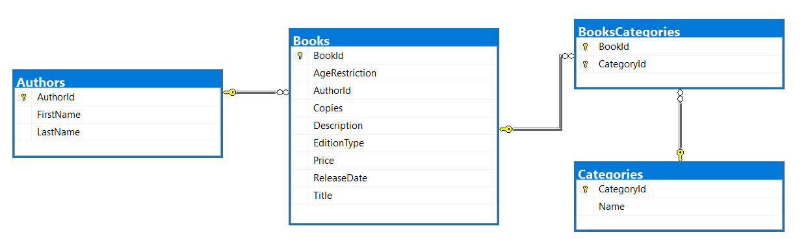

# Exercises: Advanced Querying

This document defines the **exercise assignments** for the ["Databases
Advanced – EF Core" course @ Software
University](https://softuni.bg/trainings/1741/databases-advanced-entity-framework-october-2017).

# BookShop System

For the following tasks, use the
[BookShop](http://svn.softuni.org/admin/svn/csharp-databases/2019-Jan/2.%20DB-Advanced-EF-Core/07.%20DB-Advanced-Advanced-Querying/BookShop.zip)
database. You can download the complete project or create it yourself in
**task 0**, but you should still use the pre-defined **Seed()** method
from the project to have the same **sample** data.

## Book Shop Database

You must create a **database** for a **book** **shop** **system**. It
should look like this:

### Constraints

Your **namespaces** should be:

  - **BookShop** – for your **StartUp** class

  - **BookShop.Data** – for your DbContext

  - **BookShop.Models** – for your models

  - **BookShop.Models**.**Enums** – for your models

Your **models** should be:

  - **BookShopContext** – your DbContext

  - **Author**:
    
      - AuthorId
    
      - FirstName (up to 50 characters, unicode, not required)
    
      - LastName (up to 50 characters, unicode)

  - **Book**:
    
      - BookId
    
      - Title (up to 50 characters, unicode)
    
      - Description (up to 1000 characters, unicode)
    
      - ReleaseDate (not required)
    
      - Copies (an integer)
    
      - Price
    
      - EditionType – enum (Normal, Promo, Gold)
    
      - AgeRestriction – enum (Minor, Teen, Adult)
    
      - Author
    
      - BookCategories

  - **Category**:
    
      - CategoryId
    
      - Name (up to 50 characters, unicode)
    
      - CategoryBooks

  - **BookCategory** – mapping class

For the following tasks, you will be creating methods that accept a
BookShopContext as a parameter and use it to run some queries. Create
those methods inside your **StartUp** class and upload your whole
solution to **Judge**.

public class StartUp

{

public static void Main()

{

using (var db = new BookShopContext())

{

// DbInitializer.ResetDatabase(db);

//string input = Console.ReadLine();

//int lengthCheck = int.Parse(Console.ReadLine());

string result = GetGoldenBooks(db);

Console.WriteLine(result);

}

}

## Age Restriction

**NOTE**: You will need method public static string
**GetBooksByAgeRestriction**(BookShopContext context, string command)
and public StartUp class.

Return in a **single** **string** all book **titles**, each on a **new
line,** that have **age** **restriction**, equal to the **given**
**command**. Order the titles **alphabetically**.

Read **input** from the console in your **main** **method**, and call
your **method** with the **necessary** **arguments**. Print the
**returned** **string** to the console. **Ignore** casing of the input.

public static string GetBooksByAgeRestriction(BookShopContext context,
string command)

{

StringBuilder sb = new StringBuilder();

var books = context

.Books

.Where(b =\> b.AgeRestriction.ToString().ToLower() == command.ToLower())

.OrderBy(b =\> b.Title)

.Select(b =\> b.Title);

foreach (var b in books)

{

sb.AppendLine(b);

}

return sb.ToString().TrimEnd();

}

### Example

<table>
<thead>
<tr class="header">
<th><strong>Input</strong></th>
<th><strong>Output</strong></th>
</tr>
</thead>
<tbody>
<tr class="odd">
<td>miNor</td>
<td>
A Confederacy of Dunces

A Farewell to Arms

A Handful of Dust

…
</td>
</tr>
<tr class="even">
<td>teEN</td>
<td>
A Passage to India

A Scanner Darkly

A Swiftly Tilting Planet

…
</td>
</tr>
</tbody>
</table>

## Golden Books

**NOTE**: You will need method public static string
**GetGoldenBooks**(BookShopContext context) and public StartUp class.

Return in a **single** string **titles of the golden edition books**
that have **less than 5000 copies**, each on a **new line**. Order them
by **book** **id** ascending.

Call the **GetGoldenBooks**(BookShopContext context) method in your
**Main()** and print the returned string to the console.

public static string GetGoldenBooks(BookShopContext context)

{

StringBuilder sb = new StringBuilder();

var goldBooks = context.Books

.Where(b =\> b.EditionType == (EditionType)2)

.Where(b =\> b.Copies \< 5000)

.OrderBy(b =\> b.BookId)

.Select(b =\> b.Title);

foreach (var b in goldBooks)

{

sb.AppendLine(b);

}

return sb.ToString().TrimEnd();

}

### Example

<table>
<thead>
<tr class="header">
<th><strong>Output</strong></th>
</tr>
</thead>
<tbody>
<tr class="odd">
<td>
Lilies of the Field

Look Homeward

The Mirror Crack'd from Side to Side

…
</td>
</tr>
</tbody>
</table>

## Books by Price

**NOTE**: You will need method public static string
**GetBooksByPrice**(BookShopContext context) and public StartUp class.

Return in a single string all **titles and prices** **of books** with
**price higher than 40**, each on a **new** **row** in the **format**
given below. Order them by **price** descending.

public static string GetBooksByPrice(BookShopContext context)

{

StringBuilder sb = new StringBuilder();

var booksWithPriceAbove40 = context.Books

.Where(b =\> b.Price \> 40)

.OrderByDescending(b =\> b.Price)

.Select(e =\> new

{

e.Title,

e.Price

});

foreach (var b in booksWithPriceAbove40)

{

sb.AppendLine($"{b.Title} - ${b.Price:f2}");

}

return sb.ToString().TrimEnd();

}

### Example

<table>
<thead>
<tr class="header">
<th><strong>Output</strong></th>
</tr>
</thead>
<tbody>
<tr class="odd">
<td>
O Pioneers! - $49.90

That Hideous Strength - $48.63

A Handful of Dust - $48.63

…
</td>
</tr>
</tbody>
</table>

## Not Released In

**NOTE**: You will need method public static string
**GetBooksNotReleasedIn**(BookShopContext context, int year) and public
StartUp class.

Return in a **single** string all **titles of books** that are **NOT
released** on a given year. Order them by **book** **id** ascending.

public static string GetBooksNotReleasedIn(BookShopContext context, int
year)

{

StringBuilder sb = new StringBuilder();

var booksNotReleasedThisYear = context.Books

.Where(b =\> DateTime.Parse(b.ReleaseDate.ToString()).Year \!= year)

.OrderBy(b =\> b.BookId)

.Select(b =\> b.Title);

foreach (var v in booksNotReleasedThisYear)

{

sb.AppendLine(v);

}

return sb.ToString().TrimEnd();

}

### Example

<table>
<thead>
<tr class="header">
<th><strong>Input</strong></th>
<th><strong>Output</strong></th>
</tr>
</thead>
<tbody>
<tr class="odd">
<td>2000</td>
<td>
Absalom

Nectar in a Sieve

Nine Coaches Waiting

…
</td>
</tr>
<tr class="even">
<td>1998</td>
<td>
The Needle's Eye

No Country for Old Men

No Highway

…
</td>
</tr>
</tbody>
</table>

## Book Titles by Category

**NOTE**: You will need method public static string
**GetBooksByCategory**(BookShopContext context, string input) and public
StartUp class.

Return in a single string the **titles of books** by a given **list of
categories**. The list of **categories** will be given in a single line
separated with one or more spaces. Ignore casing. Order by **title**
alphabetically.

public static string GetBooksByCategory(BookShopContext context, string
input)

{

StringBuilder sb = new StringBuilder();

var listOfCategories = input

.ToLower()

.Split(new char\[\] { ' ' }, StringSplitOptions.RemoveEmptyEntries)

.ToList();

var booksFromCategories = context

.Books

.Where(b =\> b.BookCategories

.Any(bc =\> listOfCategories

.Contains(bc.Category.Name.ToLower())))

.OrderBy(b =\> b.Title)

.Select(b =\> b.Title);

foreach (var b in booksFromCategories)

{

sb.AppendLine(b);

}

return sb.ToString().TrimEnd();

}

### Example

<table>
<thead>
<tr class="header">
<th><strong>Input</strong></th>
<th><strong>Output</strong></th>
</tr>
</thead>
<tbody>
<tr class="odd">
<td>horror mystery drama</td>
<td>
A Fanatic Heart

A Farewell to Arms

A Glass of Blessings

…
</td>
</tr>
</tbody>
</table>

## Released Before Date

**NOTE**: You will need method public static string
**GetBooksReleasedBefore**(BookShopContext context, string date) and
public StartUp class.

Return **the title, edition type and price** of all books that are
**released before a given date**. The date will be a string **in
format** **dd-MM-yyyy**.

Return all of the rows in a **single** string, ordered by **release**
**date** **descending**.

public static string GetBooksReleasedBefore(BookShopContext context,
string date)

{

StringBuilder sb = new StringBuilder();

var books = context.Books

.Where(b =\> b.ReleaseDate \< DateTime.ParseExact(date, "dd-MM-yyyy",
CultureInfo.InvariantCulture))

.OrderByDescending(b =\> b.ReleaseDate)

.Select(e =\> new

{

e.Title,

e.EditionType,

e.Price

});

foreach (var b in books)

{

sb.AppendLine($"{b.Title} - {b.EditionType} - ${b.Price:f2}");

}

return sb.ToString().TrimEnd();

}

### Example

<table>
<thead>
<tr class="header">
<th><strong>Input</strong></th>
<th><strong>Output</strong></th>
</tr>
</thead>
<tbody>
<tr class="odd">
<td>12-04-1992</td>
<td>
If I Forget Thee Jerusalem - Gold - $33.21

Oh! To be in England - Normal - $46.67

The Monkey's Raincoat - Normal - $46.93

…
</td>
</tr>
<tr class="even">
<td>30-12-1989</td>
<td>
A Fanatic Heart - Normal - $9.41

The Curious Incident of the Dog in the Night-Time - Normal - $23.41

The Other Side of Silence - Gold - $46.26

…
</td>
</tr>
</tbody>
</table>

## Author Search

**NOTE**: You will need method public static string
**GetAuthorNamesEndingIn**(BookShopContext context, string input) and
public StartUp class.

Return the **full** **names** of **authors**, whose **first** **name**
ends with a **given** **string**.

Return all **names** in a **single** **string**, each on a **new**
**row**, ordered alphabetically.

public static string GetAuthorNamesEndingIn(BookShopContext context,
string input)

{

StringBuilder sb = new StringBuilder();

var booksWithAuthors = context.Authors

.Where(a =\> a.FirstName.EndsWith(input))

.OrderBy(a =\> a.FirstName)

.ThenBy(a =\> a.LastName)

.Select(e =\> new

{

e.FirstName,

e.LastName

});

foreach (var b in booksWithAuthors)

{

sb.AppendLine($"{b.FirstName} {b.LastName}");

}

return sb.ToString().TrimEnd();

}

### Example

<table>
<thead>
<tr class="header">
<th><strong>Input</strong></th>
<th><strong>Output</strong></th>
</tr>
</thead>
<tbody>
<tr class="odd">
<td>E</td>
<td>
George Powell

Jane Ortiz
</td>
</tr>
<tr class="even">
<td>Dy</td>
<td>Randy Morales</td>
</tr>
</tbody>
</table>

## Book Search

**NOTE**: You will need method public static string
**GetBookTitlesContaining**(BookShopContext context, string input) and
public StartUp class.

Return the **titles** of **book**, which contain a **given** **string**.
Ignore casing.

Return all **titles** in a **single** **string**, each on a **new**
**row**, ordered alphabetically.

public static string GetBookTitlesContaining(BookShopContext context,
string input)

{

StringBuilder sb = new StringBuilder();

var titlesContaining = context.Books

.Where(b =\> b.Title.ToLower().Contains(input.ToLower()))

.OrderBy(b =\> b.Title)

.Select(b =\> b.Title);

foreach (var b in titlesContaining)

{

sb.AppendLine(b);

}

return sb.ToString().TrimEnd();

}

### Example

<table>
<thead>
<tr class="header">
<th><strong>Input</strong></th>
<th><strong>Output</strong></th>
</tr>
</thead>
<tbody>
<tr class="odd">
<td>sK</td>
<td>
A Catskill Eagle

The Daffodil Sky

The Skull Beneath the Skin
</td>
</tr>
<tr class="even">
<td>WOR</td>
<td>
Great Work of Time

Terrible Swift Sword
</td>
</tr>
</tbody>
</table>

## Book Search by Author

**NOTE**: You will need method public static string
**GetBooksByAuthor**(BookShopContext context, string input) and public
StartUp class.

Return **all titles of books and their authors’ names** for books, which
are written by authors whose last names **start with the given string**.

Return a single string with each title on a new row. **Ignore** casing.
Order by **book** **id** ascending.

public static string GetBooksByAuthor(BookShopContext context, string
input)

{

StringBuilder sb = new StringBuilder();

var titlesAndAuthors = context.Books

.Where(b =\> b.Author.LastName.ToLower().StartsWith(input.ToLower()))

.OrderBy(b =\> b.BookId)

.Select(e =\> new

{

e.Title,

Author = $"{e.Author.FirstName} {e.Author.LastName}"

})

.ToList();

foreach (var b in titlesAndAuthors)

{

sb.AppendLine($"{b.Title} ({b.Author})");

}

return sb.ToString().TrimEnd();

}

### Example

<table>
<thead>
<tr class="header">
<th><strong>Input</strong></th>
<th><strong>Output</strong></th>
</tr>
</thead>
<tbody>
<tr class="odd">
<td>R</td>
<td>
The Heart Is Deceitful Above All Things (Bozhidara Rysinova)

His Dark Materials (Bozhidara Rysinova)

The Heart Is a Lonely Hunter (Bozhidara Rysinova)

…
</td>
</tr>
<tr class="even">
<td>Po</td>
<td>
Postern of Fate (Stanko Popov)

Precious Bane (Stanko Popov)

The Proper Study (Stanko Popov)

…
</td>
</tr>
</tbody>
</table>

## Count Books

**NOTE**: You will need method public static int
**CountBooks**(BookShopContext context, int lengthCheck) and public
StartUp class.

Return **the number of books,** which have a **title longer than the
number** given as an input.

public static int CountBooks(BookShopContext context, int lengthCheck)

{

var numberOfBooks = context.Books

.Where(b =\> b.Title.Length \> lengthCheck);

return numberOfBooks.Count();

}

### Example

| **Input** | **Output** | **Comments**                                          |
| --------- | ---------- | ----------------------------------------------------- |
| 12        | 169        | There are 169 books with longer title than 12 symbols |
| 40        | 2          | There are 2 books with longer title than 40 symbols   |

## Total Book Copies

**NOTE**: You will need method public static string
**CountCopiesByAuthor**(BookShopContext context) and public StartUp
class.

Return the **total number of book copies** **for each author**. Order
the results **descending by total book copies**.

Return all results in a **single** **string**, each on a **new**
**line**.

public static string CountCopiesByAuthor(BookShopContext context)

{

StringBuilder sb = new StringBuilder();

var bookCount = context.Authors

.Select(e =\> new

{

Name = $"{e.FirstName} {e.LastName}",

Copies = e.Books.Sum(b=\>b.Copies)

})

.OrderByDescending(e =\> e.Copies)

.ToList();

foreach (var b in bookCount)

{

sb.AppendLine($"{b.Name} - {b.Copies}");

}

return sb.ToString().TrimEnd();

}

### Example

<table>
<thead>
<tr class="header">
<th><strong>Output</strong></th>
</tr>
</thead>
<tbody>
<tr class="odd">
<td>
Stanko Popov - 117778

Lyubov Ivanova - 107391

Jane Ortiz – 103673

…
</td>
</tr>
</tbody>
</table>

## Profit by Category

**NOTE**: You will need method public static string
**GetTotalProfitByCategory**(BookShopContext context) and public StartUp
class.

Return the **total profit of all books by category**. Profit for a book
can be calculated by multiplying its **number of copies** by the **price
per single book**. Order the results by **descending by total profit**
for category and **ascending by category name**.

public static string GetTotalProfitByCategory(BookShopContext context)

{

StringBuilder sb = new StringBuilder();

var profitByCategory = context.Categories

.Select(e =\> new

{

e.Name,

Profit = e.CategoryBooks

.Select(cb =\> cb.Book.Price \* cb.Book.Copies).Sum()

})

.OrderByDescending(e =\> e.Profit);

foreach (var b in profitByCategory)

{

sb.AppendLine($"{b.Name} ${b.Profit:f2}");

}

return sb.ToString().TrimEnd();

}

### Example

<table>
<thead>
<tr class="header">
<th><strong>Output</strong></th>
</tr>
</thead>
<tbody>
<tr class="odd">
<td>
Art $6428917.79

Fantasy $5291439.71

Adventure $5153920.77

Children's $4809746.22

…
</td>
</tr>
</tbody>
</table>

## Most Recent Books

**NOTE**: You will need method public static string
**GetMostRecentBooks**(BookShopContext context) and public StartUp
class.

Get the most recent books by categories. The **categories** should be
ordered by **name alphabetically**. Only take the **top 3** most recent
books from each category - ordered by **release date** (descending).
**Select** and **print** the **category name**, and for each **book** –
its **title** and **release year**.

public static string GetMostRecentBooks(BookShopContext context)

{

StringBuilder sb = new StringBuilder();

var mostRecentBooksByCategory = context.Categories

.OrderBy(c =\> c.Name)

.Select(c =\> new

{

c.Name,

CategoryRecentBooks = c.CategoryBooks

.OrderByDescending(cb =\> cb.Book.ReleaseDate)

.Take(3)

.Select(cb =\> new

{

BookTitle = cb.Book.Title,

BookRelease = cb.Book.ReleaseDate.Value.Year

})

.ToList()

});

foreach(var b in mostRecentBooksByCategory)

{

sb.AppendLine($"--{b.Name}");

foreach (var c in b.CategoryRecentBooks)

{

sb.AppendLine($"{c.BookTitle} ({c.BookRelease})");

}

}

return sb.ToString().TrimEnd();

}

### Example

<table>
<thead>
<tr class="header">
<th><strong>Output</strong></th>
</tr>
</thead>
<tbody>
<tr class="odd">
<td>
--Action

Brandy ofthe Damned (2015)

Bonjour Tristesse (2013)

By Grand Central Station I Sat Down and Wept (2010)

--Adventure

The Cricket on the Hearth (2013)

Dance Dance Dance (2002)

Cover Her Face (2000)

…
</td>
</tr>
</tbody>
</table>

## Increase Prices

**NOTE**: You will need method public static void
**IncreasePrices**(BookShopContext context) and public StartUp class.

**Increase the prices of all books** **released before 2010 by 5**.

public static void IncreasePrices(BookShopContext context)

{

var bookPriceIncrease = context.Books

.Where(b =\> b.ReleaseDate.Value.Year \< 2010);

foreach (var b in bookPriceIncrease)

{

b.Price += 5;

}

context.SaveChanges();

}

## Remove Books

**NOTE**: You will need method public static int
**RemoveBooks**(BookShopContext context) and public StartUp class.

Remove all **books**, which have less than **4200 copies**. Return an
**int** - the **number of books that were deleted** from the database.

public static int RemoveBooks(BookShopContext context)

{

var booksToBeRemoved = context.Books

.Where(b =\> b.Copies \< 4200)

.ToList();

context.Books.RemoveRange(booksToBeRemoved);

context.SaveChanges();

return booksToBeRemoved.Count();

}

### Example

| **Output** |
| ---------- |
| 34         |
