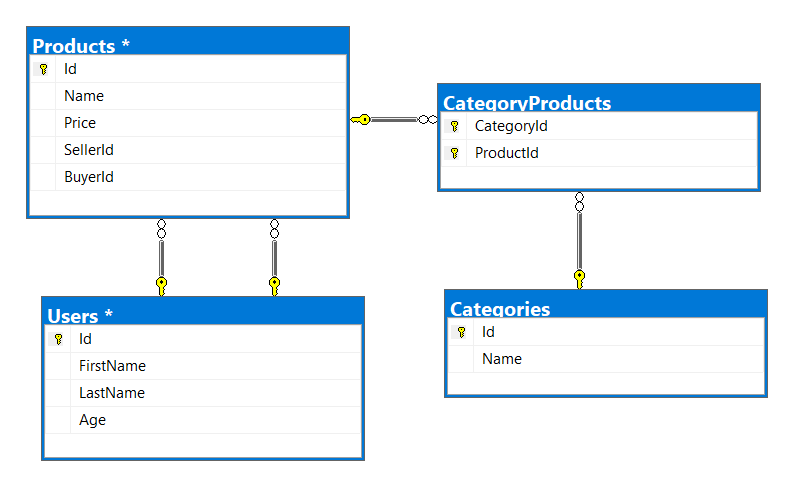

# Exercises: External Format Processing

This document defines the **exercise assignments** for the ["Databases
Advanced – EF Core" course @ Software
University](https://softuni.bg/trainings/1741/databases-advanced-entity-framework-october-2017).

# Products Shop Database

A products shop holds **users**, **products** and **categories** for the
products. Users can **sell** and **buy** products.

  - Users have an **id**, **first** **name** (optional) and **last**
    **name** (at least 3 characters) and **age** (optional).

  - Products have an **id**, **name** (at least 3 characters),
    **price**, **buyerId** (optional) and **sellerId** as IDs of users.

  - Categories have an **id** and **name** (from **3** to **15**
    characters)

Using Entity Framework Code First create a database following the above
description.

  - **Users** should have **many products sold** and **many products
    bought**.

  - **Products** should have **many categories**

  - **Categories** should have **many products**

  - **CategoryProducts** should **map products** and **categories**

public static void Main(string\[\] args)

{

using (var db = new ProductShopContext())

{

//var inputJason = File.ReadAllText(@"D:\\$$$ SOFTUNI $$$\\C\#\\C\#
DB\\Entity Framework Core\\08. JSON PROCESSING\\01. Import
Users\_Product Shop\\ProductShop\\Datasets\\users.json");

// var inputJason = File.ReadAllText(@"D:\\$$$ SOFTUNI $$$\\C\#\\C\#
DB\\Entity Framework Core\\08. JSON PROCESSING\\01. Import
Users\_Product Shop\\ProductShop\\Datasets\\products.json");

//var inputJason = File.ReadAllText(@"D:\\$$$ SOFTUNI $$$\\C\#\\C\#
DB\\Entity Framework Core\\08. JSON PROCESSING\\01. Import
Users\_Product Shop\\ProductShop\\Datasets\\categories.json");

//var inputJason = File.ReadAllText(@"D:\\$$$ SOFTUNI $$$\\C\#\\C\#
DB\\Entity Framework Core\\08. JSON PROCESSING\\01. Import
Users\_Product Shop\\ProductShop\\Datasets\\categories-products.json");

var result = GetUsersWithProducts(db);

Console.WriteLine(result);

}

}

## Import data

### Import Users

**NOTE**: You will need method public static string
ImportUsers(ProductShopContext context, string inputJson) and public
StartUp class.

Import the users from the provided file **users.json**.

Your method should return string with message $"Successfully imported
{Users.Count}";

public static string ImportUsers(ProductShopContext context, string
inputJson)

{

var users = JsonConvert.DeserializeObject\<User\[\]\>(inputJson);

context.Users.AddRange(users);

context.SaveChanges();

return $"Successfully imported {users.Length}";

}

### Import Products

**NOTE**: You will need method public static string
ImportProducts(ProductShopContext context, string inputJson) and public
StartUp class.

Import the users from the provided file **products.json**.

Your method should return string with message $"Successfully imported
{Products.Count}";

public static string ImportProducts(ProductShopContext context, string
inputJson)

{

var products = JsonConvert.DeserializeObject\<Product\[\]\>(inputJson);

context.Products.AddRange(products);

context.SaveChanges();

return $"Successfully imported {products.Length}";

}

### Import Categories

**NOTE**: You will need method public static string
ImportCategories(ProductShopContext context, string inputJson) and
public StartUp class.

Import the users from the provided file **categories.json**. Some of the
names will be null, so you don’t have to add them in the database. Just
skip the record and continue.

Your method should return string with message $"Successfully imported
{Categories.Count}";

public static string ImportCategories(ProductShopContext context, string
inputJson)

{

var categories =
JsonConvert.DeserializeObject\<Category\[\]\>(inputJson);

var categoriesThatAreNotNull = categories

.Where(p =\> p.Name \!= null)

.ToList();

context.Categories.AddRange(categoriesThatAreNotNull);

context.SaveChanges();

return $"Successfully imported {categoriesThatAreNotNull.Count}";

}

### Import Categories and Products

**NOTE**: You will need method public static string
ImportCategoryProducts(ProductShopContext context, string inputJson) and
public StartUp class.

Import the users from the provided file **categories-products.json**.

Your method should return string with message $"Successfully imported
{CategoryProducts.Count}";

public static string ImportCategoryProducts(ProductShopContext context,
string inputJson)

{

var productCategory =
JsonConvert.DeserializeObject\<CategoryProduct\[\]\>(inputJson);

context.CategoryProducts.AddRange(productCategory);

context.SaveChanges();

return $"Successfully imported {productCategory.Length}";

}

## Query and Export Data

Write the below described queries and **export** the returned data to
the specified **format**. Make sure that Entity Framework generates only
a **single query** for each task.

Note that because of the random generation of the data output probably
will be different.

### Export Products In Range

**NOTE**: You will need method public static string
GetProductsInRange(ProductShopContext context) and public StartUp class.

Get all products in a specified **price range:** 500 to 1000
(inclusive). Order them by price (from lowest to highest). Select only
the **product name**, **price** and the **full name** **of the seller**.
Export the result to JSON.

public static string GetProductsInRange(ProductShopContext context)

{

var products = context

.Products

.Where(p =\> p.Price \>= 500 && p.Price \<= 1000)

.OrderBy(p =\> p.Price)

.Select(p =\> new

{

name = p.Name,

price = p.Price,

seller = $"{p.Seller.FirstName} {p.Seller.LastName}"

})

.ToList();

var json = JsonConvert.SerializeObject(products, Formatting.Indented);

return json;

}

<table>
<thead>
<tr class="header">
<th><strong>products-in-range.json</strong></th>
</tr>
</thead>
<tbody>
<tr class="odd">
<td>
[

{

"name": "TRAMADOL HYDROCHLORIDE",

"price": 516.48,

"seller": "Christine Gomez"

},

{

"name": "Allopurinol",

"price": 518.50,

"seller": "Kathy Gilbert"

},

{

"name": "Parsley",

"price": 519.06,

"seller": "Jacqueline Perez"

},

...

]
</td>
</tr>
</tbody>
</table>

### Export Successfully Sold Products

**NOTE**: You will need method public static string
GetSoldProducts(ProductShopContext context) and public StartUp class.

Get all users who have **at least 1 sold item** with a **buyer**. Order
them by **last name**, then by **first name**. Select the person's
**first** and **last name**. For each of the **sold products** (products
with buyers), select the product's **name**, **price** and the buyer's
**first** and **last name**.

public static string GetSoldProducts(ProductShopContext context)

{

var users = context

.Users

.Where(s =\> s.ProductsSold.Count \>= 1 &&

s.ProductsSold.Any(b =\> b.Buyer \!= null))

.OrderBy(s =\> s.LastName)

.ThenBy(s =\> s.LastName)

.Select(s =\> new

{

firstName = s.FirstName,

lastName = s.LastName,

soldProducts = s.ProductsSold

.Select(p =\> new

{

name = p.Name,

price = p.Price,

buyerFirstName = p.Buyer.FirstName,

buyerLastName = p.Buyer.LastName

})

}).ToList();

var json = JsonConvert.SerializeObject(users, Formatting.Indented);

return json;

}

<table>
<thead>
<tr class="header">
<th><strong>users-sold-products.json</strong></th>
</tr>
</thead>
<tbody>
<tr class="odd">
<td>
[

{

"firstName": "Gloria",

"lastName": "Alexander",

"soldProducts": [

{

"name": " Metoprolol Tartrate",

"price": 1405.74,

"buyerFirstName": "Bonnie",

"buyerLastName": "Fox"

}

]

},

...

]
</td>
</tr>
</tbody>
</table>

### Export Categories By Products Count

**NOTE**: You will need method public static string
GetCategoriesByProductsCount(ProductShopContext context) and public
StartUp class.

Get **all** **categories**. Order them in descending order by the
category’s **products count**. For each category select its **name**,
the **number of products**, the **average price of those products**
(rounded to second digit after the decimal separator) and the **total
revenue** (total price sum and rounded to second digit after the decimal
separator) of those products (regardless if they have a buyer or not).

public static string GetCategoriesByProductsCount(ProductShopContext
context)

{

var categories = context

.Categories

.OrderByDescending(c =\> c.CategoryProducts.Count)

.Select(c =\> new

{

category = c.Name,

productsCount = c.CategoryProducts.Count,

averagePrice =
c.CategoryProducts.Average(p=\>p.Product.Price).ToString("f2"),

totalRevenue =
c.CategoryProducts.Sum(p=\>p.Product.Price).ToString("f2")

}).ToList();

var json = JsonConvert.SerializeObject(categories, Formatting.Indented);

return json;

}

<table>
<thead>
<tr class="header">
<th><strong>categories-by-products.json</strong></th>
</tr>
</thead>
<tbody>
<tr class="odd">
<td>
[

{

"category": "Garden",

"productsCount": 23,

"averagePrice": "800.15",

"totalRevenue": "18403.47",

},

{

"category": "Drugs",

"productsCount": 22,

"averagePrice": "882.20",

"totalRevenue": "19408.43"

},

...

]
</td>
</tr>
</tbody>
</table>

### Export Users and Products

**NOTE**: You will need method public static string
GetUsersWithProducts(ProductShopContext context) and public StartUp
class.

Get all users who have **at least 1 sold product with a buyer**. Order
them in descending order by the **number of sold products with a
buyer**. Select only their **first** and **last name**, **age** and for
each product - **name** and **price**. Ignore all null values.

Export the results to **JSON**. Follow the format below to better
understand how to structure your data.

public static string GetUsersWithProducts(ProductShopContext context)

{

var users = context

.Users

.Where(s =\> s.ProductsSold.Count \>= 1

&& s.ProductsSold.Any(b =\> b.Buyer \!= null))

.OrderByDescending(s=\>s.ProductsSold.Count(p =\> p.Buyer \!= null))

.Select(s =\> new

{

firstName = s.FirstName,

lastName = s.LastName,

age = s.Age,

soldProducts = new

{

count = s.ProductsSold.Count(b =\> b.Buyer \!= null),

products = s.ProductsSold.Where(b =\> b.Buyer \!= null).Select(p =\> new

{

name = p.Name,

price = p.Price

})

}

}).ToList();

var results = new

{

usersCount = users.Count,

users = users

};

var json = JsonConvert.SerializeObject(results, Formatting.Indented, new
JsonSerializerSettings

{

NullValueHandling = NullValueHandling.Ignore

});

return json;

}

<table>
<thead>
<tr class="header">
<th><strong>users-and-products.json</strong></th>
</tr>
</thead>
<tbody>
<tr class="odd">
<td>
{

"usersCount":54,

"users":

[

{

"lastName": "Stewart",

"age": 39,

"soldProducts":

{

"count": 9,

"products":

[

{

"name": "Finasteride",

"price": 1374.01

},

{

"name": "Glyburide",

"price": 95.1

},

{

"name": "GOONG SECRET CALMING BATH ",

"price": 742.47

},

{

"name": "EMEND",

"price": 1365.51

},

{

"name": "Allergena",

"price": 109.32

},

...

]

}

},

...

]

}
</td>
</tr>
</tbody>
</table>

# Car Dealer

## Setup Database

A car dealer needs information about cars, their parts, parts suppliers,
customers and sales.

  - **Cars** have **make, model**, travelled distance in kilometers

  - **Parts** have **name**, **price** and **quantity**

  - Part **supplier** have **name** and info whether he **uses imported
    parts**

  - **Customer** has **name**, **date of birth** and info whether he
    **is young driver** (Young driver is a driver that has **less than 2
    years of experience**. Those customers get **additional 5% off** for
    the sale.)

  - **Sale** has **car**, **customer** and **discount percentage**

A **price of a car** is formed by **total price of its parts**.

  - A **car** has **many parts** and **one part** can be placed **in
    many cars**

  - **One supplier** can supply **many parts** and each **part** can be
    delivered by **only one supplier**

  - In **one sale**, only **one car** can be sold

  - **Each sale** has **one customer** and **a customer** can buy **many
    cars**

public class StartUp

{

public static void Main(string\[\] args)

{

using (var db = new CarDealerContext())

{

//var inputJason = File.ReadAllText(@"D:\\$$$ SOFTUNI $$$\\C\#\\C\#
DB\\Entity Framework Core\\08. JSON PROCESSING\\01. Import Users\_Car
Dealer\\CarDealer\\Datasets\\suppliers.json");

//var inputJason = File.ReadAllText(@"D:\\$$$ SOFTUNI $$$\\C\#\\C\#
DB\\Entity Framework Core\\08. JSON PROCESSING\\01. Import Users\_Car
Dealer\\CarDealer\\Datasets\\parts.json");

//var inputJason = File.ReadAllText(@"D:\\$$$ SOFTUNI $$$\\C\#\\C\#
DB\\Entity Framework Core\\08. JSON PROCESSING\\01. Import Users\_Car
Dealer\\CarDealer\\Datasets\\cars.json");

//var inputJason = File.ReadAllText(@"D:\\$$$ SOFTUNI $$$\\C\#\\C\#
DB\\Entity Framework Core\\08. JSON PROCESSING\\01. Import Users\_Car
Dealer\\CarDealer\\Datasets\\customers.json");

//var inputJason = File.ReadAllText(@"D:\\$$$ SOFTUNI $$$\\C\#\\C\#
DB\\Entity Framework Core\\08. JSON PROCESSING\\01. Import Users\_Car
Dealer\\CarDealer\\Datasets\\sales.json");

//var result = GetCarsFromMakeToyota(db);

//Console.WriteLine(result);

}

}

## Import Data

Import data from the provided files (**suppliers.json, parts.json,
cars.json, customers.json**)

### Import Suppliers

**NOTE**: You will need method public static string
ImportSuppliers(CarDealerContext context, string inputJson) and public
StartUp class.

Import the suppliers from the provided file **suppliers.json**.

Your method should return string with message $"Successfully imported
{Suppliers.Count}.";

public static string ImportSuppliers(CarDealerContext context, string
inputJson)

{

var supplier = JsonConvert.DeserializeObject\<Supplier\[\]\>(inputJson);

context.Suppliers.AddRange(supplier);

context.SaveChanges();

return $"Successfully imported {supplier.Length}.";

}

### Import Parts

**NOTE**: You will need method public static string
ImportParts(CarDealerContext context, string inputJson) and public
StartUp class.

Import the parts from the provided file **parts.json**. If the
supplierId doesn’t exists, skip the record.

Your method should return string with message $"Successfully imported
{Parts.Count}.";

public static string ImportParts(CarDealerContext context, string
inputJson)

{

var parts = JsonConvert.DeserializeObject\<Part\[\]\>(inputJson)

.Where(p =\> context.Suppliers.Any(s =\> s.Id == p.SupplierId))

.ToList();

context.Parts.AddRange(parts);

context.SaveChanges();

return $"Successfully imported {parts.Count}.";

}

### Import Cars

**NOTE**: You will need method public static string
ImportCars(CarDealerContext context, string inputJson) and public
StartUp class.

Import the cars from the provided file **cars.json**.

Your method should return string with message $"Successfully imported
{Cars.Count}.";

public static string ImportCars(CarDealerContext context, string
inputJson)

{

var carsDto =
JsonConvert.DeserializeObject\<ImportCarDto\[\]\>(inputJson);

var cars = new List\<Car\>();

var carParts = new List\<PartCar\>();

foreach (var carDto in carsDto)

{

var car = new Car()

{

Make = carDto.Make,

Model = carDto.Model,

TravelledDistance = carDto.TravelledDistance

};

foreach (var part in carDto.PartsId.Distinct())

{

var carPart = new PartCar()

{

PartId = part,

Car = car

};

carParts.Add(carPart);

}

cars.Add(car);

}

context.Cars.AddRange(cars);

context.PartCars.AddRange(carParts);

context.SaveChanges();

return $"Successfully imported {cars.Count}.";

}

### Import Customers

**NOTE**: You will need method public static string
ImportCustomers(CarDealerContext context, string inputJson) and public
StartUp class.

Import the customers from the provided file **customers.json**.

Your method should return string with message $"Successfully imported
{Customers.Count}.";

public static string ImportCustomers(CarDealerContext context, string
inputJson)

{

var customers =
JsonConvert.DeserializeObject\<Customer\[\]\>(inputJson);

context.Customers.AddRange(customers);

context.SaveChanges();

return $"Successfully imported {customers.Length}.";

}

### Import Sales

**NOTE**: You will need method public static string
ImportSales(CarDealerContext context, string inputJson) and public
StartUp class.

Import the sales from the provided file **sales.json**.

Your method should return string with message $"Successfully imported
{Sales.Count}.";

public static string ImportSales(CarDealerContext context, string
inputJson)

{

var sales = JsonConvert.DeserializeObject\<Sale\[\]\>(inputJson);

context.Sales.AddRange(sales);

context.SaveChanges();

return $"Successfully imported {sales.Length}.";

}

## Query and Export Data

Write the below described queries and **export** the returned data to
the specified **format**. Make sure that Entity Framework generates only
a **single query** for each task.

### Export Ordered Customers

**NOTE**: You will need method public static string
GetOrderedCustomers(CarDealerContext context) and public StartUp class.

Get all **customers** ordered by their **birth date ascending**. If two
customers are born on the same date **first print those who are not
young drivers** (e.g. print experienced drivers first). **Export** the
list of customers **to JSON** in the format provided below.

public static string GetOrderedCustomers(CarDealerContext context)

{

var customers = context

.Customers

.OrderBy(c =\> c.BirthDate)

.ThenBy(c =\> c.IsYoungDriver)

.Select(e =\> new

{

Name = e.Name,

BirthDate = e.BirthDate.ToString("dd/MM/yyyy"),

IsYoungDriver = e.IsYoungDriver

}).ToList();

var json = JsonConvert.SerializeObject(customers, Formatting.Indented);

return json;

}

<table>
<thead>
<tr class="header">
<th><strong>ordered-customers.json</strong></th>
</tr>
</thead>
<tbody>
<tr class="odd">
<td>
[

{

"Name": "Louann Holzworth",

"BirthDate": " 01/10/1960",

"IsYoungDriver": false

},

{

"Name": "Donnetta Soliz",

"BirthDate": "01/10/1963",

"IsYoungDriver": true

},

...

]
</td>
</tr>
</tbody>
</table>

### Export Cars from make Toyota

**NOTE**: You will need method public static string
GetCarsFromMakeToyota(CarDealerContext context) and public StartUp
class.

Get all **cars** from make **Toyota** and **order them by model
alphabetically** and by **travelled distance descending**. **Export**
the list of **cars to JSON** in the format provided below.

public static string GetCarsFromMakeToyota(CarDealerContext context)

{

var cars = context

.Cars

.Where(c =\> c.Make == "Toyota")

.OrderBy(c =\> c.Model)

.ThenByDescending(c =\> c.TravelledDistance)

.Select(c =\> new

{

Id = c.Id,

Make = c.Make,

Model = c.Model,

TravelledDistance = c.TravelledDistance

}).ToList();

var json = JsonConvert.SerializeObject(cars, Formatting.Indented);

return json;

}

<table>
<thead>
<tr class="header">
<th><strong>toyota-cars.json</strong></th>
</tr>
</thead>
<tbody>
<tr class="odd">
<td>
[

{

"Id": 134,

"Make": "Toyota",

"Model": "Camry Hybrid",

"TravelledDistance": 486872832,

},

{

"Id": 139,

"Make": "Toyota",

"Model": "Camry Hybrid",

"TravelledDistance": 397831570,

},

...

]
</td>
</tr>
</tbody>
</table>

### Export Local Suppliers

**NOTE**: You will need method public static string
GetLocalSuppliers(CarDealerContext context) and public StartUp class.

Get all suppliers that do not import parts from abroad. Get their id,
name and the number of parts they can offer to supply. Export the list
of suppliers to JSON in the format provided below.

public static string GetLocalSuppliers(CarDealerContext context)

{

var suppliers = context

.Suppliers

.Where(s =\> s.IsImporter \!= true)

.Select(e =\> new

{

Id = e.Id,

Name = e.Name,

PartsCount = e.Parts.Count

}).ToList();

var json = JsonConvert.SerializeObject(suppliers, Formatting.Indented);

return json;

}

<table>
<thead>
<tr class="header">
<th><strong>local-suppliers.json</strong></th>
</tr>
</thead>
<tbody>
<tr class="odd">
<td>
[

{

"Id": 2,

"Name": "Agway Inc.",

"PartsCount": 3

},

{

"Id": 4,

"Name": "Airgas, Inc.",

"PartsCount": 2w

},

...

]
</td>
</tr>
</tbody>
</table>

### Export Cars with Their List of Parts

**NOTE**: You will need method public static string
GetCarsWithTheirListOfParts(CarDealerContext context) and public StartUp
class.

Get all **cars along with their list of parts**. For the **car** get
only **make, model** and **travelled distance** and for the **parts**
get only **name** and **price** (formatted to 2nd digit after
the decimal point). **Export** the list of **cars and their parts to
JSON** in the format provided below.

public static string GetCarsWithTheirListOfParts(CarDealerContext
context)

{

var cars = context

.Cars

.Select(c =\> new

{

car = new

{

c.Make,

c.Model,

c.TravelledDistance

},

parts = c.PartCars

.Select(pc =\> new

{

pc.Part.Name,

Price = $"{pc.Part.Price:f2}"

})

}).ToList();

var json = JsonConvert.SerializeObject(cars, Formatting.Indented);

return json;

}

<table>
<thead>
<tr class="header">
<th><strong>cars-and-parts.json</strong></th>
</tr>
</thead>
<tbody>
<tr class="odd">
<td>
[

{

"car": {

"Make": "Opel",

"Model": "Omega",

"TravelledDistance": 176664996

},

"parts": []

},

{

"car": {

"Make": "Opel",

"Model": "Astra",

"TravelledDistance": 516628215

},

"parts": []

},

{

"car": {

"Make": "Opel",

"Model": "Astra",

"TravelledDistance": 156191509

},

"parts": []

},

{

"car": {

"Make": "Opel",

"Model": "Corsa",

"TravelledDistance": 347259126

},

"parts": [

{

"Name": "Pillar",

"Price": "100.99"

},

{

"Name": "Valance",

"Price": "1002.99"

},

{

"Name": "Front clip",

"Price": "100.00"

}

]

},...

]
</td>
</tr>
</tbody>
</table>

### Export Total Sales by Customer

**NOTE**: You will need method public static string
GetTotalSalesByCustomer(CarDealerContext context) and public StartUp
class.

Get all customers that have bought at least 1 car and get their names,
bought cars count and total spent money on cars. Order the result list
by total spent money descending then by total bought cars again in
descending order. Export the list of customers to JSON in the format
provided below.

public static string GetTotalSalesByCustomer(CarDealerContext context)

{

var customers = context

.Customers

.Where(c =\> c.Sales.Count \>= 1)

.Select(c =\> new

{

fullName = c.Name,

boughtCars = c.Sales.Count,

spentMoney = c.Sales.Sum(s =\> s.Car.PartCars.Sum(x=\>x.Part.Price))

})

.OrderByDescending(c =\> c.spentMoney)

.ThenBy(c =\> c.boughtCars)

.ToList();

var json = JsonConvert.SerializeObject(customers, Formatting.Indented);

return json;

}

<table>
<thead>
<tr class="header">
<th><strong>customers-total-sales.json</strong></th>
</tr>
</thead>
<tbody>
<tr class="odd">
<td>
[

{

"fullName": " Johnette Derryberry",

"boughtCars": 5,

"spentMoney": 13529.25

},

{

"fullName": " Zada Attwood",

"boughtCars": 6,

"spentMoney": 13474.31

},

{

"fullName": " Donnetta Soliz",

"boughtCars": 3,

"spentMoney": 8922.22

},

...

]
</td>
</tr>
</tbody>
</table>

### Export Sales with Applied Discount

**NOTE**: You will need method public static string
GetSalesWithAppliedDiscount(CarDealerContext context) and public StartUp
class.

Get first 10 **sales** with information about the **car**, **customer**
and **price** of the sale **with and without discount**. **Export** the
list of sales **to JSON** in the format provided below.

public static string GetSalesWithAppliedDiscount(CarDealerContext
context)

{

var sales = context

.Sales

.Select(s =\> new

{

car = new

{

Make = s.Car.Make,

Model = s.Car.Model,

TravelledDistance = s.Car.TravelledDistance

},

customerName = s.Customer.Name,

Discount = s.Discount.ToString("f2"),

price = s.Car.PartCars.Sum(x=\>x.Part.Price).ToString("f2"),

priceWithDiscount = $"{s.Car.PartCars.Sum(x =\> x.Part.Price) -
(s.Car.PartCars.Sum(x =\> x.Part.Price) \* (s.Discount / 100m)):f2}"

})

.Take(10)

.ToList();

var json = JsonConvert.SerializeObject(sales, Formatting.Indented);

return json;

}

<table>
<thead>
<tr class="header">
<th><strong>sales-discounts.json</strong></th>
</tr>
</thead>
<tbody>
<tr class="odd">
<td>
[

{

"car": {

"Make": "Seat",

"Model": "Mii",

"TravelledDistance": 473519569

},

"customerName": "Ann Mcenaney",

"Discount": "30.00",

"price": "2176.37",

"priceWithDiscount": "1523.46"

},

{

"car": {

"Make": "Renault",

"Model": "Alaskan",

"TravelledDistance": 303853081

},

"customerName": "Taina Achenbach",

"Discount": "10.00",

"price": "808.76",

"priceWithDiscount": "727.88"

},

...

]
</td>
</tr>
</tbody>
</table>
