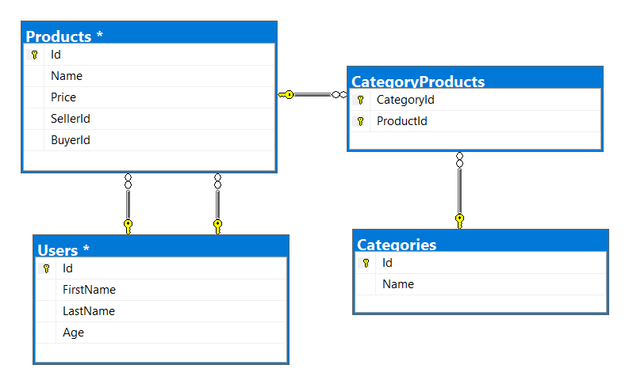

# Exercises: XML Processing

This document defines the **exercise assignments** for the ["Databases
Advanced – EF Core" course @ Software
University](https://softuni.bg/trainings/1741/databases-advanced-entity-framework-october-2017).

# Product Shop Database

A products shop holds **users**, **products** and **categories** for the
products. Users can **sell** and **buy** products.

  - Users have an **id**, **first** **name** (optional) and **last**
    **name** and **age** (optional).

  - Products have an **id**, **nam**, **price**, **buyerId** (optional)
    and **sellerId** as IDs of users.

  - Categories have an **id** and **name**.

  - Using Entity Framework Code First create a database following the
    above description.

  - **Users** should have **many products sold** and **many products
    bought**.

  - **Products** should have **many categories**

  - **Categories** should have **many products**

  - **CategoryProducts** should **map products** and **categories**

public class StartUp

{

public static void Main()

{

Mapper.Initialize(cfg =\> cfg.AddProfile\<ProductShopProfile\>());

using (var db = new ProductShopContext())

{

//var inputXml = File.ReadAllText(@"D:\\$$$ SOFTUNI $$$\\C\#\\C\#
DB\\Entity Framework Core\\09. XML PROCESSING\\ProductShop -
Skeleton\\ProductShop\\Datasets\\users.xml");

//var inputXml = File.ReadAllText(@"D:\\$$$ SOFTUNI $$$\\C\#\\C\#
DB\\Entity Framework Core\\09. XML PROCESSING\\ProductShop -
Skeleton\\ProductShop\\Datasets\\products.xml");

//var inputXml = File.ReadAllText(@"D:\\$$$ SOFTUNI $$$\\C\#\\C\#
DB\\Entity Framework Core\\09. XML PROCESSING\\ProductShop -
Skeleton\\ProductShop\\Datasets\\categories.xml");

//var inputXml = File.ReadAllText(@"D:\\$$$ SOFTUNI $$$\\C\#\\C\#
DB\\Entity Framework Core\\09. XML PROCESSING\\ProductShop -
Skeleton\\ProductShop\\Datasets\\categories-products.xml");

var result = GetUsersWithProducts(db);

Console.WriteLine(result);

}

}

## Import Data

### Import Users

**NOTE**: You will need method public static string
ImportUsers(ProductShopContext context, string inputXml) and public
StartUp class.

Import the users from the provided file **users.xml**.

Your method should return string with message $"Successfully imported
{Users.Count}";

using System.Xml.Serialization;

namespace ProductShop.Dtos.Import

{

\[XmlType("User")\]

public class ImortUsersDto

{

\[XmlElement("firstName")\]

public string FirstName { get; set; }

\[XmlElement("lastName")\]

public string LastName { get; set; }

\[XmlElement("age")\]

public int? Age { get; set; }

}

}

public static string ImportUsers(ProductShopContext context, string
inputXml)

{

var xmlSerializer = new XmlSerializer(typeof(ImortUsersDto\[\]),

new XmlRootAttribute("Users"));

ImortUsersDto\[\] userDtos;

using (var reader = new StringReader(inputXml))

{

userDtos = (ImortUsersDto\[\])xmlSerializer.Deserialize(reader);

}

var users = Mapper.Map\<User\[\]\>(userDtos);

context.Users.AddRange(users);

context.SaveChanges();

return $"Successfully imported {users.Length}";

}

### Import Products

**NOTE**: You will need method public static string
ImportProducts(ProductShopContext context, string inputXml) and public
StartUp class.

Import the products from the provided file **products.xml**.

Your method should return string with message $"Successfully imported
{Products.Count}";

using System.Xml.Serialization;

namespace ProductShop.Dtos.Import

{

\[XmlType("Product")\]

public class ImportProductsDto

{

\[XmlElement("name")\]

public string Name { get; set; }

\[XmlElement("price")\]

public decimal Price { get; set; }

\[XmlElement("sellerId")\]

public int SellerId { get; set; }

\[XmlElement("buyerId")\]

public int? BuyerId { get; set; }

}

}

public static string ImportProducts(ProductShopContext context, string
inputXml)

{

var xmlSerializer = new XmlSerializer(typeof(ImportProductsDto\[\]),

new XmlRootAttribute("Products"));

ImportProductsDto\[\] productsDtos;

using (var reader = new StringReader(inputXml))

{

productsDtos = (ImportProductsDto\[\])xmlSerializer.Deserialize(reader);

}

var products = Mapper.Map\<Product\[\]\>(productsDtos);

context.Products.AddRange(products);

context.SaveChanges();

return $"Successfully imported {products.Length}";

}

### Import Categories

**NOTE**: You will need method public static string
ImportCategories(ProductShopContext context, string inputXml) and public
StartUp class.

Import the categories from the provided file **categories.xml**.

Some of the names will be null, so you don’t have to add them in the
database. Just skip the record and continue.

Your method should return string with message $"Successfully imported
{Categories.Count}";

using System.Xml.Serialization;

namespace ProductShop.Dtos.Import

{

\[XmlType("Category")\]

public class ImportCategoriesDto

{

\[XmlElement("name")\]

public string Name { get; set; }

}

}

public static string ImportCategories(ProductShopContext context, string
inputXml)

{

var xmlSerializer = new XmlSerializer(typeof(ImportCategoriesDto\[\]),

new XmlRootAttribute("Categories"));

ImportCategoriesDto\[\] categoryDto;

using (var reader = new StringReader(inputXml))

{

categoryDto = ((ImportCategoriesDto\[\])xmlSerializer

.Deserialize(reader)).Where(x=\>x.Name \!= null).ToArray();

}

var categories = Mapper.Map\<Category\[\]\>(categoryDto);

context.Categories.AddRange(categories);

context.SaveChanges();

return $"Successfully imported {categories.Length}";

}

### Import Categories and Products

**NOTE**: You will need method public static string
ImportCategoryProducts(ProductShopContext context, string inputXml) and
public StartUp class.

Import the categories and products ids from the provided file
**categories-products.xml**. If provided category or product id, doesn’t
exists, skip the whole entry\!

Your method should return string with message $"Successfully imported
{CategoryProducts.Count}";

using System.Xml.Serialization;

namespace ProductShop.Dtos.Import

{

\[XmlType("CategoryProduct")\]

public class ImportProductCategoriesDto

{

\[XmlElement("CategoryId")\]

public int CategoryId { get; set; }

\[XmlElement("ProductId")\]

public int ProductId { get; set; }

}

}

public static string ImportCategoryProducts(ProductShopContext context,
string inputXml)

{

var xmlSerializer = new
XmlSerializer(typeof(ImportProductCategoriesDto\[\]),

new XmlRootAttribute("CategoryProducts"));

ImportProductCategoriesDto\[\] categoryProductsDto;

using (var reader = new StringReader(inputXml))

{

categoryProductsDto =
((ImportProductCategoriesDto\[\])xmlSerializer.Deserialize(reader))

.Where(x =\> context.Categories.Any(c =\> c.Id == x.CategoryId)

&& context.Products.Any(p=\>p.Id == x.ProductId))

.ToArray();

}

var categoryProduct =
Mapper.Map\<CategoryProduct\[\]\>(categoryProductsDto);

context.CategoryProducts.AddRange(categoryProduct);

context.SaveChanges();

return $"Successfully imported {categoryProduct.Length}";

}

## Query and Export Data

Write the below described queries and **export** the returned data to
the specified **format**. Make sure that Entity Framework generates only
a **single query** for each task.

### Products In Range

**NOTE**: You will need method public static string
GetProductsInRange(ProductShopContext context) and public StartUp class.

Get all products in a specified **price range** between 500 and 1000
(inclusive). Order them by price (from lowest to highest). Select only
the **product name**, **price** and the **full name** **of the buyer**.
Take top **10** records.

**Return** the list of suppliers **to XML** in the format provided
below.

using System.Xml.Serialization;

namespace ProductShop.Dtos.Export

{

\[XmlType("Product")\]

public class ExportProductInRangeDto

{

\[XmlElement("name")\]

public string Name { get; set; }

\[XmlElement("price")\]

public decimal Price { get; set; }

\[XmlElement("buyer")\]

public string BuyerName { get; set; }

}

}

public static string GetProductsInRange(ProductShopContext context)

{

var sb = new StringBuilder();

var products = context

.Products

.Where(p =\> p.Price \>= 500 && p.Price \<= 1000)

.Select(e =\> new ExportProductInRangeDto

{

Name = e.Name,

Price = e.Price,

BuyerName = e.Buyer.FirstName + " " + e.Buyer.LastName

})

.OrderBy(p =\> p.Price)

.Take(10)

.ToArray();

var xmlSerializar = new
XmlSerializer(typeof(ExportProductInRangeDto\[\]),

new XmlRootAttribute("Products"));

var namespaces = new XmlSerializerNamespaces();

namespaces.Add(string.Empty, string.Empty);

using (var writer = new StringWriter(sb))

{

xmlSerializar.Serialize(writer, products, namespaces);

}

return sb.ToString().TrimEnd();

}

<table>
<thead>
<tr class="header">
<th><strong>products-in-range.xml</strong></th>
</tr>
</thead>
<tbody>
<tr class="odd">
<td>
&lt;?xml version="1.0" encoding="utf-16"?&gt;

&lt;Products&gt;

 &lt;Product&gt;

&lt;name&gt;TRAMADOL HYDROCHLORIDE&lt;/name&gt;

&lt;price&gt;516.48&lt;/price&gt;

&lt;/Product&gt;

&lt;Product&gt;

&lt;name&gt;Allopurinol&lt;/name&gt;

&lt;price&gt;518.5&lt;/price&gt;

&lt;buyer&gt;Wallas Duffyn&lt;/buyer&gt;

&lt;/Product&gt;

&lt;Product&gt;

&lt;name&gt;Parsley&lt;/name&gt;

&lt;price&gt;519.06&lt;/price&gt;

&lt;buyer&gt;Brendin Predohl&lt;/buyer&gt;

&lt;/Product&gt;

…

&lt;/Products&gt;
</td>
</tr>
</tbody>
</table>

### Sold Products

**NOTE**: You will need method public static string
GetSoldProducts(ProductShopContext context) and public StartUp class.

Get all users who have **at least 1 sold item**. Order them by **last
name**, then by **first name**. Select the person's **first** and **last
name**. For each of the **sold products**, select the product's **name**
and **price**. Take top **5** records.

**Return** the list of suppliers **to XML** in the format provided
below.

using System.Xml.Serialization;

namespace ProductShop.Dtos.Export

{

\[XmlType("User")\]

public class ExportUserDto

{

\[XmlElement("firstName")\]

public string FirstName { get; set; }

\[XmlElement("lastName")\]

public string LastName { get; set; }

\[XmlArray("soldProducts")\]

public ExportProductDto\[\] SoldProducts { get; set; }

}

}

namespace ProductShop.Dtos.Export

{

using System.Xml.Serialization;

\[XmlType("Product")\]

public class ExportProductDto

{

\[XmlElement("name")\]

public string Name { get; set; }

\[XmlElement("price")\]

public decimal Price { get; set; }

}

}

public static string GetSoldProducts(ProductShopContext context)

{

var sb = new StringBuilder();

var users = context

.Users

.Where(x =\> x.ProductsSold.Count \>= 1)

.Select(x=\> new ExportUserDto

{

FirstName = x.FirstName,

LastName = x.LastName,

SoldProducts =x.ProductsSold.Select(p =\> new ExportProductDto

{

Name = p.Name,

Price = p.Price

})

.ToArray()

})

.OrderBy(x =\> x.LastName)

.ThenBy(x =\> x.FirstName)

.Take(5)

.ToArray();

var xmlSerializar = new XmlSerializer(typeof(ExportUserDto\[\]),

new XmlRootAttribute("Users"));

var namespaces = new XmlSerializerNamespaces();

namespaces.Add(string.Empty, string.Empty);

using (var writer = new StringWriter(sb))

{

xmlSerializar.Serialize(writer, users, namespaces);

}

return sb.ToString().TrimEnd();

}

<table>
<thead>
<tr class="header">
<th><strong>users-sold-products.xml</strong></th>
</tr>
</thead>
<tbody>
<tr class="odd">
<td>
&lt;?xml version="1.0" encoding="utf-16"?&gt;

&lt;Users&gt;

 &lt;User&gt;

&lt;firstName&gt;Almire&lt;/firstName&gt;

&lt;lastName&gt;Ainslee&lt;/lastName&gt;

&lt;soldProducts&gt;

&lt;Product&gt;

&lt;name&gt;olio activ mouthwash&lt;/name&gt;

&lt;price&gt;206.06&lt;/price&gt;

&lt;/Product&gt;

&lt;Product&gt;

&lt;name&gt;Acnezzol Base&lt;/name&gt;

&lt;price&gt;710.6&lt;/price&gt;

&lt;/Product&gt;

&lt;Product&gt;

&lt;name&gt;ENALAPRIL MALEATE&lt;/name&gt;

&lt;price&gt;210.42&lt;/price&gt;

&lt;/Product&gt;

&lt;/soldProducts&gt;

&lt;/User&gt;...

&lt;/Users&gt;
</td>
</tr>
</tbody>
</table>

### Categories By Products Count

**NOTE**: You will need method public static string
GetCategoriesByProductsCount(ProductShopContext context) and public
StartUp class.

Get **all** **categories**. For each category select its **name**, the
**number of products**, the **average price of those products** and the
**total revenue** (total price sum) of those products (regardless if
they have a buyer or not). Order them by the **number of products**
(**descending**) then by total revenue.

**Return** the list of suppliers **to XML** in the format provided
below.

using System.Xml.Serialization;

namespace ProductShop.Dtos.Export

{

\[XmlType("Category")\]

public class ExportCategoryProductsDto

{

\[XmlElement("name")\]

public string Name { get; set; }

\[XmlElement("count")\]

public int Count { get; set; }

\[XmlElement("averagePrice")\]

public decimal AveragePrice { get; set; }

\[XmlElement("totalRevenue")\]

public decimal TotalRevenue { get; set; }

}

}

public static string GetCategoriesByProductsCount(ProductShopContext
context)

{

var sb = new StringBuilder();

var categories = context

.Categories

.Select(c =\> new ExportCategoryProductsDto

{

Name = c.Name,

Count = c.CategoryProducts.Count,

AveragePrice = c.CategoryProducts.Average(p =\> p.Product.Price),

TotalRevenue = c.CategoryProducts.Sum(p =\> p.Product.Price)

})

.OrderByDescending(c =\> c.Count)

.ThenBy(c=\>c.TotalRevenue)

.ToArray();

var xmlSerializar = new
XmlSerializer(typeof(ExportCategoryProductsDto\[\]),

new XmlRootAttribute("Categories"));

var namespaces = new XmlSerializerNamespaces();

namespaces.Add(string.Empty, string.Empty);

using (var writer = new StringWriter(sb))

{

xmlSerializar.Serialize(writer, categories, namespaces);

}

return sb.ToString().TrimEnd();

}

<table>
<thead>
<tr class="header">
<th><strong>categories-by-products.xml</strong></th>
</tr>
</thead>
<tbody>
<tr class="odd">
<td>
&lt;?xml version="1.0" encoding="utf-16"?&gt;

&lt;Categories&gt;

&lt;Category&gt;

&lt;name&gt;Garden&lt;/name&gt;

&lt;count&gt;23&lt;/count&gt;

&lt;averagePrice&gt;709.94739130434782608695652174&lt;/averagePrice&gt;

&lt;totalRevenue&gt;16328.79&lt;/totalRevenue&gt;

&lt;/Category&gt;

&lt;Category&gt;

&lt;name&gt;Adult&lt;/name&gt;

&lt;count&gt;22&lt;/count&gt;

&lt;averagePrice&gt;704.41&lt;/averagePrice&gt;

&lt;totalRevenue&gt;15497.02&lt;/totalRevenue&gt;

&lt;/Category&gt;

...

&lt;/Categories&gt;
</td>
</tr>
</tbody>
</table>

### Users and Products

**NOTE**: You will need method public static string
GetUsersWithProducts(ProductShopContext context) and public StartUp
class.

Select users who have **at least 1 sold product**. Order them by the
**number of sold products** (from highest to lowest). Select only their
**first** and **last name**, **age, count** of sold products and for
each product - **name** and **price** sorted by price (descending). Take
top **10** records.

Follow the format below to better understand how to structure your data.

**Return** the list of suppliers **to XML** in the format provided
below.

using System.Xml.Serialization;

namespace ProductShop.Dtos.Export

{

public class ExportCountProductsAndUsersDto

{

\[XmlElement("count")\]

public int Count { get; set; }

\[XmlArray("users")\]

public ExportProductsAndUsersDto\[\] Users { get; set; }

}

}

using System.Xml.Serialization;

namespace ProductShop.Dtos.Export

{

\[XmlType("User")\]

public class ExportProductsAndUsersDto

{

\[XmlElement("firstName")\]

public string FirstName { get; set; }

\[XmlElement("lastName")\]

public string LastName { get; set; }

\[XmlElement("age")\]

public int? Age { get; set; }

\[XmlElement("SoldProducts")\]

public ExportSoldProductsDto SoldProducts { get; set; }

}

}

using System.Xml.Serialization;

namespace ProductShop.Dtos.Export

{

\[XmlType("SoldProducts")\]

public class ExportSoldProductsDto

{

\[XmlElement("count")\]

public int Count { get; set; }

\[XmlArray("products")\]

public ExportProductDto\[\] Products { get; set; }

}

}

namespace ProductShop.Dtos.Export

{

using System.Xml.Serialization;

\[XmlType("Product")\]

public class ExportProductDto

{

\[XmlElement("name")\]

public string Name { get; set; }

\[XmlElement("price")\]

public decimal Price { get; set; }

}

}

public static string GetUsersWithProducts(ProductShopContext context)

{

var sb = new StringBuilder();

var users = context.Users

.Where(x =\> x.ProductsSold.Any())

.OrderByDescending(p =\> p.ProductsSold.Count)

.Select(x =\> new ExportProductsAndUsersDto

{

FirstName = x.FirstName,

LastName = x.LastName,

Age = x.Age,

SoldProducts = new ExportSoldProductsDto

{

Count = x.ProductsSold.Count,

Products = x.ProductsSold.Select(p =\> new ExportProductDto

{

Name = p.Name,

Price = p.Price

})

.OrderByDescending(k =\> k.Price)

.ToArray()

}

})

.Take(10)

.ToArray();

var result = new ExportCountProductsAndUsersDto

{

Count = context.Users.Count(p =\> p.ProductsSold.Any()),

Users = users

};

var xmlSerializar = new
XmlSerializer(typeof(ExportCountProductsAndUsersDto),

new XmlRootAttribute("Users"));

var namespaces = new XmlSerializerNamespaces();

namespaces.Add(string.Empty, string.Empty);

using (var writer = new StringWriter(sb))

{

xmlSerializar.Serialize(writer, result, namespaces);

}

return sb.ToString().TrimEnd();

}

<table>
<thead>
<tr class="header">
<th><strong>users-and-products.xml</strong></th>
</tr>
</thead>
<tbody>
<tr class="odd">
<td>
&lt;Users&gt;

&lt;count&gt;54&lt;/count&gt;

&lt;users&gt;

&lt;User&gt;

&lt;firstName&gt;Cathee&lt;/firstName&gt;

&lt;lastName&gt;Rallings&lt;/lastName&gt;

&lt;age&gt;33&lt;/age&gt;

&lt;SoldProducts&gt;

&lt;count&gt;9&lt;/count&gt;

&lt;products&gt;

&lt;Product&gt;

&lt;name&gt;Fair Foundation SPF 15&lt;/name&gt;

&lt;price&gt;1394.24&lt;/price&gt;

&lt;/Product&gt;

&lt;Product&gt;

&lt;name&gt;IOPE RETIGEN MOISTURE TWIN CAKE NO.21&lt;/name&gt;

&lt;price&gt;1257.71&lt;/price&gt;

&lt;/Product&gt;

&lt;Product&gt;

&lt;name&gt;ESIKA&lt;/name&gt;

&lt;price&gt;879.37&lt;/price&gt;

&lt;/Product&gt;

&lt;Product&gt;

&lt;name&gt;allergy eye&lt;/name&gt;

&lt;price&gt;426.91&lt;/price&gt;

&lt;/Product&gt;

...

&lt;/Users&gt;
</td>
</tr>
</tbody>
</table>

# Car Dealer Database

## Setup Database

A car dealer needs information about cars, their parts, parts suppliers,
customers and sales.

  - **Cars** have **make, model**, travelled distance in kilometers

  - **Parts** have **name**, **price** and **quantity**

  - Part **supplier** have **name** and info whether he **uses imported
    parts**

  - **Customer** has **name**, **date of birth** and info whether he
    **is young driver**

  - **Sale** has **car**, **customer** and **discount percentage**

A **price of a car** is formed by **total price of its parts**.

  - A **car** has **many parts** and **one part** can be placed **in
    many cars**

  - **One supplier** can supply **many parts** and each **part** can be
    delivered by **only one supplier**

  - In **one sale**, only **one car** can be sold

  - **Each sale** has **one customer** and **a customer** can buy **many
    cars**

public class StartUp

{

public static void Main()

{

Mapper.Initialize(cfg =\> cfg.AddProfile\<CarDealerProfile\>());

using (var db = new CarDealerContext())

{

// var inputXml = File.ReadAllText(@"D:\\$$$ SOFTUNI $$$\\C\#\\C\#
DB\\Entity Framework Core\\09. XML PROCESSING\\CarDealer -
Skeleton\\CarDealer\\Datasets\\suppliers.xml");

//var inputXml = File.ReadAllText(@"D:\\$$$ SOFTUNI $$$\\C\#\\C\#
DB\\Entity Framework Core\\09. XML PROCESSING\\CarDealer -
Skeleton\\CarDealer\\Datasets\\parts.xml");

//var inputXml = File.ReadAllText(@"D:\\$$$ SOFTUNI $$$\\C\#\\C\#
DB\\Entity Framework Core\\09. XML PROCESSING\\CarDealer -
Skeleton\\CarDealer\\Datasets\\cars.xml");

//var inputXml = File.ReadAllText(@"D:\\$$$ SOFTUNI $$$\\C\#\\C\#
DB\\Entity Framework Core\\09. XML PROCESSING\\CarDealer -
Skeleton\\CarDealer\\Datasets\\customers.xml");

//var inputXml = File.ReadAllText(@"D:\\$$$ SOFTUNI $$$\\C\#\\C\#
DB\\Entity Framework Core\\09. XML PROCESSING\\CarDealer -
Skeleton\\CarDealer\\Datasets\\sales.xml");

var result = GetSalesWithAppliedDiscount(db);

Console.WriteLine(result);

}

}

## Import Data

Import data from the provided files (**suppliers.xml, parts.xml,
cars.xml, customers.xml**).

### Import Suppliers

**NOTE**: You will need method public static string
ImportSuppliers(CarDealerContext context, string inputXml) and public
StartUp class.

Import the suppliers from the provided file **suppliers.xml**.

Your method should return string with message $"Successfully imported
{suppliers.Count}";

using System.Xml.Serialization;

namespace CarDealer.Dtos.Import

{

\[XmlType("Supplier")\]

public class ImportSupplierDto

{

\[XmlElement("name")\]

public string Name { get; set; }

\[XmlElement("isImporter")\]

public bool IsImporter { get; set; }

}

}

public static string ImportSuppliers(CarDealerContext context, string
inputXml)

{

XmlSerializer xmlSerializer =

new XmlSerializer(typeof(ImportSupplierDto\[\]),

new XmlRootAttribute("Suppliers"));

ImportSupplierDto\[\] supplierDto;

using (var reader = new StringReader(inputXml))

{

supplierDto = (ImportSupplierDto\[\])xmlSerializer.Deserialize(reader);

}

var suppliers = Mapper.Map\<Supplier\[\]\>(supplierDto);

context.Suppliers.AddRange(suppliers);

context.SaveChanges();

return $"Successfully imported {suppliers.Length}";

}

### Import Parts

**NOTE**: You will need method public static string
ImportParts(CarDealerContext context, string inputXml) and public
StartUp class.

Import the parts from the provided file **parts.xml**. If the supplierId
doesn’t exists, skip the record.

Your method should return string with message $"Successfully imported
{parts.Count}";

using System.Xml.Serialization;

namespace CarDealer.Dtos.Import

{

\[XmlType("Part")\]

public class ImportPartDto

{

\[XmlElement("name")\]

public string Name { get; set; }

\[XmlElement("price")\]

public decimal Price { get; set; }

\[XmlElement("quantity")\]

public int Quantity { get; set; }

\[XmlElement("supplierId")\]

public int SupplierId { get; set; }

}

}

public static string ImportParts(CarDealerContext context, string
inputXml)

{

XmlSerializer xmlSerializer =

new XmlSerializer(typeof(ImportPartDto\[\]),

new XmlRootAttribute("Parts"));

ImportPartDto\[\] partDtos;

using (var reader = new StringReader(inputXml))

{

partDtos = ((ImportPartDto\[\])xmlSerializer

.Deserialize(reader))

.Where(p =\> context.Suppliers.Any(x =\> x.Id == p.SupplierId))

.ToArray();

}

var parts = Mapper.Map\<Part\[\]\>(partDtos);

context.Parts.AddRange(parts);

context.SaveChanges();

return $"Successfully imported {parts.Length}";

}

### Import Cars

**NOTE**: You will need method public static string
ImportCars(CarDealerContext context, string inputXml) and public StartUp
class.

Import the cars from the provided file **cars.xml**. Select unique car
part ids. If the part id doesn’t exists, skip the part record.

Your method should return string with message $"Successfully imported
{cars.Count}";

using System.Xml.Serialization;

namespace CarDealer.Dtos.Import

{

\[XmlType("Car")\]

public class ImportCarDto

{

\[XmlElement("make")\]

public string Make { get; set; }

\[XmlElement("model")\]

public string Model { get; set; }

\[XmlElement("TraveledDistance")\]

public long TravelledDistance { get; set; }

\[XmlArray("parts")\]

public ImportPartCarDto\[\] Parts { get; set; }

}

}

using System.Xml.Serialization;

namespace CarDealer.Dtos.Import

{

\[XmlType("partId")\]

public class ImportPartCarDto

{

\[XmlAttribute("id")\]

public int Id { get; set; }

}

}

public static string ImportCars(CarDealerContext context, string
inputXml)

{

var xmlSerializer = new XmlSerializer(typeof(ImportCarDto\[\]),

new XmlRootAttribute("Cars"));

ImportCarDto\[\] carDtos;

using(var reader = new StringReader(inputXml))

{

carDtos = ((ImportCarDto\[\])xmlSerializer.Deserialize(reader));

}

var cars = new List\<Car\>();

var partCars = new List\<PartCar\>();

foreach(var carDto in carDtos)

{

var car = new Car()

{

Make = carDto.Make,

Model = carDto.Model,

TravelledDistance = carDto.TravelledDistance

};

var parts = carDto

.Parts

.Where(c=\> context.Parts.Any(p=\>p.Id == c.Id))

.Select(p =\> p.Id)

.Distinct();

foreach (var partId in parts)

{

var partCar = new PartCar()

{

PartId = partId,

Car = car

};

partCars.Add(partCar);

}

cars.Add(car);

}

context.Cars.AddRange(cars);

context.PartCars.AddRange(partCars);

context.SaveChanges();

return $"Successfully imported {cars.Count}";

}

### Import Customers

**NOTE**: You will need method public static string
ImportCustomers(CarDealerContext context, string inputXml) and public
StartUp class.

Import the customers from the provided file **customers.xml**.

Your method should return string with message $"Successfully imported
{customers.Count}";

using System;

using System.Xml.Serialization;

namespace CarDealer.Dtos.Import

{

\[XmlType("Customer")\]

public class ImportCustomerDto

{

\[XmlElement("name")\]

public string Name { get; set; }

\[XmlElement("birthDate")\]

public DateTime BirthDate { get; set; }

\[XmlElement("isYoungDriver")\]

public bool IsYoungDriver { get; set; }

}

}

public static string ImportCustomers(CarDealerContext context, string
inputXml)

{

var xmlSerializer = new XmlSerializer(typeof(ImportCustomerDto\[\]),

new XmlRootAttribute("Customers"));

ImportCustomerDto\[\] importCustomerDtos;

using(var reader = new StringReader(inputXml))

{

importCustomerDtos =
(ImportCustomerDto\[\])xmlSerializer.Deserialize(reader);

}

var customers = Mapper.Map\<Customer\[\]\>(importCustomerDtos);

context.Customers.AddRange(customers);

context.SaveChanges();

return $"Successfully imported {customers.Length}";

}

### Import Sales

**NOTE**: You will need method public static string
ImportSales(CarDealerContext context, string inputXml) and public
StartUp class.

Import the sales from the provided file **sales.xml**. If car doesn’t
exists, skip whole entity.

Your method should return string with message $"Successfully imported
{sales.Count}";

using System.Xml.Serialization;

namespace CarDealer.Dtos.Import

{

\[XmlType("Sale")\]

public class ImportSalesDto

{

\[XmlElement("discount")\]

public decimal Discount { get; set; }

\[XmlElement("carId")\]

public int CarId { get; set; }

\[XmlElement("customerId")\]

public int CustomerId { get; set; }

}

}

public static string ImportSales(CarDealerContext context, string
inputXml)

{

var xmlSerializer = new XmlSerializer(typeof(ImportSalesDto\[\]),

new XmlRootAttribute("Sales"));

ImportSalesDto\[\] salesDtos;

using(var reader = new StringReader(inputXml))

{

salesDtos = ((ImportSalesDto\[\])xmlSerializer

.Deserialize(reader))

.Where(x=\>context.Cars.Any(c=\>c.Id == x.CarId))

.ToArray();

}

var sales = Mapper.Map\<Sale\[\]\>(salesDtos);

context.Sales.AddRange(sales);

context.SaveChanges();

return $"Successfully imported {sales.Length}";

}

## Query and Export Data

Write the below described queries and **export** the returned data to
the specified **format**. Make sure that Entity Framework generates only
a **single query** for each task.

### Cars With Distance

**NOTE**: You will need method public static string
GetCarsWithDistance(CarDealerContext context) and public StartUp class.

Get all **cars** with distance more than 2,000,000. Order them by make,
then by model alphabetically. Take top 10 records.

**Return** the list of suppliers **to XML** in the format provided
below.

using System.Xml.Serialization;

namespace CarDealer.Dtos.Export

{

\[XmlType("car")\]

public class ExportCarsWithDistanceDto

{

\[XmlElement("make")\]

public string Make { get; set; }

\[XmlElement("model")\]

public string Model { get; set; }

\[XmlElement("travelled-distance")\]

public long TravelledDistance { get; set; }

}

}

public static string GetCarsWithDistance(CarDealerContext context)

{

var sb = new StringBuilder();

var carDtos = context.Cars

.Where(c =\> c.TravelledDistance \> 2000000)

.Select(c =\> new ExportCarsWithDistanceDto

{

Make = c.Make,

Model = c.Model,

TravelledDistance = c.TravelledDistance

})

.OrderBy(c =\> c.Make)

.ThenBy(c =\> c.Model)

.Take(10)

.ToArray();

var xmlSerializar = new
XmlSerializer(typeof(ExportCarsWithDistanceDto\[\]),

new XmlRootAttribute("cars"));

var namespaces = new XmlSerializerNamespaces();

namespaces.Add(string.Empty, string.Empty);

using(var writer = new StringWriter(sb))

{

xmlSerializar.Serialize(writer, carDtos, namespaces);

}

return sb.ToString().TrimEnd();

}

<table>
<thead>
<tr class="header">
<th><strong>cars.xml</strong></th>
</tr>
</thead>
<tbody>
<tr class="odd">
<td>
&lt;?xml version="1.0" encoding="utf-16"?&gt;

&lt;cars&gt;

&lt;car&gt;

&lt;make&gt;BMW&lt;/make&gt;

&lt;model&gt;1M Coupe&lt;/model&gt;

&lt;travelled-distance&gt;39826890&lt;/travelled-distance&gt;

&lt;/car&gt;

&lt;car&gt;

&lt;make&gt;BMW&lt;/make&gt;

&lt;model&gt;E67&lt;/model&gt;

&lt;travelled-distance&gt;476830509&lt;/travelled-distance&gt;

&lt;/car&gt;

&lt;car&gt;

&lt;make&gt;BMW&lt;/make&gt;

&lt;model&gt;E88&lt;/model&gt;

&lt;travelled-distance&gt;27453411&lt;/travelled-distance&gt;

&lt;/car&gt;

...

&lt;/cars&gt;
</td>
</tr>
</tbody>
</table>

### Cars from make BMW

**NOTE**: You will need method public static string
GetCarsFromMakeBmw(CarDealerContext context) and public StartUp class.

Get all **cars** from make **BMW** and **order them by model
alphabetically** and by **travelled distance descending**.

**Return** the list of suppliers **to XML** in the format provided
below.

using System.Xml.Serialization;

namespace CarDealer.Dtos.Export

{

\[XmlType("car")\]

public class ExportCarsMakeBMW

{

\[XmlAttribute("id")\]

public int Id { get; set; }

\[XmlAttribute("model")\]

public string Model { get; set; }

\[XmlAttribute("travelled-distance")\]

public long TravelledDistance { get; set; }

}

}

public static string GetCarsFromMakeBmw(CarDealerContext context)

{

var sb = new StringBuilder();

var cars = context

.Cars

.Where(c =\> c.Make == "BMW")

.OrderBy(c =\> c.Model)

.ThenByDescending(c =\> c.TravelledDistance)

.ProjectTo\<ExportCarsMakeBMW\>()

.ToArray();

var xmlSerializer = new XmlSerializer(typeof(ExportCarsMakeBMW\[\]),

new XmlRootAttribute("cars"));

var namespaces = new XmlSerializerNamespaces();

namespaces.Add("", "");

using(var writer = new StringWriter(sb))

{

xmlSerializer.Serialize(writer, cars, namespaces);

}

return sb.ToString().TrimEnd();

}

<table>
<thead>
<tr class="header">
<th><strong>bmw-cars.xml</strong></th>
</tr>
</thead>
<tbody>
<tr class="odd">
<td>
&lt;cars&gt;

&lt;car id="7" model="1M Coupe" travelled-distance="39826890" /&gt;

&lt;car id="16" model="E67" travelled-distance="476830509" /&gt;

&lt;car id="5" model="E88" travelled-distance="27453411" /&gt;

...

&lt;/cars&gt;
</td>
</tr>
</tbody>
</table>

### Local Suppliers

**NOTE**: You will need method public static string
GetLocalSuppliers(CarDealerContext context) and public StartUp class.

Get all **suppliers** that **do not import parts from abroad**. Get
their **id**, **name** and **the number of parts they can offer to
supply**.

**Return** the list of suppliers **to XML** in the format provided
below.

using System.Xml.Serialization;

namespace CarDealer.Dtos.Export

{

\[XmlType("suplier")\]

public class ExportLocalSuppliersDto

{

\[XmlAttribute("id")\]

public int Id { get; set; }

\[XmlAttribute("name")\]

public string Name { get; set; }

\[XmlAttribute("parts-count")\]

public int PartsCount { get; set; }

}

}

public static string GetLocalSuppliers(CarDealerContext context)

{

StringBuilder stringBuilder = new StringBuilder();

var suppliers = context

.Suppliers

.Where(s =\> \!s.IsImporter)

.ProjectTo\<ExportLocalSuppliersDto\>()

.ToArray();

var xmlSerializar = new
XmlSerializer(typeof(ExportLocalSuppliersDto\[\]),

new XmlRootAttribute("suppliers"));

var namespaces = new XmlSerializerNamespaces();

namespaces.Add("", "");

using (var writer = new StringWriter(stringBuilder))

{

xmlSerializar.Serialize(writer, suppliers, namespaces);

}

return stringBuilder.ToString().TrimEnd();

}

<table>
<thead>
<tr class="header">
<th><strong>local-suppliers.xml</strong></th>
</tr>
</thead>
<tbody>
<tr class="odd">
<td>
&lt;?xml version="1.0" encoding="utf-16"?&gt;

&lt;suppliers&gt;

&lt;suplier id="2" name="VF Corporation" parts-count="3" /&gt;

&lt;suplier id="5" name="Saks Inc" parts-count="2" /&gt;

...

&lt;/suppliers&gt;
</td>
</tr>
</tbody>
</table>

### Cars with Their List of Parts

**NOTE**: You will need method public static string
GetCarsWithTheirListOfParts(CarDealerContext context) and public StartUp
class.

Get all **cars along with their list of parts**. For the **car** get
only **make, model** and **travelled distance** and for the **parts**
get only **name** and **price** and sort all parts by price
(descending). Sort all cars by travelled distance (**descending**) then
by model (**ascending**). Select top 5 records.

**Return** the list of suppliers **to XML** in the format provided
below.

public static string GetCarsWithTheirListOfParts(CarDealerContext
context)

{

var stringBuilder = new StringBuilder();

var xmlSerializer =

new XmlSerializer(typeof(ExportCarDto\[\]),

new XmlRootAttribute("cars"));

var cars = context

.Cars

.OrderByDescending(x =\> x.TravelledDistance)

.ThenBy(x =\> x.Model)

.Take(5)

.ProjectTo\<ExportCarDto\>()

.ToArray();

foreach (var car in cars)

{

car.Parts = car.Parts

.OrderByDescending(p =\> p.Price)

.ToArray();

}

var namespaces = new XmlSerializerNamespaces();

namespaces.Add("", "");

using (var writer = new StringWriter(stringBuilder))

{

xmlSerializer.Serialize(writer, cars, namespaces);

}

return stringBuilder.ToString().TrimEnd();

}

<table>
<thead>
<tr class="header">
<th><strong>cars-and-parts.xml</strong></th>
</tr>
</thead>
<tbody>
<tr class="odd">
<td>
&lt;?xml version="1.0" encoding="utf-16"?&gt;

&lt;cars&gt;

&lt;car make="Opel" model="Astra" travelled-distance="516628215"&gt;

&lt;parts&gt;

&lt;part name="Master cylinder" price="130.99" /&gt;

&lt;part name="Water tank" price="100.99" /&gt;

&lt;part name="Front Right Side Inner door handle" price="100.99" /&gt;

&lt;/parts&gt;

&lt;/car&gt;

...

&lt;/cars&gt;
</td>
</tr>
</tbody>
</table>

### Total Sales by Customer

**NOTE**: You will need method public static string
GetTotalSalesByCustomer(CarDealerContext context) and public StartUp
class.

Get all **customers** that have bought **at least 1 car** and get their
**names**, **bought cars** **count** and **total spent money** on cars.
**Order** the result list **by total spent money descending**.

**Return** the list of suppliers **to XML** in the format provided
below.

using CarDealer.Models;

using System.Collections.Generic;

using System.Xml.Serialization;

namespace CarDealer.Dtos.Export

{

\[XmlType("customer")\]

public class ExportCustomersByMoneySpent

{

\[XmlAttribute("full-name")\]

public string Name { get; set; }

\[XmlAttribute("bought-cars")\]

public int BoughtCars { get; set; }

\[XmlAttribute("spent-money")\]

public decimal SpentMoney { get; set; }

}

}

public static string GetTotalSalesByCustomer(CarDealerContext context)

{

var sb = new StringBuilder();

var customers = context

.Customers

.Where(e =\> e.Sales.Count \>= 1)

.Select(e =\> new ExportCustomersByMoneySpent

{

Name = e.Name,

BoughtCars = e.Sales.Count,

SpentMoney = e.Sales.Sum(c =\> c.Car.PartCars.Sum(x =\> x.Part.Price))

})

.OrderByDescending(e =\> e.SpentMoney)

.ToArray();

var xmlSerializer =

new XmlSerializer(typeof(ExportCustomersByMoneySpent\[\]),

new XmlRootAttribute("customers"));

var namespaces = new XmlSerializerNamespaces();

namespaces.Add("", "");

using (var writer = new StringWriter(sb))

{

xmlSerializer.Serialize(writer, customers, namespaces);

}

return sb.ToString().TrimEnd();

}

<table>
<thead>
<tr class="header">
<th><strong>customers-total-sales.xml</strong></th>
</tr>
</thead>
<tbody>
<tr class="odd">
<td>
&lt;?xml version="1.0" encoding="utf-16"?&gt;

&lt;customers&gt;

&lt;customer full-name="Taina Achenbach" bought-cars="1" spent-money="5588.17" /&gt;

&lt;customer full-name="Johnette Derryberry" bought-cars="1" spent-money="2694.84" /&gt;

&lt;customer full-name="Jimmy Grossi" bought-cars="1" spent-money="2366.38" /&gt;

...

&lt;/customers&gt;
</td>
</tr>
</tbody>
</table>

### Sales with Applied Discount

**NOTE**: You will need method public static string
GetSalesWithAppliedDiscount(CarDealerContext context) and public StartUp
class.

Get all **sales** with information about the **car**, **customer** and
**price** of the sale **with and without discount**.

**Return** the list of suppliers **to XML** in the format provided
below.

using System.Xml.Serialization;

namespace CarDealer.Dtos.Export

{

\[XmlType("car")\]

public class ExportCarDto

{

\[XmlAttribute("make")\]

public string Make { get; set; }

\[XmlAttribute("model")\]

public string Model { get; set; }

\[XmlAttribute("travelled-distance")\]

public long TravelledDistance { get; set; }

\[XmlArray("parts")\]

public ExportCarPartsDto\[\] Parts { get; set; }

}

}

using System.Xml.Serialization;

namespace CarDealer.Dtos.Export

{

\[XmlType("part")\]

public class ExportCarPartsDto

{

\[XmlAttribute("name")\]

public string Name { get; set; }

\[XmlAttribute("price")\]

public decimal Price { get; set; }

}

}

using System.Xml.Serialization;

namespace CarDealer.Dtos.Export

{

\[XmlType("sale")\]

public class ExportSalesWithAndWithoutDiscounts

{

\[XmlElement("car")\]

public ExportCarDto Car { get; set; }

\[XmlElement("discount")\]

public decimal Discount { get; set; }

\[XmlElement("customer-name")\]

public string CustomerName { get; set; }

\[XmlElement("price")\]

public decimal Price { get; set; }

\[XmlElement("price-with-discount")\]

public decimal PriceWithDiscount { get; set; }

}

}

public static string GetSalesWithAppliedDiscount(CarDealerContext
context)

{

var sb = new StringBuilder();

var sales = context

.Sales

.Select(e =\> new ExportSalesWithAndWithoutDiscounts

{

Car = new ExportCarDto

{

Make = e.Car.Make,

Model = e.Car.Model,

TravelledDistance = e.Car.TravelledDistance

},

Discount = e.Discount,

CustomerName = e.Customer.Name,

Price = e.Car.PartCars.Sum(pc =\> pc.Part.Price),

PriceWithDiscount = e.Car.PartCars.Sum(pc =\> pc.Part.Price) -
e.Car.PartCars.Sum(pc =\> pc.Part.Price) \* e.Discount / 100

})

.ToArray();

var xmlSerializer =

new XmlSerializer(typeof(ExportSalesWithAndWithoutDiscounts\[\]),

new XmlRootAttribute("sales"));

var namespaces = new XmlSerializerNamespaces();

namespaces.Add("", "");

using (var writer = new StringWriter(sb))

{

xmlSerializer.Serialize(writer, sales, namespaces);

}

return sb.ToString().TrimEnd();

}

<table>
<thead>
<tr class="header">
<th><strong>sales-discounts.xml</strong></th>
</tr>
</thead>
<tbody>
<tr class="odd">
<td>
&lt;?xml version="1.0" encoding="utf-16"?&gt;

&lt;sales&gt;

&lt;sale&gt;

&lt;car make="car" model="M5 F10" travelled-distance="435603343" /&gt;

&lt;discount&gt;30.00&lt;/discount&gt;

&lt;customer-name&gt;Hipolito Lamoreaux&lt;/customer-name&gt;

&lt;price&gt;707.97&lt;/price&gt;

&lt;price-with-discount&gt;495.58&lt;/price-with-discount&gt;

&lt;/sale&gt;

...

&lt;/sales&gt;
</td>
</tr>
</tbody>
</table>
