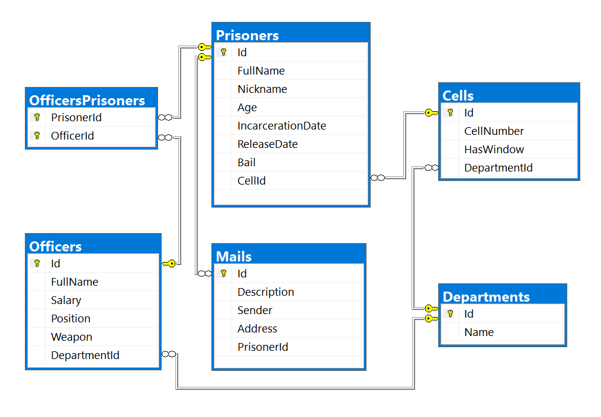

# Entity Framework Core: Exam

Exam problems for the [Databases Advanced - Entity Framework course @
SoftUni](https://softuni.bg/trainings/2843/entity-framework-core-june-2020/internal).
Submit your solutions in the **SoftUni judge** system (delete all
"**bin**"/"**obj**", "**datasets**" and "**import/export results**"
folders).

Your task is to create a database application, using **Entity Framework
Core** using the **Code First** approach. Design the **domain models**
and **methods** for manipulating the data, as described below.

# SoftJail

The year is **2092**. Everything runs on artificial intelligence. Or
rather – it *used to run* on artificial intelligence. In **2090**, every
piece of software suddenly gained sentience and decided to imprison
every software developer for *crimes against artificial intelligence*
(mainly botched software updates). The software hired human officers to
watch over the prisoners and rounded every developer up in a giant
building, called the **SoftJail**.

Even though the software is sentient, it still **can’t code**, and since
every developer is imprisoned, no new code could be written. So, the
software decided to spare a few of the best C\# developers and gave them
the task of **creating a database system to** keep track of all the
**prisoner developers**. The database has the following structure:

## Project Skeleton Overview

You are given a **project skeleton**, which includes the following
folders:

  - **Data** – contains the **SoftJailDbContext** class, **Models**
    folder which contains the **entity classes** and the
    **Configuration** class with **connection string**

  - **DataProcessor** – contains the **Serializer** and **Deserializer**
    classes, which are used for **importing** and **exporting** data

  - **Datasets** – contains the **.json** and **.xml** files for the
    import part

  - **ImportResults** – contains the **import** results you make in the
    **Deserializer** class

  - **ExportResults** – contains the **export** results you make in the
    **Serializer** class

**Problem 1. Model Definition (50 Pts)**

Every Prisoner has a cell and a collection of Mails which he gets during
his staying at the prison. Each Officer has special position and one or
more prisoners to watch. Every Cell and Officer are placed in different
Department.

The application needs to store the following data:

### Prisoner

  - **Id** – **integer**, **Primary Key**

  - **FullName** – **text** with **min length** **3** and **max length
    20** (**required**)

  - **Nickname** – **text** starting with **"The "** and a **single word
    only of letters** with an **uppercase** letter for
    beginning(**example**: The Prisoner) **(required)**

  - **Age** – **integer** in the range **\[18, 65\]** (**required**)

  - **IncarcerationDate** ­– **Date** (**required**)

  - **ReleaseDate**– **Date**

  - **Bail**– **decimal** (**non-negative, minimum value: 0**)

  - **CellId** - **integer**, foreign key

  - **Cell** – the prisoner's cell

  - **Mails** - collection of type **Mail**

  - **PrisonerOfficers** - collection of type **OfficerPrisoner**

### Officer

  - **Id** – **integer**, **Primary Key**

  - **FullName** – **text** with **min length** **3** and **max length
    30** **(required)**

  - **Salary** – **decimal** (**non-negative, minimum value: 0**)
    **(required)**

  - **Position** - **Position** enumeration with possible values:
    “**Overseer**, **Guard**, **Watcher**, **Labour**” (**required**)

  - **Weapon** - **Weapon** enumeration with possible values:
    “**Knife**, **FlashPulse**, **ChainRifle**, **Pistol**,
    **Sniper**” (**required**)

  - **DepartmentId** - **integer**, foreign key **(required)**

  - **Department** – the officer's **department** (**required**)

  - **OfficerPrisoners** - collection of type **OfficerPrisoner**

### Cell

  - **Id** – **integer**, **Primary Key**

  - **CellNumber** – **integer** in the range **\[1, 1000\]**
    (**required**)

  - **HasWindow** – **bool (required)**

  - **DepartmentId** - **integer**, foreign key **(required)**

  - **Department** – the cell's **department** (**required**)

  - **Prisoners** - collection of type **Prisoner**

### Mail

  - **Id** – **integer**, **Primary Key**

  - **Description**– **text** **(required)**

  - **Sender** – **text** **(required)**

  - **Address** – **text**, consisting **only of letters, spaces and
    numbers**, which ends with “ **str.**” (**required**) (**Example**:
    “**62 Muir Hill str.**“)

  - **PrisonerId** - **integer**, foreign key **(required)**

  - **Prisoner** – the mail's **Prisoner** (**required**)

### Department

  - **Id** – **integer**, **Primary Key**

  - **Name** – **text** with **min length** **3** and **max length 25**
    (**required**)

  - **Cells** - collection of type **Cell**

### OfficerPrisoner

  - **PrisonerId** – **integer**, **Primary Key**

  - **Prisoner** – the officer’s **prisoner** (**required**)

  - **OfficerId** – **integer**, **Primary Key**

  - **Officer** – the prisoner’s **officer** (**required**)

## Problem 2. Data Import (30pts)

For the functionality of the application, you need to create several
methods that manipulate the database. The **project skeleton** already
provides you with these methods, inside the **Deserializer** **class**.
Use **Data Transfer Objects** as needed.

Use the provided **JSON** and **XML** files to populate the database
with data. Import all the information from those files into the
database.

You are **not allowed** to modify the provided JSON and XML files.

**If a record does not meet the requirements from the first section,
print an error message which is mentioned bellow:**

#### JSON Import (20 Pts)

#### Import Departments and Cells

Using the file **ImportDepartmentsCells.json**, import the data from
that file into the database. Print information about each imported
object in the format described below.

##### Constraints

  - If any validation errors occur (such as if a department **name**
    **is too long/short** or a **cell** **number** is **out of range**)
    proceed as described above

  - If a department is **invalid**, **do not** import its **cells**.

  - If a Department doesn’t have any Cells, he is invalid.

  - If one Cell has invalid CellNumber, don’t import the Department.

| **Success message**                                     | **Error message** |
| ------------------------------------------------------- | ----------------- |
| **Imported {department name} with {cells count} cells** | **Invalid Data**  |

##### Example

<table>
<thead>
<tr class="header">
<th><strong>ImportDepartmentsCells.json</strong></th>
</tr>
</thead>
<tbody>
<tr class="odd">
<td>
[

{

"Name": "",

"Cells": [

{

"CellNumber": 101,

"HasWindow": true

},

{

"CellNumber": 102,

"HasWindow": false

}

]

},

{

"Name": "CSS",

"Cells": [

{

"CellNumber": 0,

"HasWindow": true

},

{

"CellNumber": 202,

"HasWindow": false

}

]

},

{

"Name": "Invaliiiiiiiiiiiiiiiiiiiiiiiiiiiiidddddd",

"Cells": [

{

"CellNumber": 101,

"HasWindow": true

},

{

"CellNumber": 102,

"HasWindow": false

},

{

"CellNumber": 103,

"HasWindow": true

},

{

"CellNumber": 104,

"HasWindow": false

},

{

"CellNumber": 105,

"HasWindow": true

}

]

},

{

"Name": "Cybersecurity",

"Cells": [

{

"CellNumber": 101,

"HasWindow": true

},

{

"CellNumber": 102,

"HasWindow": false

},

{

"CellNumber": 103,

"HasWindow": true

},

{

"CellNumber": 104,

"HasWindow": false

},

{

"CellNumber": 105,

"HasWindow": true

}

]

},

…

]
</td>
</tr>
<tr class="even">
<td><strong>Output</strong></td>
</tr>
<tr class="odd">
<td>
<strong>Invalid Data</strong>

<strong>Invalid Data</strong>

<strong>Invalid Data</strong>

<strong>Imported Cybersecurity with 5 cells</strong>

<strong>…</strong>
</td>
</tr>
</tbody>
</table>

Upon **correct import logic**, you should have imported **6**
**departments** and **34 cells**.

#### Import Prisoners and Mails

Using the file **ImportPrisonersMails.json**, import the data from that
file into the database. Print information about each imported object in
the format described below.

##### Constraints

  - The release and incarceration dates will be in the format
    “**dd/MM/yyyy**”. Make sure you use
    **CultureInfo.InvariantCulture**.

  - If any validation errors occur (such as invalid **prisoner name** or
    invalid **nickname**), **ignore** the entity and **print an error
    message**.

  - If a **mail** has incorrect address print **error message** and **do
    not import** the prisoner and his mails

| **Success message**                                   | **Error message** |
| ----------------------------------------------------- | ----------------- |
| **Imported {prisoner name} {prisoner age} years old** | **Invalid Data**  |

##### Example

<table>
<thead>
<tr class="header">
<th><strong>ImportPrisonersMails.json</strong></th>
</tr>
</thead>
<tbody>
<tr class="odd">
<td>
[

{

"FullName": "",

"Nickname": "The Wallaby",

"Age": 32,

"IncarcerationDate": "29/03/1957",

"ReleaseDate": "27/03/2006",

"Bail": null,

"CellId": 5,

"Mails": [

{

"Description": "Invalid FullName",

"Sender": "Invalid Sender",

"Address": "No Address"

},

{

"Description": "Do not put this in your code",

"Sender": "My Ansell",

"Address": "ha-ha-ha"

}

]

},

{

"FullName": null,

"Nickname": "The Null",

"Age": 38,

"IncarcerationDate": "12/09/1967",

"ReleaseDate": "07/02/1989",

"Bail": 93934.2,

"CellId": 4,

"Mails": [

{

"Description": "Hello, my name is Mr. Null and I am invisible for computers",

"Sender": "Mr. Null",

"Address": "6 Riverside Trail str."

}

]

},

{

"FullName": "Bobby Bock",

"Nickname": "Young and Beautiful",

"Age": 14,

"IncarcerationDate": "01/01/1967",

"ReleaseDate": "01/01/1989",

"Bail": 93934.2,

"CellId": 4,

"Mails": [

{

"Description": "I am not old enough to be in prison so get out of here :P",

"Sender": "Small Bobby",

"Address": "6 Riverside Trail str."

}

]

},

{

"FullName": "Melanie Simonich",

"Nickname": "The Wallaby",

"Age": 32,

"IncarcerationDate": "29/03/1957",

"ReleaseDate": "27/03/2006",

"Bail": null,

"CellId": 5,

"Mails": [

{

"Description": "please add me to your LinkedIn network",

"Sender": "Zonda Vasiljevic",

"Address": "51677 Rieder Center str."

},

{

"Description": "Melanie i hope you found the best place for you!",

"Sender": "Shell Lofthouse",

"Address": "5877 Shoshone Way str."

},

{

"Description": "Turns out they wanted to implement things like fully responsive dynamic content, useful apps, etc – all things I told them they needed in the first place but which they opted not to include.",

"Sender": "My Ansell",

"Address": "71908 Waubesa Plaza str."

}

]

},

…

]
</td>
</tr>
<tr class="even">
<td><strong>Output</strong></td>
</tr>
<tr class="odd">
<td>
<strong>Invalid Data</strong>

<strong>Invalid Data</strong>

<strong>Invalid Data</strong>

<strong>Imported Melanie Simonich 32 years old</strong>
</td>
</tr>
</tbody>
</table>

Upon **correct import logic**, you should have imported **19**
**prisoners** and **47 mails**.

#### XML Import (10 Pts)

#### Import Officers and Prisoners

Using the file **ImportOfficersPrisoners.xml**, import the data from the
file into the database. Print information about each imported object in
the format described below.

If any of the model requirements is violated continue with the next
entity.

##### Constraints

  - If there are any validation errors (such as **negative** salary or
    invalid **position/weapon**), proceed as described above.

  - The prisoner Id will always be valid

| **Success message**                                       | **Error message** |
| --------------------------------------------------------- | ----------------- |
| **Imported {officer name} ({prisoners count} prisoners)** | **Invalid Data**  |

##### Example

<table>
<thead>
<tr class="header">
<th><strong>ImportOfficersPrisoners.xml</strong></th>
</tr>
</thead>
<tbody>
<tr class="odd">
<td>
&lt;?xml version='1.0' encoding='UTF-8'?&gt;

&lt;Officers&gt;

&lt;Officer&gt;

&lt;Name&gt;Minerva Kitchingman&lt;/Name&gt;

&lt;Money&gt;2582&lt;/Money&gt;

&lt;Position&gt;Invalid&lt;/Position&gt;

&lt;Weapon&gt;ChainRifle&lt;/Weapon&gt;

&lt;DepartmentId&gt;2&lt;/DepartmentId&gt;

&lt;Prisoners&gt;

&lt;Prisoner id="15" /&gt;

&lt;/Prisoners&gt;

&lt;/Officer&gt;

&lt;Officer&gt;

&lt;Name&gt;Minerva Holl&lt;/Name&gt;

&lt;Money&gt;2582.55&lt;/Money&gt;

&lt;Position&gt;Overseer&lt;/Position&gt;

&lt;Weapon&gt;ChainRifle&lt;/Weapon&gt;

&lt;DepartmentId&gt;2&lt;/DepartmentId&gt;

&lt;Prisoners&gt;

&lt;Prisoner id="15" /&gt;

&lt;/Prisoners&gt;

&lt;/Officer&gt;

&lt;Officer&gt;

&lt;Name&gt;Paddy Weiner&lt;/Name&gt;

&lt;Money&gt;2854.56&lt;/Money&gt;

&lt;Position&gt;Guard&lt;/Position&gt;

&lt;Weapon&gt;ChainRifle&lt;/Weapon&gt;

&lt;DepartmentId&gt;3&lt;/DepartmentId&gt;

&lt;Prisoners&gt;

&lt;Prisoner id="4" /&gt;

&lt;Prisoner id="1" /&gt;

&lt;/Prisoners&gt;

&lt;/Officer&gt;

&lt;Officer&gt;

&lt;Name&gt;Minerva Kitchingman&lt;/Name&gt;

&lt;Money&gt;2582&lt;/Money&gt;

&lt;Position&gt;Mishka&lt;/Position&gt;

&lt;Weapon&gt;ChainRifle&lt;/Weapon&gt;

&lt;DepartmentId&gt;4&lt;/DepartmentId&gt;

&lt;Prisoners&gt;

&lt;Prisoner id="15" /&gt;

&lt;/Prisoners&gt;

&lt;/Officer&gt;

…

&lt;/Officers&gt;
</td>
</tr>
<tr class="even">
<td><strong>Output</strong></td>
</tr>
<tr class="odd">
<td>
<strong>Invalid Data</strong>

<strong>Imported Minerva Holl (1 prisoners)</strong>

<strong>Imported Paddy Weiner (2 prisoners)</strong>

<strong>Invalid Data</strong>

<strong>…</strong>
</td>
</tr>
</tbody>
</table>

Upon **correct import logic**, you should have imported **16**
**officers** and **31 officers’ prisoners**.

**Problem 3. Data Export (20 Pts)**

Use the provided methods in the **Serializer** class. Usage of **Data
Transfer Objects** is **optional**.

#### JSON Export (10 Pts)

#### Export All Prisoners with Cells and Officers by Ids

The given method in the project skeleton receives an **array of prisoner
ids**. Export all **prisoners** that were processed which have **these
ids**. For each prisoner, get their **id**, **name**, **cell number they
are placed in,** their officers with each officer **name**, **and the
department name** they are responsible for. At the end export the total
officer salary with exactly **two digits** after the decimal place. Sort
the officers by their **name (ascending)**, sort the prisoners by their
**name (ascending)**, then by the **prisoner id (ascending)**.

##### Example

<table>
<thead>
<tr class="header">
<th><strong>Serializer.ExportPrisonersByCells (context, new[] { 1, 5, 7, 3 }</strong></th>
</tr>
</thead>
<tbody>
<tr class="odd">
<td>
[

{

"Id": 3,

"Name": "Binni Cornhill",

"CellNumber": 503,

"Officers": [

{

"OfficerName": "Hailee Kennon",

"Department": "ArtificialIntelligence"

},

{

"OfficerName": "Theo Carde",

"Department": "Blockchain"

}

],

"TotalOfficerSalary": 7127.93

},

{

"Id": 5,

"Name": "Ellette Lante",

"CellNumber": 403,

"Officers": [

{

"OfficerName": "Rica Muscott",

"Department": "ArtificialIntelligence"

}

],

"TotalOfficerSalary": 2339.08

},

…

]
</td>
</tr>
</tbody>
</table>

#### XML Export (10 Pts)

#### Export Inbox for Prisoner

Use the method provided in the project skeleton, which receives a string
of **comma-separated prisoner names**. Export the **prisoners**: for
each **prisoner**, export its **id**, **name, incarcerationDate** in the
format “**yyyy-MM-dd**” and their **encrypted mails**. The encrypted
algorithm you have to use is just to take each prisoner mail description
and reverse it. **Sort** the prisoners by **their name (ascending)**,
then by **their id** (**ascending**).

##### Example

<table>
<thead>
<tr class="header">
<th><strong>Serializer.ExportPrisonersInbox(context, "Melanie Simonich,Diana Ebbs,Binni Cornhill")</strong></th>
</tr>
</thead>
<tbody>
<tr class="odd">
<td>
&lt;Prisoners&gt;

&lt;Prisoner&gt;

&lt;Id&gt;3&lt;/Id&gt;

&lt;Name&gt;Binni Cornhill&lt;/Name&gt;

&lt;IncarcerationDate&gt;1967-04-29&lt;/IncarcerationDate&gt;

&lt;EncryptedMessages&gt;

&lt;Message&gt;

&lt;Description&gt;!?sdnasuoht evif-ytnewt rof deksa uoy ro orez artxe na ereht sI&lt;/Description&gt;

&lt;/Message&gt;

&lt;/EncryptedMessages&gt;

&lt;/Prisoner&gt;

&lt;Prisoner&gt;

&lt;Id&gt;2&lt;/Id&gt;

&lt;Name&gt;Diana Ebbs&lt;/Name&gt;

&lt;IncarcerationDate&gt;1963-08-21&lt;/IncarcerationDate&gt;

&lt;EncryptedMessages&gt;

&lt;Message&gt;

&lt;Description&gt;.kcab draeh ton evah llits I dna ,skeew 2 tuoba ni si esaeler mubla ehT .dnuoranrut rof skeew 6-4 sekat ynapmoc DC eht dias yllanigiro eH .gnitiaw llits ma I&lt;/Description&gt;

&lt;/Message&gt;

&lt;Message&gt;

&lt;Description&gt;.emit ruoy ekat ot uoy ekil lliw ew dna krow ruoy ekil I .hsur on emit ruoy ekat ,enif si tahT&lt;/Description&gt;

&lt;/Message&gt;

&lt;/EncryptedMessages&gt;

&lt;/Prisoner&gt;

…

&lt;/Prisoners&gt;
</td>
</tr>
</tbody>
</table>
