# HTML-Basics-Lab

*In today's exercise, we will build a very simple page, in which we will
practice everything from the lesson learned about HTML lecture. We will
build it step by step following the instructions below.*

## Heading stage

First we need to create **three div** elements, each containing
initially one heading.  
Headings need to be: **List exercise, Table exercise and Forms
exercise**. (h1)

### Examples

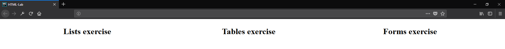

## Paragraph stage

Next step is to create our paragraphs. They will hold the information
about these three headings.

Under each heading add information about the current heading by putting
it in the **paragraph.** You can copy/paste the information about every
heading from the presentation.

**Also you need to place keywords (List, Table, Form) in span
elements\!**

If you stick to the presentation information.
Expected output should be like this one
below:

### Examples

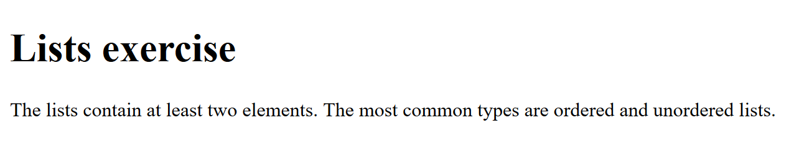

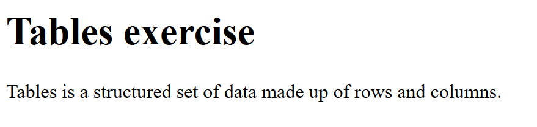

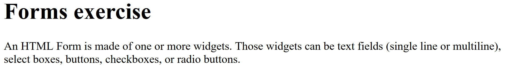

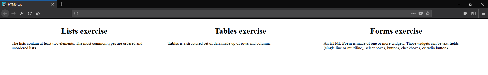

## List/Table/Form stage

Now it’s time to include **lists,** **table** and **form** to our HTML.
After each paragraph in each **div** element create one (h2) Heading
with text ‘Example’. Then we will make one example by following the (h1)
Heading:  
**List** **example** need to be ordered (ol) with at least 3 elements.
Like each of these elements, must have a unordered list (ul) nested to
in with at least 2 elements containing information about the current
order list item.  
**Table example** need to have 3 columns (Programming Language,
Developed by, First appeared):  
List at least two languages by filling out the table.

**Form example** needs to have: Username, password, email and age fields
+ submit button:

### Examples

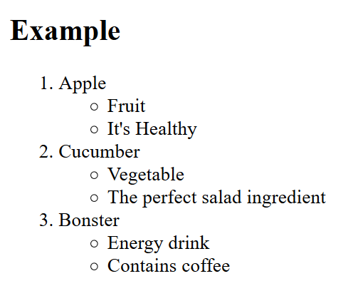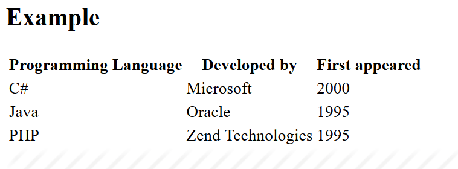

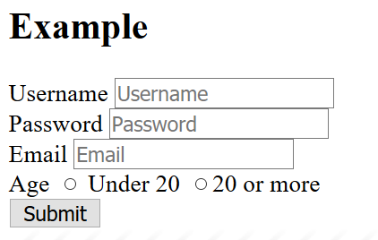

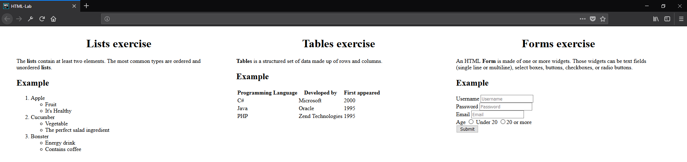

## Image stage

Try to find appropriate **icon(**picture**)** for every one heading and
insert it **after the examples.**  
See the example below:

### Examples

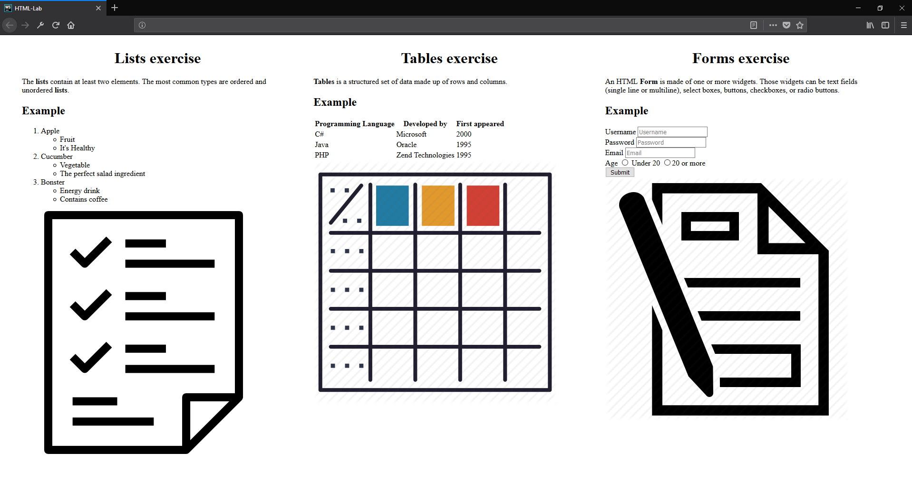

## Hyperlink stage

Our last stage is to include **hyperlinks**. You have to create a **new
paragraph** after the img tag with text:  
List/Table or Form icon link {HERE}. ‘HERE’ should be a **link** to the
photo we added before that.  
Тhe final result should be something similar to
the photo shown below:.

### Examples

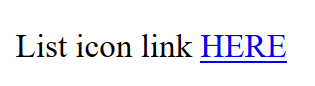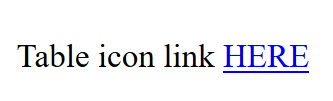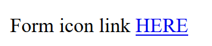

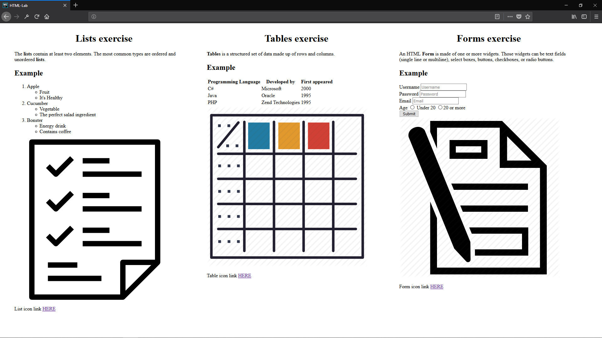

*And we are done\!*
