# CSS-Basics-Lab

*In today's exercise, we will build a very simple page in which we will
practice everything from the lesson learned about HTML lecture. We will
build it step by step following the instructions below.*

## Heading stage upgrade

Use your HTML code from the previous lecture

Make your headings (**h1**) **inline** with **color blue**

### Examples

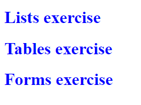

## Paragraph stage upgrade

Use your HTML code from the previous lecture

Make all **paragraphs** with **internal style** with **color
darkviolet**

### Examples

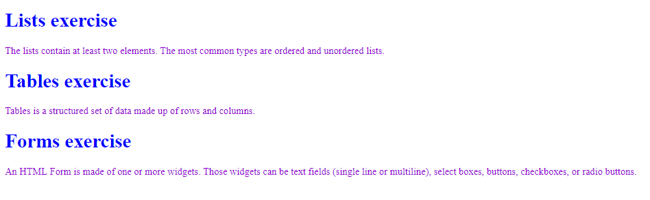

## **Code refactor**

Delete all the styles you have made

Open the styles from the HTML lecture

Link the CSS file into your HTML file

Add in the CSS file, the styles you have deleted

## List/Table/Form stage upgrade

Use your HTML code from the previous lecture

Make all list elements (**\<li\>**) with **solid border** in **yellow
color**

### Examples

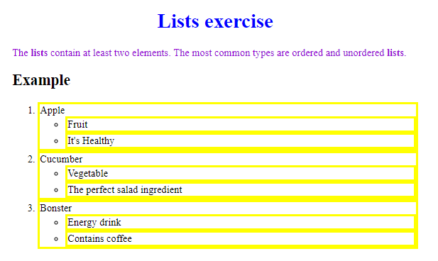

Use your HTML code from the previous lecture

Make all your **spans** with **dotted border** in **darkcyan color**

### Examples

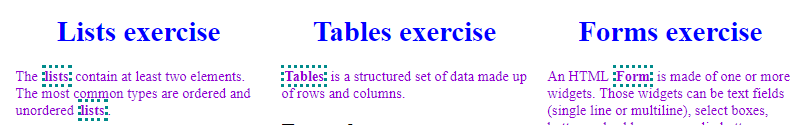

## Color Blocks

Use the following HTML

<table>
<tbody>
<tr class="odd">
<td>&lt;<strong>body</strong>&gt; 
&lt;<strong>div id="green"</strong>&gt;green block&lt;/<strong>div</strong>&gt; 
&lt;<strong>div id="blue"</strong>&gt;blue block&lt;/<strong>div</strong>&gt; 
&lt;<strong>div id="red"</strong>&gt;red block&lt;/<strong>div</strong>&gt; 
&lt;<strong>div id="purple"</strong>&gt;purple block&lt;/<strong>div</strong>&gt; 
&lt;<strong>div id="orange"</strong>&gt;orange block&lt;/<strong>div</strong>&gt; 
&lt;/<strong>body</strong>&gt;</td>
</tr>
</tbody>
</table>

### Examples

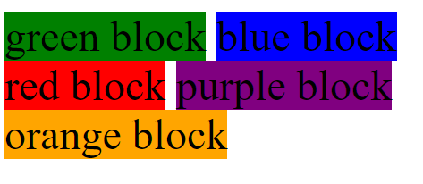

## **Color Blocks upgrade**

Use the HTML and CSS from the previous problem

Make all **\<div\> padding 20px** on each side, refresh the browser

Set **3px** **solid**, **border** with **yellow color**, refresh the
browser

Now set **margin** with **20px** for each side, refresh the browser

### Examples

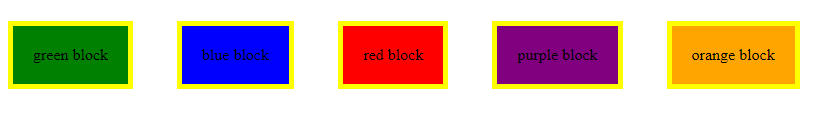

## **Cool Fonts**

Use the code from the previous problem

Go to <https://fonts.google.com/>

Pick a font of your preference

Click on the "+" in the top-right corner

Click on the new opened tab

Copy the link in your HTML \<head\>

Copy the font family in your \<div\>

### Examples

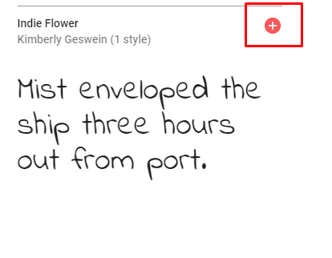

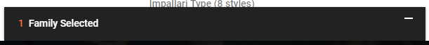

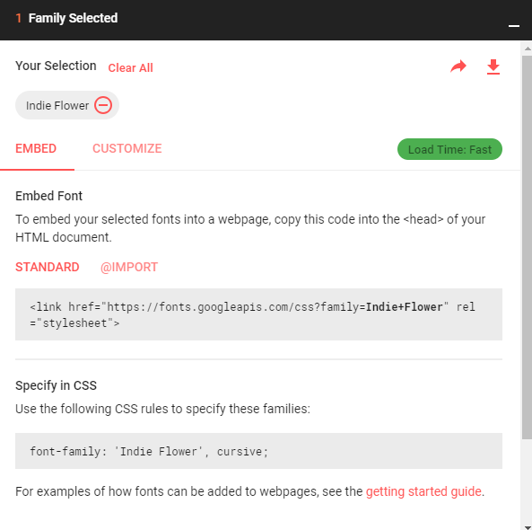

## **Cool Fonts upgrade**

Use the code from the previous problem

Set **large font-size**

Set **bold font-weight**

### Examples

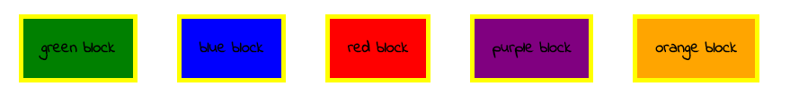

Use the code from the previous problem

In your **\<div\>** set **white color**

### Examples

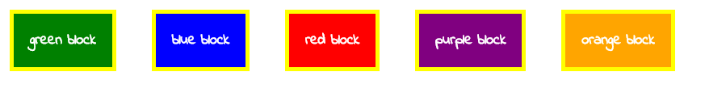

*And we are done\!*
