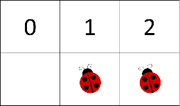

# Exercise: Arrays

Problems for exercise and homework for the ["C\# Fundamentals" course @
SoftUni](https://softuni.bg/modules/57/tech-module-4-0)  
You can check your solutions in
[Judge](https://judge.softuni.bg/Contests/1206)

## Train

You will be given a count of wagons in a train **n**. On the next **n**
lines you will receive how many people are going to get on each wagon.
At the end print the whole train and after that, on the next line, the
sum of the people in the train.

### Examples

<table>
<thead>
<tr class="header">
<th><strong>Input</strong></th>
<th><strong>Output</strong></th>
</tr>
</thead>
<tbody>
<tr class="odd">
<td>
3

13

24

8
</td>
<td>
<strong>13 24 8</strong>

<strong>45</strong>
</td>
</tr>
<tr class="even">
<td>
6

3

52

71

13

65

4
</td>
<td>
<strong>3 52 71 13 65 4</strong>

<strong>208</strong>
</td>
</tr>
<tr class="odd">
<td>
1

100
</td>
<td>
<strong>100</strong>

<strong>100</strong>
</td>
</tr>
</tbody>
</table>

## Common Elements

Write a program, which prints common elements in two arrays. You have to
compare the elements of the second array to the elements of the first.

### Examples

<table>
<thead>
<tr class="header">
<th><strong>Input</strong></th>
<th><strong>Output</strong></th>
</tr>
</thead>
<tbody>
<tr class="odd">
<td>
Hey hello 2 4

10 hey 4 hello
</td>
<td><strong>4 hello</strong></td>
</tr>
<tr class="even">
<td>
S of t un i

of i 10 un
</td>
<td>of i un</td>
</tr>
<tr class="odd">
<td>
i love to code

code i love to
</td>
<td>code i love to</td>
</tr>
</tbody>
</table>

## Zig-Zag Arrays

Write a program which creates 2 arrays. You will be given an integer
**n**. On the next **n** lines you get 2 integers. Form 2 arrays as
shown below.

### Examples

<table>
<thead>
<tr class="header">
<th><strong>Input</strong></th>
<th><strong>Output</strong></th>
</tr>
</thead>
<tbody>
<tr class="odd">
<td>
4

1 5

9 10

31 81

41 20
</td>
<td>
1 10 31 20

5 9 81 41
</td>
</tr>
<tr class="even">
<td>
2

80 23

31 19
</td>
<td>
80 19

23 31
</td>
</tr>
</tbody>
</table>

## Array Rotation

Write a program that receives an array and number of rotations you have
to perform (first element goes at the end) Print the resulting array.

### Examples

<table>
<thead>
<tr class="header">
<th><strong>Input</strong></th>
<th><strong>Output</strong></th>
</tr>
</thead>
<tbody>
<tr class="odd">
<td>
51 47 32 61 21

2
</td>
<td>32 61 21 51 47</td>
</tr>
<tr class="even">
<td>
32 21 61 1

4
</td>
<td>32 21 61 1</td>
</tr>
<tr class="odd">
<td>
2 4 15 31

5
</td>
<td>4 15 31 2</td>
</tr>
</tbody>
</table>

## Top Integers

Write a program to find all the top integers in an array. A top integer
is an integer which is **bigger** than all the elements to its right.

### Examples

| **Input**           | **Output** |
| ------------------- | ---------- |
| 1 4 3 2             | 4 3 2      |
| 14 24 3 19 15 17    | 24 19 17   |
| 27 19 42 2 13 45 48 | 48         |

## **Equal Sums**

Write a program that determines if there **exists an element in the
array** such that the **sum of the elements on its left** is **equal**
to the **sum of the elements on its right (there will never be more than
1 element like that)**. If there are **no elements to the left /
right**, their **sum is considered to be 0**. Print the **index** that
satisfies the required condition or **"no"** if there is no such index.

### Examples

<table>
<thead>
<tr class="header">
<th><strong>Input</strong></th>
<th><strong>Output</strong></th>
<th><strong>Comments</strong></th>
</tr>
</thead>
<tbody>
<tr class="odd">
<td><strong>1 2 3 3</strong></td>
<td><strong>2</strong></td>
<td>
<strong>At a[2] -&gt; left sum = 3, right sum = 3</strong>

<strong>a[0] + a[1] = a[3]</strong>
</td>
</tr>
<tr class="even">
<td><strong>1 2</strong></td>
<td><strong>no</strong></td>
<td>
<strong>At a[0] -&gt; left sum = 0, right sum = 2</strong>

<strong>At a[1] -&gt; left sum = 1, right sum = 0</strong>

<strong>No such index exists</strong>
</td>
</tr>
<tr class="odd">
<td><strong>1</strong></td>
<td><strong>0</strong></td>
<td><strong>At a[0] -&gt; left sum = 0, right sum = 0</strong></td>
</tr>
<tr class="even">
<td><strong>1 2 3</strong></td>
<td><strong>no</strong></td>
<td><strong>No such index exists</strong></td>
</tr>
<tr class="odd">
<td><strong>10 5 5 99 3 4 2 5 1 1 4</strong></td>
<td><strong>3</strong></td>
<td>
<strong>At a[3] -&gt; left sum = 20, right sum = 20</strong>

<strong>a[0] + a[1] + a[2] = a[4] + a[5] + a[6] + a[7] + a[8] + a[9] + a[10]</strong>
</td>
</tr>
</tbody>
</table>

## **Max Sequence of Equal Elements**

Write a program that finds the **longest sequence of equal elements** in
an array of integers. If several longest sequences exist, print the
leftmost one.

### Examples

| **Input**               | **Output**  |
| ----------------------- | ----------- |
| **2 1 1 2 3 3 2 2 2 1** | **2 2 2**   |
| **1 1 1 2 3 1 3 3**     | **1 1 1**   |
| **4 4 4 4**             | **4 4 4 4** |
| **0 1 1 5 2 2 6 3 3**   | **1 1**     |

## Magic Sum

Write a program, which prints all unique pairs in an array of integers
whose sum is equal to a given number.

### Examples

<table>
<thead>
<tr class="header">
<th><strong>Input</strong></th>
<th><strong>Output</strong></th>
</tr>
</thead>
<tbody>
<tr class="odd">
<td>
1 7 6 2 19 23

8
</td>
<td>
<strong>1 7</strong>

<strong>6 2</strong>
</td>
</tr>
<tr class="even">
<td>
14 20 60 13 7 19 8

27
</td>
<td>
14 13

20 7

19 8
</td>
</tr>
</tbody>
</table>

## \*Kamino Factory

The clone factory in Kamino got another order to clone troops. But this
time you are tasked to find **the best DNA** sequence to use in the
production.

You will receive the **DNA length** and until you receive the command
**"Clone them\!"** you will be receiving a **DNA sequences of ones and
zeroes, split by "\!"** **(one or several).**

You should select the sequence with the **longest subsequence of ones**.
If there are several sequences with **same length of** **subsequence of
ones**, print the one with the **leftmost** **starting index**, if there
are several sequences with same **length and starting index**, select
the sequence with the **greater sum** of its elements.

After you receive the last command **"Clone them\!"** you should print
the collected information in the following format:

"Best DNA sample {bestSequenceIndex} with sum: {bestSequenceSum}."

"{DNA sequence, joined by space}"

### Input / Constraints

  - The **first line** holds the **length** of the **sequences** –
    **integer in range \[1…100\];**

  - On the next lines until you receive **"Clone them\!"** you will be
    receiving sequences (at least one) of ones and zeroes, **split by
    "\!"** (one or several).

###  Output

The output should be printed on the console and consists of two lines in
the following format:

"Best DNA sample {bestSequenceIndex} with sum: {bestSequenceSum}."

"{DNA sequence, joined by space}"

###  Examples

<table>
<thead>
<tr class="header">
<th><strong>Input</strong></th>
<th><strong>Output</strong></th>
<th><strong>Comments</strong></th>
</tr>
</thead>
<tbody>
<tr class="odd">
<td>
5

1!0!<strong>1!1</strong>!0

0!<strong>1!1</strong>!0!0

Clone them!
</td>
<td>
Best DNA sample 2 with sum: 2.

0 1 1 0 0
</td>
<td>We receive 2 sequences with <strong>same length</strong> <strong>of subsequence of ones</strong>, but the second is printed, because its subsequence starts at <strong>index[1].</strong></td>
</tr>
<tr class="even">
<td><strong>Input</strong></td>
<td><strong>Output</strong></td>
<td><strong>Comments</strong></td>
</tr>
<tr class="odd">
<td>
4

<strong>1!1</strong>!0!<strong>1</strong>

1!0!0!1

<strong>1!1</strong>!0!0

Clone them!
</td>
<td>
Best DNA sample 1 with sum: 3.

1 1 0 1
</td>
<td>We receive 3 sequences. Both 1 and 3 <strong>have same length</strong> of subsequence of ones -&gt; 2, <strong>and both start from index[0]</strong>, but the first is printed, because its <strong>sum is greater.</strong></td>
</tr>
</tbody>
</table>

## \*LadyBugs

You are **given a field size** and the **indexes of ladybugs** inside
the field. After that on every new line **until the "end" command** is
given, a **ladybug changes its position** either to its **left or to its
right** **by a given fly length**.

A **command to a ladybug** looks like this: "**0 right 1**". This means
that the little insect placed on index 0 should fly one index to its
right. If the ladybug **lands on a fellow ladybug**, it **continues to
fly** in the same direction **by the same fly length**. If the ladybug
**flies out of the field, it is gone**.

For example, imagine you are given a field with size 3 and ladybugs on
indexes 0 and 1. If the ladybug on index 0 needs to fly to its right by
the length of 1 (0 right 1) it will attempt to land on index 1 but as
there is another ladybug there it will continue further to the right by
additional length of 1, landing on index 2. After that, if the same
ladybug needs to fly to its right by the length of 1 (2 right 1), it
will land somewhere outside of the field, so it flies away:

If you are given ladybug index that does not have ladybug there, nothing
happens. If you are given ladybug index that is outside the field,
nothing happens.

Your job is to create the program, simulating the ladybugs flying around
doing nothing. At the end, **print all cells in the field separated by
blank spaces**. For each cell that has a ladybug on it print '**1**' and
for each empty cells print '**0**'. For the example above, the output
should be **'0 1 0'**.

### Input

  - On the first line you will receive an integer - the size of the
    field

  - On the second line you will receive the initial **indexes** of all
    ladybugs separated by a blank space. **The given indexes** may or
    may not be inside the field range

  - On the next lines, until you get the "end" command you will receive
    commands in the format: "**{ladybug index} {direction} {fly
    length}**"

### Output

  - Print the **all cells within the field in format: "{cell} {cell} …
    {cell}"**
    
      - If a cell has ladybug in it, print **'1'**
    
      - If a cell is empty, print **'0'**

### Constrains

  - The size of the field will be in the range \[0 … 1000\]

  - The ladybug indexes will be in the range \[-2,147,483,647 …
    2,147,483,647\]

  - The number of commands will be in the range \[0 … 100\]

  - The fly length will be in the range \[-2,147,483,647 …
    2,147,483,647\]

### Examples

<table>
<thead>
<tr class="header">
<th><strong>Input</strong></th>
<th><strong>Output</strong></th>
<th><strong>Comments</strong></th>
</tr>
</thead>
<tbody>
<tr class="odd">
<td>
<strong>3</strong>

<strong>0 1</strong>

<strong>0 right 1</strong>

<strong>2 right 1</strong>

<strong>end</strong>
</td>
<td><strong>0 1 0</strong></td>
<td>
<strong>1 1 0 - Initial field</strong>

<strong>0 1 1 - field after "0 right 1"</strong>

<strong>0 1 0 - field after "2 right 1"</strong>
</td>
</tr>
</tbody>
</table>

<table>
<thead>
<tr class="header">
<th><strong>Input</strong></th>
<th><strong>Output</strong></th>
<th></th>
<th><strong>Input</strong></th>
<th><strong>Output</strong></th>
</tr>
</thead>
<tbody>
<tr class="odd">
<td>
<strong>3</strong>

<strong>0 1 2</strong>

<strong>0 right 1</strong>

<strong>1 right 1</strong>

<strong>2 right 1</strong>

<strong>end</strong>
</td>
<td><strong>0 0 0</strong></td>
<td></td>
<td>
<strong>5</strong>

<strong>3</strong>

<strong>3 left 2</strong>

<strong>1 left -2</strong>

<strong>end</strong>
</td>
<td><strong>0 0 0 1 0</strong></td>
</tr>
</tbody>
</table>
