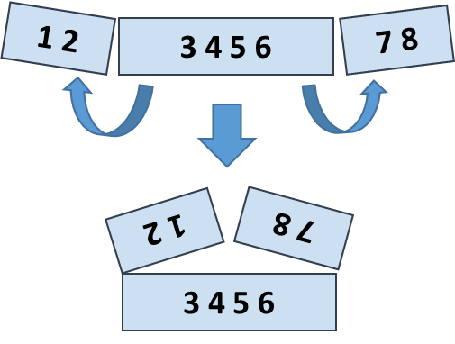

# More Exercises: Arrays

Problems for exercise and homework for the ["C\# Fundamentals" course @
SoftUni](https://softuni.bg/modules/57/tech-module-4-0)  
You can check your solutions in
[Judge](https://judge.softuni.bg/Contests/1275)

## Encrypt, Sort and Print Array

Write a program that reads a **sequence of strings** from the console.
Encrypt every string by summing:

  - The code of **each vowel multiplied by the string length**

  - The code of **each consonant divided by the string length**

**Sort** the **number** sequence in ascending order and print it on the
console.

On first line, you will always receive the number of strings you have to
read.

### Examples

<table>
<thead>
<tr class="header">
<th><strong>Input</strong></th>
<th><strong>Output</strong></th>
<th><strong>Comments</strong></th>
</tr>
</thead>
<tbody>
<tr class="odd">
<td>
<strong>4</strong>

<strong>Peter</strong>

<strong>Maria</strong>

<strong>Katya</strong>

<strong>Todor</strong>
</td>
<td>
<strong>1032</strong>

<strong>1071</strong>

<strong>1168</strong>

<strong>1532</strong>
</td>
<td>
<strong>Peter = 1071</strong>

<strong>Maria = 1532</strong>

<strong>Katya = 1032</strong>

<strong>Todor = 1168</strong>
</td>
</tr>
<tr class="even">
<td>
<strong>3</strong>

<strong>Sofia</strong>

<strong>London</strong>

<strong>Washington</strong>
</td>
<td>
<strong>1396</strong>

<strong>1601</strong>

<strong>3202</strong>
</td>
<td>
<strong>Sofia = 1601</strong>

<strong>London = 1396</strong>

<strong>Washington = 3202</strong>
</td>
</tr>
</tbody>
</table>

## Pascal Triangle

The triangle may be constructed in the following manner: In row 0 (the
topmost row), there is a unique nonzero entry 1. Each entry of each
subsequent row is constructed by adding the number above and to the left
with the number above and to the right, treating blank entries as 0. For
example, the initial number in the first (or any other) row is 1 (the
sum of 0 and 1), whereas the numbers 1 and 3 in the third row are added
to produce the number 4 in the fourth row.

If you want more info about it:
<https://en.wikipedia.org/wiki/Pascal's_triangle>

Print each row elements separated with whitespace.

### Examples

<table>
<thead>
<tr class="header">
<th><strong>Input</strong></th>
<th><strong>Output</strong></th>
</tr>
</thead>
<tbody>
<tr class="odd">
<td><em>4</em></td>
<td>
<em>1</em>

<em>1 1</em>

<em>1 2 1</em>

<em>1 3 3 1</em>
</td>
</tr>
<tr class="even">
<td><em>13</em></td>
<td>
<em>1</em>

<em>1 1</em>

<em>1 2 1</em>

<em>1 3 3 1</em>

<em>1 4 6 4 1</em>

<em>1 5 10 10 5 1</em>

<em>1 6 15 20 15 6 1</em>

<em>1 7 21 35 35 21 7 1</em>

<em>1 8 28 56 70 56 28 8 1</em>

<em>1 9 36 84 126 126 84 36 9 1</em>

<em>1 10 45 120 210 252 210 120 45 10 1</em>

<em>1 11 55 165 330 462 462 330 165 55 11 1</em>

<em>1 12 66 220 495 792 924 792 495 220 66 12 1</em>
</td>
</tr>
</tbody>
</table>

### Hints

  - The input number **n** will be **1 \<= n \<= 60**

  - Think about proper **type** for elements in array

  - Don’t be scary to use **more and more arrays**

## Recursive Fibonacci

The Fibonacci sequence is quite a famous sequence of numbers. Each
member of the sequence is calculated from the sum of the two previous
elements. The **first two** elements are 1, 1. Therefore the sequence
goes as 1, 1, 2, 3, 5, 8, 13, 21, 34…  
The following sequence can be generated with an array, but that’s easy,
so your task is to implement recursively.

So if the function **GetFibonacci(n)** returns the n’th Fibonacci number
we can express it using **GetFibonacci(n) = GetFibonacci(n-1) +
GetFibonacci(n-2).**

However, this will never end and in a few seconds a StackOverflow
Exception is thrown. In order for the recursion to stop it has to have a
“**bottom**”. The bottom of the recursion is **GetFibonacci(2)** should
return 1 and **GetFibonacci(1)** should return 1.

### Input Format:

  - On the only line in the input the user should enter the wanted
    Fibonacci number.

### Output Format:

  - The output should be the n’th Fibonacci number counting from 1.

### Constraints:

  - 1 ≤ N ≤ 50

### Examples

| **Input** | **Output** |
| --------- | ---------- |
| 5         | 5          |
| 10        | 55         |
| 21        | 10946      |

For the Nth Fibonacci number, we calculate the N-1th and the N-2th
number, but for the calculation of N-1th number we calculate the
N-1-1th(N-2th) and the N-1-2th number, so we have a lot of repeated
calculations.

If you want to figure out how to skip those unnecessary calculations,
you can search for a technique called
[memoization](https://en.wikipedia.org/wiki/Memoization).

## Fold and Sum 

Read an array of **4\*k** integers, fold it like shown below, and print
the sum of the upper and lower two rows (each holding 2 \* k integers):

### Examples

<table>
<thead>
<tr class="header">
<th><strong>Input</strong></th>
<th><strong>Output</strong></th>
<th><strong>Comments</strong></th>
</tr>
</thead>
<tbody>
<tr class="odd">
<td><strong>5 2 3 6</strong></td>
<td><strong>7 9</strong></td>
<td>
<strong>5 6 +</strong>

<strong>2 3 =</strong>

<strong>7 9</strong>
</td>
</tr>
<tr class="even">
<td><strong>1 2 3 4 5 6 7 8</strong></td>
<td><strong>5 5 13 13</strong></td>
<td>
<strong>2 1 8 7 +</strong>

<strong>3 4 5 6 =</strong>

<strong>5 5 13 13</strong>
</td>
</tr>
<tr class="odd">
<td><strong>4 3 -1 2 5 0 1 9 8 6 7 -2</strong></td>
<td><strong>1 8 4 -1 16 14</strong></td>
<td>
<strong>-1 3 4 -2 7 6 +</strong>

<strong>2 5 0 1 9 8 =</strong>

<strong>1 8 4 -1 16 14</strong>
</td>
</tr>
</tbody>
</table>

### Hints

  - Create the **first row** after folding: the first **k** numbers
    reversed, followed by the last **k** numbers reversed.

  - Create the **second row** after folding: the middle 2\***k**
    numbers.

  - **Sum** the first and the second rows.

## Longest Increasing Subsequence (LIS)

Read a **list of integers** and find the **longest increasing
subsequence** (LIS). If several such exist, print the **leftmost**.

### Examples

| **Input**                               | **Output**         |
| --------------------------------------- | ------------------ |
| **1**                                   | **1**              |
| **7 3 5 8 -1 0 6 7**                    | **3 5 6 7**        |
| **1 2 5 3 5 2 4 1**                     | **1 2 3 5**        |
| **0 10 20 30 30 40 1 50 2 3 4 5 6**     | **0 1 2 3 4 5 6**  |
| **11 12 13 3 14 4 15 5 6 7 8 7 16 9 8** | **3 4 5 6 7 8 16** |
| **3 14 5 12 15 7 8 9 11 10 1**          | **3 5 7 8 9 11**   |

### Hints

  - Assume we have **n** numbers in an array **nums\[0…n-1\]**.

  - Let **len\[p\]** holds the length of the longest increasing
    subsequence (LIS) ending at position **p**.

  - In a for loop, we shall calculate **len\[p\]** for **p** = **0** …
    **n-1** as follows:
    
      - Let **left** is the leftmost position on the left of **p**
        (**left** \< **p**), such that **len\[left\]** is the largest
        possible.
    
      - Then, **len\[p\]** = **1** + **len\[left\]**. If **left** does
        not exist, **len\[p\]** = **1**.
    
      - Also, save **prev\[p\]** = **left** (we hold if **prev\[\]** the
        previous position, used to obtain the best length for position
        **p**).

  - Once the values for **len\[0**…**n-1\]** are calculated, restore the
    LIS starting from position **p** such that **len\[p\]** is maximal
    and go back and back through **p** = **prev\[p\]**.

  - The table below illustrates these computations:

| index    | 0     | 1      | 2     | 3        | 4           | 5       | 6         | 7           | 8              | 9              | 10    |
| -------- | ----- | ------ | ----- | -------- | ----------- | ------- | --------- | ----------- | -------------- | -------------- | ----- |
| nums\[\] | **3** | **14** | **5** | **12**   | **15**      | **7**   | **8**     | **9**       | **11**         | **10**         | **1** |
| len\[\]  | 1     | 2      | 2     | 3        | 4           | 3       | 4         | 5           | 6              | 6              | 1     |
| prev\[\] | \-1   | 0      | 0     | 2        | 3           | 2       | 5         | 6           | 7              | 7              | \-1   |
| LIS      | {3}   | {3,14} | {3,5} | {3,5,12} | {3,5,12,15} | {3,5,7} | {3,5,7,8} | {3,5,7,8,9} | {3,5,7,8,9,11} | {3,5,7,8,9,10} | {1}   |
