# Lab: Arrays

Problems for in-class lab for the  
You can check your solutions in
[Judge](https://judge.softuni.bg/Contests/1202)

## Day of Week

Enter a day number \[1…7\] and print the name (in English) or "Invalid
day\!"

### Examples

| **Input** | **Output**        |
| --------- | ----------------- |
| 1         | Monday            |
| 2         | **Wednesday**     |
| **10**    | **Invalid day\!** |

## Print Numbers in Reverse Order

Read n numbers and print them in reverse order.

### Examples

<table>
<thead>
<tr class="header">
<th><strong>Input</strong></th>
<th><strong>Output</strong></th>
</tr>
</thead>
<tbody>
<tr class="odd">
<td>
3

10

20

30
</td>
<td>30 20 10</td>
</tr>
<tr class="even">
<td>
3

30

20

10
</td>
<td><strong>10</strong> 20 30</td>
</tr>
<tr class="odd">
<td>
<strong>1</strong>

<strong>10</strong>
</td>
<td><strong>10</strong></td>
</tr>
</tbody>
</table>

###   
Hints

First, we need to read **n** from the console.

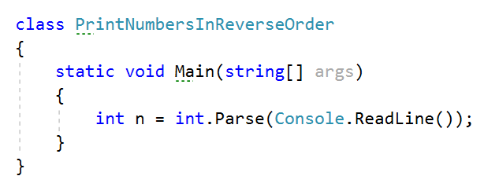

Create an **array of integer** with **n** size.

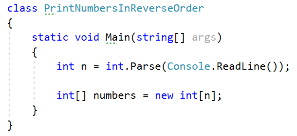

Read **n** numbers using for loop.

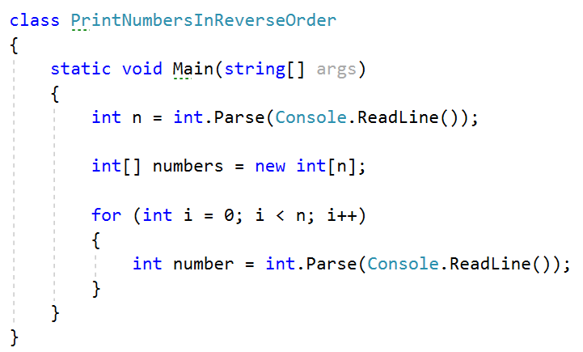

**Set** number to the corresponding **index**.

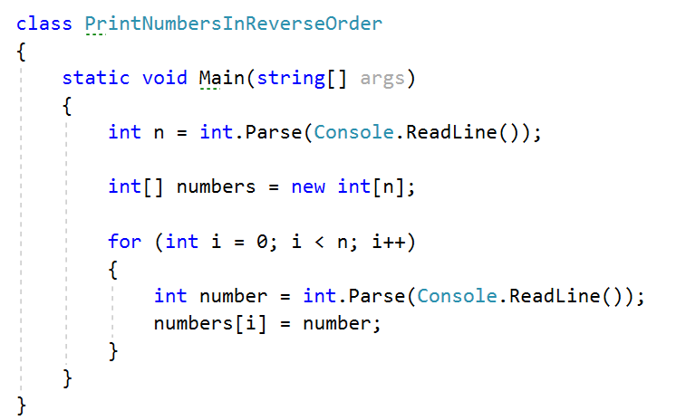

Print the array in reversed order.

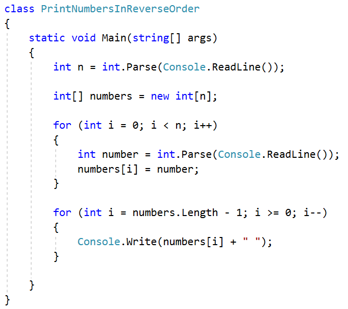

## Rounding Numbers

Read an array of real numbers (space separated), round them in "**away
from 0**" style and print the output as in the examples:

### Examples

<table>
<thead>
<tr class="header">
<th><strong>Input</strong></th>
<th><strong>Output</strong></th>
</tr>
</thead>
<tbody>
<tr class="odd">
<td><strong>0.9 1.5 2.4 2.5 3.14</strong></td>
<td>
<strong>0.9 =&gt; 1</strong>

<strong>1.5 =&gt; 2</strong>

<strong>2.4 =&gt; 2</strong>

<strong>2.5 =&gt; 3</strong>

<strong>3.14 =&gt; 3</strong>
</td>
</tr>
<tr class="even">
<td><strong>-5.01 -1.599 -2.5 -1.50 0</strong></td>
<td>
<strong>-5.01 =&gt; -5</strong>

<strong>-1.599 =&gt; -2</strong>

<strong>-2.5 =&gt; -3</strong>

<strong>-1.50 =&gt; -2</strong>

<strong>0 =&gt; 0</strong>
</td>
</tr>
</tbody>
</table>

## Reverse Array of Strings

Read an array of strings (space separated values), reverse it and print
its elements:

### Examples

| **Input**   | **Output**     |
| ----------- | -------------- |
| a b c d e   | e d c b a      |
| \-1 hi ho w | **w ho hi -1** |

## Sum Even Numbers

Read an array from the console and sum only the even numbers.

### Examples

| **Input**   | **Output** |
| ----------- | ---------- |
| 1 2 3 4 5 6 | 12         |
| 3 5 7 9     | **0**      |
| 2 4 6 8 10  | **30**     |

### Hints

First, we need to read the array.

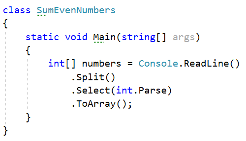

We will need a variable for the sum.

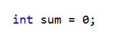

Iterate through all elements in the array with for loop.

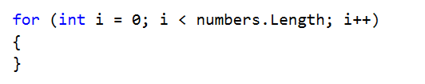

Check if the number at current index is even.

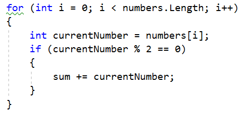

Print the total sum

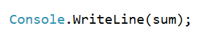

## Even and Odd Subtraction

Write a program that calculates the difference between the sum of the
even and the sum of the odd numbers in an array.

### Examples

<table>
<thead>
<tr class="header">
<th><strong>Input</strong></th>
<th><strong>Output</strong></th>
<th><strong>Comments</strong></th>
</tr>
</thead>
<tbody>
<tr class="odd">
<td>1 2 3 4 5 6</td>
<td>3</td>
<td>
Even: 2 + 4 + 6 = 12

Odd: 1 + 3 + 5 = 9

Result: 12 – 9 = 3
</td>
</tr>
<tr class="even">
<td>3 5 7 9</td>
<td>-24</td>
<td>
Even: 0

Odd: 3 + 5 + 7 + 9 = 24

Result: 0 – 24 = -24
</td>
</tr>
<tr class="odd">
<td>2 4 6 8 10</td>
<td><strong>30</strong></td>
<td>
Even: 2 + 4 + 6 + 8 + 10 = 30

Odd: 0

Result: 30 – 0 = 30
</td>
</tr>
</tbody>
</table>

### Hints

First, we need to read the array.

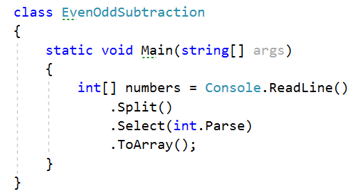

We will need two variables – even and odd sum.

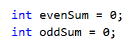

Iterate through all elements in the array with for loop.

Check the current number – if it is even add it to the even sum,
otherwise add It to the odd sum.

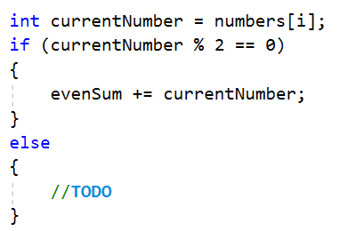

Print the difference.

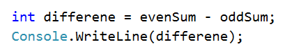

## Equal Arrays

Read two arrays and print on the console whether they are identical or
not. Arrays are identical if their elements are equal. If the arrays are
identical find the sum of the first one and print on the console
following message: "Arrays are identical. Sum: {sum}", otherwise find
the first index where the arrays differ and print on the console
following message: "Arrays are not identical. Found difference at
{index} index".

### Examples

<table>
<thead>
<tr class="header">
<th><strong>Input</strong></th>
<th><strong>Output</strong></th>
</tr>
</thead>
<tbody>
<tr class="odd">
<td>
10 20 30

10 20 30
</td>
<td>Arrays are identical. Sum: 60</td>
</tr>
<tr class="even">
<td>
1 2 3 4 5

1 2 4 3 5
</td>
<td><strong>Arrays are not identical. Found difference at 2 index</strong></td>
</tr>
<tr class="odd">
<td>
<strong>1</strong>

<strong>10</strong>
</td>
<td><strong>Arrays are not identical. Found difference at 0 index</strong></td>
</tr>
</tbody>
</table>

### Hints

First, we need to read two arrays.

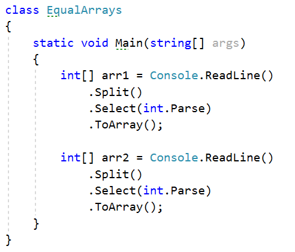

Iterate through arrays and compare element. If the elements are not
equal print the required message and break the loop.

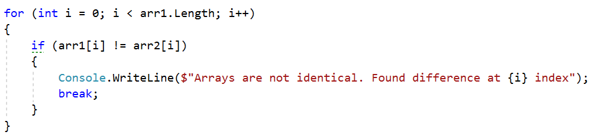

Think about how to solve the other part of the problem.

## Condense Array to Number

Write a program to read **an array of integers** and **condense** them
by **summing** adjacent couples of elements until a **single integer**
is obtained. For example, if we have 3 elements {2, 10, 3}, we sum the
first two and the second two elements and obtain {2+10, 10+3} = {12,
13}, then we sum again all adjacent elements and obtain {12+13} = {25}.

### Examples

| **Input**     | **Output** | **Comments**                                                                   |
| ------------- | ---------- | ------------------------------------------------------------------------------ |
| 2 10 3        | 25         | 2 10 3 2+10 10+3 12 13 12 + 13 25                                              |
| **5 0 4 1 2** | 35         | **5 0 4 1 2 5+0 0+4 4+1 1+2 5 4 5 3 5+4 4+5 5+3 9 9 8 9+9 9+8 18 17 18+17 35** |
| **1**         | 1          | **1 is already condensed to number**                                           |

### Hints

While we have more than one element in the array **nums\[\]**, repeat
the following:

  - Allocate a new array **condensed\[\]** of size **nums.Length-1**.

  - Sum the numbers from **nums\[\]** to **condensed\[\]**:
    
      - condensed\[i\] = nums\[i\] + nums\[i+1\]

  - nums\[\] = condensed\[\]

The process is illustrated below:

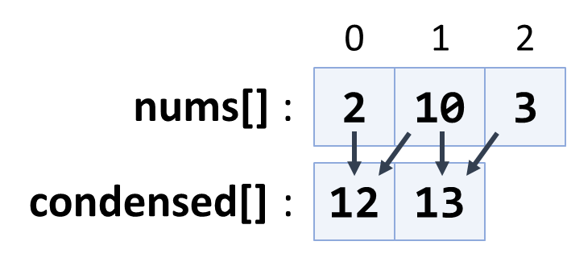

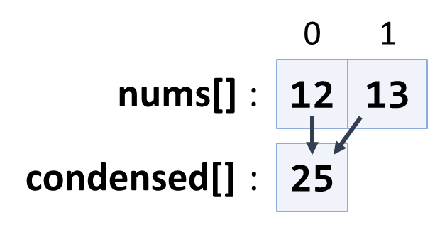
