# Lab: Methods

Problems for in-class lab for the  
You can check your solutions in
[Judge](https://judge.softuni.bg/Contests/1208)

# Declaring and Invoking Methods

## Sign of Integer Numbers

Create a method that prints the **sign** of an integer number **n**:

### Examples 

| **Input** | **Output**                 |
| --------- | -------------------------- |
| 2         | The number 2 is positive.  |
| \-5       | The number -5 is negative. |
| 0         | The number 0 is zero.      |

## Grades

Write a method that **receives a grade** between **2.00** and **6.00**
and **prints the corresponding grade in words**

  - 2.00 – 2.99 - "Fail"

  - 3.00 – 3.49 - "Poor"

  - 3.50 – 4.49 - "Good"

  - 4.50 – 5.49 - "Very good"

  - 5.50 – 6.00 - "Excellent"

### Examples

| **Input** | **Output** |
| --------- | ---------- |
| 3.33      | Poor       |
| 4.50      | Very good  |
| 2.99      | Fail       |

### Hints

1.  Read the grade from the console and pass it to a method

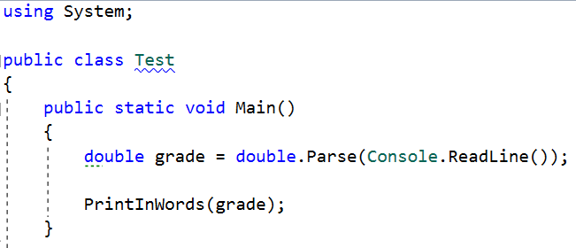

2.  Then create the method and make the if statements for each case

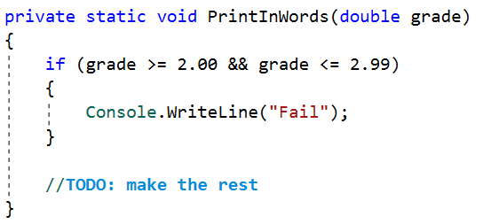

## Calculations

Write a program that receives a string on the first line (add, multiply,
subtract, divide) and on the next two lines receives two numbers. Create
four methods (for each calculation) and invoke the right one depending
on the command. The method should also print the result (needs to be
void)

### Example

<table>
<thead>
<tr class="header">
<th><strong>Input</strong></th>
<th><strong>Output</strong></th>
</tr>
</thead>
<tbody>
<tr class="odd">
<td>
<strong>subtract</strong>

<strong>5</strong>

<strong>4</strong>
</td>
<td><strong>1</strong></td>
</tr>
<tr class="even">
<td>
<strong>divide</strong>

<strong>8</strong>

<strong>4</strong>
</td>
<td><strong>2</strong></td>
</tr>
</tbody>
</table>

### Hints

1.  Read the command on the first line and the two numbers, and then
    make an if/switch statement for each type of calculation

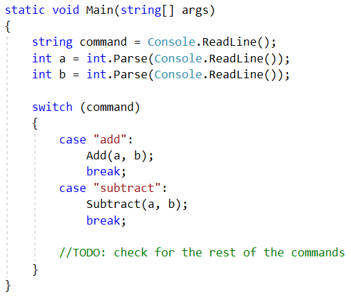

2.  Then create the four methods and print the result

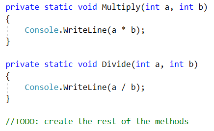

## Printing Triangle

Create a method for printing triangles as shown below:

### Examples

<table>
<thead>
<tr class="header">
<th><strong>Input</strong></th>
<th><strong>Output</strong></th>
</tr>
</thead>
<tbody>
<tr class="odd">
<td><strong>3</strong></td>
<td>
<strong>1</strong>

<strong>1 2</strong>

<strong>1 2 3</strong>

<strong>1 2</strong>

<strong>1</strong>
</td>
</tr>
<tr class="even">
<td>4</td>
<td>
1

1 2

1 2 3

1 2 3 4

1 2 3

1 2

1
</td>
</tr>
</tbody>
</table>

### Hints

1.  After you read the input

2.  Start by creating a method **for printing a single line** from a
    **given start** to a **given end**. Choose a **meaningful name** for
    it, describing its purpose:

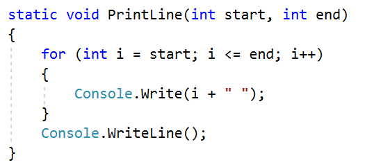

3.  Create another method for printing the whole triangle. Again choose
    a **meaningful name** for it, describing its purpose.

4.  Think how you can use the **PrintLine()** method to solve the
    problem

5.  After you spent some time thinking, you should have come to the
    conclusion that you will need two loops

6.  In the first loop you can print the first half of the triangle:

> 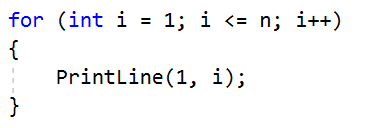

7.  In the second loop you can print the second half of the triangle:

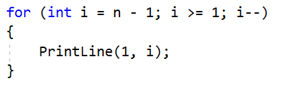

## Orders

Write a method that calculates the total price of an order and prints it
on the console. The method should receive one of the following products:
coffee, coke, water, snacks; and a quantity of the product. The prices
for a single piece of each product are:

  - coffee – 1.50

  - water – 1.00

  - coke – 1.40

  - snacks – 2.00

Print the result formatted to the second decimal place

### Example

<table>
<thead>
<tr class="header">
<th><strong>Input</strong></th>
<th><strong>Output</strong></th>
</tr>
</thead>
<tbody>
<tr class="odd">
<td>
<strong>water</strong>

<strong>5</strong>
</td>
<td><strong>5.00</strong></td>
</tr>
<tr class="even">
<td>
<strong>coffee</strong>

<strong>2</strong>
</td>
<td><strong>3.00</strong></td>
</tr>
</tbody>
</table>

### Hints

1.  Read the first two lines

2.  Create a method the pass the two variables in

3.  Print the result in the method

# Returning Values and Overloading

## Calculate Rectangle Area

Create a method that calculates and **returns** the
[area](http://www.mathopenref.com/trianglearea.html) of a rectangle by
given width and height:

### Examples

<table>
<thead>
<tr class="header">
<th><strong>Input</strong></th>
<th><strong>Output</strong></th>
</tr>
</thead>
<tbody>
<tr class="odd">
<td>
<strong>3</strong>

<strong>4</strong>
</td>
<td><strong>12</strong></td>
</tr>
<tr class="even">
<td>
<strong>6</strong>

<strong>2</strong>
</td>
<td><strong>12</strong></td>
</tr>
</tbody>
</table>

### Hints

1.  After reading the input

2.  Create a method, but this time **instead** of typing **"static
    void"** before its name, type **"static double"** as this will make
    it to **return a value of type double**:

> 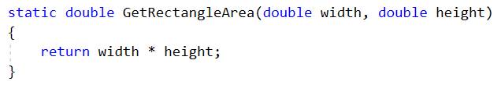

3.  > **Invoke** the method in the main and **save the return value in a
    > new variable**:

> 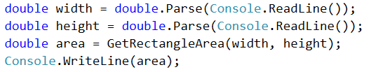

## Repeat String

Write a method that receives a string and a repeat count n (integer).
The method should return a new string (the old one repeated n times)

### Example

<table>
<thead>
<tr class="header">
<th><strong>Input</strong></th>
<th><strong>Output</strong></th>
</tr>
</thead>
<tbody>
<tr class="odd">
<td>
<strong>abc</strong>

<strong>3</strong>
</td>
<td><strong>abcabcabc</strong></td>
</tr>
<tr class="even">
<td>
<strong>String</strong>

<strong>2</strong>
</td>
<td><strong>StringString</strong></td>
</tr>
</tbody>
</table>

### Hints

1.  Firstly read the **string** and the repeat count **n**

2.  Then create the method and pass it the variables

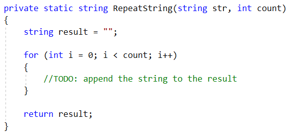

3.  In the main method, print the result

## **Math Power**

Create a method that calculates and returns the value of a number raised
to a given power:

### Examples

<table>
<thead>
<tr class="header">
<th><strong>Input</strong></th>
<th><strong>Output</strong></th>
</tr>
</thead>
<tbody>
<tr class="odd">
<td>
<strong>2</strong>

<strong>8</strong>
</td>
<td><strong>256</strong></td>
</tr>
<tr class="even">
<td>
<strong>3</strong>

<strong>4</strong>
</td>
<td><strong>81</strong></td>
</tr>
</tbody>
</table>

### Hints

1.  > As usual, read the input

2.  > Create a method which will have two parameters - the number and
    > the power, and will return a result of type double:

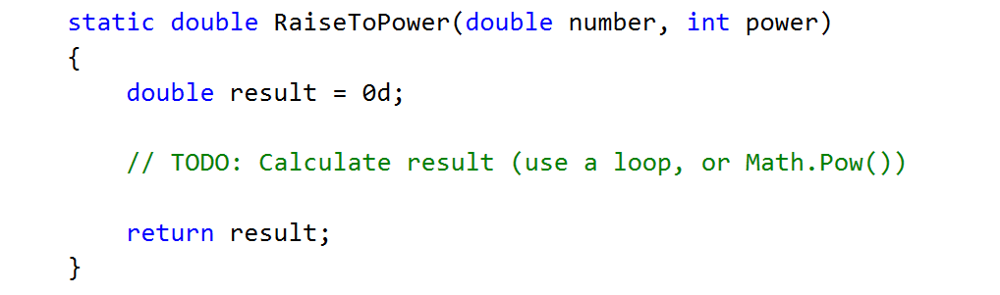

3.  Print the result

## Greater of Two Values

Create a method **GetMax()** that **returns the greater** of two values
(the values can be of type **int**, **char** or **string**)

### Examples

<table>
<thead>
<tr class="header">
<th><strong>Input</strong></th>
<th><strong>Output</strong></th>
</tr>
</thead>
<tbody>
<tr class="odd">
<td>
int

2

16
</td>
<td>16</td>
</tr>
<tr class="even">
<td>
char

a

z
</td>
<td>z</td>
</tr>
<tr class="odd">
<td>
string

aaa

bbb
</td>
<td>bbb</td>
</tr>
</tbody>
</table>

## Multiply Evens by Odds

Create a program that **multiplies the sum** of **all even digits** of a
number **by the sum of all odd digits** of the same number:

  - Create a method called **GetMultipleOfEvenAndOdds()**

  - Create a method **GetSumOfEvenDigits()**

  - Create **GetSumOfOddDigits()**

  - You may need to use **Math.Abs()** for negative numbers

### Examples

<table>
<thead>
<tr class="header">
<th><strong>Input</strong></th>
<th><strong>Output</strong></th>
<th><strong>Comment</strong></th>
</tr>
</thead>
<tbody>
<tr class="odd">
<td>-12345</td>
<td>54</td>
<td>
Evens: 2 4

Odds: 1 3 5

Even sum: 6

Odd sum: 9

6 * 9 = 54
</td>
</tr>
</tbody>
</table>

## Math operations

Write a method that receives two number and an operator, calculates the
result and returns it. You will be given three lines of input. The first
will be the first number, the second one will be the operator and the
last one will be the second number. The possible operators are: / \* + -

Print the result rounded up to the second decimal point.

### Example

<table>
<thead>
<tr class="header">
<th><strong>Input</strong></th>
<th><strong>Output</strong></th>
</tr>
</thead>
<tbody>
<tr class="odd">
<td>
<strong>5</strong>

<strong>*</strong>

<strong>5</strong>
</td>
<td><strong>25</strong></td>
</tr>
<tr class="even">
<td>
<strong>4</strong>

<strong>+</strong>

<strong>8</strong>
</td>
<td><strong>12</strong></td>
</tr>
</tbody>
</table>

### Hint

1.  Read the inputs and create a method that returns a double (the
    result of the operation)

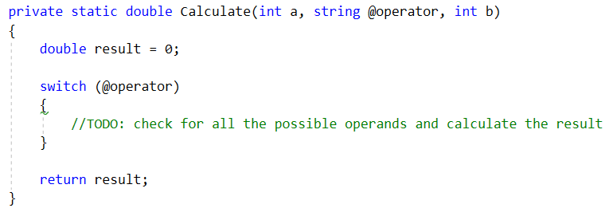
