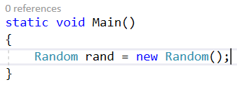

# Einstein’s Riddle Documentation

*In this Lab we are going to create a C\# program that generates a
random [Einstein’s riddle](https://udel.edu/~os/riddle.html) each time
the program is started. It will also have a functionality to print the
solution if the user has trouble solving it. At the end it is going to
look like this:*

## Creating the project

Create new .NET Core project in Visual Studio

## Creating the sets

First, we need **5 arrays** to store the information about the **houses,
nationalities, drinks, cigarettes** and **pets**. We also need to store
the **hints**, because we want to write them on the console. For them to
be accessible in all of the code, we are going to create them as
**static variables on top of the Main method**.

  - It does not matter, how the info is ordered. We are going to
    **shuffle** it anyway.

  - The hints array should have **15 elements**, because we are going to
    create **15 hints**

## Random and shuffling

Now to shuffle the info, we need a random generator, so we create it

Now we need a method that shuffles each array of info, so we have new
riddle every time we start the program

  - We create the method and pass it the random generator we have
    created. We are going to use the Fisher-Yates Shuffle Algorithm to
    shuffle the data:

  - We use a **for-loop**. In this case the iterations are 5, because
    the length of each of the arrays is 5.

  - We take **a random index from every array** and create a **Swap
    method** that is going to swap the data at the given **indices**
    from the given **array of data**.

  - We repeat that for each of the arrays we have.

## The Swap method

The method is going to receive **2 indices and an array and it is going
to swap them**:

  - We **store the value of the first index** from the given array of
    data

  - We **set the first value to the second value**

  - We **set the second value to the stored value**

## Generating the Hints

The next step after we shuffled all the data is, to **generate the
hints**. We follow the **original hints** of the riddle. If you open the
[solution](https://udel.edu/~os/riddle-solution.html) (**scroll to the
bottom** to see the solution table) and **check for the first hint**,
you will see that it reveals the user the **nationality of the person
living in the 3rd house** and the **color of that house**.
(in our case we **start counting from 0** because we use **arrays**, so
for us it is the **second index**) We do that for all the **15 hints**.

First let us call a method **GenerateHints in our main method:**

Now let us **create it,** following the original riddle:

  - Check what kind of info we give the user using the hints of the
    riddle and the solution

## Printing the info for the user

We are almost done. Now we have to provide the user with the intro and
the hints of the riddle. Use the link to write on the console the intro:

For the question we see the riddle and the solution (the **fish is the
3rd index of our pets array**)

Now we have to loop through the hints and print them:

Now we have to check if the user wants to see the solution. We write the
following code:

  - We wait for the user to type something (it is possible for him to
    write everything).

  - Until we receive a string that says "solution", we say the user that
    the command is invalid  
    and read the string again.

  - If the string is correct we proceed.

## Printing the solution

If the user asks for the solution we want to print it. So, we create a
method called PrintSolution and call it in the Main method after the
while loop:

  - The method will just loop **5 times** to print the info about each
    person with his **house, drink, nationality, pet and cigarettes.**

***Ready\! Now you can try running the program
and solving the riddle\!*** 😊
