# Lab: Lists

Problems for in-class lab for the  
You can check your solutions in
[Judge](https://judge.softuni.bg/Contests/1210)

## Sum Adjacent Equal Numbers

Write a program to **sum all adjacent equal numbers** in a list of
decimal numbers, starting from **left to right**.

  - After two numbers are summed, the obtained result could be equal to
    some of its neighbors and should be summed as well (see the examples
    below).

  - Always sum the **leftmost** two equal neighbors (if several couples
    of equal neighbors are available).

### Examples

| **Input**        | **Output**  | **Explanation**                                                                                                                           |
| ---------------- | ----------- | ----------------------------------------------------------------------------------------------------------------------------------------- |
| **3 3 6 1**      | 12 1        | **3 3 6 1 6 6 1 12 1**                                                      |
| **8 2 2 4 8 16** | **16 8 16** | **8 2 2 4 8 16 8 4 4 8 16 8 8 8 16 16 8 16** |
| **5 4 2 1 1 4**  | **5 8 4**   | **5 4 2 1 1 4 5 4 2 2 4 5 4 4 4 5 8 4**      |

### Solution

Read a list of numbers.

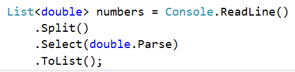

Iterate through the elements. Check if the number at the **current**
**index** is **equal** to the **next** number. If it is, **aggregate**
**the numbers** and **reset** the loop, otherwise **don't do anything**.

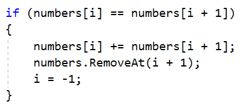

Finally, you have to print the numbers joined by a single space.

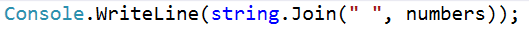

## Gauss' Trick

Write a program that **sums** all of the **numbers in a list** in the
following order:

*first **+** last*, *first + 1* ***+** last - 1*, *first + 2* **+**
*last **-** 2***,** … *first + n*, *last - n*.

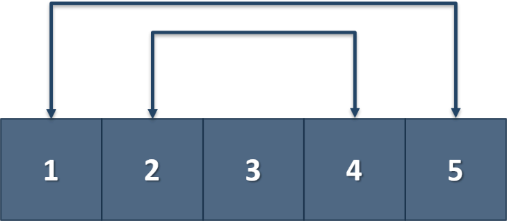

### Example

| **Input** | **Output** |
| --------- | ---------- |
| 1 2 3 4 5 | 6 6 3      |
| 1 2 3 4   | 5 5        |

## Merging Lists

You are going to receive two lists with numbers. Create a result list,
which contains the numbers from both of the lists. The **first**
**element** should be **from the first list**, the **second** from the
**second list** and so on. If the length of the two lists **are not
equal**, just **add** the **remaining** **elements** at the **end** of
the list.

### Example

<table>
<thead>
<tr class="header">
<th><strong>Input</strong></th>
<th><strong>Output</strong></th>
</tr>
</thead>
<tbody>
<tr class="odd">
<td>
<strong>3 5 2 43 12 3 54 10 23</strong>

<strong>76 5 34 2 4 12</strong>
</td>
<td><strong>3</strong> <strong>76</strong> <strong>5</strong> <strong>5</strong> <strong>2</strong> <strong>34</strong> <strong>43</strong> <strong>2</strong> <strong>12</strong> <strong>4</strong> <strong>3</strong> <strong>12</strong> <strong>54</strong> <strong>10</strong> <strong>23</strong></td>
</tr>
<tr class="even">
<td>
<strong>76 5 34 2 4 12</strong>

<strong>3 5 2 43 12 3 54 10 23</strong>
</td>
<td><strong>76</strong> <strong>3</strong> 5 <strong>5</strong> <strong>34</strong> <strong>2</strong> <strong>2</strong> <strong>43</strong> <strong>4</strong> <strong>12</strong> <strong>12</strong> <strong>3</strong> <strong>54 10 23</strong></td>
</tr>
</tbody>
</table>

### Hint

  - Read the two lists

  - Create a result list

  - Start looping through them until you reach the end of the smallest
    one

  - Finally add the remaining elements (if there are any) to the end of
    the list

## List of Products

Read a number **n** and **n lines of products**. Print a **numbered
list** of all the products **ordered by name**.

### Examples

<table>
<thead>
<tr class="header">
<th><strong>Input</strong></th>
<th><strong>Output</strong></th>
</tr>
</thead>
<tbody>
<tr class="odd">
<td>
4

Potatoes

Tomatoes

Onions

Apples
</td>
<td>
1.Apples

2.Onions

3.Potatoes

4.Tomatoes
</td>
</tr>
</tbody>
</table>

### Solution

First, we need to read the number **n** from the console.

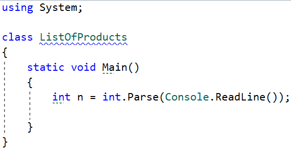

Then we need to create our **list of strings**, because the **products
are strings.**

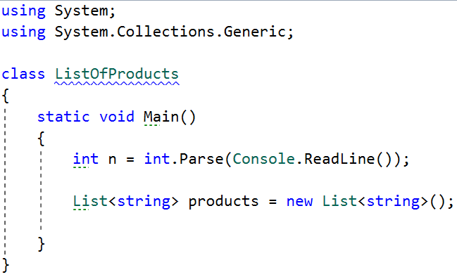

Then we need to iterate **n times** and **read our current product**.

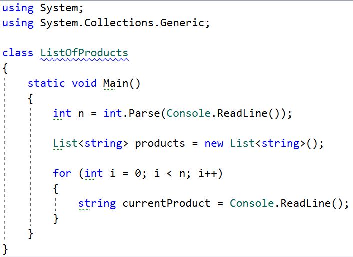

The next step is to **add** the current product to the list.

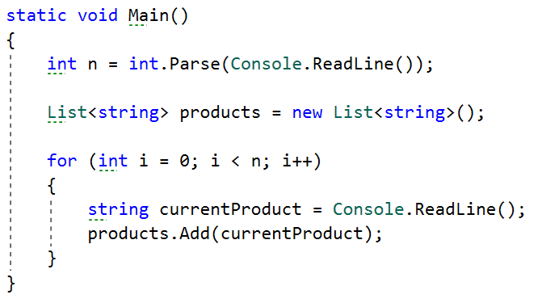

After we finish reading the products, we **sort our list
alphabetically.**

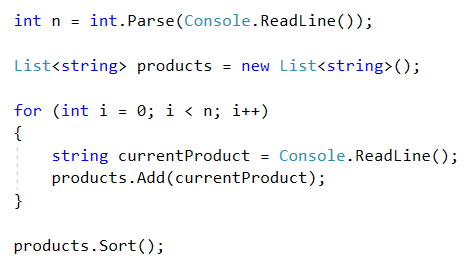

  - The **sort method** sorts the list in ascending order.

> Finally, we have to **print our sorted** list. To do that we **loop
> through the list**.

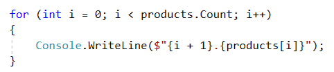

  - We use **i + 1**, because we want to **start counting from 1**, we
    put the **'.'**, and **finally** we put **the actual product.**

## Remove Negatives and Reverse

Read a **list of integers**, **remove all negative numbers** from it and
print the remaining elements in **reversed order**. In case there are no
elements left in the list, print "**empty**".

### Examples

| **Input**            | **Output** |
| -------------------- | ---------- |
| **10 -5 7 9 -33 50** | 50 9 7 10  |
| **7 -2 -10 1**       | **1 7**    |
| **-1 -2 -3**         | **empty**  |

### Solution

Read a list of integers.

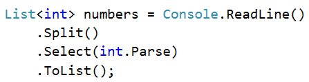

Remove all negative numbers.

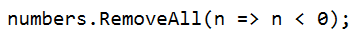

If the list count is equal to 0 print "empty", otherwise print all
numbers joined by space.

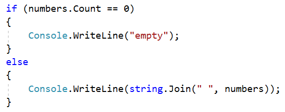

## List Manipulation Basics

Write a program that reads a list of integers. Then until you receive
**"end"**, you will receive different **commands:**

**Add {number}:** add a number to the end of the list.  
**Remove {number}:** remove a number from the list.  
**RemoveAt {index}:** remove a number at a given index.  
**Insert {number} {index}:** insert a number at a given index.

**Note: All the indices will be valid\!**

When you receive the **"end"** command, print the **final state** of the
list (**separated by spaces**).

### Example

<table>
<thead>
<tr class="header">
<th><strong>Input</strong></th>
<th><strong>Output</strong></th>
</tr>
</thead>
<tbody>
<tr class="odd">
<td>
4 19 2 53 6 43

Add 3

Remove 2

RemoveAt 1

Insert 8 3

end
</td>
<td>4 53 6 8 43 3</td>
</tr>
</tbody>
</table>

### Solution

First let us read the list from the console.

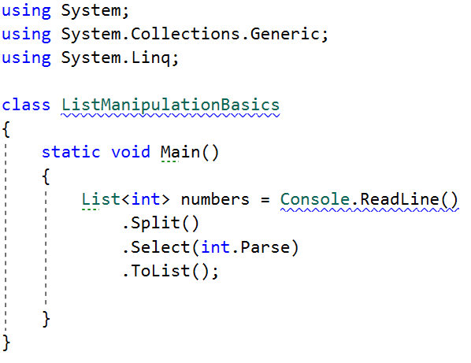

  - We **split** the string we have received from the console, then we
    **loop through each of the elements** and parse them to
    **integers.**

  - This returns **IEnumarable\<int\>** (a **collection** of integers)
    and we have to keep it in the form of a list.

Next, we go through the input using a while loop and a switch case
statement for the different commands.

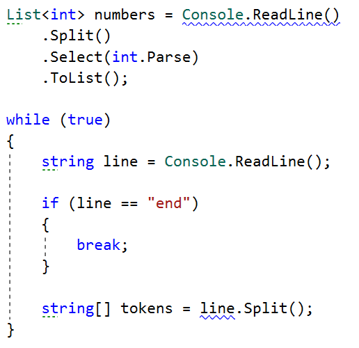

  - We stop the cycle if the line is end, otherwise we **split** the
    input string into **tokens**.

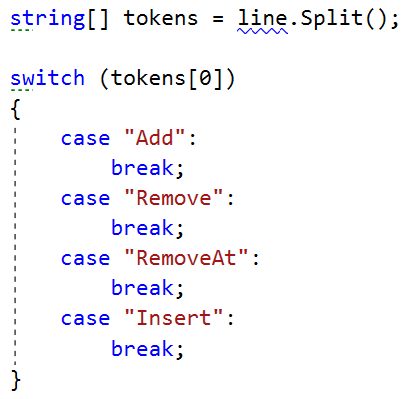

Now, let us implement **each** of the **commands**.

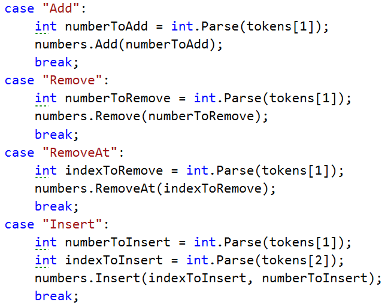

  - For each of the commands, **except "Insert",** **tokens\[1\]** is
    the **number/index.**

  - For the **"Insert"** command we receive a **number and an index**
    (**tokens\[1\], tokens\[2\]**).

Finally, we **print** the numbers, joined by **a single space.**

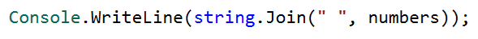

## List Manipulation Advanced

Next, we are going to implement more complicated list commands,
**extending the previous task**. Again, read a list and keep reading
commands until you receive **"end"**:

**Contains {number}** – check if the list contains the number and if so
- print **"Yes**", **otherwise** print **"No such number"**.  
**PrintEven** – print **all the even numbers**, **separated by a
space**.  
**PrintOdd** – print **all the odd numbers, separated by a space**.**  
GetSum** – print the **sum of all the numbers**.**  
Filter {condition} {number}** – print all the numbers that **fulfill the
given condition**. The condition will be either '**\<**', '**\>**',
"**\>=**", "**\<=**".

**After** the **end** **command,** print the list **only if** you have
made some **changes** to the **original list**. **Changes** are made
**only** from the commands from the **previous task**.

### Example

<table>
<thead>
<tr class="header">
<th><strong>Input</strong></th>
<th><strong>Output</strong></th>
</tr>
</thead>
<tbody>
<tr class="odd">
<td>
2 13 43 876 342 23 543

Contains 100

Contains 543

PrintEven

PrintOdd

GetSum

Filter &gt;= 43

Filter &lt; 100

end
</td>
<td>
No such number

Yes

2 876 342

13 43 23 543

1842

43 876 342 543

2 13 43 23
</td>
</tr>
</tbody>
</table>

##
