# Lab: Objects and Classes

Problems for in-class lab for the  
You can check your solutions in
[Judge](https://judge.softuni.bg/Contests/1214)

# Using the Built-in .NET Classes

## Day of Week

You are given a **date** in format **day-month-year**. Calculate and
print the **day of week** in **English**.

### Examples

| **Input**      | **Output**    |
| -------------- | ------------- |
| **18-04-2016** | Monday        |
| **27-11-1996** | **Wednesday** |

### Hints

  - **Read the date as string** from the Console.

  - Use the method [**DateTime.ParseExact(string date, format,
    provider)**](https://msdn.microsoft.com/en-us/library/w2sa9yss\(v=vs.110\).aspx)
    to convert the input string to object of type **DateTime**. Use
    format **“d-M-yyyy”** and **CultureInfo.InvariantCulture**.
    
      - Alternatively split the input by “**-**“ and you will get the
        day, month and year as numbers. Now you can create **new
        DateTime(year, month, day)**.

  - The newly created **DateTime** object has a
    **[DayOfWeek](https://msdn.microsoft.com/en-us/library/system.datetime.dayofweek\(v=vs.110\).aspx)**
    property.

## Randomize Words

You are given a **list of words in one line**. **Randomize their order**
and print each word at a separate line.

### Examples

<table>
<thead>
<tr class="header">
<th><strong>Input</strong></th>
<th><strong>Output</strong></th>
<th><strong>Comments</strong></th>
</tr>
</thead>
<tbody>
<tr class="odd">
<td>Welcome to SoftUni and have fun learning programming</td>
<td>
learning

Welcome

SoftUni

and

fun

programming

have

to
</td>
<td>The order of the words in the output will be different after each program execution.</td>
</tr>
</tbody>
</table>

### Hints

  - **Split** the input string by (space) and create an **array of
    words**.

  - Create a random number generator – an object **rnd** of type
    **Random**.

  - In a **for-loop exchange each number** at positions 0, 1, …
    **words.Length-1** by a number at **random position**. To generate a
    random number in range use **rnd.[Next(minValue,
    maxValue)](https://msdn.microsoft.com/en-us/library/2dx6wyd4\(v=vs.110\).aspx)**.
    Note that by definition **minValue** is **inclusive**, but
    **maxValue** is **exclusive**.

  - Print each word in the array on new line.

## **Big Factorial**

You will receive **N** – a number in the range **\[0 – 1000\]**.
Calculate the **Factorial** of **N** and print the result.

### Examples

| **Input** | **Output**                                                                                                                                                                                                             |
| --------- | ---------------------------------------------------------------------------------------------------------------------------------------------------------------------------------------------------------------------- |
| 50        | 30414093201713378043612608166064768844377641568960512000000000000                                                                                                                                                      |
| **125**   | **188267717688892609974376770249160085759540364871492425887598231508353156331613598866882932889495923133646405445930057740630161919341380597818883457558547055524326375565007131770880000000000000000000000000000000** |

### Hints

Use the class **BigInteger** from the built-in .NET library
**System.Numerics.dll**.

1.  Import the namespace “**System.Numerics**”:

2.  Use the type **BigInteger** to calculate the number **factorial**.

> 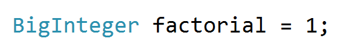

3.  **Loop from 2 to N and multiply every number with factorial.**

# Defining Simple Classes

## Songs

Define a class **Song**, which holds the following information about
songs: **Type List**, **Name** and **Time**.

On the first line you will receive the **number of songs** **-** **N**.

On the **next N-lines** you will be receiving data in the following
format: **"{typeList}\_{name}\_{time}".**

On the last line you will receive **Type List** / **"all".** Print only
the **Names of the songs,** which are from that **Type List** / **All
songs**.

### Examples

<table>
<thead>
<tr class="header">
<th><strong>Input</strong></th>
<th><strong>Output</strong></th>
</tr>
</thead>
<tbody>
<tr class="odd">
<td>
<strong>3</strong>

favourite_DownTown_3:14

favourite_Kiss_4:16

favourite_Smooth Criminal_4:01

favourite
</td>
<td>
DownTown

Kiss

Smooth Criminal
</td>
</tr>
<tr class="even">
<td>
<strong>4</strong>

favourite_DownTown_3:14

listenLater_Andalouse_3:24

favourite_In To The Night_3:58

favourite_Live It Up_3:48

listenLater
</td>
<td>Andalouse</td>
</tr>
<tr class="odd">
<td>
<strong>2</strong>

<strong>like_Replay_3:15</strong>

<strong>ban_Photoshop_3:48</strong>

<strong>all</strong>
</td>
<td>
Replay

Photoshop
</td>
</tr>
</tbody>
</table>

### Solution

Define a class Song with properties: **Type List**, **Name** and
**Time**.

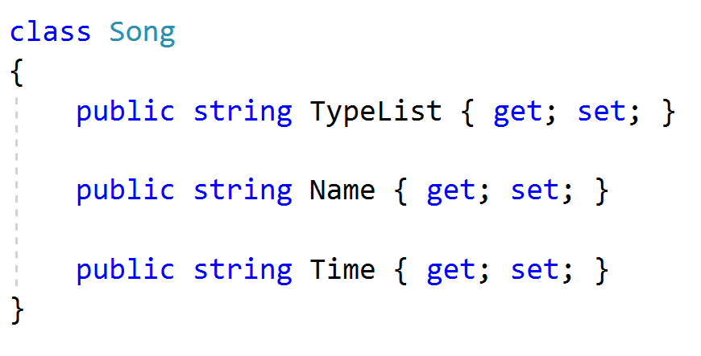

Read the input lines, make a collection and store the data.

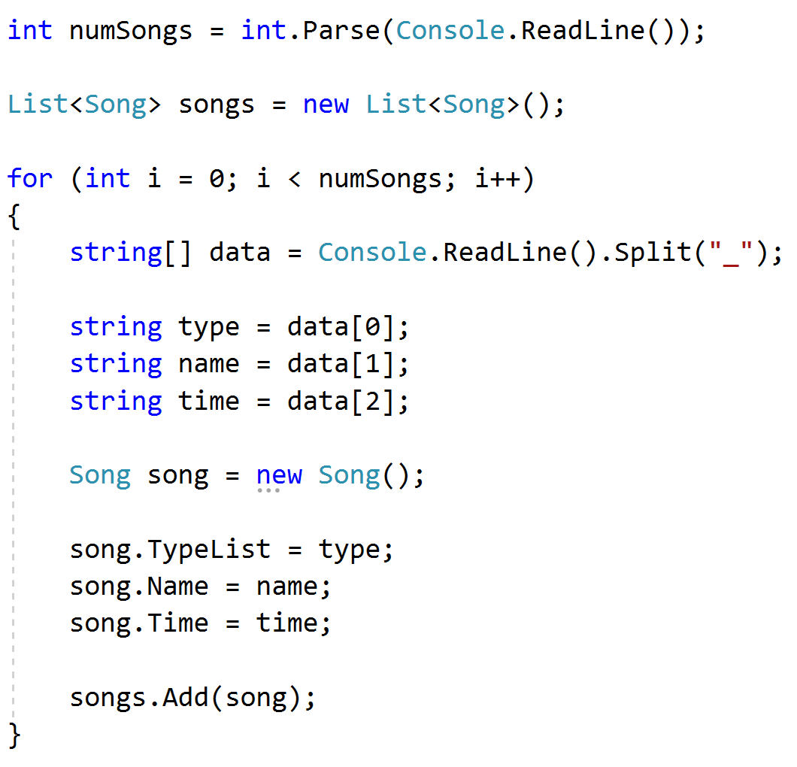

Finally read your last line – **Type List** and **print** the result.

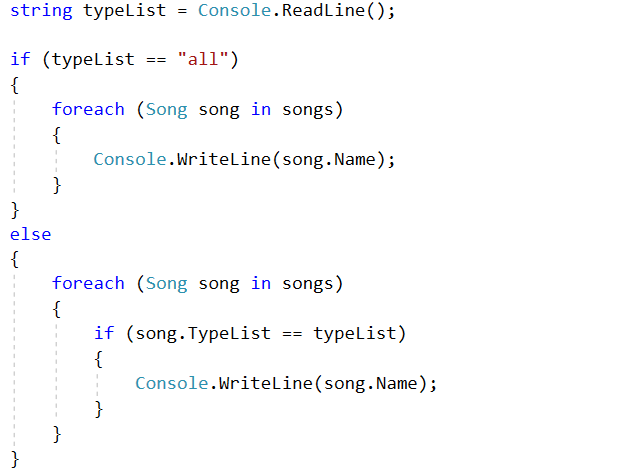

You can use LINQ to filter the collection.

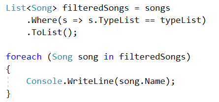

## Students

Define a class **Student**, which holds the following information about
students: **first name**, **last name**, **age** and **hometown**.

Read a list of students until you receive the "**end**" command. After
that, you will receive a **name of a city**. Print only students, which
are from the given city in the following format: **"{firstName}
{lastName} is {age} years old.".**

### Examples

<table>
<thead>
<tr class="header">
<th><strong>Input</strong></th>
<th><strong>Output</strong></th>
</tr>
</thead>
<tbody>
<tr class="odd">
<td>
<strong>John Smith 15 Sofia</strong>

<strong>Peter Ivanov 14 Plovdiv</strong>

<strong>Linda Bridge 16 Sofia</strong>

<strong>Simon Stone 12 Varna</strong>

<strong>end</strong>

Sofia
</td>
<td>
John Smith is 15 years old.

Linda Bridge is 16 years old.
</td>
</tr>
<tr class="even">
<td>
<strong>Anthony Taylor 15 Chicago</strong>

<strong>David Anderson 16 Washington</strong>

<strong>Jack Lewis 14 Chicago</strong>

<strong>David Lee 14 Chicago</strong>

<strong>end</strong>

<strong>Chicago</strong>
</td>
<td>
<strong>Anthony Taylor is 15 years old.</strong>

<strong>Jack Lewis is 14 years old.</strong>

<strong>David Lee is 14 years old.</strong>
</td>
</tr>
</tbody>
</table>

### Solution

Define a class student with the following properties: **FirstName**,
**LastName**, **Age** and **City**.

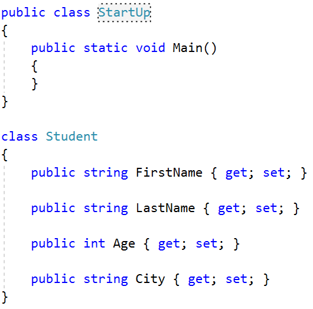

Read a list of students.

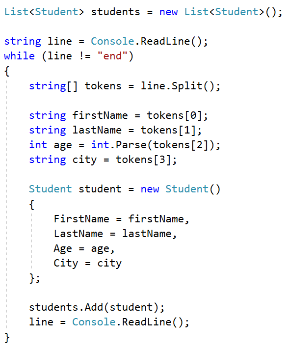

Read a city name and print only students which are from the given city.

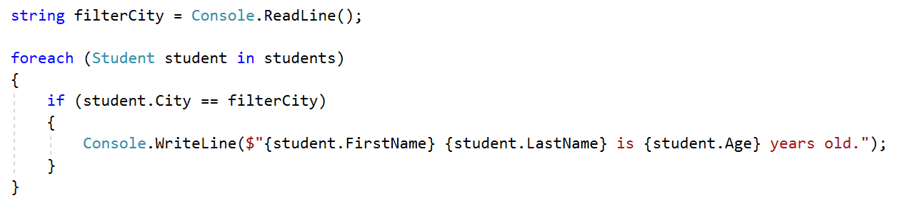

You can filter the students with LINQ.

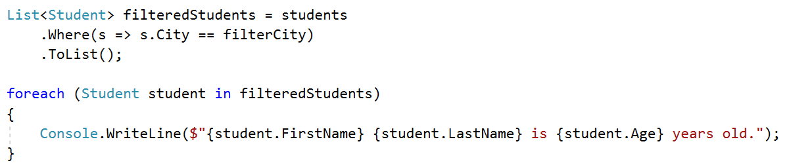

## Students 2.0

Use the class from the previous problem. If you receive a student, which
already exists (**first name** and **last name** should be **unique**)
overwrite the information.

<table>
<thead>
<tr class="header">
<th><strong>Input</strong></th>
<th><strong>Output</strong></th>
</tr>
</thead>
<tbody>
<tr class="odd">
<td>
<strong>John Smith 15 Sofia</strong>

<strong>Peter Ivanov 14 Plovdiv</strong>

<strong>Peter Ivanov 25 Plovdiv</strong>

<strong>Linda Bridge 16 Sofia</strong>

<strong>Linda Bridge 27 Sofia</strong>

<strong>Simon Stone 12 Varna</strong>

<strong>end</strong>

Sofia
</td>
<td>
John Smith is 15 years old.

Linda Bridge is 27 years old.
</td>
</tr>
<tr class="even">
<td>
<strong>Anthony Taylor 15 Chicago</strong>

<strong>David Anderson 16 Washington</strong>

<strong>Jack Lewis 14 Chicago</strong>

<strong>David Lee 14 Chicago</strong>

<strong>Jack Lewis 26 Chicago</strong>

<strong>David Lee 18 Chicago</strong>

<strong>end</strong>

<strong>Chicago</strong>
</td>
<td>
<strong>Anthony Taylor is 15 years old.</strong>

<strong>Jack Lewis is 26 years old.</strong>

<strong>David Lee is 18 years old.</strong>
</td>
</tr>
</tbody>
</table>

### Hints

Check if the given student already exists.

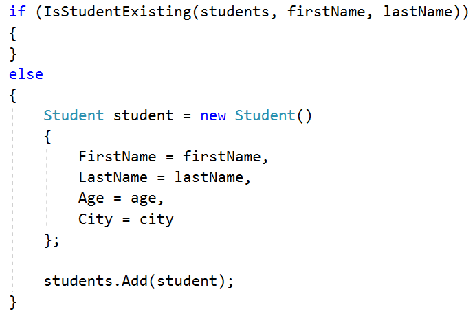

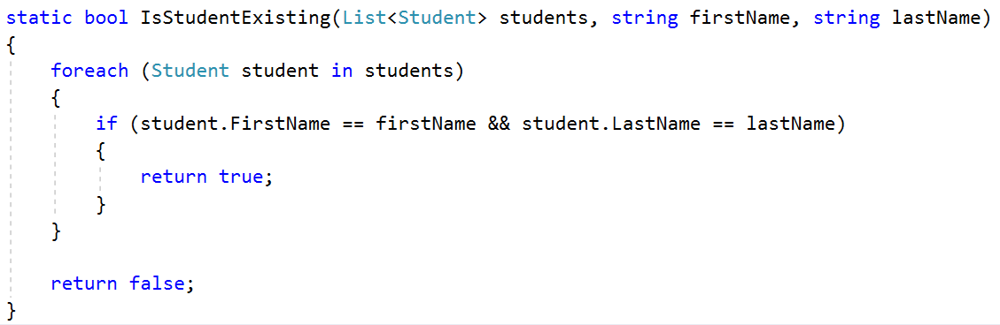

Overwrite the student information.

First, we have to find the existing student.

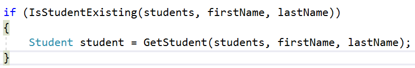

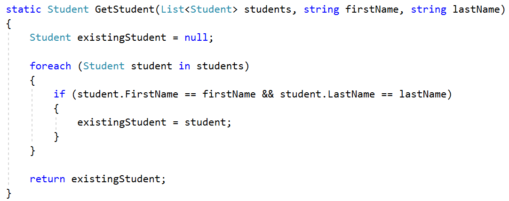

Finally, we have to overwrite the information.

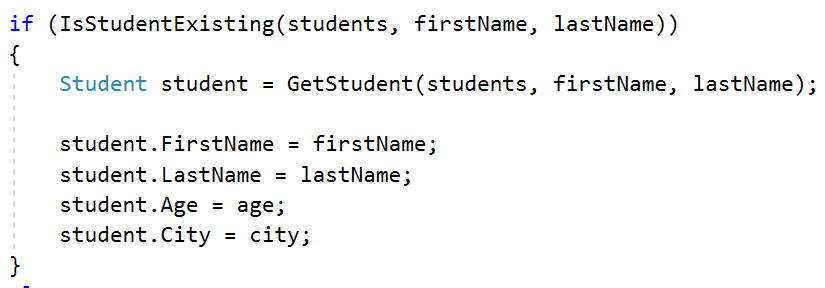

We can use LINQ as well.

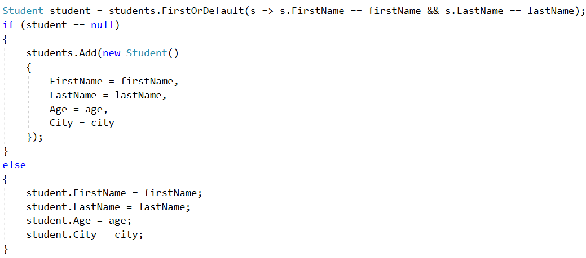

**FirstOrDefault** returns the first occurrence or the default value
(null in this case).

## Store Boxes

Define a class **Item,** which contains these properties: **Name and
Price.**

Define a class **Box,** which contains these properties: **Serial
Number, Item, Item Quantity** and **Price for a Box.**

Until you receive **"end",** you will be receiving data in the following
format: **{Serial Number} {Item Name} {Item Quantity} {itemPrice}**

The **Price of one box** has to be calculated: **itemQuantity \*
itemPrice.**

Print all the boxes, ordered descending by price for a box, in the
following format:

**{boxSerialNumber}**

**-- {boxItemName} – ${boxItemPrice}: {boxItemQuantity}**

**-- ${boxPrice}**

The price should be **formatted to the 2nd digit after the
decimal separator**.

### Examples

<table>
<thead>
<tr class="header">
<th><strong>Input</strong></th>
<th><strong>Output</strong></th>
</tr>
</thead>
<tbody>
<tr class="odd">
<td>
<strong>19861519 Dove 15 2.50</strong>

<strong>86757035 Butter 7 3.20</strong>

<strong>39393891 Orbit 16 1.60</strong>

<strong>37741865 Samsung 10 1000</strong>

<strong>end</strong>
</td>
<td>
37741865

-- Samsung - $1000.00: 10

-- $10000.00

19861519

-- Dove - $2.50: 15

-- $37.50

39393891

-- Orbit - $1.60: 16

-- $25.60

86757035

-- Butter - $3.20: 7

-- $22.40
</td>
</tr>
<tr class="even">
<td>
<strong>48760766 Alcatel 8 100</strong>

<strong>97617240 Intel 2 500</strong>

<strong>83840873 Milka 20 2.75</strong>

<strong>35056501 SneakersXL 15 1.50</strong>

<strong>end</strong>
</td>
<td>
<strong>97617240</strong>

<strong>-- Intel - $500.00: 2</strong>

<strong>-- $1000.00</strong>

<strong>48760766</strong>

<strong>-- Alcatel - $100.00: 8</strong>

<strong>-- $800.00</strong>

<strong>83840873</strong>

<strong>-- Milka - $2.75: 20</strong>

<strong>-- $55.00</strong>

<strong>35056501</strong>

<strong>-- SneakersXL - $1.50: 15</strong>

<strong>-- $22.50</strong>
</td>
</tr>
</tbody>
</table>

### Hints

This is how your class Box should look like:

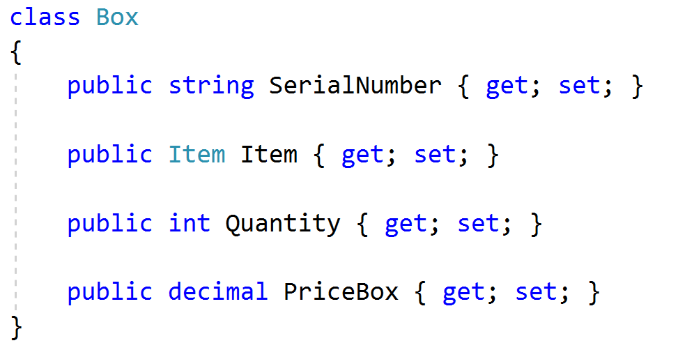

Create an **instance** of **Item** in such a way, that when you try to
set a value to some of the properties, it will not throw you an
exception.

There are two ways to do that:

First you can create a new instance of **Item** in the **Box
constructor**.

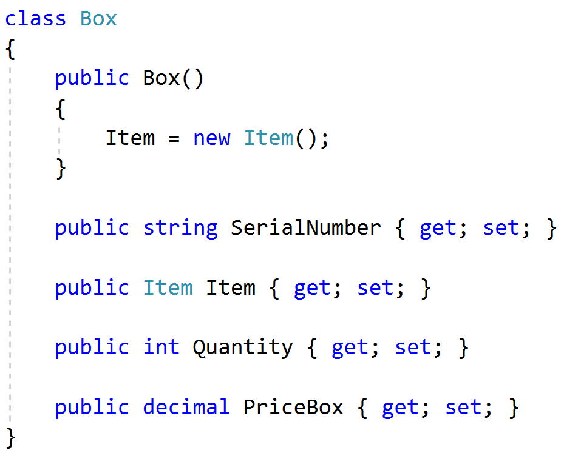

Or every time you create a new Box, on the next line just access the
Item property and create a new instance.

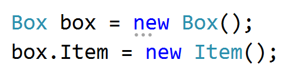

## Vehicle Catalogue 

Your task is to **create a Vehicle catalogue,** which contains only
**Trucks** **and** **Cars**.

Define a class **Truck** with the following properties: **Brand, Model
and Weight**.

Define a class **Car** with the following properties: **Brand, Model and
Horse Power**.

Define a class **Catalog** with the following properties: **Collections
of** **Trucks and Cars**.

You must read the input until you receive the "**end**" command. It will
be in following format: **{type}/{brand}/{model}/{horse power /
weight}**

In the end you have **to print all of the vehicles ordered alphabetical
by brand,** in the following format:

**Cars:**

**{Brand}: {Model} - {Horse Power}hp**

**Trucks:**

**{Brand}: {Model} - {Weight}kg**

### Examples

<table>
<thead>
<tr class="header">
<th><strong>Input</strong></th>
<th><strong>Output</strong></th>
</tr>
</thead>
<tbody>
<tr class="odd">
<td>
<strong>Car/Audi/A3/110</strong>

<strong>Car/Maserati/Levante/350</strong>

<strong>Truck/Mercedes/Actros/9019</strong>

<strong>Car/Porsche/Panamera/375</strong>

<strong>end</strong>
</td>
<td>
Cars:

Audi: A3 - 110hp

Maserati: Levante - 350hp

Porsche: Panamera - 375hp

Trucks:

Mercedes: Actros - 9019kg
</td>
</tr>
<tr class="even">
<td>
<strong>Car/Subaru/Impreza/152</strong>

<strong>Car/Peugeot/307/109</strong>

<strong>end</strong>
</td>
<td>
<strong>Cars:</strong>

<strong>Peugeot: 307 - 109hp</strong>

<strong>Subaru: Impreza - 152hp</strong>
</td>
</tr>
</tbody>
</table>

### Hints

This is how your class **Catalog** should look like.

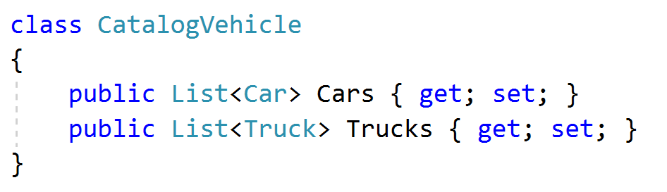

Don’t forget to **create instances** **for the two** **Lists**.

You can do it in the **constructor of CatalogueVehicle.**
