# Lab: Dictionaries, Lambda and LINQ

Problems for in-class lab for the  
You can check your solutions in
[Judge](https://judge.softuni.bg/Contests/1212)

# Associative Arrays

## Count Real Numbers

Read a **list of integers** and **print them in ascending order,** along
with their **number of occurrences**.

### Examples

<table>
<thead>
<tr class="header">
<th><strong>Input</strong></th>
<th><strong>Output</strong></th>
<th></th>
<th><strong>Input</strong></th>
<th><strong>Output</strong></th>
<th></th>
<th><strong>Input</strong></th>
<th><strong>Output</strong></th>
</tr>
</thead>
<tbody>
<tr class="odd">
<td>8 2 2 8 2</td>
<td>
2 -&gt; 3

8 -&gt; 2
</td>
<td></td>
<td>1 5 1 3</td>
<td>
1 -&gt; 2

3 -&gt; 1

5 -&gt; 1
</td>
<td></td>
<td>-2 0 0 2</td>
<td>
-2 -&gt; 1

0 -&gt; 2

2 -&gt; 1
</td>
</tr>
</tbody>
</table>

### Hints

Read an array of doubles:

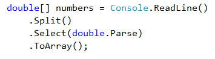

Use **SortedDictionary\<double,** **int\>** named **counts**.

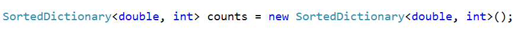

Pass through each of the numbers and increase their count -
**counts\[num\]**, if **num** exists in the dictionary, or assign
**counts\[num\]** = **1**, if the number does not exist in the
dictionary. We are assigning it that value, beacause it is its first
occurance. The count represents the occurances.

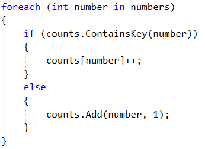

Pass through all of the numbers in the dictionary and print the number
**num** and its count of occurrences.

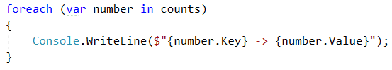

## Odd Occurrences

Write a program that extracts all elements from a given sequence of
words that are present in it an **odd number of times**
(case-insensitive).

  - Words are given on a single line, space separated.

  - Print the result elements in lowercase, in their order of
    appearance.

### Examples

| **Input**                      | **Output** |
| ------------------------------ | ---------- |
| Java C\# PHP PHP JAVA C java   | java c\# c |
| 3 5 5 hi pi HO Hi 5 ho 3 hi pi | 5 hi       |
| a a A SQL xx a xx a A a XX c   | a sql xx c |

### Hints

Read a line from the console and split it by a space

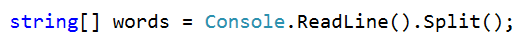

Use a **dictionary** (**string** **int**) to count the occurrences of
each word

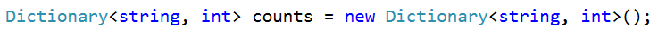

Pass through each of the elements in the array and count each word.

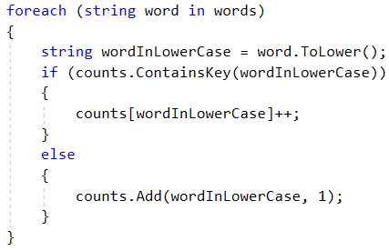

Pass through the dictionary and print words that occures odd times.

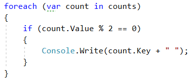

## Word Synonyms

Write a program, which keeps a dictionary with synonyms. The **key** of
the dictionary will be the **word**. The **value** will be a **list of
all the synonyms of that word**. You will be given a number **n – the
count of the words**. After each word, you will be given a synonym, so
the count of lines you have to read from the console is **2 \* n.** You
will be receiving a **word** and a **synonym** each on a separate line
like this:

  - {**word**}

  - {**synonym**}

If you get the same word twice, just add the new synonym to the list.

Print the words in the following format:

**{word} - {synonym1, synonym2… synonymN}**

### Examples

<table>
<thead>
<tr class="header">
<th><strong>Input</strong></th>
<th><strong>Output</strong></th>
</tr>
</thead>
<tbody>
<tr class="odd">
<td>
3

cute

adorable

cute

charming

smart

clever
</td>
<td>
cute - adorable, charming

smart - clever
</td>
</tr>
<tr class="even">
<td>
2

task

problem

task

assignment
</td>
<td>task – problem, assignment</td>
</tr>
</tbody>
</table>

### Hints

  - Use a **dictionary (string -\> List\<string\>)** to keep all of the
    synonyms.

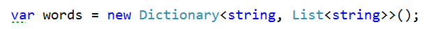

  - **Read n \* 2 lines**

  - **Add the word in the dictionary if it is not present**

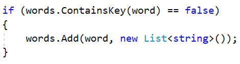

  - **Add the synonym as a value to the given word**

> 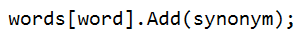

  - Print each word with the synonyms in the required format

# LINQ

## Largest 3 Numbers

Read a **list of integers** and **print the largest 3 of them**. If
there are less than 3, print all of them.

### Examples

| **Input**        | **Output** |  | **Input** | **Output** |
| ---------------- | ---------- |  | --------- | ---------- |
| 10 30 15 20 50 5 | 50 30 20   |  | 20 30     | 30 20      |

### Hints

  - Read an array of integers

  - **Order the array using a LINQ query**

> 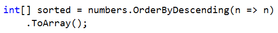

  - **Print top 3 numbers with for loop**

## Word Filter

Read an array of strings and take only words, whose length is even.
Print each word on a new line.

### Examples

<table>
<thead>
<tr class="header">
<th><strong>Input</strong></th>
<th><strong>Output</strong></th>
</tr>
</thead>
<tbody>
<tr class="odd">
<td>kiwi orange banana apple</td>
<td>
kiwi

orange

banana
</td>
</tr>
<tr class="even">
<td>pizza cake pasta chips</td>
<td>cake</td>
</tr>
</tbody>
</table>

  - Read an array of strings

  - Filter those whose length is even

> 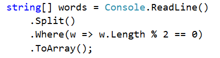

  - Print each word on a new line
