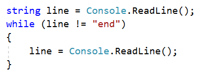
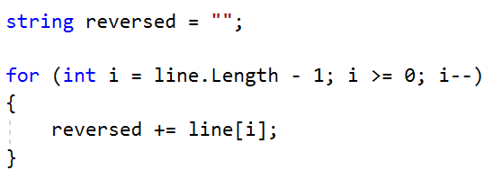
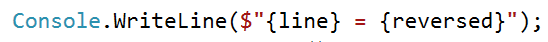
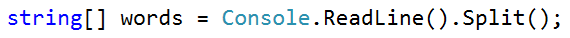
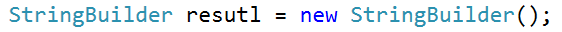
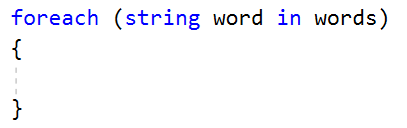
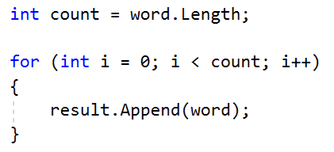

# Lab: Strings and Text Processing

Problems for in-class lab for the
[.](https://softuni.bg/modules/57/tech-module-4-0)

You can check your solutions here:
[Judge](https://judge.softuni.bg/Contests/1216)

## Reverse Strings

You will be given series of strings until you receive an **"end"**
command. Write a program that reverses strings and prints each pair on
separate line in format **"{word} = {reversed word}"**.

### Examples

<table>
<thead>
<tr class="header">
<th><strong>Input</strong></th>
<th><strong>Output</strong></th>
</tr>
</thead>
<tbody>
<tr class="odd">
<td>
helLo

Softuni

bottle

end
</td>
<td>
helLo = oLleh

Softuni = inutfoS

bottle = elttob
</td>
</tr>
<tr class="even">
<td>
Dog

caT

chAir

end
</td>
<td>
Dog = goD

caT = Tac

chAir = riAhc
</td>
</tr>
</tbody>
</table>

### Solution

Use while loop and read strings until you receive "end".

Reverse the string with for loop. Start from the last index and append
each symbol to the new string.

Print the reversed string in the specified format.

## Repeat Strings

### Write a program that reads an array of strings. Each string is repeated N times, where N is the length of the string. Print the concatenated string.

### Examples

| **Input**  | **Output**             |
| ---------- | ---------------------- |
| hi abc add | hihiabcabcabcaddaddadd |
| work       | workworkworkwork       |
| ball       | ballballballball       |

### Solution

  - Read a string array.

  - Initialize **StringBuilder**.

  - Iterate through elements in the array.

  - Find the length of the current word and append it.

  - Print the **StringBuilder**.

## Substring

On the **first line** you will receive a **string**. On the **second
line** you will receive a second **string**. Write a program that
**removes** **all** of the **occurrences** of the **first** string
**in** the **second** **until** there is **no match**. At the end
**print** the **remaining string**.

### Examples

<table>
<thead>
<tr class="header">
<th><strong>Input</strong></th>
<th><strong>Output</strong></th>
<th><strong>Comment</strong></th>
</tr>
</thead>
<tbody>
<tr class="odd">
<td>
Ice

kicegiciceeb
</td>
<td>kgb</td>
<td>
We remove ice once and we get "kgiciceeb"

We match "ice" one more time and we get "kgiceb"

There is one more match. The finam result is "kgb"
</td>
</tr>
</tbody>
</table>

### Hints

  - Read the input.

  - Find the first index where the key appears.
    
      - Use the built-in method **IndexOf**()

  - Remove the match.
    
      - Use the built-in method **Remove**(index, length)

  - Repeat it until the text doesn't contain the key anymore.

## Text Filter

Write a program that takes a **text** and a **string of banned words**.
All words included in the ban list should be replaced with **asterisks**
"**\***", equal to the word's length. The entries in the ban list will
be separated by a **comma** and **space** "**,** ".

The ban list should be entered on the first input line and the text on
the second input line.

### Examples

<table>
<thead>
<tr class="header">
<th><strong>Input</strong></th>
<th><strong>Output</strong></th>
</tr>
</thead>
<tbody>
<tr class="odd">
<td>
Linux, Windows

It is not <strong>Linux</strong>, it is GNU/<strong>Linux</strong>. <strong>Linux</strong> is merely the kernel, while GNU adds the functionality. Therefore we owe it to them by calling the OS GNU/<strong>Linux</strong>! Sincerely, a <strong>Windows</strong> client
</td>
<td>It is not *****, it is GNU/*****. ***** is merely the kernel, while GNU adds the functionality. Therefore we owe it to them by calling the OS GNU/*****! Sincerely, a ******* client</td>
</tr>
</tbody>
</table>

### Hints

  - Read the input.

  - Replace all ban words in the text with asterisk (\*).
    
      - Use the built-in method **Replace**(banWord, replacement).
    
      - Use **new string(**char ch, int repeatCount**)** to create the
        replacement

## Digits, Letters and Other

Write a program that receives a **single** **string** and on the
**first** **line** prints **all the digits**, on the **second** – **all
the letters**, and on the **third** – **all the other characters**.
**There will always be at least one digit, one letter and one other
characters.**

### Examples

<table>
<thead>
<tr class="header">
<th><strong>Input</strong></th>
<th><strong>Output</strong></th>
</tr>
</thead>
<tbody>
<tr class="odd">
<td>Agd#53Dfg^&amp;4F53</td>
<td>
53453

AgdDfgF

#^&amp;
</td>
</tr>
</tbody>
</table>

### Hints

  - Read the input.

  - Use loop to iterate through all characters in the text. If the char
    is digit print it, otherwise ignore it.
    
      - Use char.**IsDigit**(char symbol)

  - Do the same for the letters and other chars
    
      - Find something like IsDigit method for the letters.
