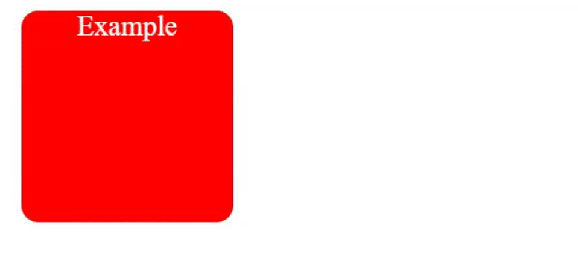
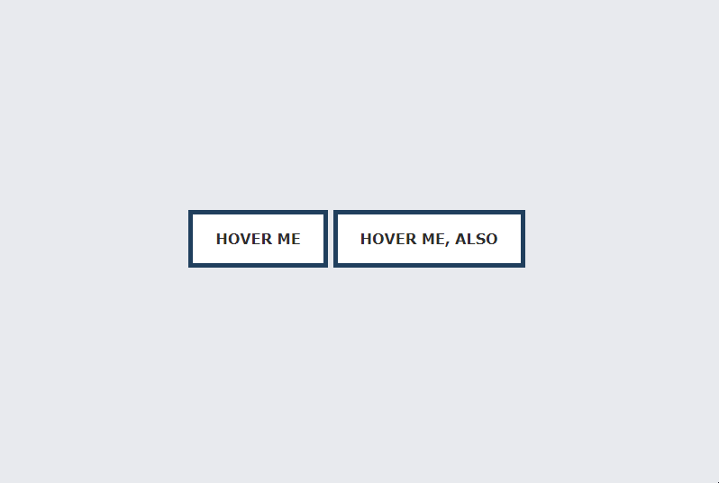

# CSS Transitions, Animations and Transformations

Problems for exercises and homework for the ["CSS Advanced" course @
SoftUni](https://softuni.bg/trainings/3042/css-advanced-july-2020).
Submit your homework in the SoftUni course instance page at
<https://softuni.bg/trainings/2871/css-advanced-july-2020/>.

## Box Change

Create a page like the following:

### Constraints

  - Update the following box properties with transition **ease** effect
    
      - width;
    
      - height;
    
      - background-color;
    
      - font-size;
    
      - left;
    
      - top;
    
      - color;

## Circle to Box Animation

Create a page like the following:

### Constraints

  - Create a **small** **red** **circle**

  - **Center** the circle in the viewport

  - **Animate** that circle to a **square** and **back** to **circle**

## Fancy List Animation

Create a page like the following:

### Constraints

  - Create a **list** **of** **items** with icons

  - Animate the showing of **each** **element**

  - Use **animation-delay** to make the appearance of the elements
    staggered

## Animating Gradients

Create a page like the following:

### Constraints

  - Create an empty **div** element

  - Use **:before** and **:after** pseudo elements with position
    absolute to make them as big as their container

  - Add different gradients on the **:before** and **:after** elements

  - Animate between the different gradients by using **opacity** on the
    top most element

## Border Animation

Create a page like the following:

### Constraints

  - Use **a** tag to create **two** **buttons**

  - Set the buttons **outline** to be **5px** with **dark** **blue** color

  - When the buttons are **hover** change the **outline** **width**

## Rotated Rectangle

Create a page like the following:

### Constraints

  - Use the transform **rotate** function to rotate the **image**
    **wrapper**

  - Use **rotate** both for the image and the image wrapper

  - Add overlay with **opacity** to the image wrapper
