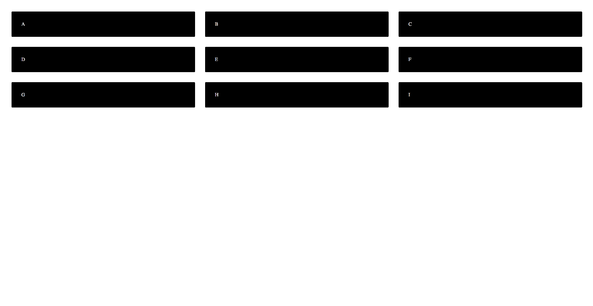
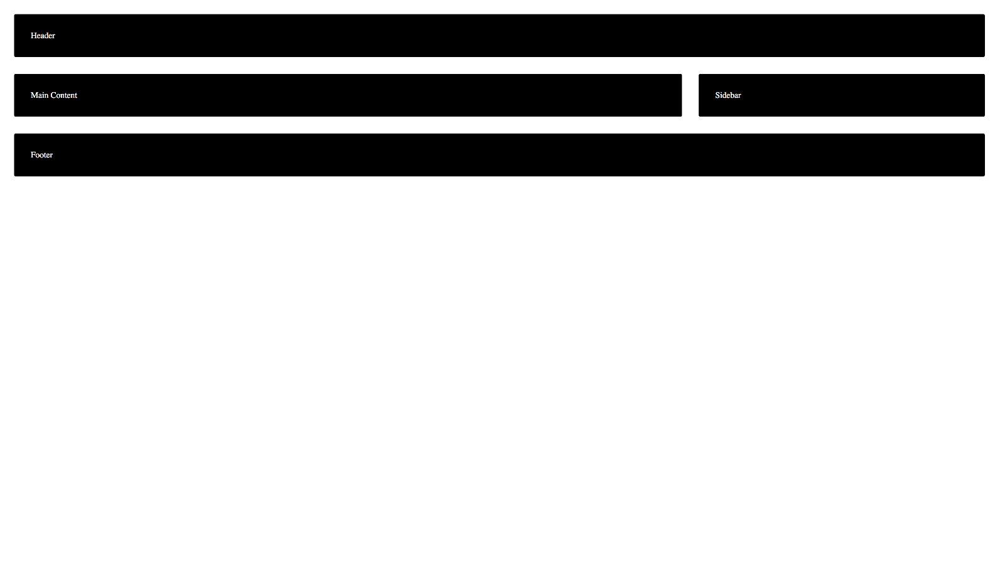
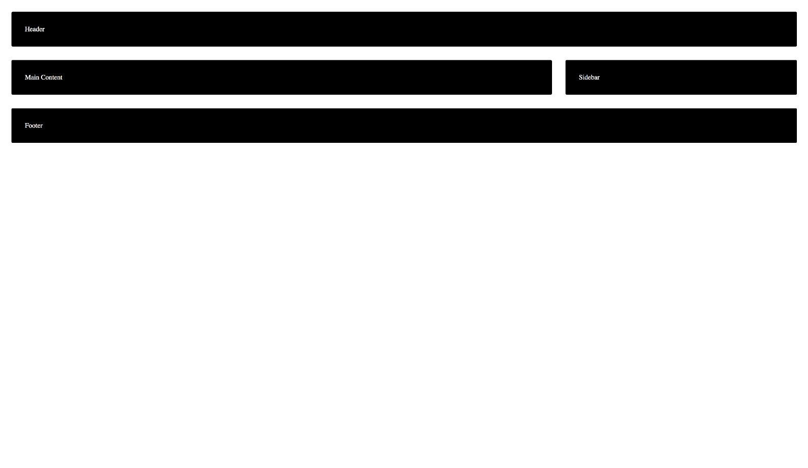
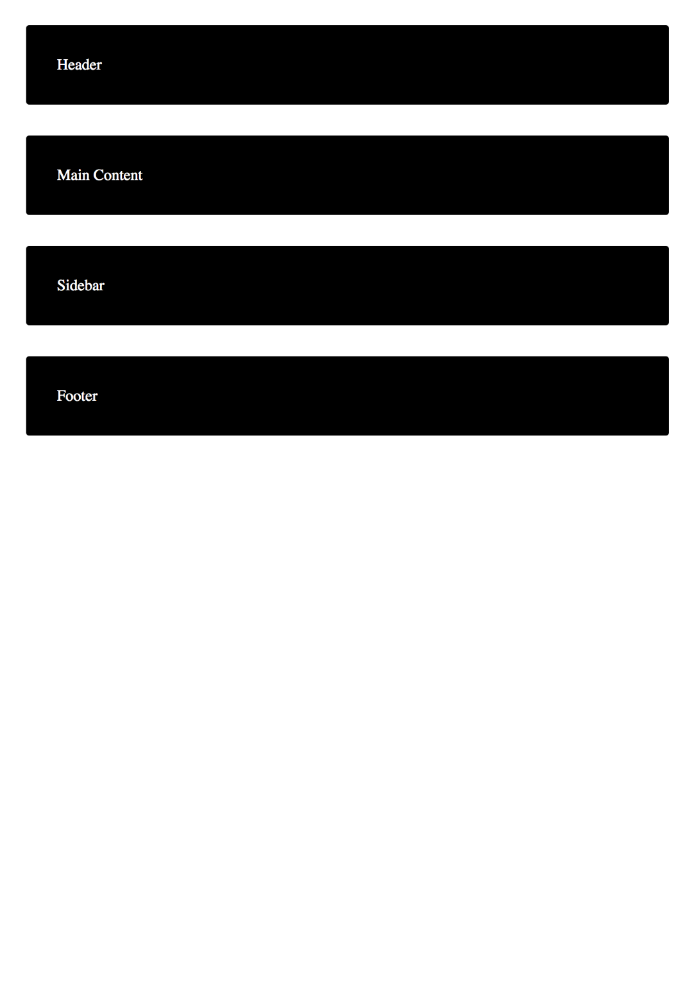
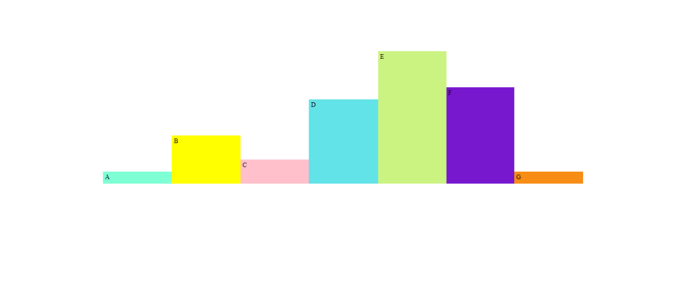
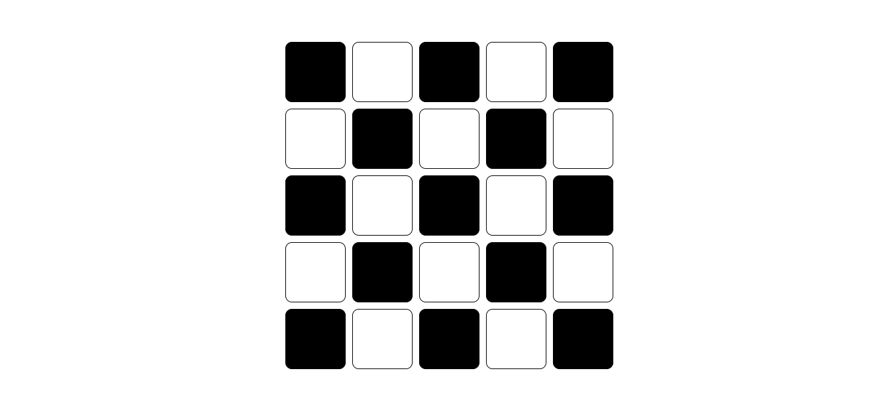
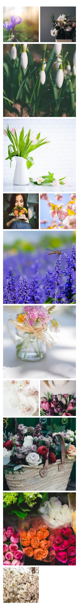

# CSS Grid

Problems for exercises and homework for the ["CSS Advanced" course @
SoftUni](https://softuni.bg/trainings/3042/css-advanced-july-2020).

## Simple Grid

Create a web page like the following:

  - Use **article** tags to create the containers with **letters** inside

  - Set to the body **display** property **grid**

## Basic Blog Layout

Create a web page like the following:

### Constraints

  - Create the following elements using semantic tags:
    **header**,  **main**, **sidebar** and **footer**

  - Arrange them in the basic blog **layout** by using **display** property **grid**

## Grid Named Areas

Create a web page like the following:

### Hints

  - Copy the code from the previous exercise (**Basic Blog Layout**)

  - Update the grid definition to use **named areas**

  - **Update the element placing to use the named areas**

## Grid Areas Media Queries

Create a web page like the following for **desktop** and **mobile**:

### Hints

  - Copy the code from the previous exercise (**Grid Named Areas**)

  - Redefine the grid using **Media** **Queries** for the screen **under** **1024px** **width**

## Colorful Statistic Diagram

Create a web page like the following:

  - Use **article** tags to create the containers with **letters** inside

## Grid Chess Board

Create a web page like the following:

  - Use **div** tags to create **25 empty boxes**

## Grid Gallery

Create a web page like the following for **desktop** and **mobile**:

> 
> 
> 

  - Use **img** tags to display the pictures

  - Set to the body **display** property **grid**

  - Redefine the grid using **Media** **Queries** when the screen has **800px** width
