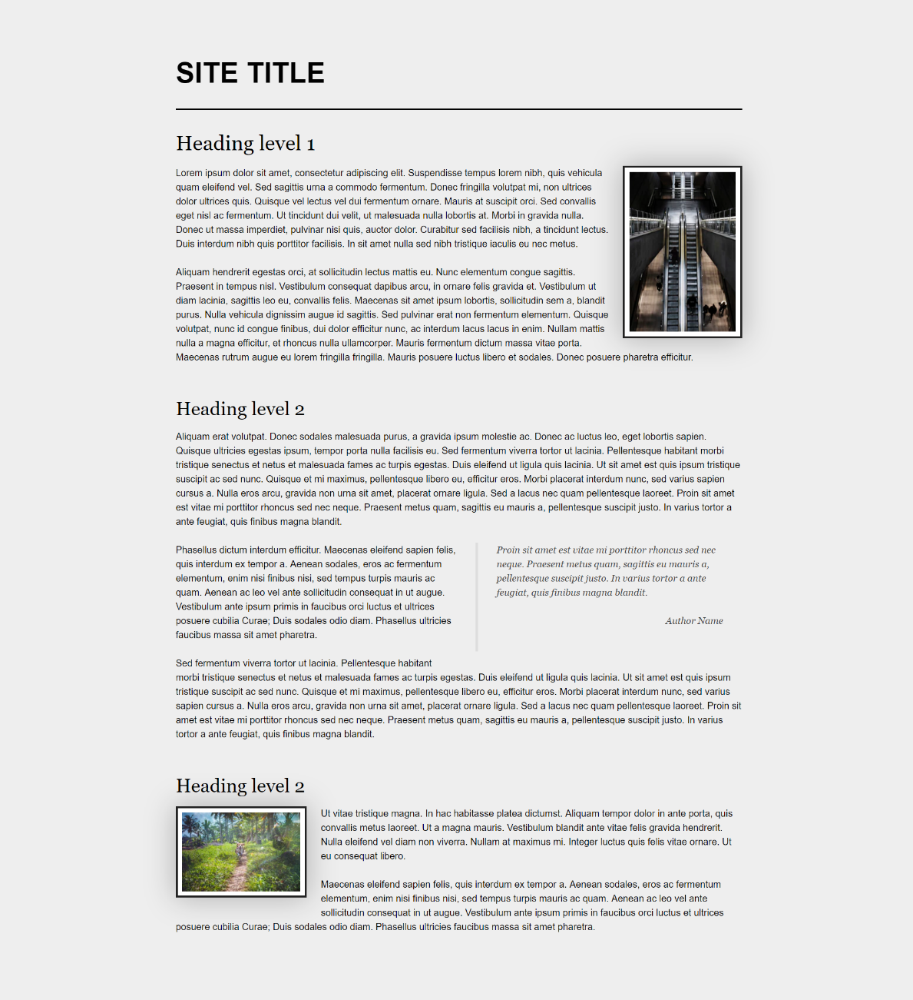
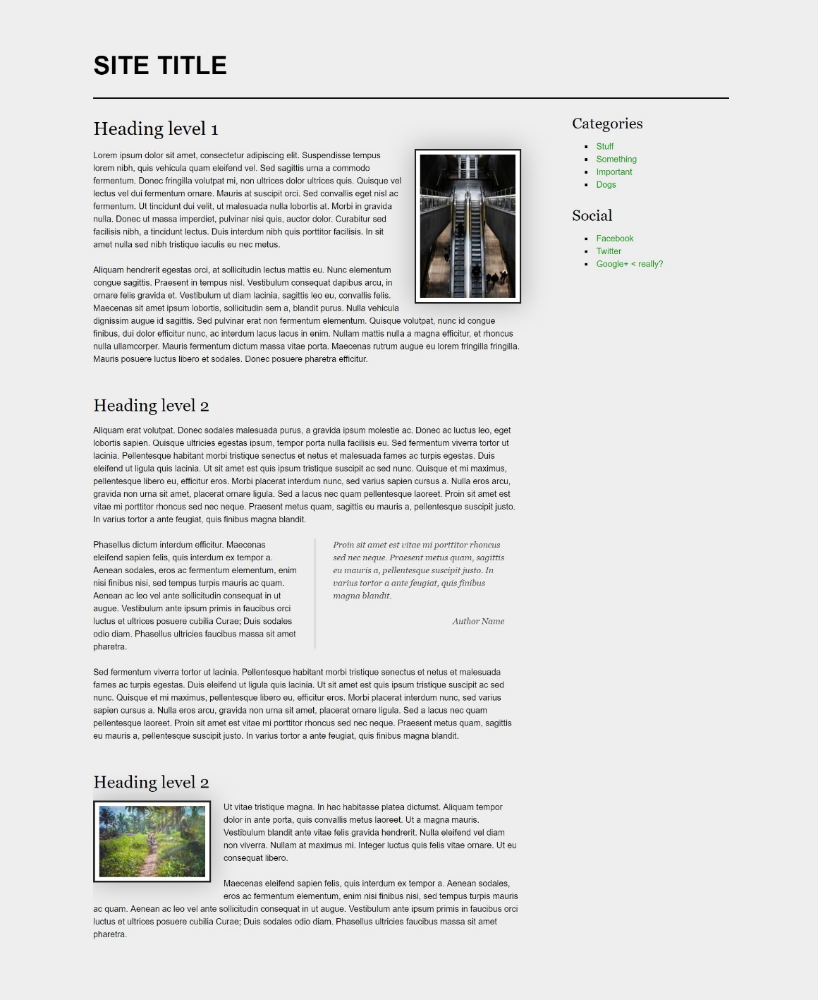
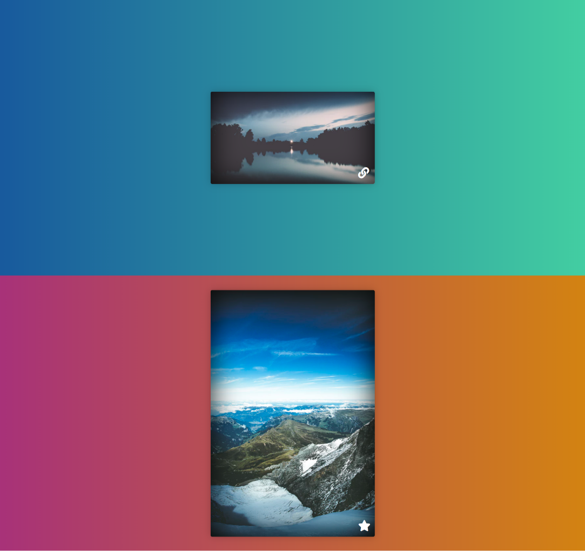
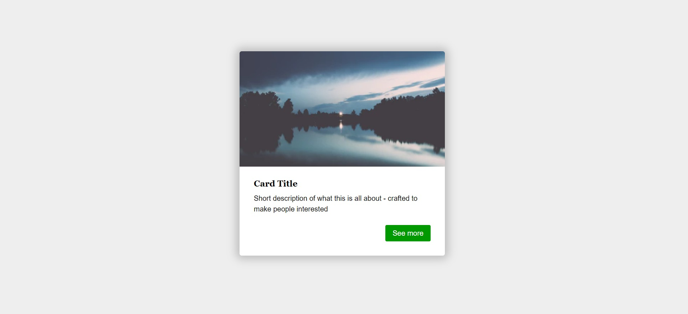
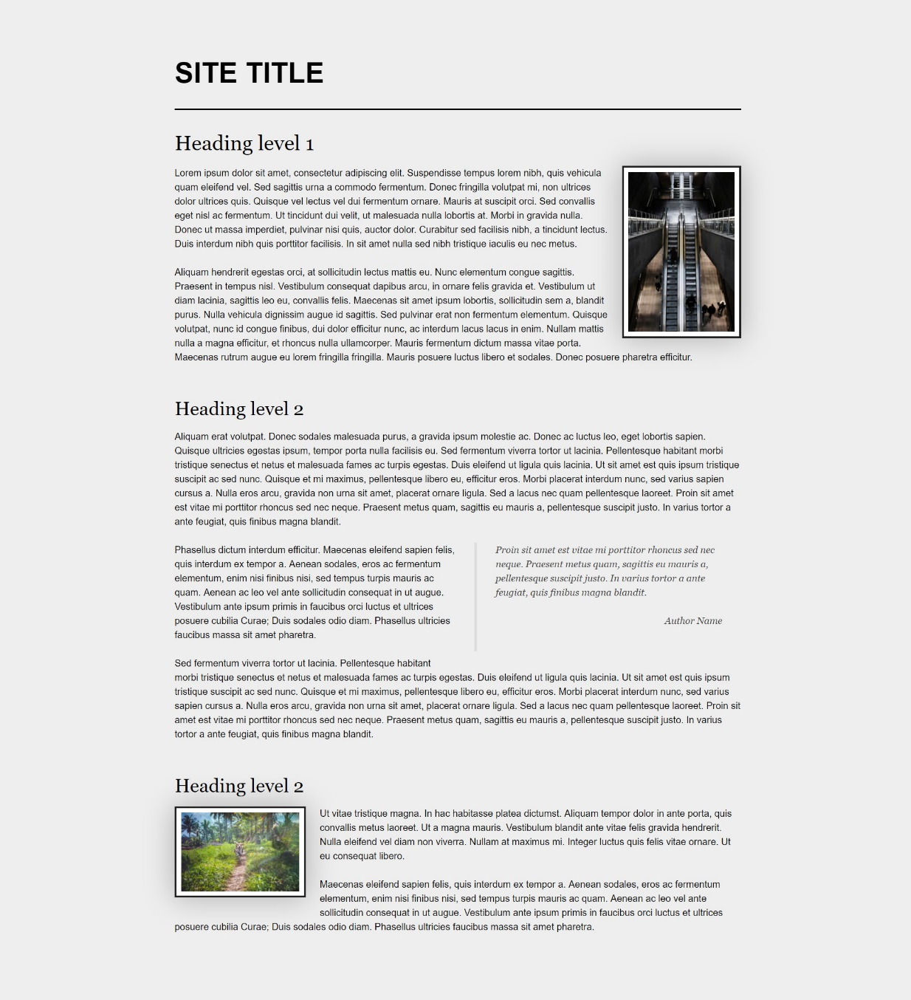
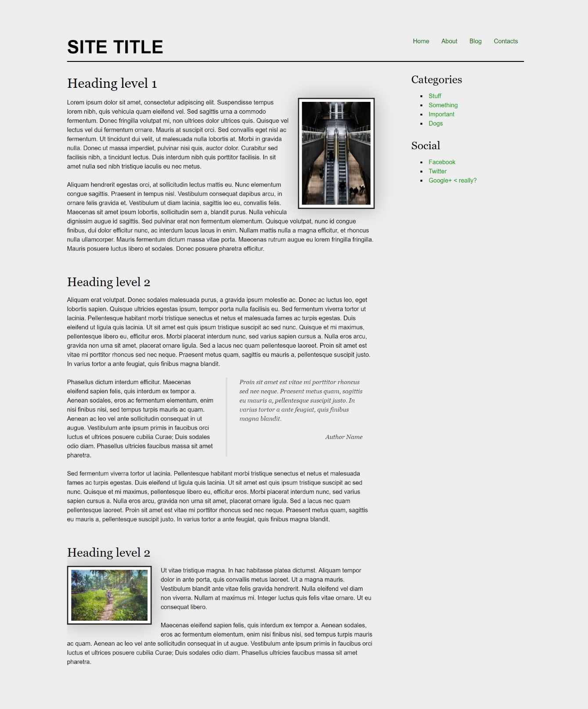
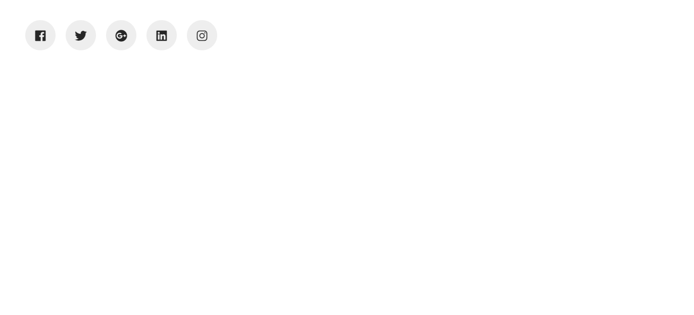

# Exercise: **Position & Float**

Problems for exercises and homework for the ["HTML and CSS" course @
SoftUni](https://softuni.bg/trainings/2983/html-and-css-may-2020).
Submit your solutions in the SoftUni Judge system at
<https://judge.softuni.bg/Contests/#!/List/ByCategory/134/HTML-and-CSS-Exercises>.

# Article with Quotes and Media

You can take an old solution of this task and modify them to match the
requirements. Create a web page like the following:

### Constraints

  - Divide your content into **header** and **main** tags

  - The entire page font should have the following properties:
    
      - Size - **16px**
    
      - Line height - **1.5**
    
      - Font family - **Helvetica, sans-serif**

  - Add class site-title to the paragraph in the
    header (**p.site-title**)
    
      - Change the display property to **inline-block**
    
      - Set the font weight to **bold**

  - Transform the text to **uppercase**

## Blog Layout - Float

Create a web page like the following:

### Constraints

  - Change the document **title** to "**Blog Layout - Float**"

  - Divide your content into **header**, **main** and **aside** tags
    
      - Create a paragraph inside the **header** for the site title
    
      - Create an **article** inside the **main**
    
      - Create two **sections** inside the **aside**
        
          - The sections should have a **h3** heading and a navigation
            - **nav** with **ul**, **li** and **a** elements

  - Use **rgb(238, 238, 238)** for body background

  - Use **rgb(255, 255, 255)** for image background and **rgba(0, 0, 0,
    0.25)** for image box shadow

  - Use font family **Georgia, serif** for the blockquote

  - Use font family **Georgia, serif** with size **1em/1.2** for the
    headings

  - Use **float** property to position the first image on the right

  - Use **float** property to position the second image on the left

## Position Playground

Create a web page like the following:

### Constraints

  - Change the document title to "**Positioning Playground**"

  - Import [Font
    Awesome](https://fontawesome.com/) into your **CSS** file

  - Add two container units **(divs)** with class **viewport** inside
    the body
    
      - Inside each one add section with
        class **card** *(***section.card***)*
        
          - Change the display property to **block**
        
          - Try to center the section with position
            property **absolute**

##  Center Position and Transform

Create a web page like the following:

### Constraints

  - Change the document title to "**Center Position and Transform**"

  - Create section with two **divs**
    
      - Look the screenshot for the inner items

  - Use **rgb(238, 238, 238)** for body background

  - Use **rgb(255, 255, 255)** for card background

  - Use **rgb(0, 153, 0)** for card button background

  - Use font **Georgia, serif** with size **1em/1.2** for the headings

  - Set the image position property to **absolute**

## Floating Images and Quotes

Create a web page like the following:

### Constraints

  - Change the document title to "**Floating Images and Quotes**"

  - Create a **header** with **h1** inside

  - Add an **article** and look the screenshot for some insight for the
    other items inside

  - Use color - **rgb(238, 238, 238) **for body background

  - Use color - **rgb(255, 255, 255)** for image background
    and **rgba(0, 0, 0, 0.25)** for image box shadow

  - Use font family **Georgia, serif** for the blockquote and headings

## Navigation Float

Create a web page like the following:

### Constraints

  - Change the document title to "**Navigation - Float**"

  - Create a **header **with a **p** for as title
    
      - Inside the **header** add a **nav **with a **ul **and
        4 **li** elements

  - Create a **main**, which contains an **article** with
    a **header** and **h1** heading
    
      - Add a **section** inside the **article**

  - Create an **aside** element with two sections inside
    
      - The sections should have a **h3** heading and a navigation
        - **nav** with **ul**, **li** and **a** elements

  - Use **rgb(0, 102, 0)** for the anchors

  - Use **rgb(238, 238, 238)** for body background

  - Use **rgb(255, 255, 255)** for image background and **rgba(0, 0, 0,
    0.25)** for image box shadow

  - Use font **Georgia, serif** for the blockquote

  - Use font **Georgia, serif **with size **1em/1.2 **for the headings

## Social Media Icons

Create a web page like the following:

### Constraints

  - Change the document title to "**Social Media Icons**"

  - All you need for your HTML are **ul**, **li** and **a** tags

  - Use **FontAwesome** to add social icons

  - Change the **ul** display property to **inline-block**

  - Remove list items default style

  - Each **a** tag must have **border-radius: 50%;**

  - Check the provided screenshots to see the **hover** effects
