# Lab: Objects and DOM

Problems for in-class lab for the ["JavaScript Essentials" course @
SoftUni](https://softuni.bg/courses/js-essentials). Submit your
solutions in the SoftUni judge system at
<https://judge.softuni.bg/Contests/1425/Lab-Objects-and-DOM>

## Towns to JSON

You’re tasked to create and print a JSON from a text table. You will
receive input as an array of strings, where each string represents a row
of a table, with values on the row encompassed by pipes **"|"** and
optionally spaces. The table will consist of exactly 3 columns
**“Town”**, **“Latitude”** and **“Longitude”**. The **latitude** and
**longitude** columns will always contain **valid numbers**. Check the
examples to get a better understanding of your task.

The **input** comes as an array of strings - the first string contains
the table’s headings, each next string is a row from the table.

The **output** should be printed on the console **stringified** - for
each entry row in the input print the object representing it.

### Examples

<table>
<thead>
<tr class="header">
<th><strong>Input</strong></th>
</tr>
</thead>
<tbody>
<tr class="odd">
<td>
['| Town | Latitude | Longitude |',

'| Sofia | 42.696552 | 23.32601 |',

'| Beijing | 39.913818 | 116.363625 |'];
</td>
</tr>
<tr class="even">
<td><strong>Output</strong></td>
</tr>
<tr class="odd">
<td>[{"Town":"Sofia","Latitude":42.69,"Longitude":23.32}, 
{"Town":"Beijing","Latitude":39.91,"Longitude":116.36}]</td>
</tr>
<tr class="even">
<td>Input</td>
</tr>
<tr class="odd">
<td>
['| Town | Latitude | Longitude |',

'| Veliko Turnovo | 43.0757 | 25.6172 |',

'| Monatevideo | 34.50 | 56.11 |']
</td>
</tr>
<tr class="even">
<td><strong>Output</strong></td>
</tr>
<tr class="odd">
<td>[{"Town":"Veliko Turnovo","Latitude":43.0757,"Longitude":25.6172}, 
{"Town":"Monatevideo","Latitude":34.5,"Longitude":56.11}]</td>
</tr>
</tbody>
</table>

## Sum by Town

You’re tasked with calculating the total sum of income for several
Towns. You will receive an array of strings representing towns and their
incomes, every **even** index will be a **town** and every **odd** index
will be an **income** belonging to that town. Create an object that will
hold all the **towns as keys** and their **total income** (the sum of
their incomes) **as values** to those keys and print it as a JSON.

The **input** comes as an array of strings - each even index is the name
of a town and each odd index is an income belonging to that town.

The **output** should be printed on the console - JSON representation of
the object containing all towns and their total incomes.

### Examples

<table>
<thead>
<tr class="header">
<th><strong>Input</strong></th>
<th><strong>Output</strong></th>
</tr>
</thead>
<tbody>
<tr class="odd">
<td>
Sofia

20

Varna

3

Sofia

5

Varna

4
</td>
<td>{"Sofia":25,"Varna":7}</td>
</tr>
<tr class="even">
<td>
Sofia

20

Varna

3

sofia

5

varna

4
</td>
<td><strong>{"Sofia":20,"Varna":3,"sofia":5,"varna":4}</strong></td>
</tr>
</tbody>
</table>

## Count Words in a Text

You are tasked to count the number of words in a text using an object as
an associative array, any combination of letters, digits and \_
(underscore) should be counted as a word. The words should be stored in
the object as properties - the **key** being the **word** and the
**value** being the **amount of times the word is contained** **in the
text**.

The **input** comes as an array of strings containing one entry - the
text whose words should be counted. The text may consist of more than
one sentence.

The **output** should be printed on the console - the JSON
representation of the object containing the words.

### Examples

| **Input**                                                             |
| --------------------------------------------------------------------- |
| Far too slow, you're far too slow.                                    |
| **Output**                                                            |
| {"Far":1,"too":2,"slow":2,"you":1,"re":1,"far":1}                     |
| Input                                                                 |
| JS devs use Node.js for server-side JS.-- JS for devs                 |
| **Output**                                                            |
| {"JS":3,"devs":2,"use":1,"Node":1,"js":1,"for":2,"server":1,"side":1} |

## Populations in Towns

You have been tasked to create a register for different **towns** and
their **population**.

The **input** comes as array of strings. Each element will contain data
for a town and its population in the following format:

“**{townName} \<-\> {townPopulation}**”

If you receive the same town twice, **you should add** the **given
population** to the **current one**.

As **output**, you must print all the towns, and their population.

### Examples

<table>
<thead>
<tr class="header">
<th><strong>Input</strong></th>
<th><strong>Output</strong></th>
</tr>
</thead>
<tbody>
<tr class="odd">
<td>
Sofia &lt;-&gt; 1200000

Montana &lt;-&gt; 20000

New York &lt;-&gt; 10000000

Washington &lt;-&gt; 2345000

Las Vegas &lt;-&gt; 1000000
</td>
<td>
<strong>Sofia : 1200000</strong>

<strong>Montana : 20000</strong>

<strong>New York : 10000000</strong>

<strong>Washington : 2345000</strong>

<strong>Las Vegas : 1000000</strong>
</td>
</tr>
</tbody>
</table>

<table>
<thead>
<tr class="header">
<th><strong>Input</strong></th>
<th><strong>Output</strong></th>
</tr>
</thead>
<tbody>
<tr class="odd">
<td>
<strong>Istanbul &lt;-&gt; 100000</strong>

<strong>Honk Kong &lt;-&gt; 2100004</strong>

<strong>Jerusalem &lt;-&gt; 2352344</strong>

<strong>Mexico City &lt;-&gt; 23401925</strong>

<strong>Istanbul &lt;-&gt; 1000</strong>
</td>
<td>
<strong>Istanbul : 101000</strong>

<strong>Honk Kong : 2100004</strong>

<strong>Jerusalem : 2352344</strong>

<strong>Mexico City : 23401925</strong>
</td>
</tr>
</tbody>
</table>

## Articles List

In this problem, you should create a JS functionality which creates
articles and appends them into some article section.

**The programs in this language are called scripts. They can be written
right in the HTML and executed automatically as the page loads.**

**Scripts are provided and executed as a plain text. They don't need a
special preparation or a compilation to run.**

**In this aspect, JavaScript is very different from another language
called Java.**

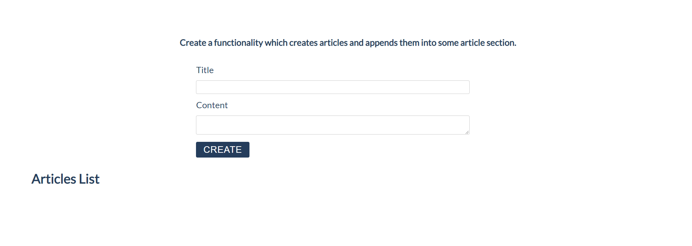

### Constraints:

  - **Title value** from the **title input** should be a **heading 3
    element \<h3\>**

  - **Content text** from the **textarea element** should be a
    **paragraph \<p\>**

  - Both new created elements (**h3** and **p**) should be appended to a
    new **article element \<article\>**

  - **The current article element** should be **appended** to the
    section which has an id articles (**\#articles**)

  - You should create new **article element** only if **title** and
    **content are not empty**

  - After the button is pressed you must **clear** the **title value**
    and **text value**

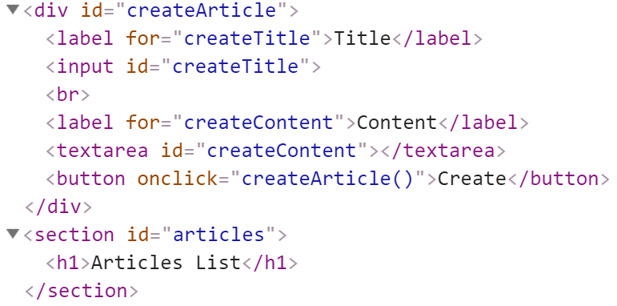

### Input:

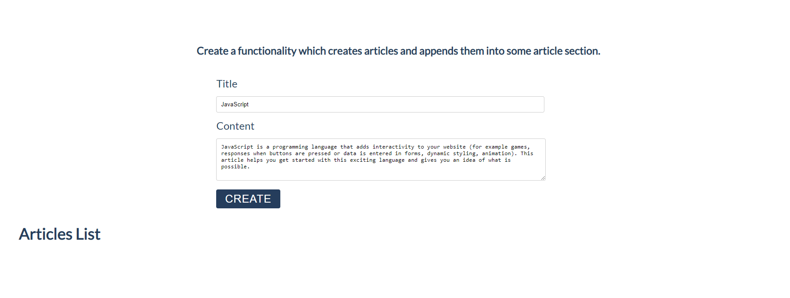

### Output:

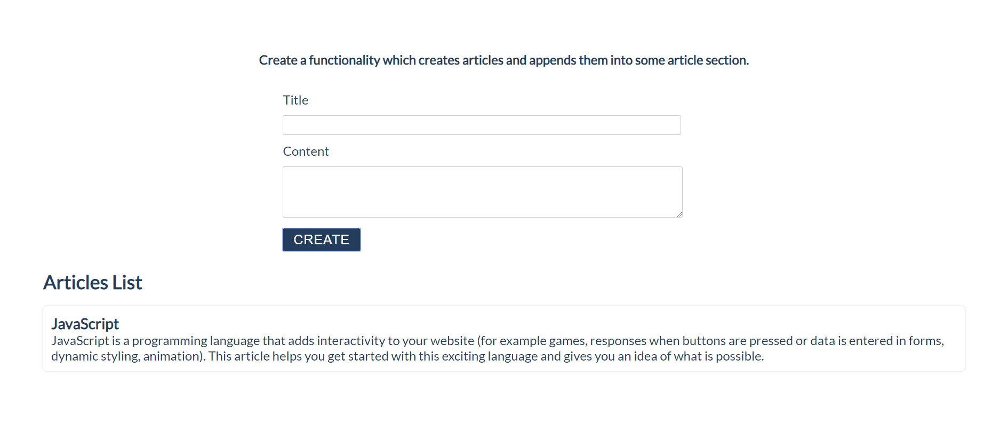

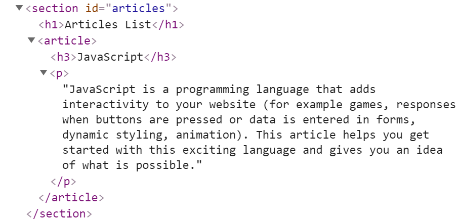

## Format the Text

In this problem, you should **create a JS functionality** which
**formats the given text into paragraphs.**

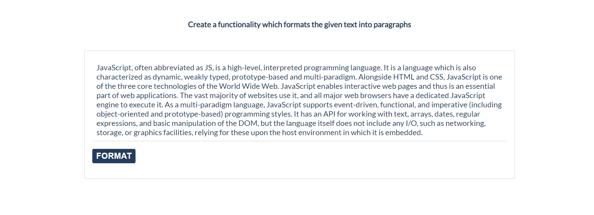

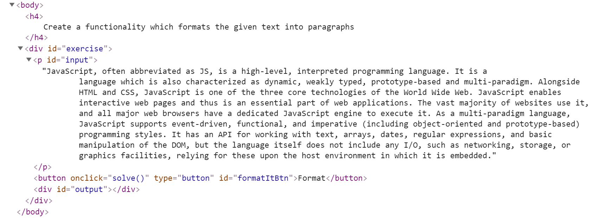

When the \[**Format**\] **button is clicked**, you need to **format the
text** **inside** the **paragraph** with an **id** "**input**". The
formatting is **done** as **follows:**

  - You need to **create a new paragraph element which holds no more
    than 3 sentences from the given input.**

  - If the given input contains **less** or **3 sentences**, you need to
    create only 1 paragraph, fill it with these sentences and append
    this paragraph to the div with an **id** "**output**".

Otherwise, when you have more than 3 sentences in that **input
paragraph,** you need to create enough paragraphs to get all sentences
from the **input text.**

Just remember to **restrict** the **sentences** in **each paragraph to
3.**

### Example:

  - If the input paragraph **contains 2 sentences**, you need to create
    only **1 paragraph** with these 2 sentences

  - If the input paragraph **contains 7 sentences,** you need to create
    **3 paragraphs**  
    **- The first paragraph** must **contain the first 3 sentences**  
    **- The second paragraph** must **contain the other three sentences
    of the whole text**  
    \- The **third paragraph** will contain **only the last sentence**,
    because there are no more sentences in this paragraph

**To find out how many sentences there are in the text, simply split the
whole text by '.' Also, every sentence must have at least 1 character.**

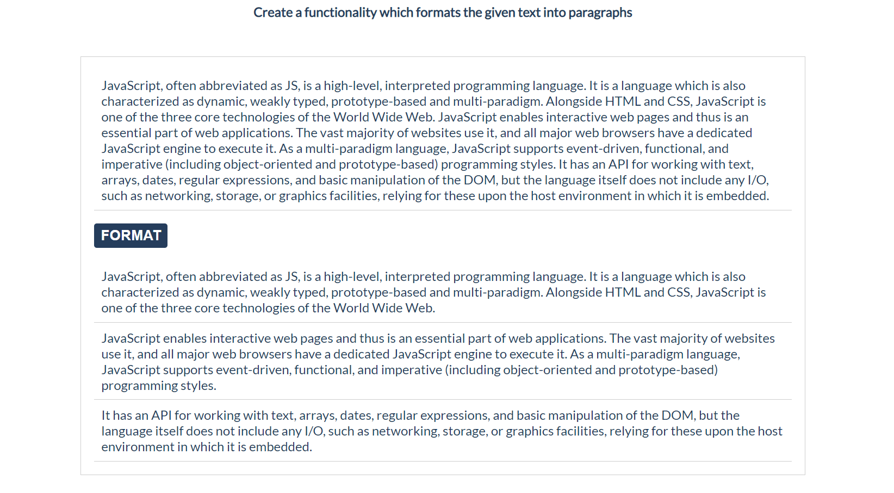

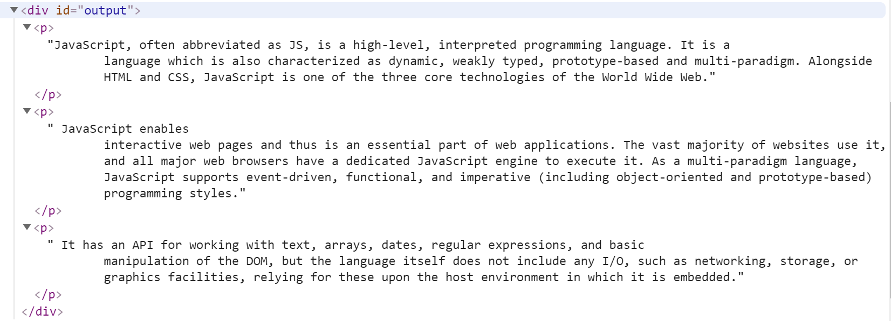

## Growing Word

In this problem, you should **create a JS functionality** which
**changes the size and the color** of a given **paragraph** on **every
click**.

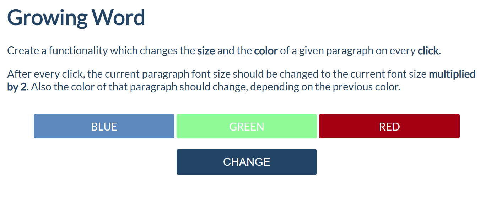

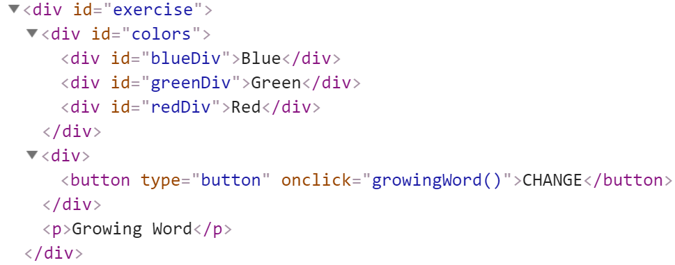

Every time when we **click** on the \[**CHANGE**\] button, **the color**
and **the size** of **the paragraph** which contains "**Growing Word**"
**should change\!**

**After every click,** the current paragraph ***font size*** should be
**changed** to the **current font size multiplied by 2.** Also, **the
color** of that paragraph should change, depending on the **previous
color**.

### Example:

  - If we click **once**, the color should be changed to **blue** and
    the font size should be **2** (First initial size)

  - If we click **twice,** the color should be changed to **green** and
    the font size should be **4** (2 \* 2)

  - If we click **three times**, the current color of that paragraph
    should be changed to **red** and the font size should be **8** (4 \*
    2)

  - If our paragraph already has a **red color, on** the **next** click,
    the color should turn to **blue**. Just loop throw these three
    colors (blue, green, red) again and again and again... while you are
    clicking on that button.

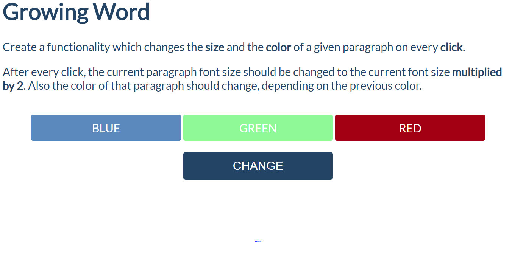

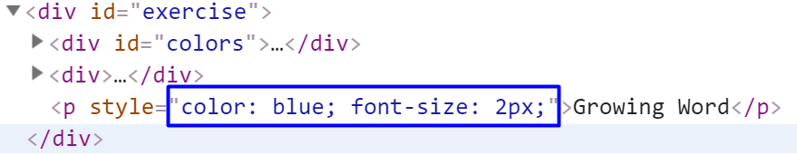

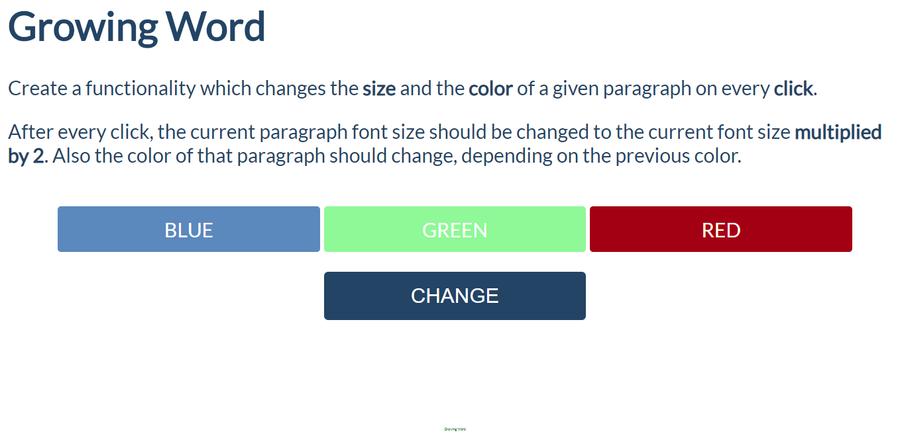

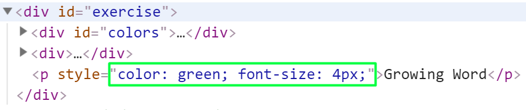

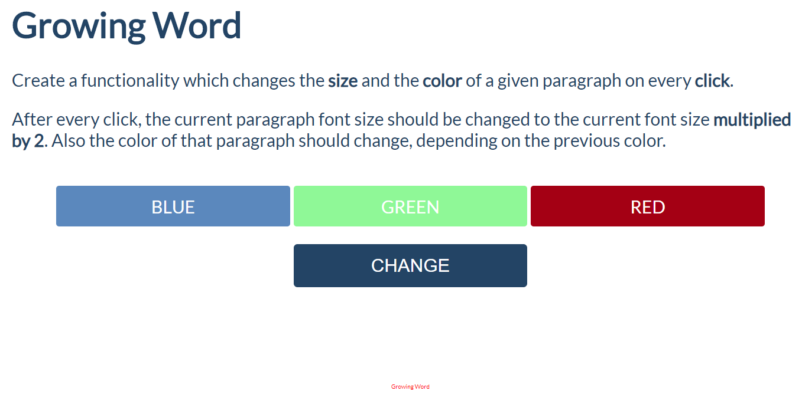

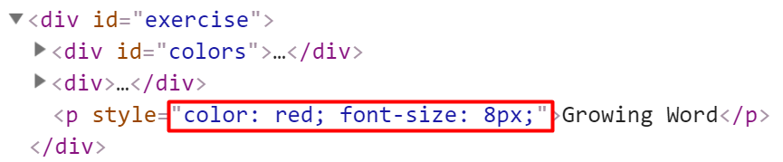

## Visited Sites

In this problem, you should **create a JS functionality** that keeps
track of how many times a

specific site has been **visited**.

For instance, if we click **twice on the
Gmail link and once on the YouTube
link**, the expected

result must be:

