# Lab: **Syntax, Functions and Statements**

Problems for in-class lab for the ["JavaScript Essentials" course @
SoftUni](https://softuni.bg/courses/js-essentials). Submit your
solutions in the SoftUni judge system at
<https://judge.softuni.bg/Contests/1421/Lab-JavaScript-Syntax-and-Operators>.

## String Length

Write a JS function that takes **three** **string arguments** as an
input.

Calculate the **sum** of the **length** of the **strings** and the
**average length** of the strings **rounded** **down** to the nearest
integer.

The **input** comes as **three string arguments** passed to your
function.

The **output** should be printed on the console on two lines.

### Examples

<table>
<thead>
<tr class="header">
<th><strong>Input</strong></th>
<th><strong>Output</strong></th>
</tr>
</thead>
<tbody>
<tr class="odd">
<td>'chocolate', 'ice cream', 'cake'</td>
<td>
<strong>22</strong>

<strong>7</strong>
</td>
</tr>
</tbody>
</table>

<table>
<thead>
<tr class="header">
<th><strong>Input</strong></th>
<th><strong>Output</strong></th>
</tr>
</thead>
<tbody>
<tr class="odd">
<td>'pasta', '5', '22.3'</td>
<td>
<strong>10</strong>

<strong>3</strong>
</td>
</tr>
</tbody>
</table>

### Hints

  - Write a function that receives three string arguments.

  - Declare two variables named **sumLength** and **averageLength** that
    will keep the mathematical results.

  - Calculate the length of the strings using the **length property**.

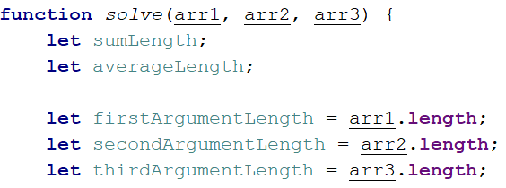

  - Calculate the sum of the three lengths. 

  - Calculate the **average length** of the strings **rounded** **down**
    to the nearest integer. Use the **Math.floor()** function.

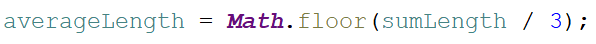

  - Print the results on the console.

## Math Operations

Write a JS function that takes **two** **numbers** and **a string** as
an input.

The string may be one of the following: '**+**', '**-**', '**\***',
'**/**', '**%**', '**\*\***'.

Print on the console the result of the mathematical **operation**
between **both numbers** and the **operator** you receive as a string.

The **input** comes as **two numbers** and **a string argument** passed
to your function.

The **output** should be printed on the console.

### Examples

| **Input** | **Output** |  | **Input**    | **Output** |
| --------- | ---------- |  | ------------ | ---------- |
| 5, 6, '+' | **11**     |  | 3, 5.5, '\*' | **16.5**   |

### Hints

  - Write a function which receives **three** arguments:

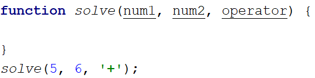

  - Declare a variable named **result** that will keep your mathematical
    result.

  - Write down **switch** command that will take the string from your
    input and depending on it, perform the mathematical logic between
    the two numbers.

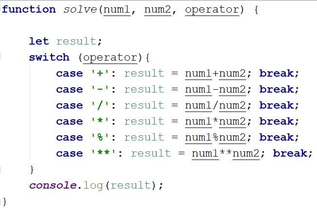

  - Print the result on the console.

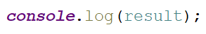

## Sum of Numbers N…M

Write a JS function that takes two numbers **n** and **m** as an input
and **prints the sum** of all numbers from **n** to **m**.

The **input** comes as **two string elements** that need to be
**parsed** as numbers.

The **output** should **return** the **sum**.

### Examples

| **Input** | **Output** |
| --------- | ---------- |
| '1', '5'  | 15         |

| **Input** | **Output** |
| --------- | ---------- |
| '-8', 20' | **174**    |

### Hints

  - Write a function that receives two string arguments and parse them
    as numbers. Use **Number(string)** function or just put the '**+**'
    sign before the string.

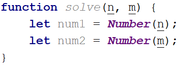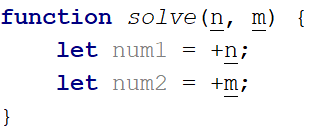

  - Declare a variable named **result** that will keep the mathematical
    results.

  - Write a **for** loop from **num1** to **num2** and for every turn of
    the cycle, until it’s completed, add the current value.

  - Finally, return the result.

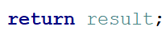

## Largest Number

Write a function that takes **three number arguments** as an input and
find the **largest** of them. Print the following text on the console:
'**The largest number is {number}.**'.

The **input** comes as **three number arguments** passed to your
function.

The **output** should be printed to the console.

### Example

| **Input**      | **Output**                    |
| -------------- | ----------------------------- |
| 5, -3, 16      | **The largest number is 16.** |
| **Input**      | **Output**                    |
| \-3, -5, -22.5 | **The largest number is -3.** |

### Hints

  - Write a function that receives three number arguments.

  - Declare a variable named **result** that will keep the result.

  - Make several checks to find out the largest of the three numbers.
    Start with num1.

  - Do the same for the others.

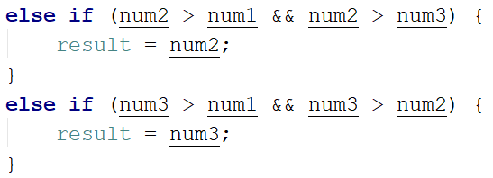

  - Print the result on the console.

## Circle Area

Write a function that takes **a single argument** as an input.

**Check the type** of the input argument. If it is a **number**, assume
it is the radius of a circle and **calculate the circle area**. Print
the **area** **rounded** to **two decimal places**.

If the argument type is **NOT** a number, print the following text on
the console:  
'**We cannot calculate the circle area, because we receive a {type of
argument}.**'

The **input** comes as a **single argument** passed to your function.

The **output** should be printed on the console.

### Example

| **Input** | **Output** |  | **Input** | **Output**                                                         |
| --------- | ---------- |  | --------- | ------------------------------------------------------------------ |
| 5         | 78.54      |  | 'name'    | We can not calculate the circle area, because we receive a string. |

### Hints

  - Write a function that receives a single argument.

  - Declare a variable named **result** that will keep your result.

  - Check the type of the input argument with the **typeof()** function.

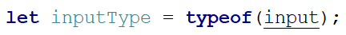

  - If the type is equal to **'number'**, calculate the circle area and
    print it on the console rounded to two decimal places. To do this,
    use the method **toFixed().  
    **The **Math.pow()** function returns the base to
    the exponent power, that is, base exponent. You can find more
    information about the area
    [here](https://en.wikipedia.org/wiki/Circle):

  - If the type is **NOT** a **'number'**, print the following text on
    the console:

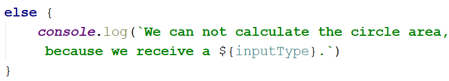

## Square of Stars

Write a function that **prints a rectangle** made of **stars** with
**variable size**, depending on an input parameter. If there is **no
parameter** specified, the rectangle should **always** be of **size 5**.
Look at the examples to get an idea.

The **input** comes as a single **number** argument.

The **output** is a series of lines printed on the console, forming a
rectangle of variable size.

### Examples

<table>
<thead>
<tr class="header">
<th><strong>Input</strong></th>
<th><strong>Output</strong></th>
<th></th>
<th><strong>Input</strong></th>
<th><strong>Output</strong></th>
<th></th>
<th><strong>Input</strong></th>
<th><strong>Output</strong></th>
<th></th>
<th><strong>Input</strong></th>
<th><strong>Output</strong></th>
</tr>
</thead>
<tbody>
<tr class="odd">
<td>1</td>
<td><strong>*</strong></td>
<td></td>
<td><strong>2</strong></td>
<td>
<strong>**</strong>

<strong>**</strong>
</td>
<td></td>
<td><strong>5</strong></td>
<td>
<strong>*****</strong>

<strong>*****</strong>

<strong>*****</strong>

<strong>*****</strong>

<strong>*****</strong>
</td>
<td></td>
<td></td>
<td>
<strong>*****</strong>

<strong>*****</strong>

<strong>*****</strong>

<strong>*****</strong>

<strong>*****</strong>
</td>
</tr>
</tbody>
</table>

## Day of Week

Write a function that prints a number between 1 and 7 when a **day of
the week** is passed to it as a string and an **error message** if the
string is **not recognized**.

The **input** comes as a single string argument.

The **output** should be returned as a result.

### Examples

| **Input** | **Output** |  | **Input**  | **Output** |  | **Input**   | **Output** |
| --------- | ---------- |  | ---------- | ---------- |  | ----------- | ---------- |
| Monday    | **1**      |  | **Friday** | **5**      |  | **Invalid** | **error**  |

## Functional Calculator

Write a program that receives **two numbers** and an **operator** and
performs a calculation between the variables, using the operator. Store
the different functions in variables and pass them to your calculator.

The **input** comes as three arguments - two numbers, and a string,
representing the operator.

The **output** should be printed on the console.

### Examples

| **Input** | **Output** |  | **Input**     | **Output** |  | **Input**        | **Output** |
| --------- | ---------- |  | ------------- | ---------- |  | ---------------- | ---------- |
| 2, 4, '+' | **6**      |  | **3, 3, '/'** | **1**      |  | **18, -1, '\*'** | **-18**    |

## Aggregate Elements

Write a program that performs different operations on an array of
elements. Implement the following operations:

  - **Sum(ai)** - calculates the sum all elements from the
    input array

  - **Sum(1/ai)** - calculates the sum of the inverse values
    (1/ai) of all elements from the array

  - **Concat(ai)** - concatenates the string representations
    of all elements from the array

The **input** comes as an array of number elements.

The **output** should be printed on the console on a new line for each
of the operations.

### Examples

<table>
<thead>
<tr class="header">
<th><strong>Input</strong></th>
<th><strong>Output</strong></th>
<th></th>
<th><strong>Input</strong></th>
<th><strong>Output</strong></th>
</tr>
</thead>
<tbody>
<tr class="odd">
<td>[1, 2, 3]</td>
<td>
<strong>6</strong>

<strong>1.8333</strong>

<strong>123</strong>
</td>
<td></td>
<td><strong>[2, 4, 8, 16]</strong></td>
<td>
<strong>30</strong>

<strong>0.9375</strong>

<strong>24816</strong>
</td>
</tr>
</tbody>
</table>

## \*Words Uppercase

Write a program that **extracts all words** from a passed in string and
converts them to **upper case**. The extracted words in upper case must
be printed on a single line separated by **", "**.

The **input** comes as a single string argument - the text to extract
and convert words from.

The **output** should be a single line containing the converted string.

### Examples

| **Input**          | **Output**            |  | **Input**   | **Output** |
| ------------------ | --------------------- |  | ----------- | ---------- |
| 'Hi, how are you?' | **HI, HOW, ARE, YOU** |  | **'hello'** | **HELLO**  |

### Hints

  - You may need to use a [Regular
    Expression](https://developer.mozilla.org/en-US/docs/Web/JavaScript/Guide/Regular_Expressions)
    or alternatively check for all delimiters that can be found in a
    sentence (ex. ",", " ", "\!", "?" and so on).
