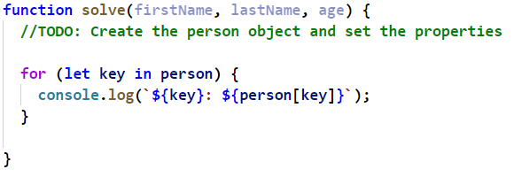
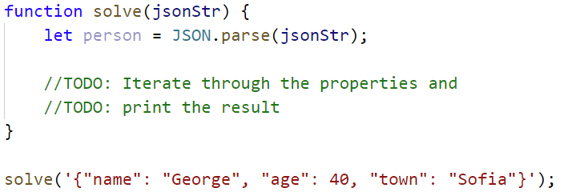
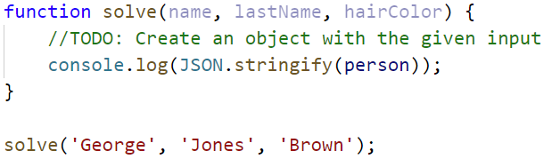
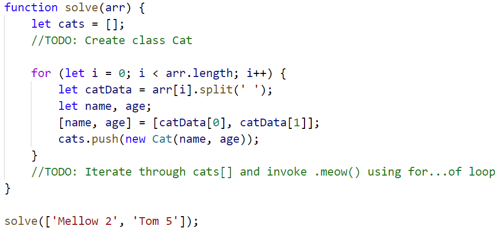
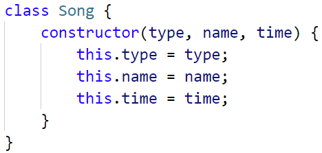
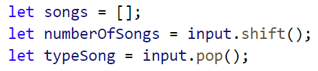
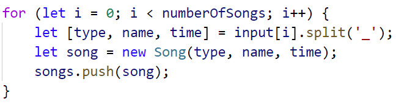
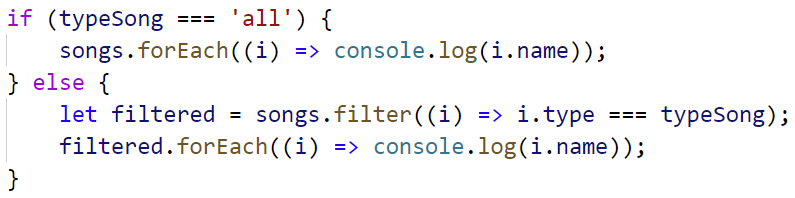

# Lab: Objects and Classes

## Person Info

Write a function that receives **3 parameters**, sets them to an
**object** and prints the object's properties by key and value in the
format: "**{key}: {value}**"

The input comes as **3 separate strings** in the following order:
**firstName**, **lastName**, **age**.

### Examples

<table>
<thead>
<tr class="header">
<th><strong>Input</strong></th>
<th><strong>Output</strong></th>
</tr>
</thead>
<tbody>
<tr class="odd">
<td>"Peter", 
"Pan", 
"20"</td>
<td>
firstName: Peter

lastName: Pan

age: 20
</td>
</tr>
</tbody>
</table>

### Hints

## City

Receive **five single strings**.

Create a **city object** which will hold the city **name**, **area**,
**population**, **country** and **postcode**.

Loop through all the **keys** and print them with their **values** in
format: "**{key} -\> {value}**"

The input will be in the following order: **name**, **area**,
**population**, **country** and **postCode**.

See the examples below.

### Examples

<table>
<thead>
<tr class="header">
<th><strong>Input</strong></th>
<th><strong>Output</strong></th>
</tr>
</thead>
<tbody>
<tr class="odd">
<td>"Sofia"," 492", "1238438", "Bulgaria", "1000"</td>
<td>
name -&gt; Sofia

area -&gt; 492

population -&gt; 1238438

country -&gt; Bulgaria

postCode -&gt; 1000
</td>
</tr>
</tbody>
</table>

## Convert to Object

Write a function that receives a **string** in **JSON format** and
converts it to **object**.

Loop through all the keys and print them with their values in format:
"**{key}: {value}**"

### Examples

<table>
<thead>
<tr class="header">
<th><strong>Input</strong></th>
<th><strong>Output</strong></th>
</tr>
</thead>
<tbody>
<tr class="odd">
<td>'{"name": "George", "age": 40, "town": "Sofia"}'</td>
<td>
name: George

age: 40

town: Sofia
</td>
</tr>
</tbody>
</table>

### Hints

  - Use **JSON.parse()** method to parse JSON string to an object

## Convert to JSON

Write a Function That Receives Name, LastName, HairColor and Sets Them
to an Object.

Convert the **object** to **JSON string** and print it.

Input is provided as **3 single strings** in the order stated above.

### Examples

<table>
<thead>
<tr class="header">
<th><strong>Input</strong></th>
<th><strong>Output</strong></th>
</tr>
</thead>
<tbody>
<tr class="odd">
<td>
'George',

'Jones',

'Brown'
</td>
<td>{"name":"George", 
"lastName":"Jones", 
"hairColor":"Brown"}</td>
</tr>
</tbody>
</table>

### Hints

  - Use **JSON.stringify()** to parse the object to JSON string

## Cats

Write a function that receives **array** of strings in the following
format **'{cat name} {age}'**.

Create a **Cat** **class** that receives in the **constructor** the
**name** and the **age** parsed from the input.

It should also have a function named **"meow"** that will print **"{cat
name}, age {age} says Meow"** on the console.

For each of the strings provided you must **create a cat object.**

### Examples

<table>
<thead>
<tr class="header">
<th><strong>Input</strong></th>
<th><strong>Output</strong></th>
</tr>
</thead>
<tbody>
<tr class="odd">
<td>['Mellow 2', 'Tom 5']</td>
<td>
Mellow, age 2 says Meow

Tom, age 5 says Meow
</td>
</tr>
</tbody>
</table>

### Hints

  - Create a Cat class with properties and methods described above

  - Parse the input data

  - Create all objects using class constructor and the parsed input
    data, store them in an array

  - Loop through the array using **for…of** cycle and **invoke .meow()**
    method

## Songs

Define a **class** **Song**, which holds the following information about
songs: **typeList**, **name** and **time**.

You will receive the input as an **array**.

The first element **n** will be the number of songs. Next **n** elements
will be the songs data in the following format:
**"{typeList}\_{name}\_{time}"**, and the the last element will be
**Type List** / **"all".**

Print only the **names of the songs** which are from that **Type List**
/ **All songs**.

**Examples**

<table>
<thead>
<tr class="header">
<th><strong>Input</strong></th>
<th><strong>Output</strong></th>
</tr>
</thead>
<tbody>
<tr class="odd">
<td>
<strong>[3,</strong>

'favourite_DownTown_3:14',

'favourite_Kiss_4:16',

'favourite_Smooth Criminal_4:01',

'favourite']
</td>
<td>
DownTown

Kiss

Smooth Criminal
</td>
</tr>
<tr class="even">
<td>
<strong>[4,</strong>

'favourite_DownTown_3:14',

'listenLater_Andalouse_3:24',

'favourite_In To The Night_3:58',

'favourite_Live It Up_3:48',

'listenLater']
</td>
<td>Andalouse</td>
</tr>
<tr class="odd">
<td>
<strong>[2,</strong>

<strong>'like_Replay_3:15',</strong>

<strong>'ban_Photoshop_3:48',</strong>

<strong>'all']</strong>
</td>
<td>
Replay

Photoshop
</td>
</tr>
</tbody>
</table>

### Solution:

Create a Song class with properties described above

Create a new array, where you will store songs

Iterate over the songs:

